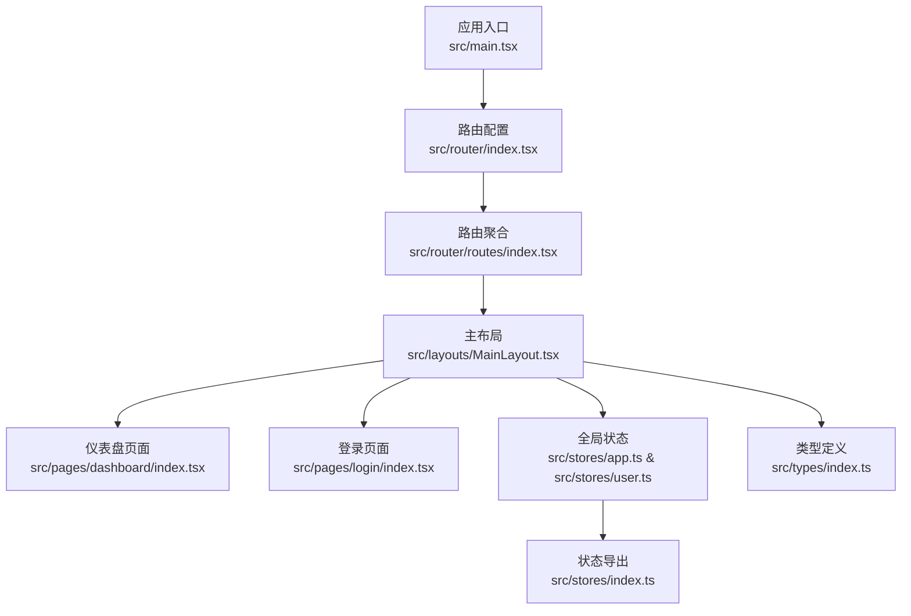
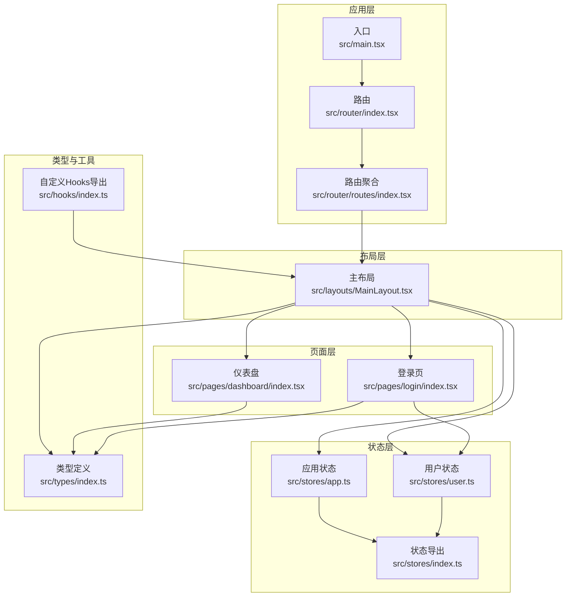
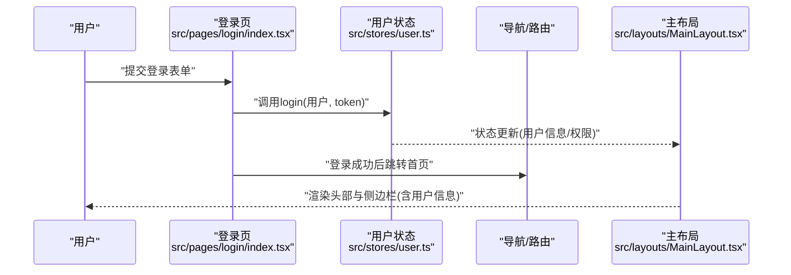
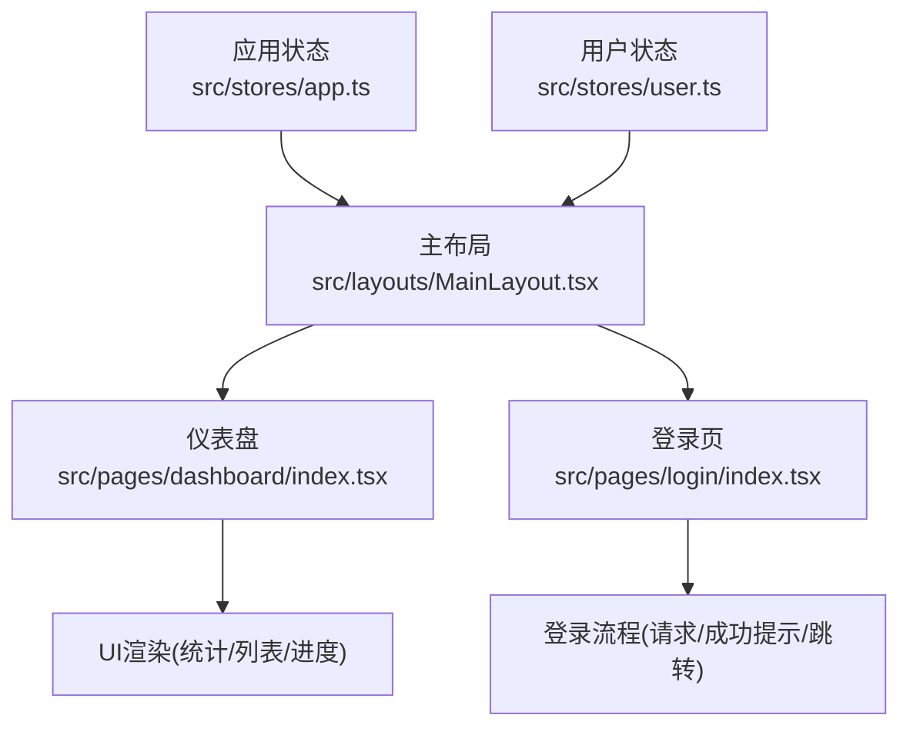
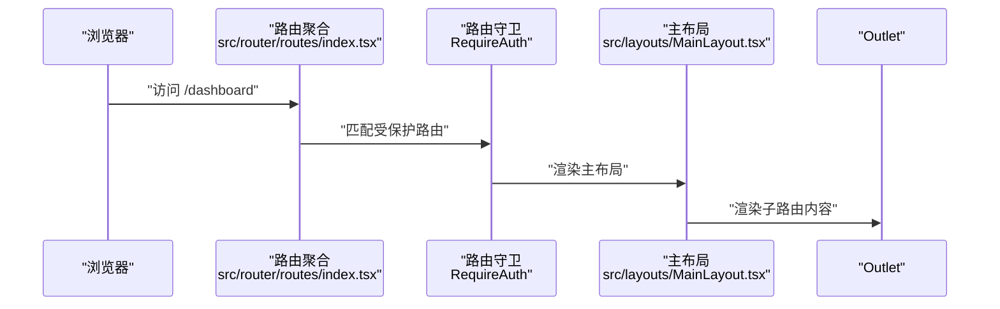
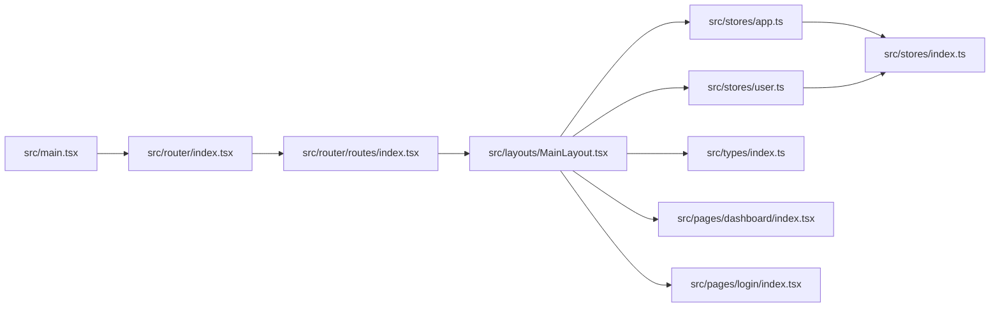

# 组件通信机制

<cite>
**本文引用的文件**
- [src/main.tsx](file://src/main.tsx)
- [src/layouts/MainLayout.tsx](file://src/layouts/MainLayout.tsx)
- [src/pages/dashboard/index.tsx](file://src/pages/dashboard/index.tsx)
- [src/pages/login/index.tsx](file://src/pages/login/index.tsx)
- [src/router/index.tsx](file://src/router/index.tsx)
- [src/router/routes/index.tsx](file://src/router/routes/index.tsx)
- [src/stores/app.ts](file://src/stores/app.ts)
- [src/stores/user.ts](file://src/stores/user.ts)
- [src/stores/index.ts](file://src/stores/index.ts)
- [src/hooks/index.ts](file://src/hooks/index.ts)
- [src/types/index.ts](file://src/types/index.ts)
</cite>

## 目录

1. [引言](#引言)
2. [项目结构](#项目结构)
3. [核心组件](#核心组件)
4. [架构总览](#架构总览)
5. [详细组件分析](#详细组件分析)
6. [依赖关系分析](#依赖关系分析)
7. [性能考虑](#性能考虑)
8. [故障排查指南](#故障排查指南)
9. [结论](#结论)
10. [附录](#附录)

## 引言

本文件围绕AI管理平台的组件通信机制展开，重点覆盖以下主题：

- 父子组件通信：通过路由布局与页面容器、状态存储与UI组件之间的数据流进行说明
- 兄弟组件通信：通过共享状态（Zustand）在不同页面或布局区域之间协同
- 跨层级通信：通过全局状态（Zustand）、路由守卫与布局容器实现跨层级的数据与行为传递
- props最佳实践：类型安全、默认值与性能优化
- 状态提升策略：在合适层级集中管理共享状态，避免过度提升
- 事件系统设计：自定义事件、事件冒泡与委托在Ant Design组件中的应用
- Context API使用场景：当前项目主要采用Zustand，Context使用较少；仍可说明其适用场景
- 自定义Hook设计模式：封装复杂业务逻辑与状态管理
- 调试技巧与性能优化建议

## 项目结构

项目采用分层组织方式：

- 应用入口负责全局配置与路由挂载
- 布局层负责导航、侧边栏与头部等横切关注点
- 页面层负责具体业务视图
- 状态层使用Zustand进行集中状态管理
- 类型与常量定义位于独立模块，便于复用

图表来源

- [src/main.tsx](file://src/main.tsx#L17-L31)
- [src/router/index.tsx](file://src/router/index.tsx#L1-L9)
- [src/router/routes/index.tsx](file://src/router/routes/index.tsx#L9-L28)
- [src/layouts/MainLayout.tsx](file://src/layouts/MainLayout.tsx#L1-L174)
- [src/pages/dashboard/index.tsx](file://src/pages/dashboard/index.tsx#L1-L170)
- [src/pages/login/index.tsx](file://src/pages/login/index.tsx#L1-L133)
- [src/stores/app.ts](file://src/stores/app.ts#L1-L59)
- [src/stores/user.ts](file://src/stores/user.ts#L1-L76)
- [src/stores/index.ts](file://src/stores/index.ts#L1-L3)
- [src/types/index.ts](file://src/types/index.ts#L1-L101)

章节来源

- [src/main.tsx](file://src/main.tsx#L17-L31)
- [src/router/index.tsx](file://src/router/index.tsx#L1-L9)
- [src/router/routes/index.tsx](file://src/router/routes/index.tsx#L9-L28)

## 核心组件

- 应用入口与全局配置：在入口中配置国际化、主题与路由提供器，确保全局样式与主题生效
- 主布局：统一承载侧边栏、头部、内容区与通知徽标，是跨页面共享状态的主要消费端
- 页面组件：仪表盘与登录页分别展示静态数据与登录流程，体现props与状态的使用差异
- 状态存储：应用状态与用户状态通过Zustand集中管理，并持久化到本地存储
- 类型系统：提供分页、用户、表格列、表单字段、API响应等类型，保障props与状态的类型安全

章节来源

- [src/main.tsx](file://src/main.tsx#L1-L32)
- [src/layouts/MainLayout.tsx](file://src/layouts/MainLayout.tsx#L18-L174)
- [src/pages/dashboard/index.tsx](file://src/pages/dashboard/index.tsx#L1-L170)
- [src/pages/login/index.tsx](file://src/pages/login/index.tsx#L1-L133)
- [src/stores/app.ts](file://src/stores/app.ts#L1-L59)
- [src/stores/user.ts](file://src/stores/user.ts#L1-L76)
- [src/stores/index.ts](file://src/stores/index.ts#L1-L3)
- [src/types/index.ts](file://src/types/index.ts#L1-L101)

## 架构总览

下图展示了从入口到页面、再到状态存储的整体通信路径与职责边界。

图表来源

- [src/main.tsx](file://src/main.tsx#L17-L31)
- [src/router/index.tsx](file://src/router/index.tsx#L1-L9)
- [src/router/routes/index.tsx](file://src/router/routes/index.tsx#L9-L28)
- [src/layouts/MainLayout.tsx](file://src/layouts/MainLayout.tsx#L1-L174)
- [src/pages/dashboard/index.tsx](file://src/pages/dashboard/index.tsx#L1-L170)
- [src/pages/login/index.tsx](file://src/pages/login/index.tsx#L1-L133)
- [src/stores/app.ts](file://src/stores/app.ts#L1-L59)
- [src/stores/user.ts](file://src/stores/user.ts#L1-L76)
- [src/stores/index.ts](file://src/stores/index.ts#L1-L3)
- [src/types/index.ts](file://src/types/index.ts#L1-L101)
- [src/hooks/index.ts](file://src/hooks/index.ts#L1-L6)

## 详细组件分析

### 布局与页面间的父子通信

- 父组件（主布局）向子组件（仪表盘、登录页）传递行为与状态：
  - 通过useAppStore控制侧边栏折叠与主题切换
  - 通过useUserStore读取用户信息与执行登出
  - 通过Ant Design组件的onClick回调与navigate实现路由跳转
- 子组件（登录页）通过useUserStore的login动作写入用户信息与token，触发全局状态更新

图表来源

- [src/pages/login/index.tsx](file://src/pages/login/index.tsx#L32-L50)
- [src/stores/user.ts](file://src/stores/user.ts#L46-L60)
- [src/layouts/MainLayout.tsx](file://src/layouts/MainLayout.tsx#L23-L24)

章节来源

- [src/layouts/MainLayout.tsx](file://src/layouts/MainLayout.tsx#L18-L174)
- [src/pages/login/index.tsx](file://src/pages/login/index.tsx#L32-L50)
- [src/stores/user.ts](file://src/stores/user.ts#L21-L76)

### 兄弟组件通信（通过共享状态）

- 仪表盘与登录页均依赖主布局提供的共享状态（应用状态与用户状态），实现跨页面的协同：
  - 侧边栏折叠状态在主布局中维护，影响仪表盘与登录页的布局
  - 用户登录后，头部显示用户信息，通知徽标等UI同步更新
- 该模式避免了在多处重复维护相同状态，降低耦合度

图表来源

- [src/stores/app.ts](file://src/stores/app.ts#L1-L59)
- [src/stores/user.ts](file://src/stores/user.ts#L1-L76)
- [src/layouts/MainLayout.tsx](file://src/layouts/MainLayout.tsx#L1-L174)
- [src/pages/dashboard/index.tsx](file://src/pages/dashboard/index.tsx#L1-L170)
- [src/pages/login/index.tsx](file://src/pages/login/index.tsx#L1-L133)

章节来源

- [src/stores/app.ts](file://src/stores/app.ts#L18-L59)
- [src/stores/user.ts](file://src/stores/user.ts#L21-L76)
- [src/layouts/MainLayout.tsx](file://src/layouts/MainLayout.tsx#L23-L24)

### 跨层级通信（路由守卫与布局容器）

- 路由守卫RequireAuth包裹主布局，实现跨层级的鉴权控制
- 主布局作为根容器，向下传递状态与行为，向上接收路由变化，形成稳定的跨层级通信链路

图表来源

- [src/router/routes/index.tsx](file://src/router/routes/index.tsx#L11-L26)
- [src/layouts/MainLayout.tsx](file://src/layouts/MainLayout.tsx#L1-L174)

章节来源

- [src/router/routes/index.tsx](file://src/router/routes/index.tsx#L9-L28)
- [src/layouts/MainLayout.tsx](file://src/layouts/MainLayout.tsx#L1-L174)

### Props传递最佳实践

- 类型安全：通过types模块定义用户、分页、表格列、表单字段等类型，确保props的结构与约束
- 默认值设置：在组件内部对可选属性提供合理默认值，避免空值导致的渲染异常
- 性能优化：
  - 使用稳定引用（如memo、useMemo、useCallback）减少重渲染
  - 将大型对象拆分为更小的props，避免不必要的深层比较
  - 在列表渲染中使用稳定的key，提升Diff效率

章节来源

- [src/types/index.ts](file://src/types/index.ts#L17-L85)
- [src/pages/dashboard/index.tsx](file://src/pages/dashboard/index.tsx#L84-L113)
- [src/pages/login/index.tsx](file://src/pages/login/index.tsx#L72-L120)

### 状态提升策略

- 当前项目采用Zustand集中管理应用状态与用户状态，避免在多层级之间重复提升状态
- 合适的层级：
  - 应用级状态（主题、语言、侧边栏）放置于应用状态store
  - 用户级状态（登录态、权限）放置于用户状态store
- 避免过度提升：仅在真正需要跨组件共享时才提升至全局store，保持组件职责单一

章节来源

- [src/stores/app.ts](file://src/stores/app.ts#L5-L16)
- [src/stores/user.ts](file://src/stores/user.ts#L6-L19)
- [src/stores/index.ts](file://src/stores/index.ts#L1-L3)

### 事件系统设计

- Ant Design组件事件：通过onClick、onChange等回调实现事件绑定，结合navigate与store动作完成交互
- 事件冒泡与委托：在Ant Design组件中遵循其事件模型，避免直接操作DOM事件
- 自定义事件：可在业务组件中封装事件处理器，统一处理用户输入、按钮点击等行为

章节来源

- [src/layouts/MainLayout.tsx](file://src/layouts/MainLayout.tsx#L48-L61)
- [src/pages/login/index.tsx](file://src/pages/login/index.tsx#L36-L50)

### Context API使用场景

- 当前项目主要使用Zustand进行状态管理，Context使用较少
- Context适用于：
  - 跨组件的主题、语言等配置传递
  - 不频繁变更但需要跨层级访问的轻量配置
- 若引入Context，建议与Zustand配合使用，避免重复造轮子

[本节为概念性说明，不涉及具体源码分析]

### 自定义Hook设计模式

- 封装复杂逻辑：将请求、鉴权、状态订阅等逻辑封装为自定义Hook，提升复用性与可测试性
- 与ahooks协作：推荐优先使用ahooks提供的通用Hook，必要时再自定义扩展
- 导出规范：在hooks/index.ts中统一导出，便于全局复用

章节来源

- [src/hooks/index.ts](file://src/hooks/index.ts#L1-L6)

## 依赖关系分析

- 入口依赖路由与全局配置，路由依赖路由聚合与守卫，主布局依赖状态与类型，页面依赖布局与状态
- 状态导出统一管理，避免循环依赖

图表来源

- [src/main.tsx](file://src/main.tsx#L17-L31)
- [src/router/index.tsx](file://src/router/index.tsx#L1-L9)
- [src/router/routes/index.tsx](file://src/router/routes/index.tsx#L9-L28)
- [src/layouts/MainLayout.tsx](file://src/layouts/MainLayout.tsx#L1-L174)
- [src/stores/app.ts](file://src/stores/app.ts#L1-L59)
- [src/stores/user.ts](file://src/stores/user.ts#L1-L76)
- [src/stores/index.ts](file://src/stores/index.ts#L1-L3)
- [src/types/index.ts](file://src/types/index.ts#L1-L101)
- [src/pages/dashboard/index.tsx](file://src/pages/dashboard/index.tsx#L1-L170)
- [src/pages/login/index.tsx](file://src/pages/login/index.tsx#L1-L133)

章节来源

- [src/main.tsx](file://src/main.tsx#L17-L31)
- [src/router/index.tsx](file://src/router/index.tsx#L1-L9)
- [src/router/routes/index.tsx](file://src/router/routes/index.tsx#L9-L28)
- [src/stores/index.ts](file://src/stores/index.ts#L1-L3)

## 性能考虑

- 渲染优化
  - 对频繁更新的UI使用memo或浅比较，减少子组件重渲染
  - 列表渲染时使用稳定key，避免不必要的节点移动
- 状态管理
  - Zustand默认按引用更新，避免在props中传递大对象，改为传递标识符或派生数据
  - 使用局部状态与全局状态分离，避免全局状态波动引发大面积重渲染
- 请求与异步
  - 使用请求缓存与去抖，避免重复请求
  - 在登录页等关键流程中，合理使用loading状态与成功提示，减少无效重渲染

[本节提供通用指导，不涉及具体源码分析]

## 故障排查指南

- 登录失败或跳转异常
  - 检查登录页的请求回调与store动作是否正确调用
  - 确认路由守卫与导航逻辑
- 用户信息未更新
  - 检查用户状态store的login动作是否被调用
  - 确认主布局中useUserStore的订阅是否生效
- 侧边栏状态异常
  - 检查应用状态store的toggleSidebar与setSidebarCollapsed
  - 确认主布局中状态与UI的绑定是否一致

章节来源

- [src/pages/login/index.tsx](file://src/pages/login/index.tsx#L36-L50)
- [src/stores/user.ts](file://src/stores/user.ts#L46-L60)
- [src/layouts/MainLayout.tsx](file://src/layouts/MainLayout.tsx#L23-L24)
- [src/stores/app.ts](file://src/stores/app.ts#L25-L35)

## 结论

本项目通过清晰的分层与Zustand集中状态管理，实现了父子、兄弟与跨层级的高效组件通信。类型系统的引入进一步提升了props传递的安全性。建议在后续迭代中：

- 保持状态提升的最小化原则，避免过度提升
- 在复杂交互场景中引入自定义Hook，封装业务逻辑
- 持续优化渲染性能，减少不必要的重渲染

[本节为总结性内容，不涉及具体源码分析]

## 附录

- 关键流程回顾
  - 登录流程：表单提交 → 请求回调 → 写入用户状态 → 跳转首页 → 布局渲染用户信息
  - 布局联动：侧边栏折叠状态 → 影响布局宽度与内容区渲染
- 参考文件
  - [src/main.tsx](file://src/main.tsx#L17-L31)
  - [src/layouts/MainLayout.tsx](file://src/layouts/MainLayout.tsx#L18-L174)
  - [src/pages/dashboard/index.tsx](file://src/pages/dashboard/index.tsx#L1-L170)
  - [src/pages/login/index.tsx](file://src/pages/login/index.tsx#L32-L50)
  - [src/router/routes/index.tsx](file://src/router/routes/index.tsx#L11-L26)
  - [src/stores/app.ts](file://src/stores/app.ts#L18-L59)
  - [src/stores/user.ts](file://src/stores/user.ts#L21-L76)
  - [src/types/index.ts](file://src/types/index.ts#L17-L85)
