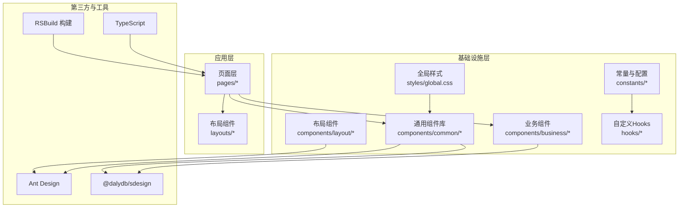
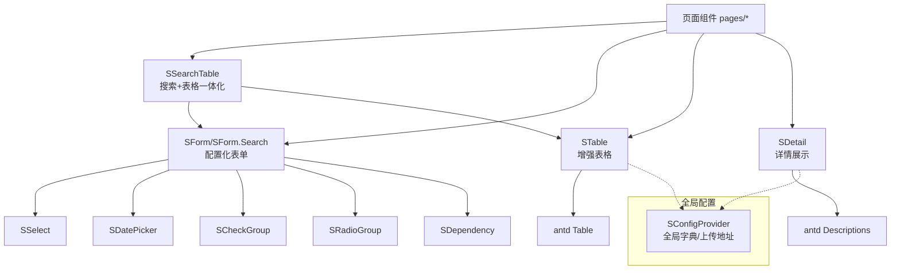
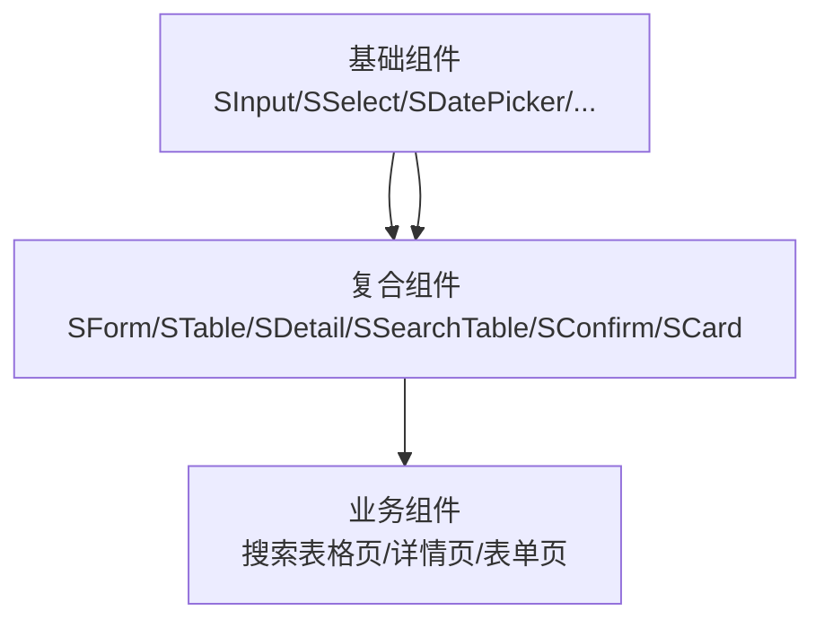
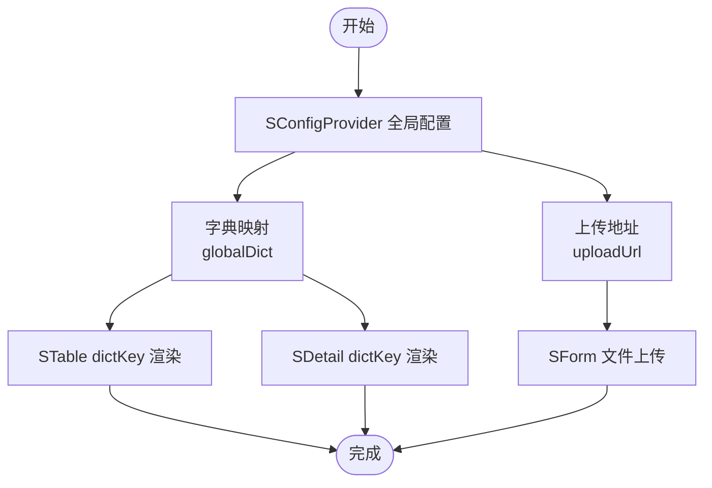
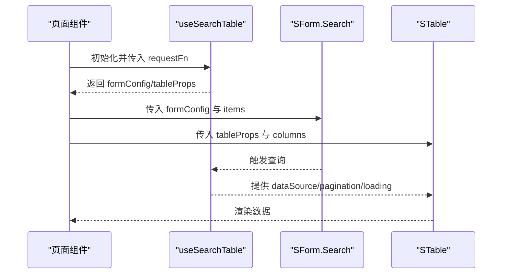

# 通用组件库

<cite>
**本文引用的文件**
- [package.json](file://package.json)
- [架构规范.md](file://.ai/core/architecture.md)
- [代码规范.md](file://.ai/core/coding-standards.md)
- [@dalydb/sdesign 组件库文档.md](file://.ai/core/sdesign-docs.md)
- [全局样式 global.css](file://src/styles/global.css)
- [应用配置 config.ts](file://src/constants/config.ts)
- [枚举常量 enum.ts](file://src/constants/enum.ts)
- [自定义Hooks导出 index.ts](file://src/hooks/index.ts)
</cite>

## 目录

1. [简介](#简介)
2. [项目结构](#项目结构)
3. [核心组件](#核心组件)
4. [架构总览](#架构总览)
5. [组件分类与层次结构](#组件分类与层次结构)
6. [命名规范与目录结构](#命名规范与目录结构)
7. [统一接口与用户体验一致性](#统一接口与用户体验一致性)
8. [可配置性设计](#可配置性设计)
9. [扩展性策略](#扩展性策略)
10. [版本管理与发布流程](#版本管理与发布流程)
11. [使用指南与集成示例](#使用指南与集成示例)
12. [故障排查](#故障排查)
13. [结论](#结论)

## 简介

本文件面向“AI管理平台”的前端通用组件库，目标是建立一套统一、可扩展、可维护的组件体系，支撑从基础组件到业务组件的完整设计语言。组件库以 Ant Design 为基础，结合企业级实践，形成以 S 前缀命名的增强组件集合，并配套统一的接口、样式与交互规范，确保跨页面、跨团队的一致体验。

## 项目结构

项目采用“分层+按域组织”的结构，组件库位于统一的组件层，配合 API、状态、路由、工具等模块协同工作。组件层下包含通用组件、业务组件与布局组件三类，便于复用与治理。

图示来源

- [.ai/core/architecture.md](file://.ai/core/architecture.md#L20-L75)

章节来源

- [.ai/core/architecture.md](file://.ai/core/architecture.md#L20-L75)

## 核心组件

- 组件库基石：基于 Ant Design 5.x 的增强组件，统一以 S 前缀命名，提供更贴近业务的配置化能力与一致的交互语义。
- 组件类型：包含基础输入/选择类、表格/表单类、弹窗/确认类、详情展示类、布局容器类等，覆盖管理后台高频场景。
- 统一接口：通过统一的 Props 设计、默认行为与错误边界，降低使用成本，提升一致性。

章节来源

- [.ai/core/sdesign-docs.md](file://.ai/core/sdesign-docs.md#L13-L50)

## 架构总览

组件库与应用层的协作关系如下：

图示来源

- [.ai/core/sdesign-docs.md](file://.ai/core/sdesign-docs.md#L22-L50)
- [.ai/core/sdesign-docs.md](file://.ai/core/sdesign-docs.md#L447-L462)
- [.ai/core/sdesign-docs.md](file://.ai/core/sdesign-docs.md#L470-L490)
- [.ai/core/sdesign-docs.md](file://.ai/core/sdesign-docs.md#L188-L196)

## 组件分类与层次结构

- 基础组件：输入/选择/开关/单选/复选/日期选择等，强调可复用与最小可用。
- 复合组件：表单/表格/详情/确认/卡片等，强调配置化与组合能力。
- 业务组件：围绕具体业务域的页面级组件，如“搜索表格页”，强调领域语义与交互闭环。

图示来源

- [.ai/core/architecture.md](file://.ai/core/architecture.md#L33-L36)
- [.ai/core/sdesign-docs.md](file://.ai/core/sdesign-docs.md#L22-L50)

章节来源

- [.ai/core/architecture.md](file://.ai/core/architecture.md#L33-L36)

## 命名规范与目录结构

- 组件命名：S 前缀 + PascalCase，如 SButton、SForm、STable、SSearchTable。
- 目录结构：components/common、components/business、components/layout，分别承载通用、业务与布局组件。
- 导出规范：每个模块提供统一的 index.ts 导出，便于按需引入与 Tree-shaking。

章节来源

- [.ai/core/coding-standards.md](file://.ai/core/coding-standards.md#L91-L99)
- [.ai/core/architecture.md](file://.ai/core/architecture.md#L33-L36)

## 统一接口与用户体验一致性

- 统一的 Props 设计：组件继承 Ant Design 原生能力并扩展常用配置，减少重复实现。
- 一致的交互语义：如按钮的 actionType、表格的 dictKey、表单的 items 配置化等，降低学习成本。
- 错误边界与容错：SCard、SErrorBoundary 等提供错误兜底，避免局部异常影响整体页面。

章节来源

- [.ai/core/sdesign-docs.md](file://.ai/core/sdesign-docs.md#L53-L74)
- [.ai/core/sdesign-docs.md](file://.ai/core/sdesign-docs.md#L75-L81)
- [.ai/core/sdesign-docs.md](file://.ai/core/sdesign-docs.md#L253-L267)

## 可配置性设计

- 主题与样式：通过 Ant Design 的 ConfigProvider 与 SConfigProvider 提供全局样式与字典配置；组件内部通过 useComStyle 等 Hook 管理样式前缀与主题变量。
- 尺寸与密度：组件提供 size/compact 等统一尺寸入口，满足不同场景的密度需求。
- 字典映射与渲染：STable/SDetail 支持 dictKey 自动映射，简化多状态/枚举展示。
- 上传与资源：SConfigProvider 提供 uploadUrl，统一文件上传接口。

图示来源

- [.ai/core/sdesign-docs.md](file://.ai/core/sdesign-docs.md#L112-L125)
- [.ai/core/sdesign-docs.md](file://.ai/core/sdesign-docs.md#L470-L490)
- [.ai/core/sdesign-docs.md](file://.ai/core/sdesign-docs.md#L188-L196)

章节来源

- [.ai/core/sdesign-docs.md](file://.ai/core/sdesign-docs.md#L112-L125)
- [.ai/core/sdesign-docs.md](file://.ai/core/sdesign-docs.md#L470-L490)

## 扩展性策略

- 插槽与自定义渲染：SForm/SForm.Search 支持自定义组件与渲染函数，满足复杂业务形态。
- 高阶组件：通过 SSearchTable 将搜索与表格解耦，提供统一的数据流与分页联动。
- 自定义 Hook：useSearchTable/useExpand/useFormPerformance 等，将通用逻辑抽象为可复用的 Hook，降低页面实现复杂度。
- 组合与继承：组件间通过组合与继承 Ant Design 原生能力，既保证一致性又保留扩展空间。

图示来源

- [.ai/core/sdesign-docs.md](file://.ai/core/sdesign-docs.md#L556-L588)

章节来源

- [.ai/core/sdesign-docs.md](file://.ai/core/sdesign-docs.md#L508-L588)

## 版本管理与发布流程

- 组件库版本：当前使用 @dalydb/sdesign v1.3.1，作为统一的组件基座。
- 发布与同步：通过 package.json 中的 ai 配置与脚本，实现组件库文档与模板的同步与更新。
- 向后兼容：遵循 Ant Design 的版本策略与组件 API 的稳定性承诺，尽量避免破坏性变更；如需升级，建议先在测试环境验证。

章节来源

- [package.json](file://package.json#L65-L79)
- [.ai/core/sdesign-docs.md](file://.ai/core/sdesign-docs.md#L11-L13)

## 使用指南与集成示例

- 引入组件：从 @dalydb/sdesign 按需导入所需组件与类型。
- 页面集成：以 SSearchTable 为例，通过 items 配置搜索项，columns 定义表格列，requestFn 提供数据源，即可快速搭建列表页。
- 表单与详情：SForm/SForm.Search 与 SDetail 配合使用，实现配置化表单与详情展示。
- 全局配置：通过 SConfigProvider 提供字典与上传地址，使表格与详情组件自动读取。

章节来源

- [.ai/core/sdesign-docs.md](file://.ai/core/sdesign-docs.md#L15-L21)
- [.ai/core/sdesign-docs.md](file://.ai/core/sdesign-docs.md#L603-L625)
- [.ai/core/sdesign-docs.md](file://.ai/core/sdesign-docs.md#L627-L638)
- [.ai/core/sdesign-docs.md](file://.ai/core/sdesign-docs.md#L640-L651)

## 故障排查

- 表单校验与错误：遵循规范，统一在 request 层处理网络错误，组件层仅处理业务错误与提示。
- 无数据与无页面：使用 SNoData/SNoPage 提供占位，改善空状态体验。
- 样式污染：遵循 BEM 命名与组件作用域样式，避免全局样式影响。
- 性能优化：使用 useMemo/useCallback 缓存计算与回调，大数据量场景使用虚拟列表或分页加载。

章节来源

- [.ai/core/coding-standards.md](file://.ai/core/coding-standards.md#L250-L294)
- [.ai/core/coding-standards.md](file://.ai/core/coding-standards.md#L323-L350)
- [全局样式 global.css](file://src/styles/global.css#L35-L83)

## 结论

本组件库以 Ant Design 为基础，结合 @dalydb/sdesign 的增强能力，形成统一的组件语言与开发范式。通过清晰的分类、统一的接口、完善的可配置性与扩展性策略，能够高效支撑管理后台的快速迭代与长期演进。建议在实际项目中严格遵循命名与目录规范，充分利用 Hook 与配置化能力，持续沉淀业务组件，提升整体开发效率与用户体验一致性。
