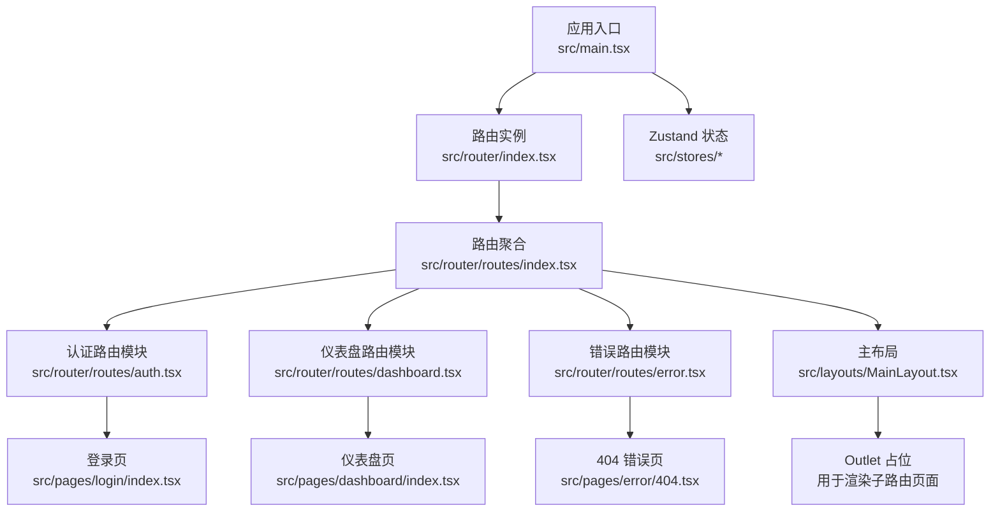
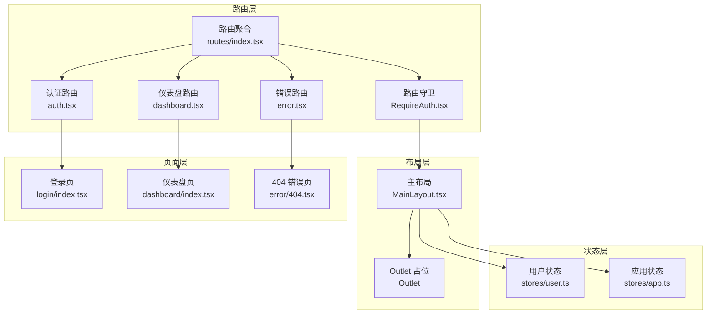
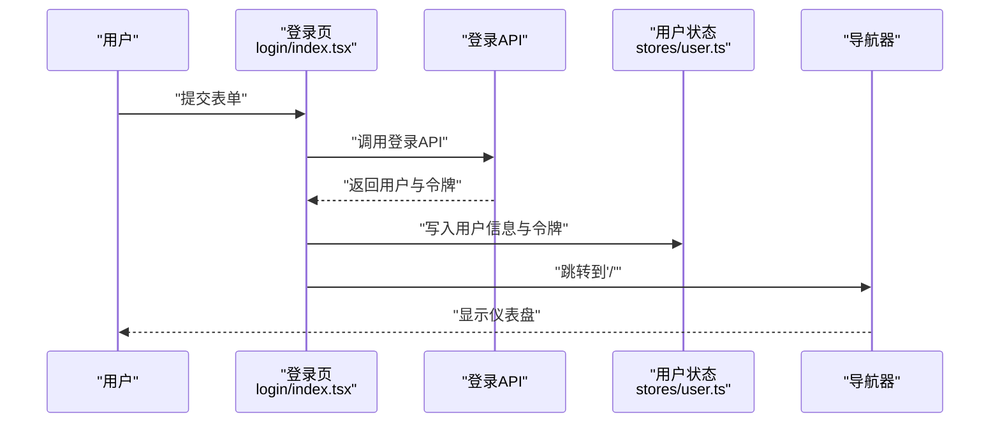
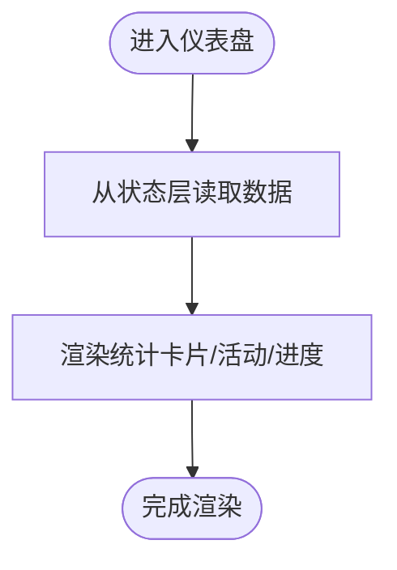
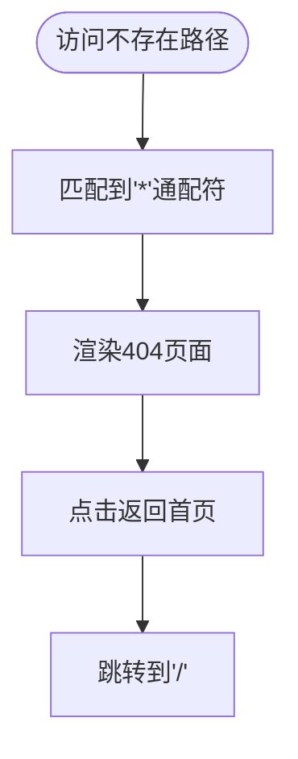
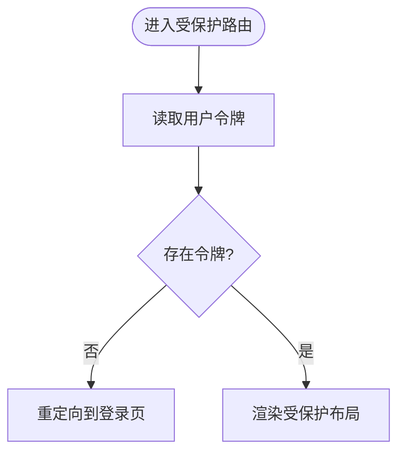
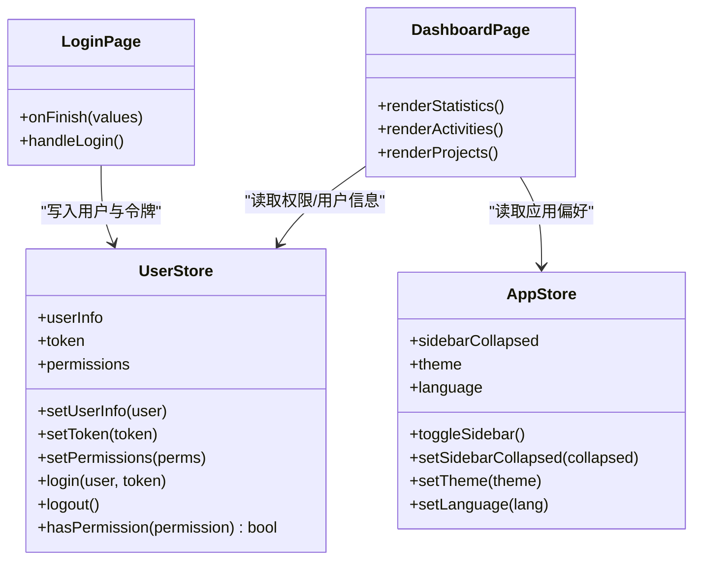
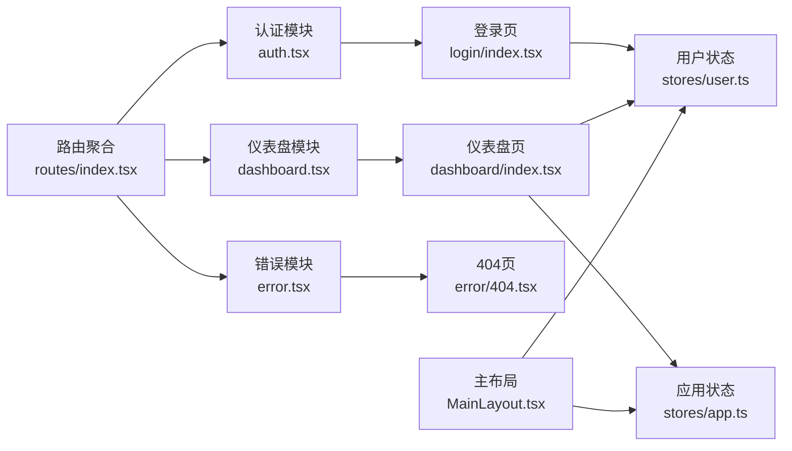

# 页面组件架构

<cite>
**本文引用的文件**
- [src/main.tsx](file://src/main.tsx)
- [src/router/index.tsx](file://src/router/index.tsx)
- [src/router/routes/index.tsx](file://src/router/routes/index.tsx)
- [src/router/routes/auth.tsx](file://src/router/routes/auth.tsx)
- [src/router/routes/dashboard.tsx](file://src/router/routes/dashboard.tsx)
- [src/router/routes/error.tsx](file://src/router/routes/error.tsx)
- [src/router/utils/index.tsx](file://src/router/utils/index.tsx)
- [src/router/guards/RequireAuth.tsx](file://src/router/guards/RequireAuth.tsx)
- [src/layouts/MainLayout.tsx](file://src/layouts/MainLayout.tsx)
- [src/pages/dashboard/index.tsx](file://src/pages/dashboard/index.tsx)
- [src/pages/login/index.tsx](file://src/pages/login/index.tsx)
- [src/pages/error/404.tsx](file://src/pages/error/404.tsx)
- [src/stores/user.ts](file://src/stores/user.ts)
- [src/stores/app.ts](file://src/stores/app.ts)
- [src/stores/index.ts](file://src/stores/index.ts)
</cite>

## 目录

1. [引言](#引言)
2. [项目结构](#项目结构)
3. [核心组件](#核心组件)
4. [架构总览](#架构总览)
5. [组件详解](#组件详解)
6. [依赖关系分析](#依赖关系分析)
7. [性能考量](#性能考量)
8. [故障排查指南](#故障排查指南)
9. [结论](#结论)
10. [附录：开发规范与最佳实践](#附录开发规范与最佳实践)

## 引言

本文件面向AI管理平台的页面组件架构，系统性阐述页面设计模式、组织结构、与路由系统的集成（含嵌套路由与Outlet）、状态管理策略（页面级状态提升与数据获取模式）、权限控制机制（路由守卫配合访问控制）、性能优化策略（懒加载、代码分割、缓存）以及开发规范与最佳实践。目标是帮助开发者快速理解并高效扩展页面层功能。

## 项目结构

页面组件位于 src/pages 目录下，采用按功能域分层的组织方式；路由系统位于 src/router，采用模块化拆分（认证、仪表盘、错误页），并通过主入口聚合；布局组件位于 src/layouts，当前采用主布局 MainLayout 包裹受保护内容区域；状态管理基于 Zustand，分别在 src/stores 中进行模块化管理。

图表来源

- [src/main.tsx](file://src/main.tsx#L10-L31)
- [src/router/index.tsx](file://src/router/index.tsx#L1-L9)
- [src/router/routes/index.tsx](file://src/router/routes/index.tsx#L9-L28)
- [src/router/routes/auth.tsx](file://src/router/routes/auth.tsx#L5-L11)
- [src/router/routes/dashboard.tsx](file://src/router/routes/dashboard.tsx#L5-L10)
- [src/router/routes/error.tsx](file://src/router/routes/error.tsx#L5-L10)
- [src/layouts/MainLayout.tsx](file://src/layouts/MainLayout.tsx#L166-L166)
- [src/pages/login/index.tsx](file://src/pages/login/index.tsx#L1-L133)
- [src/pages/dashboard/index.tsx](file://src/pages/dashboard/index.tsx#L1-L170)
- [src/pages/error/404.tsx](file://src/pages/error/404.tsx#L1-L23)
- [src/stores/user.ts](file://src/stores/user.ts#L21-L75)
- [src/stores/app.ts](file://src/stores/app.ts#L18-L58)

章节来源

- [src/main.tsx](file://src/main.tsx#L10-L31)
- [src/router/index.tsx](file://src/router/index.tsx#L1-L9)
- [src/router/routes/index.tsx](file://src/router/routes/index.tsx#L1-L31)

## 核心组件

- 应用入口与路由提供者：应用根节点通过 RouterProvider 注入路由实例，全局配置 Ant Design 国际化与主题。
- 主布局与嵌套路由：MainLayout 作为受保护布局容器，内部通过 Outlet 渲染当前匹配的子路由页面，形成“主布局 + 子页面”的嵌套结构。
- 页面组件：登录页、仪表盘页、404错误页均为独立页面组件，按需懒加载并使用 Suspense 提供加载态。
- 路由守卫：RequireAuth 在进入受保护布局前校验令牌，未通过则重定向至登录页。
- 状态管理：Zustand 分离用户态与应用态，支持持久化与 Immer 原子更新，简化页面级状态提升与共享。

章节来源

- [src/main.tsx](file://src/main.tsx#L17-L31)
- [src/layouts/MainLayout.tsx](file://src/layouts/MainLayout.tsx#L166-L166)
- [src/router/guards/RequireAuth.tsx](file://src/router/guards/RequireAuth.tsx#L11-L22)
- [src/stores/user.ts](file://src/stores/user.ts#L21-L75)
- [src/stores/app.ts](file://src/stores/app.ts#L18-L58)

## 架构总览

页面组件架构围绕“路由 + 布局 + 页面 + 状态”四要素展开。路由系统负责路径与页面映射、嵌套与守卫；布局负责导航与内容区占位；页面负责具体业务展示与交互；状态管理负责跨页面共享与持久化。

图表来源

- [src/router/routes/index.tsx](file://src/router/routes/index.tsx#L9-L28)
- [src/router/routes/auth.tsx](file://src/router/routes/auth.tsx#L5-L11)
- [src/router/routes/dashboard.tsx](file://src/router/routes/dashboard.tsx#L5-L12)
- [src/router/routes/error.tsx](file://src/router/routes/error.tsx#L5-L10)
- [src/router/guards/RequireAuth.tsx](file://src/router/guards/RequireAuth.tsx#L11-L22)
- [src/layouts/MainLayout.tsx](file://src/layouts/MainLayout.tsx#L166-L166)
- [src/stores/user.ts](file://src/stores/user.ts#L21-L75)
- [src/stores/app.ts](file://src/stores/app.ts#L18-L58)

## 组件详解

### 登录页（登录流程）

- 功能要点
  - 表单收集用户名、密码与“记住我”，使用 ahooks 的 useRequest 执行登录请求。
  - 登录成功后通过用户状态存储写入用户信息与令牌，并跳转到首页。
  - 使用 Ant Design 表单与图标组件，提供基础校验与加载态反馈。
- 关键交互时序

图表来源

- [src/pages/login/index.tsx](file://src/pages/login/index.tsx#L32-L50)
- [src/pages/login/index.tsx](file://src/pages/login/index.tsx#L36-L43)
- [src/stores/user.ts](file://src/stores/user.ts#L46-L50)
- [src/main.tsx](file://src/main.tsx#L17-L31)

章节来源

- [src/pages/login/index.tsx](file://src/pages/login/index.tsx#L1-L133)
- [src/stores/user.ts](file://src/stores/user.ts#L21-L75)

### 仪表盘页（页面级数据与布局）

- 功能要点
  - 展示统计卡片、最近活动列表与项目进度条，采用响应式栅格布局。
  - 页面本身不直接发起网络请求，体现“页面级状态提升 + 数据获取模式”：数据通常由上层布局或状态层提供，页面仅消费。
- 结构示意

图表来源

- [src/pages/dashboard/index.tsx](file://src/pages/dashboard/index.tsx#L12-L167)

章节来源

- [src/pages/dashboard/index.tsx](file://src/pages/dashboard/index.tsx#L1-L170)

### 404 错误页（兜底路由）

- 功能要点
  - 使用 Ant Design Result 组件展示错误状态与返回首页按钮。
  - 通过导航器返回首页，保证用户体验与可恢复性。
- 流程示意

图表来源

- [src/router/routes/error.tsx](file://src/router/routes/error.tsx#L5-L10)
- [src/pages/error/404.tsx](file://src/pages/error/404.tsx#L5-L19)

章节来源

- [src/pages/error/404.tsx](file://src/pages/error/404.tsx#L1-L23)
- [src/router/routes/error.tsx](file://src/router/routes/error.tsx#L1-L16)

### 主布局与嵌套路由（Outlet）

- 功能要点
  - 主布局包含侧边栏、头部与内容区，内容区通过 Outlet 渲染当前匹配的子路由页面。
  - 顶部导航与侧边菜单联动，支持折叠切换与用户菜单操作。
- 嵌套关系示意

图表来源

- [src/router/routes/index.tsx](file://src/router/routes/index.tsx#L11-L25)
- [src/layouts/MainLayout.tsx](file://src/layouts/MainLayout.tsx#L166-L166)

章节来源

- [src/layouts/MainLayout.tsx](file://src/layouts/MainLayout.tsx#L1-L174)
- [src/router/routes/index.tsx](file://src/router/routes/index.tsx#L1-L31)

### 路由守卫与权限控制（RequireAuth）

- 功能要点
  - 在进入受保护布局前检查用户令牌是否存在，无令牌则重定向至登录页。
  - 支持自定义重定向地址，默认为登录页。
- 权限控制流程

图表来源

- [src/router/guards/RequireAuth.tsx](file://src/router/guards/RequireAuth.tsx#L11-L22)

章节来源

- [src/router/guards/RequireAuth.tsx](file://src/router/guards/RequireAuth.tsx#L1-L25)
- [src/stores/user.ts](file://src/stores/user.ts#L21-L75)

### 状态管理策略（Zustand）

- 用户状态（useUserStore）
  - 字段：用户信息、令牌、权限集合。
  - 方法：设置信息、设置令牌、设置权限、登录、登出、权限判断。
  - 特性：持久化存储令牌与用户信息片段，Immer 原子更新。
- 应用状态（useAppStore）
  - 字段：侧边栏折叠状态、主题、语言。
  - 方法：切换折叠、设置折叠、设置主题、设置语言。
  - 特性：持久化应用偏好，Immer 原子更新。
- 页面级状态提升与数据获取模式
  - 页面组件通过状态存储读取全局状态，避免在页面内重复拉取相同数据。
  - 页面组件负责渲染与交互，数据获取由上层（布局或状态层）统一处理，减少重复请求与状态分散。

图表来源

- [src/stores/user.ts](file://src/stores/user.ts#L21-L75)
- [src/stores/app.ts](file://src/stores/app.ts#L18-L58)
- [src/pages/login/index.tsx](file://src/pages/login/index.tsx#L32-L50)
- [src/pages/dashboard/index.tsx](file://src/pages/dashboard/index.tsx#L12-L167)

章节来源

- [src/stores/user.ts](file://src/stores/user.ts#L1-L76)
- [src/stores/app.ts](file://src/stores/app.ts#L1-L59)
- [src/stores/index.ts](file://src/stores/index.ts#L1-L3)

## 依赖关系分析

- 路由依赖
  - 路由聚合文件引入各模块路由并组合成完整路由树。
  - 认证路由与仪表盘路由均使用懒加载与 Suspense 包裹，确保按需加载与加载态体验。
- 布局依赖
  - 主布局依赖状态存储以读取用户信息与应用偏好，同时通过 Outlet 渲染子路由页面。
- 页面依赖
  - 登录页依赖用户状态存储执行登录动作；仪表盘页依赖状态存储读取权限与用户信息；404页依赖导航器返回首页。
- 状态依赖
  - 页面通过状态存储读取与写入，避免在页面内分散管理状态，降低耦合度。

图表来源

- [src/router/routes/index.tsx](file://src/router/routes/index.tsx#L9-L28)
- [src/router/routes/auth.tsx](file://src/router/routes/auth.tsx#L5-L11)
- [src/router/routes/dashboard.tsx](file://src/router/routes/dashboard.tsx#L5-L12)
- [src/router/routes/error.tsx](file://src/router/routes/error.tsx#L5-L10)
- [src/pages/login/index.tsx](file://src/pages/login/index.tsx#L32-L50)
- [src/pages/dashboard/index.tsx](file://src/pages/dashboard/index.tsx#L12-L167)
- [src/pages/error/404.tsx](file://src/pages/error/404.tsx#L5-L19)
- [src/stores/user.ts](file://src/stores/user.ts#L21-L75)
- [src/stores/app.ts](file://src/stores/app.ts#L18-L58)
- [src/layouts/MainLayout.tsx](file://src/layouts/MainLayout.tsx#L166-L166)

章节来源

- [src/router/routes/index.tsx](file://src/router/routes/index.tsx#L1-L31)
- [src/layouts/MainLayout.tsx](file://src/layouts/MainLayout.tsx#L1-L174)

## 性能考量

- 懒加载与代码分割
  - 各路由模块使用 React.lazy 与 Suspense 包裹，结合 lazyLoad 工具函数，实现按需加载与加载态展示，减少首屏体积。
- 缓存机制
  - 用户状态与应用状态采用持久化中间件，将关键字段（如令牌、用户信息、侧边栏折叠状态、主题、语言）持久化，提升二次访问体验。
- 加载态与骨架
  - 懒加载组件通过全局 Spin 提供统一加载态，改善感知性能。
- 路由守卫短路
  - 未登录用户在进入受保护布局前即被重定向，避免无效渲染与资源浪费。

章节来源

- [src/router/utils/index.tsx](file://src/router/utils/index.tsx#L4-L20)
- [src/router/routes/auth.tsx](file://src/router/routes/auth.tsx#L5-L11)
- [src/router/routes/dashboard.tsx](file://src/router/routes/dashboard.tsx#L5-L12)
- [src/router/routes/error.tsx](file://src/router/routes/error.tsx#L5-L10)
- [src/stores/user.ts](file://src/stores/user.ts#L67-L74)
- [src/stores/app.ts](file://src/stores/app.ts#L49-L57)

## 故障排查指南

- 登录失败或无法跳转
  - 检查登录页是否正确调用用户状态存储写入令牌与用户信息，并确认导航器跳转逻辑。
  - 参考：[登录页提交与跳转](file://src/pages/login/index.tsx#L32-L50)
- 未登录被重定向到登录页
  - 检查路由守卫是否正确读取令牌，确认令牌是否持久化成功。
  - 参考：[路由守卫令牌检查](file://src/router/guards/RequireAuth.tsx#L15-L19)，[用户状态持久化](file://src/stores/user.ts#L67-L74)
- 仪表盘空白或数据不显示
  - 检查页面是否从状态层正确读取数据，确认状态初始化与写入逻辑。
  - 参考：[仪表盘渲染](file://src/pages/dashboard/index.tsx#L12-L167)，[用户状态读取](file://src/stores/user.ts#L21-L75)
- 404页面未显示
  - 检查通配符路由是否正确挂载，确认懒加载与 Suspense 配置。
  - 参考：[错误路由配置](file://src/router/routes/error.tsx#L5-L10)，[404页面](file://src/pages/error/404.tsx#L5-L19)

章节来源

- [src/pages/login/index.tsx](file://src/pages/login/index.tsx#L32-L50)
- [src/router/guards/RequireAuth.tsx](file://src/router/guards/RequireAuth.tsx#L15-L19)
- [src/stores/user.ts](file://src/stores/user.ts#L67-L74)
- [src/pages/dashboard/index.tsx](file://src/pages/dashboard/index.tsx#L12-L167)
- [src/router/routes/error.tsx](file://src/router/routes/error.tsx#L5-L10)
- [src/pages/error/404.tsx](file://src/pages/error/404.tsx#L5-L19)

## 结论

本页面组件架构以“路由 + 布局 + 页面 + 状态”为核心，通过 RequireAuth 实现访问控制，通过 Outlet 实现嵌套路由与页面切换，通过 Zustand 实现状态持久化与页面级状态提升。配合懒加载与缓存策略，整体具备良好的可维护性、可扩展性与性能表现。后续可在路由模块中继续拆分更多页面域，并在状态层补充更细粒度的数据获取与缓存策略。

## 附录：开发规范与最佳实践

- 页面组件开发规范
  - 页面组件职责单一，专注渲染与交互；数据获取与状态提升交由上层处理。
  - 使用类型安全的 props 与状态字段，避免在页面内直接管理全局状态。
  - 对外暴露最小 API，便于复用与测试。
- 路由与嵌套路由
  - 子路由页面统一通过懒加载与 Suspense 包裹，保持一致的加载体验。
  - 嵌套路由通过主布局的 Outlet 渲染，避免在页面内重复实现布局。
- 权限控制
  - 受保护路由统一使用 RequireAuth 守卫，避免在页面内分散处理。
  - 权限判断方法集中于状态存储，提供 hasPermission 等便捷方法。
- 状态管理
  - 用户态与应用态分离，分别管理用户信息/令牌与界面偏好。
  - 使用 Immer 原子更新，减少不必要的渲染与副作用。
  - 仅持久化必要字段，避免敏感信息泄露。
- 性能优化
  - 按需加载与代码分割优先；对大组件提供骨架屏或加载态。
  - 合理使用缓存与持久化，减少重复请求与初始化开销。
- 可维护性
  - 路由模块化拆分，新增页面只需在对应模块注册即可。
  - 统一的错误兜底与返回逻辑，提升一致性与可测试性。
