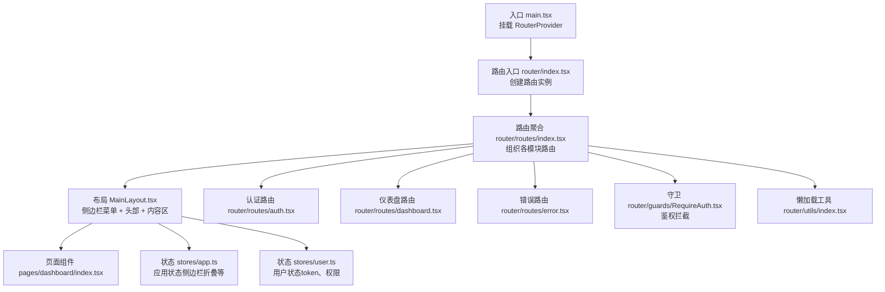
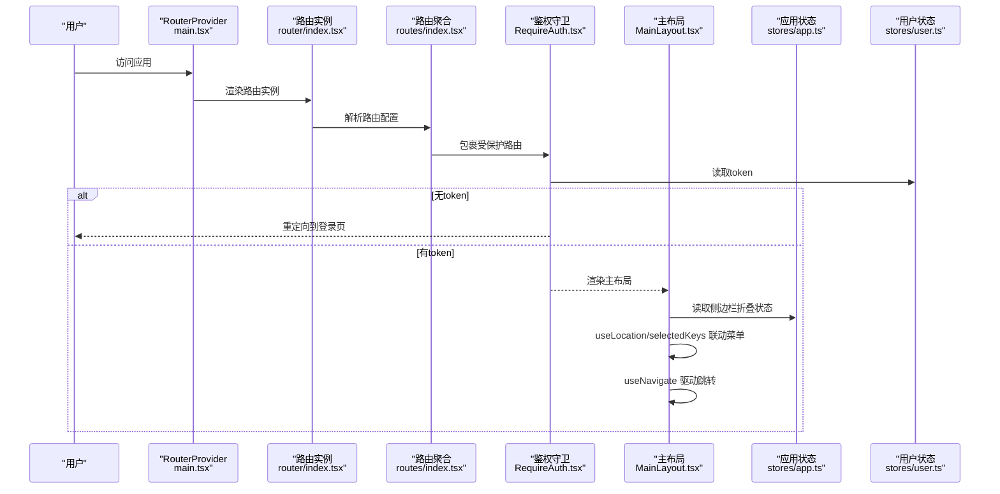
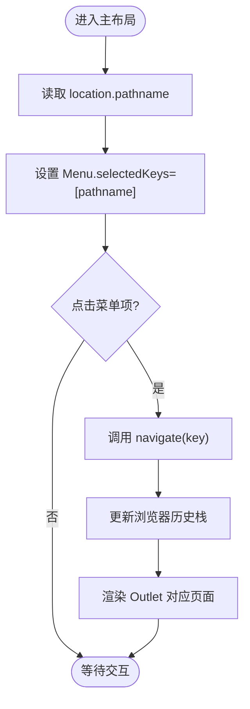
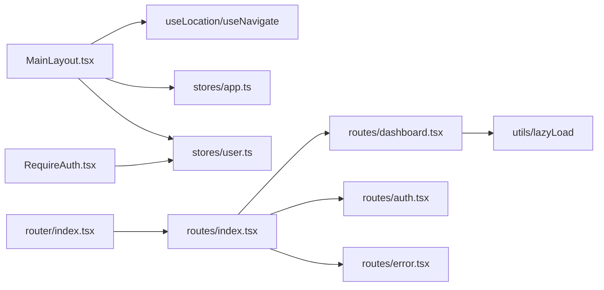

# 导航管理与状态

<cite>
**本文引用的文件**
- [src/main.tsx](file://src/main.tsx)
- [src/router/index.tsx](file://src/router/index.tsx)
- [src/router/routes/index.tsx](file://src/router/routes/index.tsx)
- [src/router/routes/dashboard.tsx](file://src/router/routes/dashboard.tsx)
- [src/router/routes/auth.tsx](file://src/router/routes/auth.tsx)
- [src/router/routes/error.tsx](file://src/router/routes/error.tsx)
- [src/router/utils/index.tsx](file://src/router/utils/index.tsx)
- [src/router/guards/RequireAuth.tsx](file://src/router/guards/RequireAuth.tsx)
- [src/layouts/MainLayout.tsx](file://src/layouts/MainLayout.tsx)
- [src/stores/app.ts](file://src/stores/app.ts)
- [src/stores/user.ts](file://src/stores/user.ts)
- [src/pages/dashboard/index.tsx](file://src/pages/dashboard/index.tsx)
- [mock/routes.json](file://mock/routes.json)
</cite>

## 目录

1. [简介](#简介)
2. [项目结构](#项目结构)
3. [核心组件](#核心组件)
4. [架构总览](#架构总览)
5. [详细组件分析](#详细组件分析)
6. [依赖关系分析](#依赖关系分析)
7. [性能考量](#性能考量)
8. [故障排查指南](#故障排查指南)
9. [结论](#结论)
10. [附录](#附录)

## 简介

本文件围绕AI管理平台的导航管理与状态展开，系统性阐述以下主题：

- 路由状态的获取与监听：基于React Router的useNavigate、useLocation等hooks，如何在组件中读取与驱动导航状态。
- 导航历史与前进后退：结合浏览器历史栈与路由配置，说明如何实现前进后退与状态保持。
- 导航事件处理：如何监听路由变化并执行副作用（如埋点、权限校验、菜单联动）。
- 面包屑导航：基于路由配置元信息动态生成面包屑的策略。
- 侧边栏菜单与路由联动：如何根据当前路由高亮对应菜单项，并通过useNavigate驱动跳转。
- 导航动画与过渡：结合布局与状态存储，给出可落地的过渡方案。
- 性能优化与常见问题：懒加载、状态持久化、权限守卫对性能的影响及优化建议。

## 项目结构

本项目采用“按功能域分层+路由模块化”的组织方式：

- 入口与渲染：在入口文件中挂载RouterProvider，统一注入路由实例。
- 路由层：拆分为多个路由模块（认证、仪表盘、错误页），并通过聚合文件统一导出。
- 布局层：主布局MainLayout集中处理头部、侧边栏、内容区与菜单联动。
- 状态层：应用状态与用户状态分别通过Zustand进行管理，并持久化到本地存储。
- 懒加载与骨架：通过通用工具对页面组件进行懒加载与加载占位。

图表来源

- [src/main.tsx](file://src/main.tsx#L17-L31)
- [src/router/index.tsx](file://src/router/index.tsx#L1-L9)
- [src/router/routes/index.tsx](file://src/router/routes/index.tsx#L9-L28)
- [src/layouts/MainLayout.tsx](file://src/layouts/MainLayout.tsx#L18-L171)
- [src/stores/app.ts](file://src/stores/app.ts#L18-L58)
- [src/stores/user.ts](file://src/stores/user.ts#L21-L75)
- [src/router/guards/RequireAuth.tsx](file://src/router/guards/RequireAuth.tsx#L11-L22)
- [src/router/utils/index.tsx](file://src/router/utils/index.tsx#L4-L20)

章节来源

- [src/main.tsx](file://src/main.tsx#L17-L31)
- [src/router/index.tsx](file://src/router/index.tsx#L1-L9)
- [src/router/routes/index.tsx](file://src/router/routes/index.tsx#L9-L28)

## 核心组件

- 路由实例与Provider
  - 在入口文件中创建路由实例并注入到应用根节点，确保全局路由可用。
  - 路由实例由路由聚合文件统一导出，便于集中管理。
- 主布局与菜单联动
  - 主布局中使用useLocation读取当前路径，使用useNavigate驱动跳转。
  - 侧边栏菜单通过selectedKeys与location.pathname联动，实现自动高亮。
- 鉴权守卫
  - RequireAuth守卫从用户状态中读取token，无token时重定向至登录页。
- 应用状态与用户状态
  - 应用状态包含侧边栏折叠等UI状态；用户状态包含token、权限等业务状态。
  - 两者均使用Zustand持久化，提升用户体验与性能。

章节来源

- [src/main.tsx](file://src/main.tsx#L17-L31)
- [src/layouts/MainLayout.tsx](file://src/layouts/MainLayout.tsx#L18-L171)
- [src/router/guards/RequireAuth.tsx](file://src/router/guards/RequireAuth.tsx#L11-L22)
- [src/stores/app.ts](file://src/stores/app.ts#L18-L58)
- [src/stores/user.ts](file://src/stores/user.ts#L21-L75)

## 架构总览

下图展示了从入口到布局、路由、状态与页面的整体交互流程：

图表来源

- [src/main.tsx](file://src/main.tsx#L17-L31)
- [src/router/index.tsx](file://src/router/index.tsx#L1-L9)
- [src/router/routes/index.tsx](file://src/router/routes/index.tsx#L9-L28)
- [src/router/guards/RequireAuth.tsx](file://src/router/guards/RequireAuth.tsx#L11-L22)
- [src/layouts/MainLayout.tsx](file://src/layouts/MainLayout.tsx#L18-L171)
- [src/stores/app.ts](file://src/stores/app.ts#L18-L58)
- [src/stores/user.ts](file://src/stores/user.ts#L21-L75)

## 详细组件分析

### 路由状态获取与监听（useNavigate、useLocation）

- 获取当前路由状态
  - 在主布局中通过useLocation读取location对象，从而获得当前路径等信息。
  - 该状态用于菜单高亮与面包屑生成的基础。
- 监听路由变化
  - 当前代码未显式监听location变化，但可通过useEffect在主布局中订阅location变化，执行副作用（如埋点、权限校验、滚动复位等）。
- 导航驱动
  - 使用useNavigate在菜单点击或用户操作时进行编程式导航，支持相对路径与绝对路径。
- 导航历史与前进后退
  - 浏览器历史栈由React Router维护，无需额外实现前进后退逻辑；如需跨页面保留状态，可在页面级状态管理中引入持久化策略。

章节来源

- [src/layouts/MainLayout.tsx](file://src/layouts/MainLayout.tsx#L18-L171)

### 导航历史管理策略（前进后退与状态保持）

- 历史栈管理
  - React Router默认使用浏览器历史栈，前进后退由浏览器原生能力提供。
- 状态保持
  - 页面级状态可通过Zustand持久化中间件在刷新后恢复；对于复杂场景，可在页面组件内结合sessionStorage或URL参数进行轻量状态同步。
- 路由参数与查询
  - 对于带参数的路由，建议在页面组件中解析params与search，必要时将其写入状态或URL，以便刷新后恢复。

章节来源

- [src/router/routes/dashboard.tsx](file://src/router/routes/dashboard.tsx#L8-L14)
- [src/router/utils/index.tsx](file://src/router/utils/index.tsx#L4-L20)

### 导航事件处理（监听路由变化与副作用）

- 副作用执行时机
  - 在主布局中使用useEffect监听location变化，执行如埋点上报、权限校验、标题更新、滚动位置复位等副作用。
- 权限校验
  - 鉴权守卫在进入受保护路由前检查token，无token则重定向至登录页。
- 页面级副作用
  - 页面组件可监听自身props或上下文变化，执行初始化加载、订阅清理等。

章节来源

- [src/router/guards/RequireAuth.tsx](file://src/router/guards/RequireAuth.tsx#L11-L22)
- [src/layouts/MainLayout.tsx](file://src/layouts/MainLayout.tsx#L18-L171)

### 面包屑导航（动态生成策略）

- 元信息来源
  - 路由配置中的handle字段可用于存放页面元信息（如标题、图标），作为面包屑名称与图标的数据源。
- 动态生成步骤
  - 通过location.pathname与路由配置映射，计算当前路径对应的面包屑层级。
  - 将每个层级映射到对应的元信息，生成可点击的导航链路。
- 实现要点
  - 需要保证路由层级与面包屑层级一致；对于嵌套路由，应正确处理index与children的关系。

章节来源

- [src/router/routes/dashboard.tsx](file://src/router/routes/dashboard.tsx#L8-L14)
- [src/router/routes/index.tsx](file://src/router/routes/index.tsx#L9-L28)

### 侧边栏菜单与路由联动（高亮与跳转）

- 菜单高亮
  - 侧边栏Menu组件通过selectedKeys绑定location.pathname，实现自动高亮。
- 跳转驱动
  - 菜单项onClick回调中调用navigate(key)，实现编程式导航。
- 菜单项扩展
  - 新增菜单项时，只需在menuItems中追加条目，并确保key与目标路由一致。

图表来源

- [src/layouts/MainLayout.tsx](file://src/layouts/MainLayout.tsx#L98-L104)

章节来源

- [src/layouts/MainLayout.tsx](file://src/layouts/MainLayout.tsx#L63-L104)

### 导航动画与过渡（布局与状态）

- 侧边栏折叠动画
  - 通过应用状态toggleSidebar控制Sider.collapsed，配合Ant Design的折叠动画实现平滑过渡。
- 页面切换过渡
  - 可在Outlet外层包裹过渡组件（如CSS动画或第三方库），实现页面间的淡入淡出或滑动过渡。
- 加载占位
  - 使用懒加载工具在页面切换时显示加载骨架，改善感知性能。

章节来源

- [src/stores/app.ts](file://src/stores/app.ts#L18-L58)
- [src/router/utils/index.tsx](file://src/router/utils/index.tsx#L4-L20)

### 路由配置与页面懒加载

- 路由聚合
  - 路由聚合文件将认证、仪表盘、错误页等模块路由合并，并在根路径下套用RequireAuth与MainLayout。
- 懒加载
  - 页面组件通过lazy与Suspense实现懒加载，减少首屏体积；加载期间显示大尺寸加载指示器。

章节来源

- [src/router/routes/index.tsx](file://src/router/routes/index.tsx#L9-L28)
- [src/router/routes/dashboard.tsx](file://src/router/routes/dashboard.tsx#L5-L14)
- [src/router/utils/index.tsx](file://src/router/utils/index.tsx#L4-L20)

### 登录与鉴权（RequireAuth）

- 鉴权逻辑
  - 守卫从用户状态读取token，若不存在则重定向至登录页。
- 登录后跳转
  - 登录成功后应设置token与用户信息，并在需要时回退到目标页面。

章节来源

- [src/router/guards/RequireAuth.tsx](file://src/router/guards/RequireAuth.tsx#L11-L22)
- [src/stores/user.ts](file://src/stores/user.ts#L46-L60)

## 依赖关系分析

- 组件耦合与职责
  - MainLayout依赖useLocation/useNavigate进行导航联动，依赖应用状态与用户状态进行UI与业务控制。
  - RequireAuth依赖用户状态进行鉴权，避免重复鉴权逻辑分散。
  - 路由聚合文件负责组织路由，降低布局与路由的耦合度。
- 外部依赖
  - React Router提供路由能力；Ant Design提供UI组件与图标；Zustand提供轻量状态管理与持久化。

图表来源

- [src/layouts/MainLayout.tsx](file://src/layouts/MainLayout.tsx#L18-L171)
- [src/stores/app.ts](file://src/stores/app.ts#L18-L58)
- [src/stores/user.ts](file://src/stores/user.ts#L21-L75)
- [src/router/guards/RequireAuth.tsx](file://src/router/guards/RequireAuth.tsx#L11-L22)
- [src/router/index.tsx](file://src/router/index.tsx#L1-L9)
- [src/router/routes/index.tsx](file://src/router/routes/index.tsx#L9-L28)
- [src/router/routes/dashboard.tsx](file://src/router/routes/dashboard.tsx#L5-L14)
- [src/router/utils/index.tsx](file://src/router/utils/index.tsx#L4-L20)

章节来源

- [src/layouts/MainLayout.tsx](file://src/layouts/MainLayout.tsx#L18-L171)
- [src/router/routes/index.tsx](file://src/router/routes/index.tsx#L9-L28)

## 性能考量

- 懒加载与骨架
  - 页面组件使用懒加载与加载骨架，显著降低首屏时间与白屏风险。
- 状态持久化
  - 应用状态与用户状态均使用持久化中间件，避免频繁重新拉取与初始化。
- 路由与布局解耦
  - 将路由聚合与布局分离，减少不必要的重渲染。
- 建议
  - 对高频路由变化的页面，考虑使用缓存策略或keep-alive（如需）。
  - 对长列表或复杂图表页面，可进一步拆分加载与分页，避免一次性渲染造成卡顿。

章节来源

- [src/router/utils/index.tsx](file://src/router/utils/index.tsx#L4-L20)
- [src/stores/app.ts](file://src/stores/app.ts#L18-L58)
- [src/stores/user.ts](file://src/stores/user.ts#L21-L75)

## 故障排查指南

- 登录后无法进入受保护页面
  - 检查用户状态是否正确设置token与用户信息；确认鉴权守卫读取逻辑。
- 菜单不随路由高亮
  - 确认Menu的selectedKeys绑定的是location.pathname；检查菜单key与路由路径是否一致。
- 页面切换闪烁或白屏
  - 检查懒加载与骨架配置；确认Suspense包裹范围覆盖完整。
- 路由重定向异常
  - 检查路由聚合中的重定向逻辑与错误页配置；确认浏览器历史栈状态。

章节来源

- [src/router/guards/RequireAuth.tsx](file://src/router/guards/RequireAuth.tsx#L11-L22)
- [src/layouts/MainLayout.tsx](file://src/layouts/MainLayout.tsx#L98-L104)
- [src/router/utils/index.tsx](file://src/router/utils/index.tsx#L4-L20)
- [src/router/routes/error.tsx](file://src/router/routes/error.tsx#L8-L13)

## 结论

本项目通过清晰的路由分层、稳定的布局联动与轻量的状态管理，构建了可维护、可扩展的导航体系。结合懒加载、持久化与鉴权守卫，既保证了性能，也提升了用户体验。后续可在面包屑动态生成、页面过渡动画与复杂路由场景（如多级嵌套、参数化路由）方面进一步完善。

## 附录

- 示例页面：仪表盘页面展示了统计卡片与活动列表的布局实践，可作为导航联动与内容区渲染的参考。
- Mock路由：mock/routes.json提供了示例路由映射，便于理解路由与页面的对应关系。

章节来源

- [src/pages/dashboard/index.tsx](file://src/pages/dashboard/index.tsx#L12-L167)
- [mock/routes.json](file://mock/routes.json#L1-L10)
