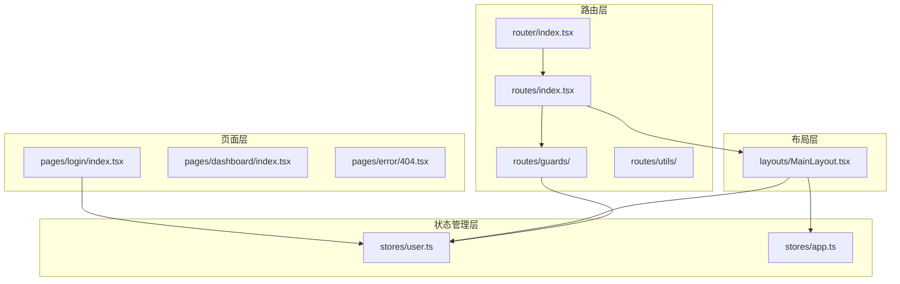
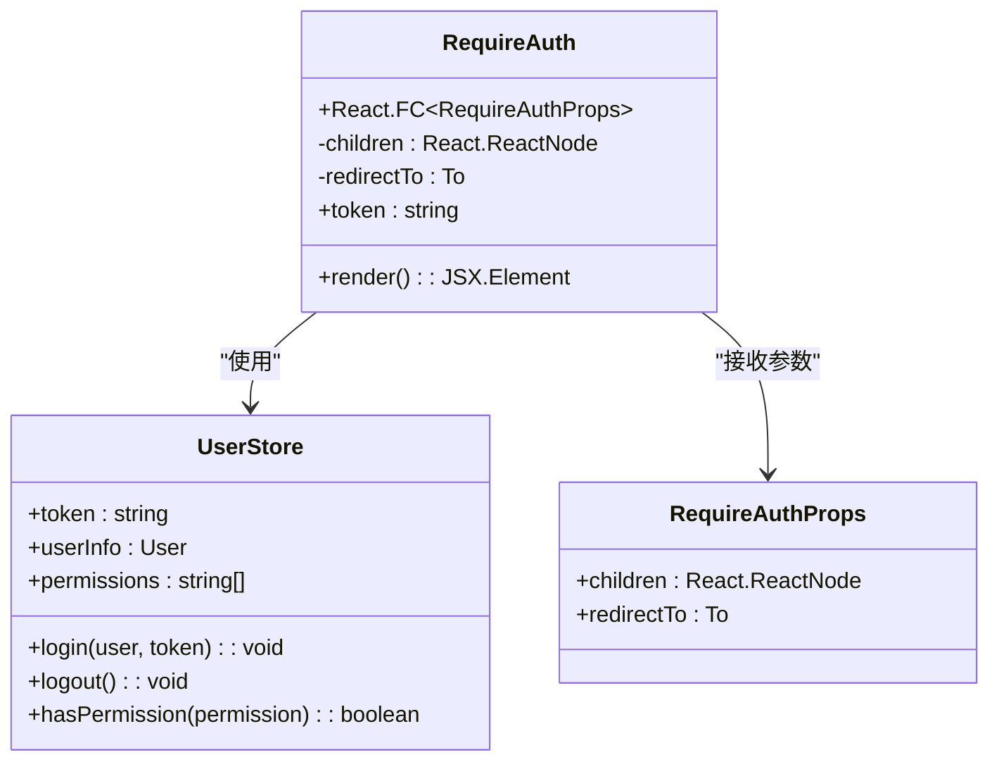
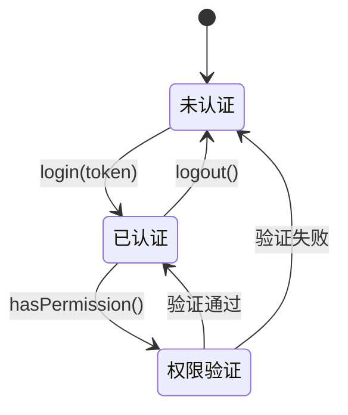
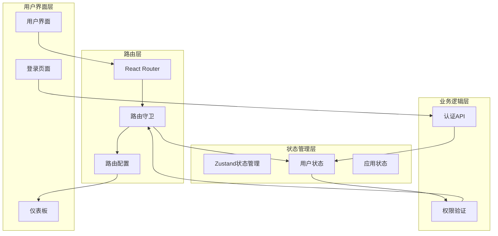
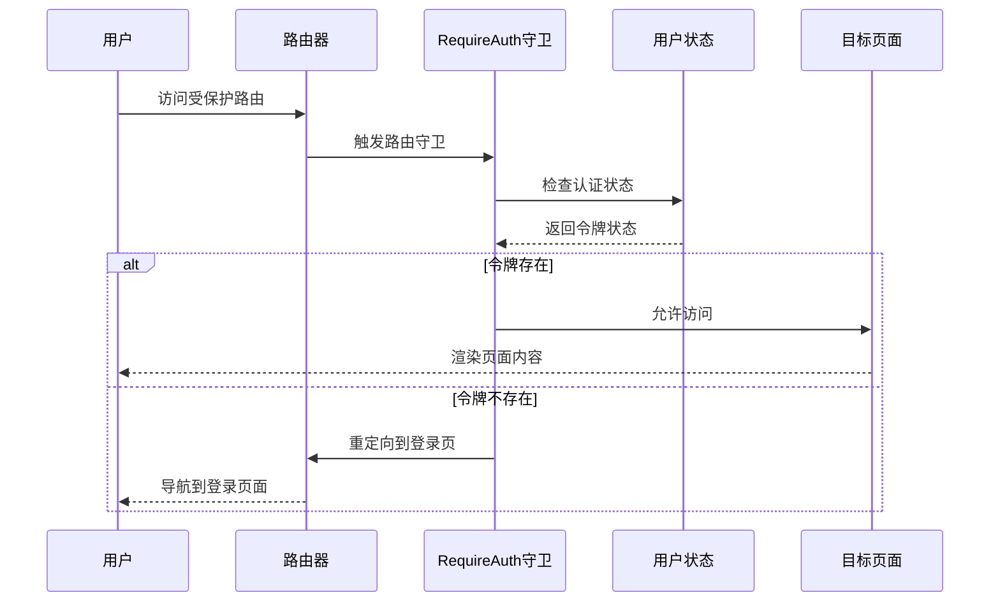
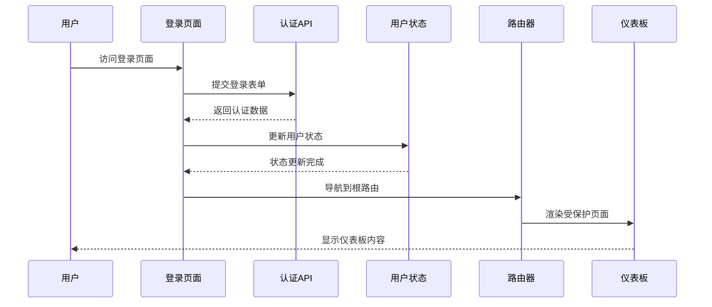
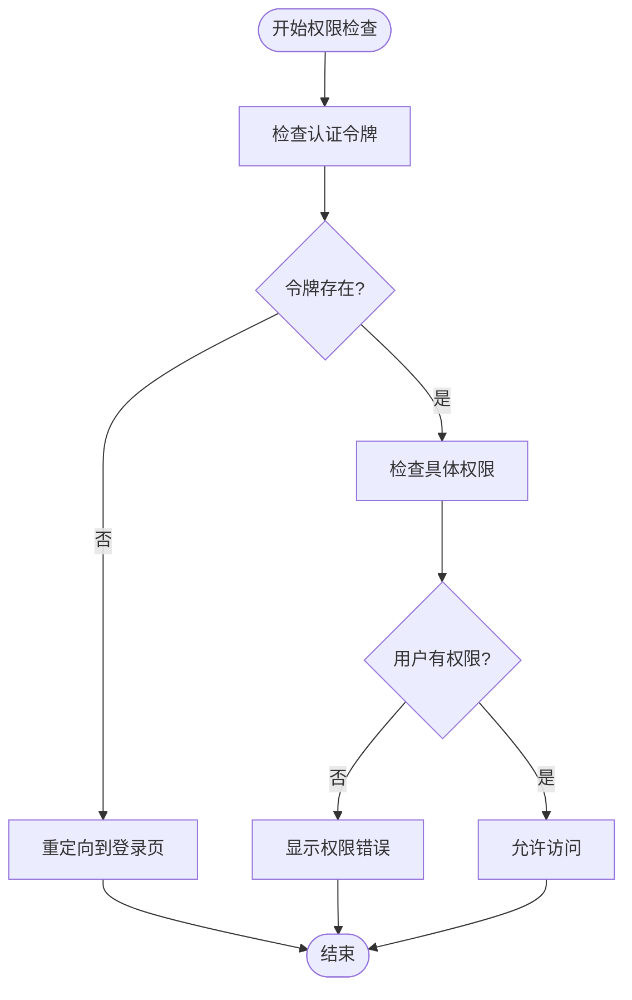
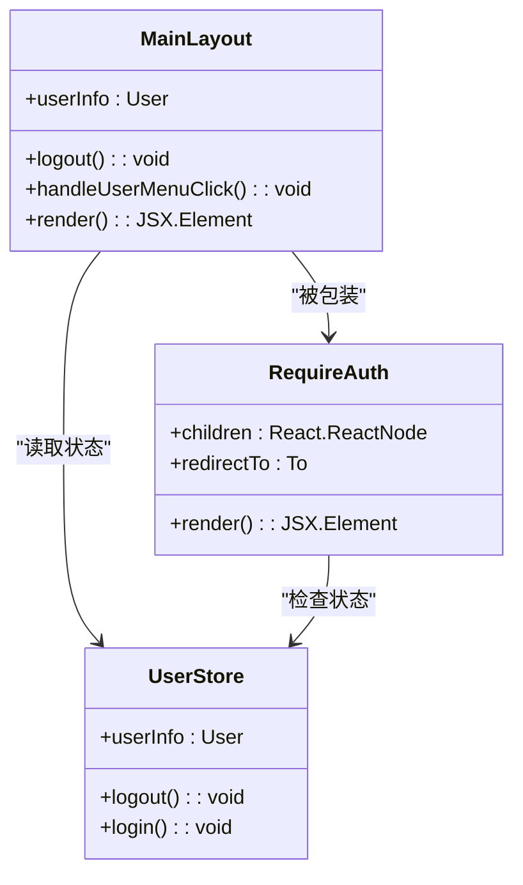
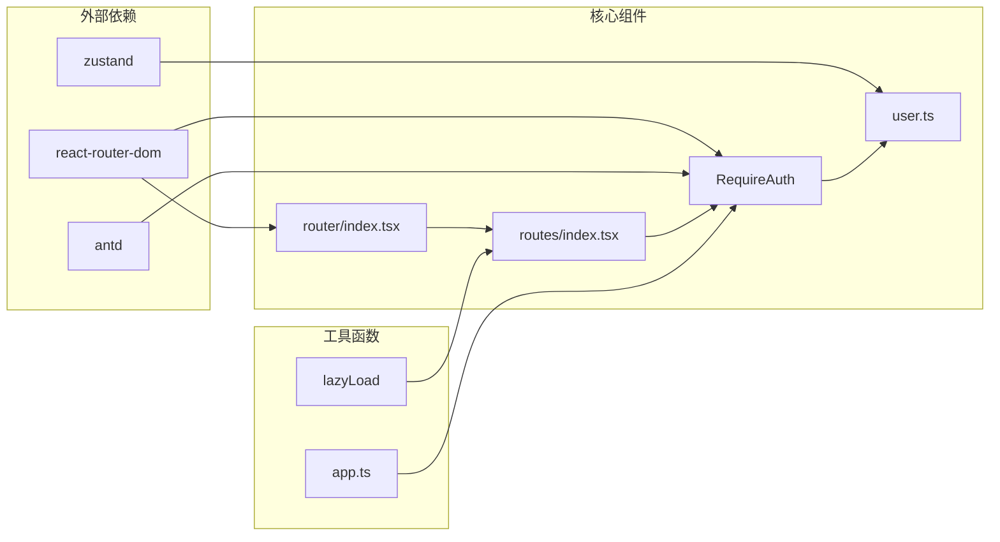

# 路由守卫机制

<cite>
**本文档引用的文件**
- [RequireAuth.tsx](file://src/router/guards/RequireAuth.tsx)
- [guards/index.ts](file://src/router/guards/index.ts)
- [user.ts](file://src/stores/user.ts)
- [routes/index.tsx](file://src/router/routes/index.tsx)
- [router/index.tsx](file://src/router/index.tsx)
- [auth.tsx](file://src/router/routes/auth.tsx)
- [dashboard.tsx](file://src/router/routes/dashboard.tsx)
- [error.tsx](file://src/router/routes/error.tsx)
- [MainLayout.tsx](file://src/layouts/MainLayout.tsx)
- [login/index.tsx](file://src/pages/login/index.tsx)
- [app.ts](file://src/stores/app.ts)
- [utils/index.tsx](file://src/router/utils/index.tsx)
- [main.tsx](file://src/main.tsx)
</cite>

## 目录

1. [引言](#引言)
2. [项目结构](#项目结构)
3. [核心组件](#核心组件)
4. [架构概览](#架构概览)
5. [详细组件分析](#详细组件分析)
6. [依赖关系分析](#依赖关系分析)
7. [性能考虑](#性能考虑)
8. [故障排除指南](#故障排除指南)
9. [结论](#结论)
10. [附录](#附录)

## 引言

本文件深入解析AI管理平台的路由守卫机制，重点阐述RequireAuth组件的实现逻辑和权限验证机制。该系统通过路由守卫实现登录状态检查、用户权限验证和访问控制，确保只有经过身份验证的用户才能访问受保护的资源。

路由守卫作为现代前端应用安全架构的核心组件，负责在用户导航到不同页面时进行权限验证，提供无缝的用户体验和强大的安全保障。本文将详细分析其实现原理、执行时机、与状态管理的集成方式，以及最佳实践指导。

## 项目结构

AI管理平台采用模块化架构设计，路由守卫机制分布在多个关键目录中：



**图表来源**

- [router/index.tsx](file://src/router/index.tsx#L1-L9)
- [routes/index.tsx](file://src/router/routes/index.tsx#L1-L31)
- [stores/user.ts](file://src/stores/user.ts#L1-L76)

**章节来源**

- [router/index.tsx](file://src/router/index.tsx#L1-L9)
- [routes/index.tsx](file://src/router/routes/index.tsx#L1-L31)

## 核心组件

### RequireAuth路由守卫组件

RequireAuth是系统中最核心的路由守卫组件，实现了基于令牌的认证检查机制：



**图表来源**

- [RequireAuth.tsx](file://src/router/guards/RequireAuth.tsx#L6-L25)
- [user.ts](file://src/stores/user.ts#L6-L19)

RequireAuth组件的核心功能包括：

- **令牌检查**：从用户状态存储中获取认证令牌
- **条件渲染**：根据令牌存在性决定是否渲染受保护内容
- **自动重定向**：未认证用户自动跳转到登录页面
- **可配置重定向路径**：支持自定义重定向目标

**章节来源**

- [RequireAuth.tsx](file://src/router/guards/RequireAuth.tsx#L1-L25)

### 用户状态管理

用户状态管理采用Zustand库实现，提供了完整的认证状态管理能力：



**图表来源**

- [user.ts](file://src/stores/user.ts#L46-L65)

用户状态包含以下关键属性：

- **认证令牌**：用于API请求的身份验证
- **用户信息**：包含用户的基本资料
- **权限列表**：细粒度的权限控制数组

**章节来源**

- [user.ts](file://src/stores/user.ts#L1-L76)

## 架构概览

AI管理平台的路由守卫架构采用分层设计，确保了良好的可维护性和扩展性：



**图表来源**

- [main.tsx](file://src/main.tsx#L17-L31)
- [router/index.tsx](file://src/router/index.tsx#L1-L9)
- [routes/index.tsx](file://src/router/routes/index.tsx#L9-L28)

## 详细组件分析

### 路由配置与守卫集成

路由系统通过RequireAuth组件实现了统一的访问控制策略：



**图表来源**

- [routes/index.tsx](file://src/router/routes/index.tsx#L11-L17)
- [RequireAuth.tsx](file://src/router/guards/RequireAuth.tsx#L15-L19)

路由配置的关键特点：

- **全局守卫**：根路由使用RequireAuth作为包装器
- **嵌套路由**：所有子路由都继承父级的认证要求
- **灵活重定向**：支持自定义重定向目标路径

**章节来源**

- [routes/index.tsx](file://src/router/routes/index.tsx#L9-L28)

### 登录流程与状态更新

登录流程展示了路由守卫与状态管理的完整集成：



**图表来源**

- [login/index.tsx](file://src/pages/login/index.tsx#L36-L43)
- [user.ts](file://src/stores/user.ts#L46-L51)

**章节来源**

- [login/index.tsx](file://src/pages/login/index.tsx#L32-L50)

### 权限验证机制

系统支持基于令牌的简单权限验证，以及更复杂的权限检查：



**图表来源**

- [RequireAuth.tsx](file://src/router/guards/RequireAuth.tsx#L15-L21)
- [user.ts](file://src/stores/user.ts#L62-L65)

**章节来源**

- [RequireAuth.tsx](file://src/router/guards/RequireAuth.tsx#L11-L22)
- [user.ts](file://src/stores/user.ts#L62-L65)

### 布局组件与守卫协作

MainLayout组件展示了路由守卫与布局系统的协同工作：



**图表来源**

- [MainLayout.tsx](file://src/layouts/MainLayout.tsx#L18-L25)
- [RequireAuth.tsx](file://src/router/guards/RequireAuth.tsx#L11-L14)

**章节来源**

- [MainLayout.tsx](file://src/layouts/MainLayout.tsx#L18-L61)

## 依赖关系分析

路由守卫机制的依赖关系展现了清晰的分层架构：



**图表来源**

- [RequireAuth.tsx](file://src/router/guards/RequireAuth.tsx#L1-L4)
- [user.ts](file://src/stores/user.ts#L1-L4)
- [router/index.tsx](file://src/router/index.tsx#L1-L3)

**章节来源**

- [RequireAuth.tsx](file://src/router/guards/RequireAuth.tsx#L1-L4)
- [user.ts](file://src/stores/user.ts#L1-L4)

## 性能考虑

路由守卫机制在设计时充分考虑了性能优化：

### 状态订阅优化

- **精确订阅**：RequireAuth仅订阅token状态，避免不必要的重新渲染
- **状态持久化**：用户状态通过localStorage持久化，减少重复登录
- **内存管理**：Zustand提供高效的响应式状态管理

### 渲染性能

- **懒加载路由**：使用React.lazy实现代码分割
- **Suspense支持**：提供加载状态反馈
- **条件渲染**：未认证时快速重定向，避免无意义的页面渲染

### 导航性能

- **即时重定向**：未认证用户立即跳转到登录页
- **缓存策略**：已认证用户的导航体验流畅
- **错误边界**：404页面提供友好的错误处理

## 故障排除指南

### 常见问题及解决方案

#### 1. 登录后仍被重定向到登录页

**可能原因**：

- 令牌未正确存储到状态管理
- 状态持久化配置问题
- 路由守卫逻辑错误

**解决步骤**：

1. 检查登录API返回的数据格式
2. 验证useUserStore的login方法调用
3. 确认localStorage中token的存在性
4. 调试RequireAuth组件的状态订阅

#### 2. 权限验证不生效

**可能原因**：

- 权限检查逻辑错误
- 用户权限状态未正确更新
- 守卫组件未正确包装路由

**解决步骤**：

1. 检查hasPermission方法的实现
2. 验证权限状态的更新流程
3. 确认路由配置中守卫的正确使用

#### 3. 页面加载闪烁问题

**可能原因**：

- Suspense加载时间过长
- 状态初始化延迟
- 组件渲染性能问题

**解决步骤**：

1. 优化lazyLoad的加载状态
2. 减少初始状态的复杂度
3. 实施适当的缓存策略

**章节来源**

- [login/index.tsx](file://src/pages/login/index.tsx#L36-L43)
- [RequireAuth.tsx](file://src/router/guards/RequireAuth.tsx#L15-L19)

## 结论

AI管理平台的路由守卫机制通过RequireAuth组件实现了高效、可靠的访问控制。该系统具有以下优势：

### 技术优势

- **简洁高效**：基于令牌的简单认证机制易于理解和维护
- **性能优秀**：精确的状态订阅和懒加载优化
- **用户体验好**：无缝的重定向和加载状态反馈

### 架构优势

- **模块化设计**：清晰的分层架构便于扩展
- **状态集中管理**：统一的Zustand状态管理
- **路由配置灵活**：支持复杂的嵌套路由结构

### 扩展建议

1. **增强权限系统**：实现基于角色的权限控制
2. **添加中间件**：支持更复杂的路由拦截逻辑
3. **性能监控**：集成路由性能监控工具
4. **安全加固**：添加CSRF保护和XSS防护

该路由守卫机制为AI管理平台提供了坚实的安全基础，能够有效防止未授权访问，同时保持良好的用户体验。

## 附录

### 自定义路由守卫开发指南

#### 基础守卫组件模板

```typescript
// 新增自定义守卫组件
export const CustomGuard: React.FC<{
  children: React.ReactNode;
  requiredPermission?: string;
}> = ({ children, requiredPermission }) => {
  const token = useUserStore(state => state.token);
  const hasPermission = useUserStore(state => state.hasPermission);

  if (!token) {
    return <Navigate to="/login" replace />;
  }

  if (requiredPermission && !hasPermission(requiredPermission)) {
    return <Navigate to="/unauthorized" replace />;
  }

  return <>{children}</>;
};
```

#### 最佳实践清单

1. **单一职责原则**：每个守卫组件只负责一种类型的验证
2. **错误处理**：提供清晰的错误信息和回退策略
3. **性能优化**：最小化状态订阅范围
4. **测试覆盖**：为守卫组件编写单元测试
5. **文档记录**：详细记录守卫的使用场景和配置选项

#### 常用守卫类型

- **认证守卫**：检查用户登录状态
- **权限守卫**：验证用户具体权限
- **角色守卫**：基于用户角色的访问控制
- **时间守卫**：基于时间段的访问限制
