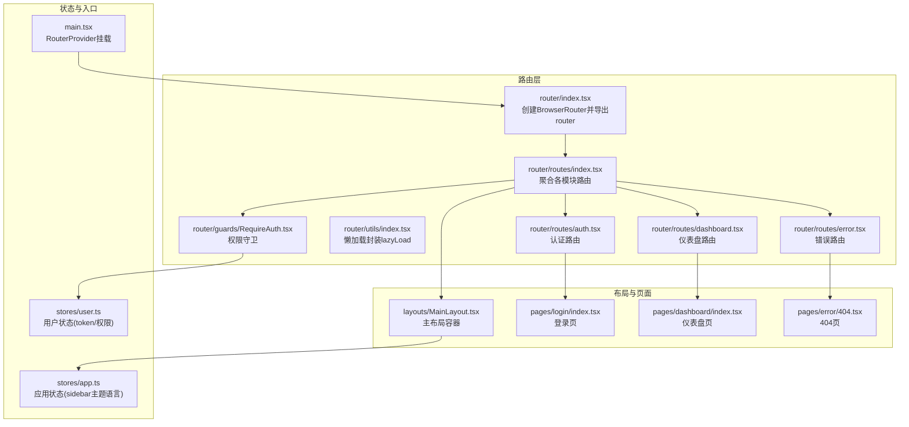
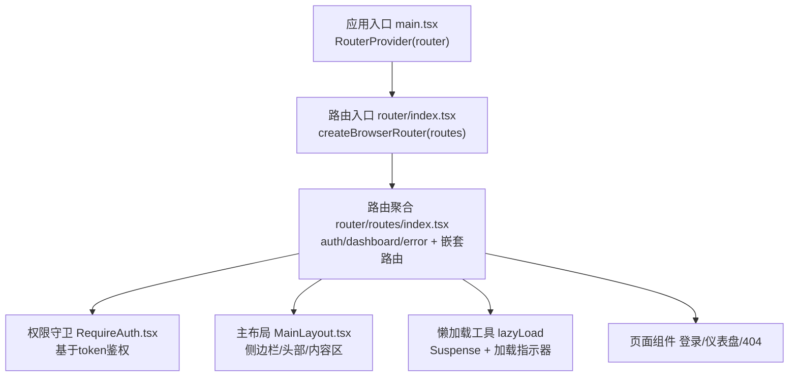
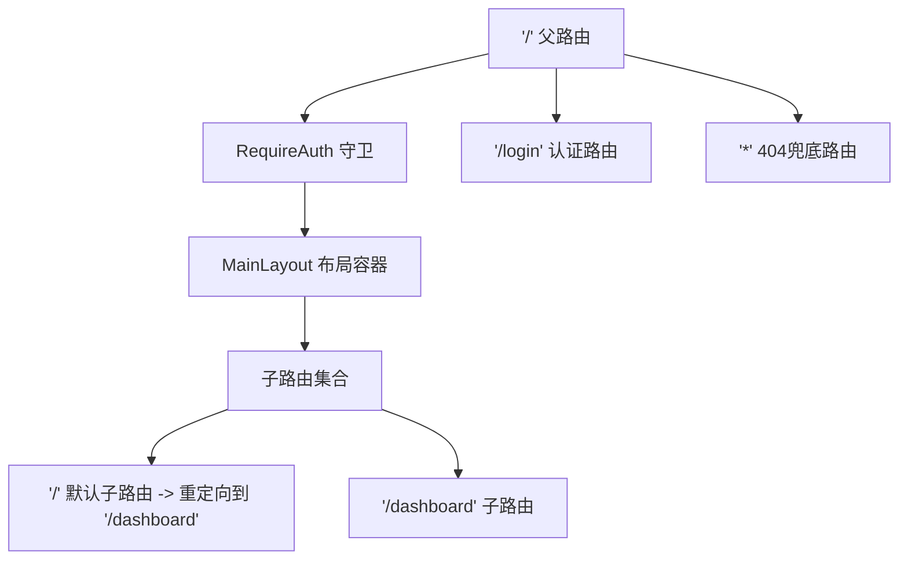
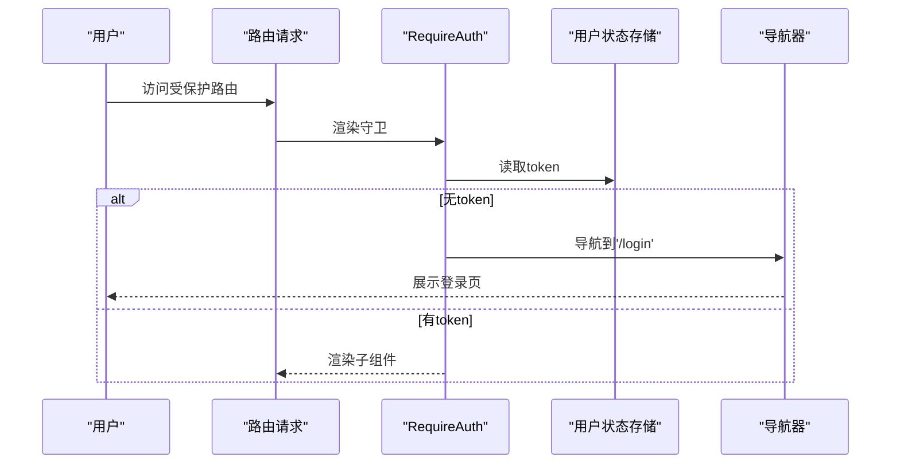
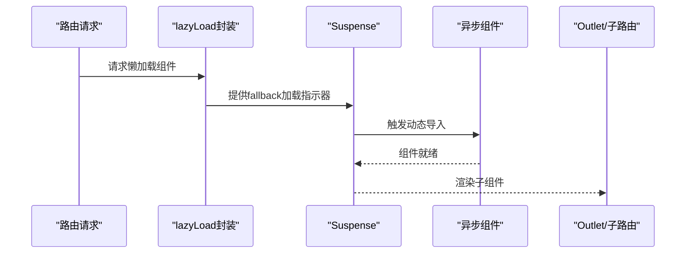
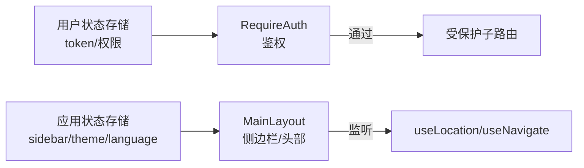
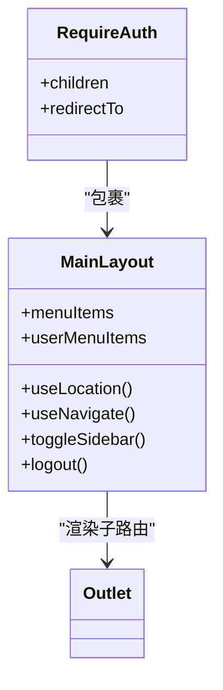
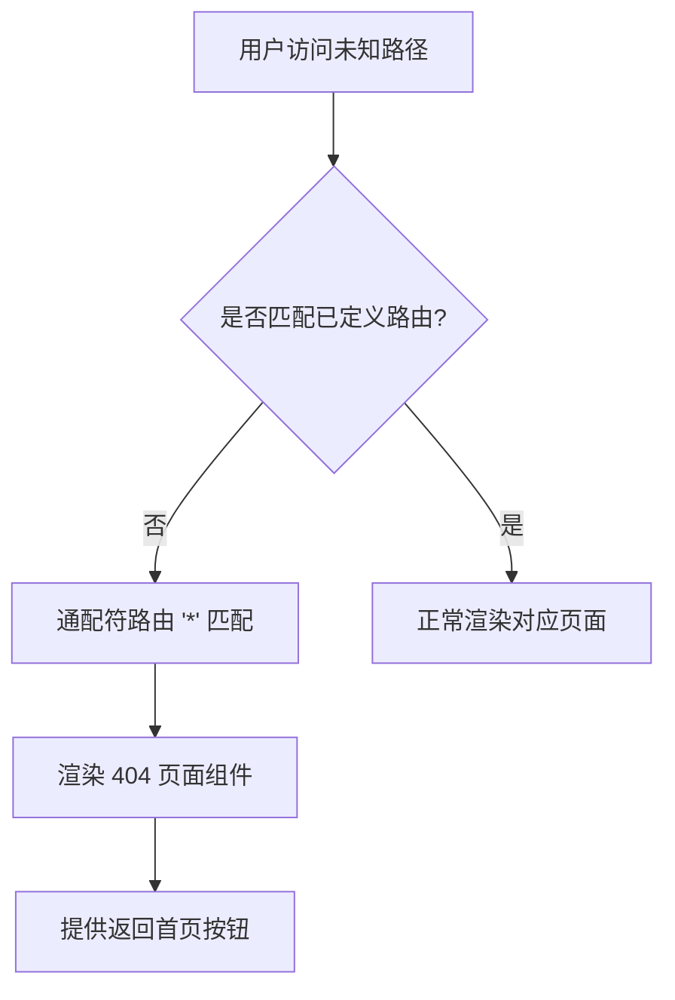
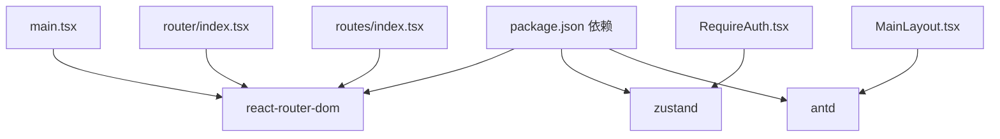

# 路由架构设计

<cite>
**本文引用的文件**
- [src/router/index.tsx](file://src/router/index.tsx)
- [src/router/routes/index.tsx](file://src/router/routes/index.tsx)
- [src/router/guards/RequireAuth.tsx](file://src/router/guards/RequireAuth.tsx)
- [src/router/routes/auth.tsx](file://src/router/routes/auth.tsx)
- [src/router/routes/dashboard.tsx](file://src/router/routes/dashboard.tsx)
- [src/router/routes/error.tsx](file://src/router/routes/error.tsx)
- [src/router/utils/index.tsx](file://src/router/utils/index.tsx)
- [src/layouts/MainLayout.tsx](file://src/layouts/MainLayout.tsx)
- [src/pages/error/404.tsx](file://src/pages/error/404.tsx)
- [src/stores/user.ts](file://src/stores/user.ts)
- [src/stores/app.ts](file://src/stores/app.ts)
- [src/main.tsx](file://src/main.tsx)
- [src/pages/dashboard/index.tsx](file://src/pages/dashboard/index.tsx)
- [src/pages/login/index.tsx](file://src/pages/login/index.tsx)
- [package.json](file://package.json)
</cite>

## 目录

1. [引言](#引言)
2. [项目结构](#项目结构)
3. [核心组件](#核心组件)
4. [架构总览](#架构总览)
5. [详细组件分析](#详细组件分析)
6. [依赖关系分析](#依赖关系分析)
7. [性能考虑](#性能考虑)
8. [故障排查指南](#故障排查指南)
9. [结论](#结论)
10. [附录](#附录)

## 引言

本设计文档围绕AI管理平台的路由架构展开，重点阐述基于React Router 6的路由配置策略、嵌套路由与动态参数处理、路由守卫机制、懒加载与Suspense结合的代码分割实践、路由状态管理（当前路由状态获取与监听）、路由与布局组件的集成模式（统一页面骨架与面包屑导航）、以及错误边界与404页面处理策略。文档旨在帮助开发者快速理解并扩展该路由体系。

## 项目结构

路由相关代码采用按功能模块化组织：路由入口、路由定义、守卫、页面懒加载工具、布局与页面组件、状态存储等分层清晰，便于维护与扩展。

图表来源

- [src/router/index.tsx](file://src/router/index.tsx#L1-L9)
- [src/router/routes/index.tsx](file://src/router/routes/index.tsx#L1-L31)
- [src/router/guards/RequireAuth.tsx](file://src/router/guards/RequireAuth.tsx#L1-L25)
- [src/router/utils/index.tsx](file://src/router/utils/index.tsx#L1-L23)
- [src/router/routes/auth.tsx](file://src/router/routes/auth.tsx#L1-L15)
- [src/router/routes/dashboard.tsx](file://src/router/routes/dashboard.tsx#L1-L17)
- [src/router/routes/error.tsx](file://src/router/routes/error.tsx#L1-L16)
- [src/layouts/MainLayout.tsx](file://src/layouts/MainLayout.tsx#L1-L174)
- [src/pages/login/index.tsx](file://src/pages/login/index.tsx#L1-L133)
- [src/pages/dashboard/index.tsx](file://src/pages/dashboard/index.tsx#L1-L170)
- [src/pages/error/404.tsx](file://src/pages/error/404.tsx#L1-L23)
- [src/stores/user.ts](file://src/stores/user.ts#L1-L76)
- [src/stores/app.ts](file://src/stores/app.ts#L1-L59)
- [src/main.tsx](file://src/main.tsx#L1-L32)

章节来源

- [src/router/index.tsx](file://src/router/index.tsx#L1-L9)
- [src/router/routes/index.tsx](file://src/router/routes/index.tsx#L1-L31)
- [src/main.tsx](file://src/main.tsx#L1-L32)

## 核心组件

- 路由器实例：在路由入口中创建BrowserRouter并导出router，供应用根节点注入。
- 路由聚合：将认证、仪表盘、错误等路由模块合并到统一routes数组中，并通过嵌套路由实现“登录后主面板”结构。
- 权限守卫：RequireAuth组件基于用户token进行鉴权，未登录自动跳转至登录页。
- 懒加载工具：lazyLoad封装Suspense与加载指示器，统一处理异步组件加载体验。
- 主布局：MainLayout提供统一的侧边栏、头部、内容区与用户下拉菜单，作为受保护区域的容器。
- 页面组件：登录页、仪表盘页、404页分别对应不同路由路径，配合懒加载与守卫实现安全访问。

章节来源

- [src/router/index.tsx](file://src/router/index.tsx#L1-L9)
- [src/router/routes/index.tsx](file://src/router/routes/index.tsx#L1-L31)
- [src/router/guards/RequireAuth.tsx](file://src/router/guards/RequireAuth.tsx#L1-L25)
- [src/router/utils/index.tsx](file://src/router/utils/index.tsx#L1-L23)
- [src/layouts/MainLayout.tsx](file://src/layouts/MainLayout.tsx#L1-L174)
- [src/pages/login/index.tsx](file://src/pages/login/index.tsx#L1-L133)
- [src/pages/dashboard/index.tsx](file://src/pages/dashboard/index.tsx#L1-L170)
- [src/pages/error/404.tsx](file://src/pages/error/404.tsx#L1-L23)

## 架构总览

整体采用“路由聚合 + 嵌套路由 + 守卫 + 懒加载”的架构，形成清晰的访问控制与用户体验路径。

图表来源

- [src/main.tsx](file://src/main.tsx#L1-L32)
- [src/router/index.tsx](file://src/router/index.tsx#L1-L9)
- [src/router/routes/index.tsx](file://src/router/routes/index.tsx#L1-L31)
- [src/router/guards/RequireAuth.tsx](file://src/router/guards/RequireAuth.tsx#L1-L25)
- [src/router/utils/index.tsx](file://src/router/utils/index.tsx#L1-L23)
- [src/layouts/MainLayout.tsx](file://src/layouts/MainLayout.tsx#L1-L174)
- [src/pages/login/index.tsx](file://src/pages/login/index.tsx#L1-L133)
- [src/pages/dashboard/index.tsx](file://src/pages/dashboard/index.tsx#L1-L170)
- [src/pages/error/404.tsx](file://src/pages/error/404.tsx#L1-L23)

## 详细组件分析

### 路由层级设计与嵌套路由实现

- 根路径“/”作为受保护区域的父级，内部包含一个重定向到“/dashboard”的默认子路由，以及仪表盘等子路由。
- 通过RequireAuth包裹MainLayout，确保所有受保护子路由均需登录态。
- 认证路由独立于受保护区域，允许未登录用户访问登录页。

图表来源

- [src/router/routes/index.tsx](file://src/router/routes/index.tsx#L9-L28)
- [src/router/guards/RequireAuth.tsx](file://src/router/guards/RequireAuth.tsx#L1-L25)
- [src/layouts/MainLayout.tsx](file://src/layouts/MainLayout.tsx#L1-L174)

章节来源

- [src/router/routes/index.tsx](file://src/router/routes/index.tsx#L1-L31)

### 动态路由参数处理

- 当前路由定义未显式声明动态参数（如:id），因此不涉及动态路由参数解析。
- 若后续需要支持动态路由（如详情页），可在路由定义中添加参数占位符，并在目标组件中通过路由库提供的钩子读取参数。

（本小节为概念性说明，不直接分析具体文件）

### 路由守卫机制与权限控制

- RequireAuth组件从用户状态存储中读取token，若为空则重定向至登录页；否则渲染子组件。
- 用户状态存储提供登录、登出、权限判断等能力，守卫逻辑简洁可靠。

图表来源

- [src/router/guards/RequireAuth.tsx](file://src/router/guards/RequireAuth.tsx#L1-L25)
- [src/stores/user.ts](file://src/stores/user.ts#L1-L76)

章节来源

- [src/router/guards/RequireAuth.tsx](file://src/router/guards/RequireAuth.tsx#L1-L25)
- [src/stores/user.ts](file://src/stores/user.ts#L1-L76)

### 路由懒加载与代码分割

- 使用React.lazy与Suspense实现页面级代码分割，提升首屏性能。
- lazyLoad工具统一封装了加载指示器，避免重复代码并保证一致体验。
- 认证页、仪表盘页、404页均通过lazy与lazyLoad组合实现懒加载。

图表来源

- [src/router/utils/index.tsx](file://src/router/utils/index.tsx#L1-L23)
- [src/router/routes/auth.tsx](file://src/router/routes/auth.tsx#L1-L15)
- [src/router/routes/dashboard.tsx](file://src/router/routes/dashboard.tsx#L1-L17)
- [src/router/routes/error.tsx](file://src/router/routes/error.tsx#L1-L16)

章节来源

- [src/router/utils/index.tsx](file://src/router/utils/index.tsx#L1-L23)
- [src/router/routes/auth.tsx](file://src/router/routes/auth.tsx#L1-L15)
- [src/router/routes/dashboard.tsx](file://src/router/routes/dashboard.tsx#L1-L17)
- [src/router/routes/error.tsx](file://src/router/routes/error.tsx#L1-L16)

### 路由状态管理与监听

- 应用通过Zustand管理用户与应用状态，路由守卫与布局组件均依赖状态存储实现鉴权与UI行为。
- 在布局组件中可使用路由提供的useLocation/useNavigate等钩子进行导航与状态联动。
- 建议在路由层通过路由元信息（handle）传递页面标题等静态元数据，用于构建面包屑或页面标题。

图表来源

- [src/stores/user.ts](file://src/stores/user.ts#L1-L76)
- [src/stores/app.ts](file://src/stores/app.ts#L1-L59)
- [src/router/guards/RequireAuth.tsx](file://src/router/guards/RequireAuth.tsx#L1-L25)
- [src/layouts/MainLayout.tsx](file://src/layouts/MainLayout.tsx#L1-L174)

章节来源

- [src/stores/user.ts](file://src/stores/user.ts#L1-L76)
- [src/stores/app.ts](file://src/stores/app.ts#L1-L59)
- [src/layouts/MainLayout.tsx](file://src/layouts/MainLayout.tsx#L1-L174)

### 路由与布局组件集成模式

- MainLayout作为受保护区域的容器，内部通过Outlet渲染子路由内容。
- 侧边栏菜单根据当前路径高亮选中项，点击触发导航；头部包含用户下拉菜单，支持退出登录并跳转登录页。
- 该模式实现了统一的页面骨架与导航行为，便于扩展更多受保护页面。

图表来源

- [src/layouts/MainLayout.tsx](file://src/layouts/MainLayout.tsx#L1-L174)
- [src/router/guards/RequireAuth.tsx](file://src/router/guards/RequireAuth.tsx#L1-L25)

章节来源

- [src/layouts/MainLayout.tsx](file://src/layouts/MainLayout.tsx#L1-L174)

### 错误边界与404页面处理

- 通过通配符路由“\*”匹配未命中路由，渲染404页面组件。
- 404页面提供返回首页的交互按钮，提升用户体验。
- 对于运行时异常，建议在布局或页面层增加错误边界组件，捕获并展示降级内容。

图表来源

- [src/router/routes/error.tsx](file://src/router/routes/error.tsx#L1-L16)
- [src/pages/error/404.tsx](file://src/pages/error/404.tsx#L1-L23)

章节来源

- [src/router/routes/error.tsx](file://src/router/routes/error.tsx#L1-L16)
- [src/pages/error/404.tsx](file://src/pages/error/404.tsx#L1-L23)

## 依赖关系分析

- 路由层依赖React Router DOM与Zustand状态库；懒加载依赖React Suspense；UI组件依赖Ant Design。
- 入口文件仅负责挂载路由器，路由层内部解耦，便于扩展与维护。

图表来源

- [package.json](file://package.json#L20-L36)
- [src/main.tsx](file://src/main.tsx#L1-L32)
- [src/router/index.tsx](file://src/router/index.tsx#L1-L9)
- [src/router/routes/index.tsx](file://src/router/routes/index.tsx#L1-L31)
- [src/router/guards/RequireAuth.tsx](file://src/router/guards/RequireAuth.tsx#L1-L25)
- [src/layouts/MainLayout.tsx](file://src/layouts/MainLayout.tsx#L1-L174)

章节来源

- [package.json](file://package.json#L20-L36)

## 性能考虑

- 代码分割：通过React.lazy与lazyLoad实现按需加载，减少初始包体积。
- 加载体验：在Suspense中提供加载指示器，避免白屏与闪烁。
- 状态持久化：用户token与应用设置通过持久化中间件保存，降低刷新后的重复登录成本。
- 建议：对高频切换的页面可考虑预加载策略；对大组件拆分更细粒度的模块以进一步优化缓存命中。

（本节为通用性能指导，不直接分析具体文件）

## 故障排查指南

- 登录后无法进入受保护页面
  - 检查用户状态存储是否正确写入token；确认RequireAuth守卫逻辑。
  - 参考：[src/stores/user.ts](file://src/stores/user.ts#L1-L76)，[src/router/guards/RequireAuth.tsx](file://src/router/guards/RequireAuth.tsx#L1-L25)
- 404页面未显示
  - 检查通配符路由是否位于路由表末尾；确认懒加载组件是否正确导出。
  - 参考：[src/router/routes/error.tsx](file://src/router/routes/error.tsx#L1-L16)，[src/pages/error/404.tsx](file://src/pages/error/404.tsx#L1-L23)
- 懒加载组件空白或长时间无响应
  - 检查动态导入路径是否正确；确认Suspense fallback是否生效。
  - 参考：[src/router/utils/index.tsx](file://src/router/utils/index.tsx#L1-L23)，[src/router/routes/dashboard.tsx](file://src/router/routes/dashboard.tsx#L1-L17)

章节来源

- [src/stores/user.ts](file://src/stores/user.ts#L1-L76)
- [src/router/guards/RequireAuth.tsx](file://src/router/guards/RequireAuth.tsx#L1-L25)
- [src/router/routes/error.tsx](file://src/router/routes/error.tsx#L1-L16)
- [src/pages/error/404.tsx](file://src/pages/error/404.tsx#L1-L23)
- [src/router/utils/index.tsx](file://src/router/utils/index.tsx#L1-L23)
- [src/router/routes/dashboard.tsx](file://src/router/routes/dashboard.tsx#L1-L17)

## 结论

该路由架构以清晰的模块划分、严格的权限守卫、完善的懒加载与状态管理为基础，形成了可扩展、易维护且具有良好用户体验的前端路由体系。通过主布局与受保护区域的分离，以及通配符404兜底，满足了现代管理平台对安全性与可用性的双重需求。后续可在路由元信息、面包屑、权限细化等方面进一步增强。

## 附录

- 路由入口与挂载：应用通过RouterProvider注入router实例，实现全局路由能力。
- 页面示例：登录页提供模拟登录流程并写入用户状态；仪表盘页作为受保护区域的典型页面。

章节来源

- [src/main.tsx](file://src/main.tsx#L1-L32)
- [src/pages/login/index.tsx](file://src/pages/login/index.tsx#L1-L133)
- [src/pages/dashboard/index.tsx](file://src/pages/dashboard/index.tsx#L1-L170)
