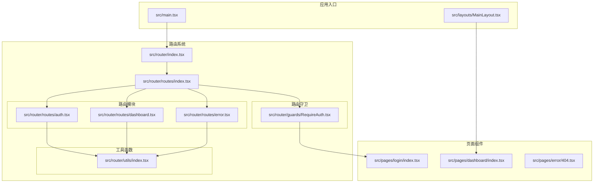
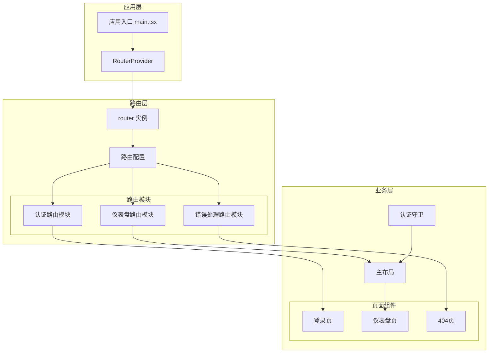
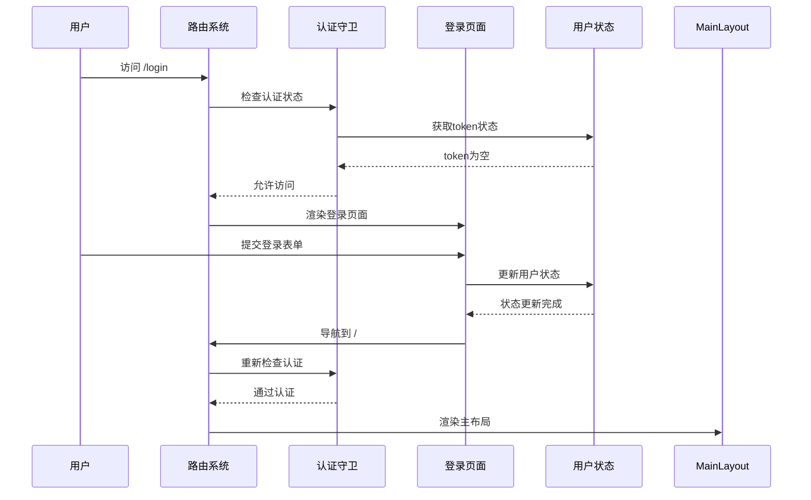
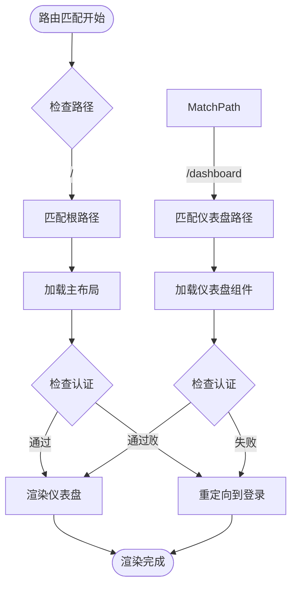
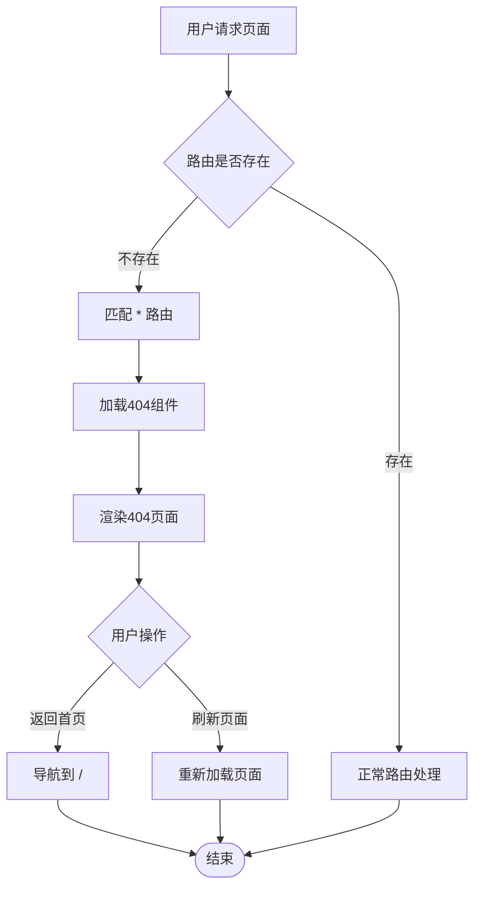
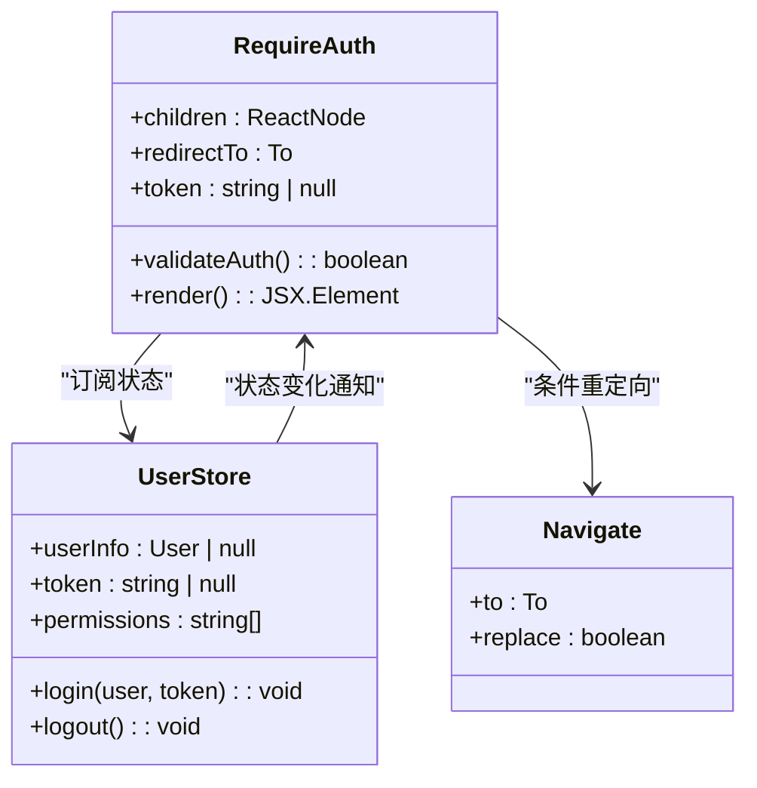
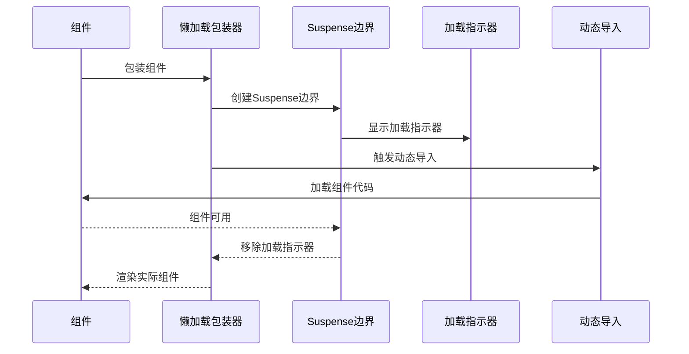
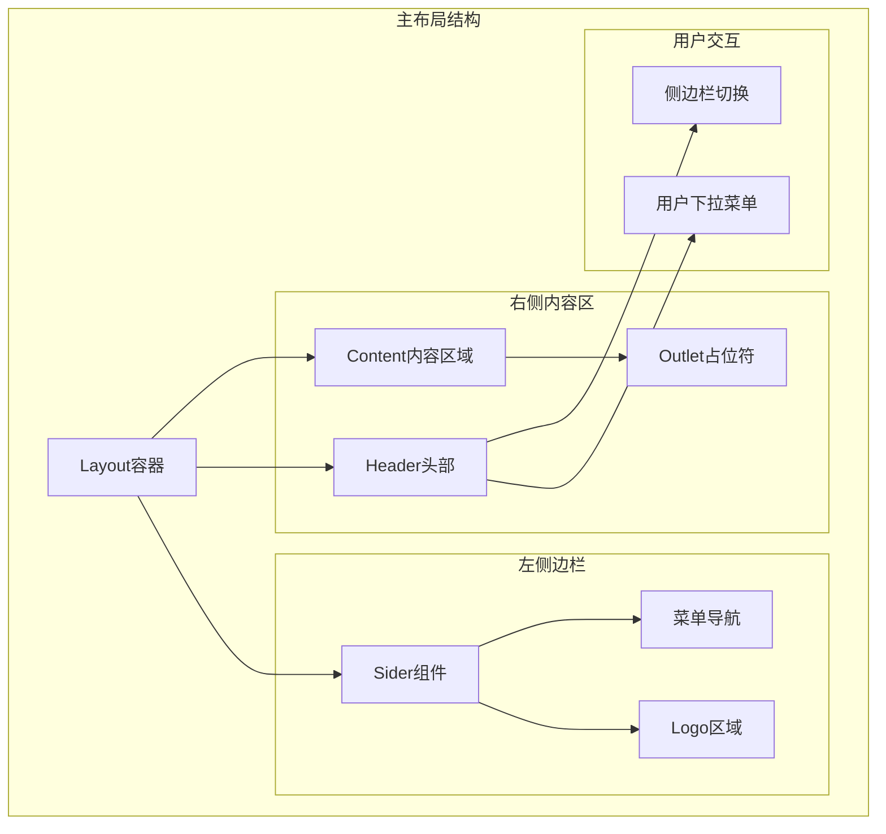
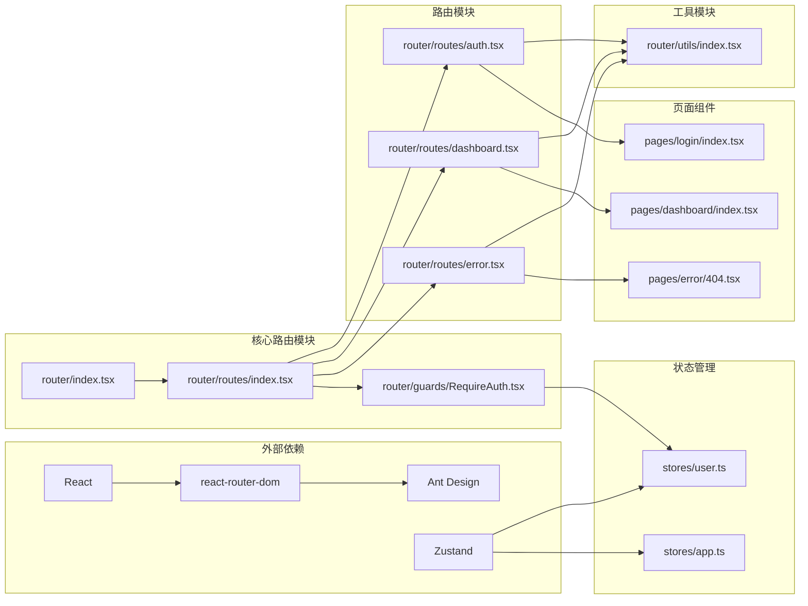

# 路由配置与定义

<cite>
**本文档引用的文件**
- [src/router/index.tsx](file://src/router/index.tsx)
- [src/router/routes/index.tsx](file://src/router/routes/index.tsx)
- [src/router/guards/RequireAuth.tsx](file://src/router/guards/RequireAuth.tsx)
- [src/router/routes/auth.tsx](file://src/router/routes/auth.tsx)
- [src/router/routes/dashboard.tsx](file://src/router/routes/dashboard.tsx)
- [src/router/routes/error.tsx](file://src/router/routes/error.tsx)
- [src/router/utils/index.tsx](file://src/router/utils/index.tsx)
- [src/layouts/MainLayout.tsx](file://src/layouts/MainLayout.tsx)
- [src/main.tsx](file://src/main.tsx)
- [src/pages/login/index.tsx](file://src/pages/login/index.tsx)
- [src/pages/dashboard/index.tsx](file://src/pages/dashboard/index.tsx)
- [src/pages/error/404.tsx](file://src/pages/error/404.tsx)
- [src/stores/user.ts](file://src/stores/user.ts)
- [src/stores/app.ts](file://src/stores/app.ts)
</cite>

## 目录

1. [简介](#简介)
2. [项目结构](#项目结构)
3. [核心组件](#核心组件)
4. [架构概览](#架构概览)
5. [详细组件分析](#详细组件分析)
6. [依赖关系分析](#依赖关系分析)
7. [性能考虑](#性能考虑)
8. [故障排除指南](#故障排除指南)
9. [结论](#结论)

## 简介

本项目采用React Router 6构建AI管理平台的路由系统，实现了完整的路由配置策略，包括路由层级设计、嵌套路由、动态路由参数处理、路由懒加载等功能。通过集中化的路由管理方式，提供了清晰的路由组织结构和良好的可维护性。

## 项目结构

项目采用模块化路由架构，主要文件组织如下：

**图表来源**

- [src/router/index.tsx](file://src/router/index.tsx#L1-L9)
- [src/router/routes/index.tsx](file://src/router/routes/index.tsx#L1-L31)
- [src/router/guards/RequireAuth.tsx](file://src/router/guards/RequireAuth.tsx#L1-L25)

**章节来源**

- [src/router/index.tsx](file://src/router/index.tsx#L1-L9)
- [src/router/routes/index.tsx](file://src/router/routes/index.tsx#L1-L31)

## 核心组件

### 路由配置入口

路由系统的核心是`createBrowserRouter`实例，它统一管理所有路由配置：

- **路由创建**: 使用`createBrowserRouter`创建浏览器历史模式的路由实例
- **配置导入**: 从`./routes/index`导入集中化的路由配置
- **导出接口**: 提供`router`实例供应用入口使用

### 集中式路由管理

`routes/index.tsx`作为路由配置的中央枢纽，实现了以下功能：

- **模块化组织**: 将不同类型的路由拆分为独立的路由模块
- **嵌套路由**: 通过`element`和`children`属性实现层级路由结构
- **路由组合**: 使用展开运算符将多个路由模块合并到主路由表中

**章节来源**

- [src/router/index.tsx](file://src/router/index.tsx#L1-L9)
- [src/router/routes/index.tsx](file://src/router/routes/index.tsx#L1-L31)

## 架构概览

系统采用分层架构设计，实现了清晰的关注点分离：

**图表来源**

- [src/main.tsx](file://src/main.tsx#L10-L31)
- [src/router/index.tsx](file://src/router/index.tsx#L1-L9)
- [src/router/routes/index.tsx](file://src/router/routes/index.tsx#L1-L31)

## 详细组件分析

### 认证路由模块 (auth.tsx)

认证路由模块专门处理用户身份验证相关的路由：

**图表来源**

- [src/router/routes/auth.tsx](file://src/router/routes/auth.tsx#L1-L15)
- [src/router/guards/RequireAuth.tsx](file://src/router/guards/RequireAuth.tsx#L1-L25)
- [src/pages/login/index.tsx](file://src/pages/login/index.tsx#L32-L50)

**章节来源**

- [src/router/routes/auth.tsx](file://src/router/routes/auth.tsx#L1-L15)
- [src/pages/login/index.tsx](file://src/pages/login/index.tsx#L1-L133)

### 仪表盘路由模块 (dashboard.tsx)

仪表盘路由模块负责管理应用的主要功能页面：

**图表来源**

- [src/router/routes/dashboard.tsx](file://src/router/routes/dashboard.tsx#L1-L17)
- [src/layouts/MainLayout.tsx](file://src/layouts/MainLayout.tsx#L166-L166)

**章节来源**

- [src/router/routes/dashboard.tsx](file://src/router/routes/dashboard.tsx#L1-L17)
- [src/pages/dashboard/index.tsx](file://src/pages/dashboard/index.tsx#L1-L170)

### 错误处理路由模块 (error.tsx)

错误处理路由模块提供全局的错误页面处理：

**图表来源**

- [src/router/routes/error.tsx](file://src/router/routes/error.tsx#L1-L16)
- [src/pages/error/404.tsx](file://src/pages/error/404.tsx#L1-L23)

**章节来源**

- [src/router/routes/error.tsx](file://src/router/routes/error.tsx#L1-L16)
- [src/pages/error/404.tsx](file://src/pages/error/404.tsx#L1-L23)

### 路由守卫组件 (RequireAuth)

认证守卫组件实现了基于token的状态检查：

**图表来源**

- [src/router/guards/RequireAuth.tsx](file://src/router/guards/RequireAuth.tsx#L1-L25)
- [src/stores/user.ts](file://src/stores/user.ts#L21-L76)

**章节来源**

- [src/router/guards/RequireAuth.tsx](file://src/router/guards/RequireAuth.tsx#L1-L25)
- [src/stores/user.ts](file://src/stores/user.ts#L1-L76)

### 路由懒加载工具 (lazyLoad)

懒加载工具实现了代码分割和加载状态管理：

**图表来源**

- [src/router/utils/index.tsx](file://src/router/utils/index.tsx#L1-L23)

**章节来源**

- [src/router/utils/index.tsx](file://src/router/utils/index.tsx#L1-L23)

### 主布局组件 (MainLayout)

主布局组件提供了应用的整体框架结构：

**图表来源**

- [src/layouts/MainLayout.tsx](file://src/layouts/MainLayout.tsx#L73-L171)

**章节来源**

- [src/layouts/MainLayout.tsx](file://src/layouts/MainLayout.tsx#L1-L174)

## 依赖关系分析

路由系统的依赖关系体现了清晰的层次结构：

**图表来源**

- [src/router/index.tsx](file://src/router/index.tsx#L1-L9)
- [src/router/routes/index.tsx](file://src/router/routes/index.tsx#L1-L31)
- [src/stores/user.ts](file://src/stores/user.ts#L1-L76)

**章节来源**

- [src/router/index.tsx](file://src/router/index.tsx#L1-L9)
- [src/stores/user.ts](file://src/stores/user.ts#L1-L76)

## 性能考虑

### 代码分割策略

系统采用了多层代码分割策略来优化性能：

- **按路由模块分割**: 每个路由模块独立打包，实现按需加载
- **组件级懒加载**: 使用`React.lazy`实现组件级别的动态导入
- **加载状态管理**: 通过`Suspense`提供统一的加载指示器

### 缓存策略

- **状态持久化**: 用户认证状态通过Zustand的`persist`中间件进行本地存储
- **布局缓存**: 主布局组件的状态在组件级别进行缓存
- **路由状态**: 路由历史记录通过浏览器历史API进行管理

### 优化建议

1. **路由预加载**: 对于高频访问的路由可以考虑预加载策略
2. **图片优化**: 页面中的静态资源可以进一步优化加载性能
3. **CDN集成**: 生产环境可以考虑集成CDN加速静态资源

## 故障排除指南

### 常见问题及解决方案

#### 认证失败问题

**症状**: 用户无法访问受保护的路由
**原因**: token状态异常或过期
**解决方案**:

1. 检查用户状态存储中的token值
2. 验证认证守卫的逻辑判断
3. 确认用户登录流程的正确性

#### 路由跳转问题

**症状**: 页面无法正确跳转到目标路由
**原因**: 路由配置错误或导航参数问题
**解决方案**:

1. 检查路由路径配置的正确性
2. 验证导航函数的使用方式
3. 确认路由参数的传递格式

#### 懒加载问题

**症状**: 组件加载缓慢或出现空白页面
**原因**: 动态导入失败或加载时间过长
**解决方案**:

1. 检查组件的导出格式
2. 验证懒加载包装器的配置
3. 优化加载指示器的显示效果

**章节来源**

- [src/router/guards/RequireAuth.tsx](file://src/router/guards/RequireAuth.tsx#L15-L21)
- [src/router/utils/index.tsx](file://src/router/utils/index.tsx#L4-L20)

## 结论

本项目的路由配置展现了现代React应用的最佳实践：

### 设计优势

1. **模块化组织**: 通过路由模块化实现了清晰的职责分离
2. **集中管理**: 集中式路由配置便于维护和扩展
3. **性能优化**: 懒加载和代码分割提升了应用性能
4. **类型安全**: 完整的TypeScript类型定义确保了开发体验

### 技术亮点

- **嵌套路由**: 通过层级结构实现了复杂的页面布局
- **路由守卫**: 基于状态管理的认证机制保证了安全性
- **错误处理**: 全局错误路由提供了友好的用户体验
- **响应式设计**: 结合布局组件实现了自适应的界面

### 扩展建议

1. **权限路由**: 可以扩展基于角色的权限控制
2. **国际化支持**: 可以添加多语言路由支持
3. **SEO优化**: 可以集成路由级别的SEO配置
4. **监控集成**: 可以添加路由访问统计和分析功能

该路由系统为AI管理平台提供了坚实的技术基础，具有良好的可维护性和扩展性，能够满足复杂应用场景的需求。
