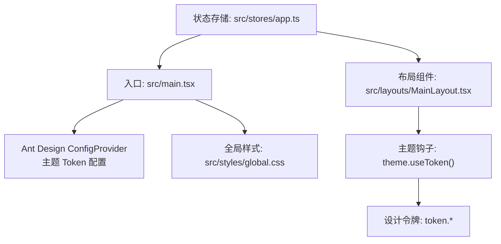
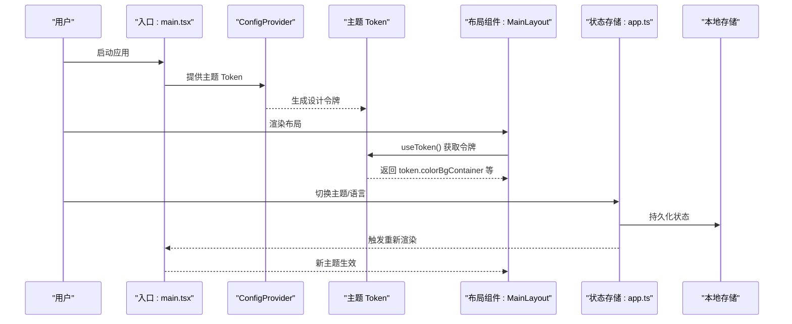
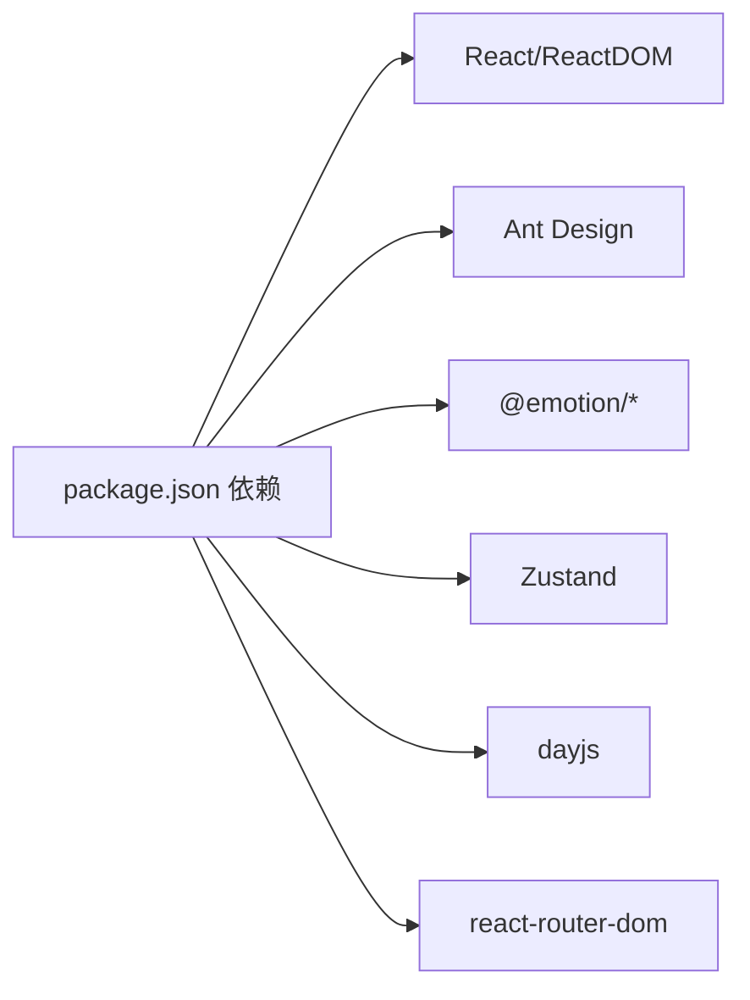

# 样式与主题

<cite>
**本文引用的文件**
- [src/styles/global.css](file://src/styles/global.css)
- [src/main.tsx](file://src/main.tsx)
- [src/layouts/MainLayout.tsx](file://src/layouts/MainLayout.tsx)
- [src/stores/app.ts](file://src/stores/app.ts)
- [src/constants/config.ts](file://src/constants/config.ts)
- [src/constants/enum.ts](file://src/constants/enum.ts)
- [package.json](file://package.json)
- [rsbuild.config.ts](file://rsbuild.config.ts)
</cite>

## 目录

1. [简介](#简介)
2. [项目结构](#项目结构)
3. [核心组件](#核心组件)
4. [架构总览](#架构总览)
5. [详细组件分析](#详细组件分析)
6. [依赖分析](#依赖分析)
7. [性能考虑](#性能考虑)
8. [故障排查指南](#故障排查指南)
9. [结论](#结论)
10. [附录](#附录)

## 简介

本文件系统化梳理本项目的样式与主题体系，重点覆盖以下方面：

- CSS-in-JS 方案与实现：通过 Ant Design 的 ConfigProvider 与主题 Token，结合 emotion 生态在构建产物中注入样式。
- 样式组织结构：全局样式、组件内联样式、主题变量的统一管理与应用。
- 主题定制机制：颜色系统、圆角半径等设计令牌的集中配置与动态切换。
- 响应式设计策略：断点与布局适配、组件响应性的实现思路。
- 最佳实践：命名规范、性能优化、可维护性设计。
- 使用示例与主题切换方法：从入口配置到布局组件的实际应用路径。

## 项目结构

项目采用“入口配置 + 全局样式 + 组件内联样式 + 状态存储”的组合方式：

- 入口配置：在应用根节点通过 ConfigProvider 注入主题 Token，统一控制 Ant Design 组件的主题风格。
- 全局样式：通过全局 CSS 文件定义基础排版、滚动条与常用工具类，确保页面一致性。
- 组件内联样式：在布局组件中直接使用 theme.useToken() 获取设计令牌，实现动态主题渲染。
- 状态存储：通过 Zustand 管理主题模式、语言等状态，并持久化到本地存储。

图表来源

- [src/main.tsx](file://src/main.tsx#L17-L31)
- [src/styles/global.css](file://src/styles/global.css#L1-L83)
- [src/layouts/MainLayout.tsx](file://src/layouts/MainLayout.tsx#L18-L23)
- [src/stores/app.ts](file://src/stores/app.ts#L18-L58)

章节来源

- [src/main.tsx](file://src/main.tsx#L17-L31)
- [src/styles/global.css](file://src/styles/global.css#L1-L83)
- [src/layouts/MainLayout.tsx](file://src/layouts/MainLayout.tsx#L18-L23)
- [src/stores/app.ts](file://src/stores/app.ts#L18-L58)

## 核心组件

- 入口主题配置：在应用根节点通过 ConfigProvider 的 theme.token 注入主色与圆角等基础设计令牌，作为全局主题基线。
- 布局组件主题应用：在布局组件中使用 theme.useToken() 获取 token，用于侧边栏、头部、内容区等容器背景、边框与阴影等样式的动态渲染。
- 状态存储与持久化：通过 Zustand 管理主题模式与语言等状态，并持久化到本地存储，保证刷新后仍保持一致的主题体验。

章节来源

- [src/main.tsx](file://src/main.tsx#L19-L27)
- [src/layouts/MainLayout.tsx](file://src/layouts/MainLayout.tsx#L21-L164)
- [src/stores/app.ts](file://src/stores/app.ts#L18-L58)

## 架构总览

下图展示了从入口到组件的主题链路：入口配置 -> 设计令牌 -> 组件渲染 -> 用户交互 -> 状态持久化。

图表来源

- [src/main.tsx](file://src/main.tsx#L19-L27)
- [src/layouts/MainLayout.tsx](file://src/layouts/MainLayout.tsx#L21-L164)
- [src/stores/app.ts](file://src/stores/app.ts#L18-L58)

## 详细组件分析

### 入口主题配置（ConfigProvider）

- 作用：为整个应用提供统一的主题 Token，包括主色与圆角等基础设计令牌。
- 关键点：
  - 在入口文件中包裹应用根节点，确保所有 Ant Design 组件继承统一主题。
  - Token 可在运行时根据业务需要进行调整，但建议集中在入口处统一管理。

章节来源

- [src/main.tsx](file://src/main.tsx#L19-L27)

### 布局组件中的主题应用（theme.useToken）

- 作用：在布局组件中通过 theme.useToken() 获取设计令牌，用于容器背景、边框、阴影等样式的动态渲染。
- 关键点：
  - 使用 token.colorBgContainer 作为容器背景色，确保在浅色/深色主题下自动适配。
  - 使用 token.colorBorderSecondary 与 token.borderRadiusLG 控制边框与圆角，提升视觉一致性。
  - 将主题令牌直接应用于内联样式对象，避免额外的 CSS 文件耦合。

章节来源

- [src/layouts/MainLayout.tsx](file://src/layouts/MainLayout.tsx#L21-L164)

### 全局样式与工具类（global.css）

- 作用：提供基础排版、滚动条样式与常用工具类，保证页面基础一致性和可复用性。
- 关键点：
  - 重置与盒模型：统一 margin/padding 与 box-sizing，减少跨浏览器差异。
  - 字体与高度：统一根元素与页面高度，确保全屏布局稳定。
  - 滚动条：针对 WebKit 内核提供滚动条样式，增强视觉体验。
  - 工具类：提供 flex、gap、padding、margin、文本对齐与宽高占满等常用类，便于快速布局。

章节来源

- [src/styles/global.css](file://src/styles/global.css#L1-L83)

### 状态存储与主题持久化（Zustand）

- 作用：管理主题模式、语言等状态，并通过持久化中间件将状态写入本地存储。
- 关键点：
  - 状态字段：包含 sidebarCollapsed、theme、language 等，便于主题切换与布局控制。
  - 动作函数：提供 setTheme、setLanguage 等动作，支持外部调用以触发主题更新。
  - 持久化策略：仅持久化部分字段，减少存储体积并避免敏感信息泄露。

章节来源

- [src/stores/app.ts](file://src/stores/app.ts#L18-L58)

### 主题模式与语言枚举（常量定义）

- 作用：通过枚举统一管理主题模式与语言，提升类型安全与可读性。
- 关键点：
  - ThemeMode：Light、Dark、Auto，用于控制主题切换策略。
  - Language：ZhCN、EnUS，用于国际化语言选择。
  - StorageKey：Theme、Language 等键名，便于与本地存储配合使用。

章节来源

- [src/constants/enum.ts](file://src/constants/enum.ts#L30-L45)
- [src/constants/enum.ts](file://src/constants/enum.ts#L62-L70)

### 应用配置与默认主题（常量定义）

- 作用：集中管理应用配置，包括默认主题、分页参数、语言等。
- 关键点：
  - defaultTheme：指定默认主题为 light，与入口 Token 配置相呼应。
  - defaultLanguage：指定默认语言，便于初始化与后续国际化扩展。

章节来源

- [src/constants/config.ts](file://src/constants/config.ts#L15-L16)
- [src/constants/config.ts](file://src/constants/config.ts#L13-L14)

### CSS-in-JS 与 emotion 生态

- 作用：通过 emotion 相关包在构建阶段将样式注入到 DOM，实现 CSS-in-JS 的运行时样式生成。
- 关键点：
  - 项目依赖中包含 @emotion/\* 相关包，表明构建产物中会使用 emotion 的样式注入能力。
  - 结合 Ant Design 的 ConfigProvider，形成“主题 Token + CSS-in-JS”的完整方案。

章节来源

- [package.json](file://package.json#L20-L36)
- [package.json](file://package.json#L259-L267)

### 构建配置与入口

- 作用：定义应用入口、代理与输出等构建行为，确保开发与生产环境的一致性。
- 关键点：
  - 入口文件：src/main.tsx，作为应用启动与主题配置的根节点。
  - 代理配置：开发时将 /api 请求转发至本地 Mock 服务，便于前后端协同。

章节来源

- [rsbuild.config.ts](file://rsbuild.config.ts#L7-L9)
- [rsbuild.config.ts](file://rsbuild.config.ts#L13-L21)

## 依赖分析

- 入口依赖：React、ReactDOM、Ant Design、dayjs、路由等，构成应用骨架。
- 样式生态：Ant Design 提供主题 Token 与组件样式；emotion 包负责 CSS-in-JS 的样式注入。
- 状态管理：Zustand 提供轻量级状态管理，并通过 persist 中间件实现持久化。

图表来源

- [package.json](file://package.json#L20-L36)

章节来源

- [package.json](file://package.json#L20-L36)

## 性能考虑

- 样式注入策略：通过 ConfigProvider 与 emotion 的组合，避免大量独立 CSS 文件带来的网络请求开销，提升首屏渲染效率。
- 主题切换成本：主题切换主要影响组件内联样式与少数全局样式，整体开销可控。
- 本地存储：仅持久化必要字段，减少存储体积与序列化/反序列化成本。
- 构建优化：Rsbuild 默认启用 React 插件，有助于代码分割与 Tree Shaking。

## 故障排查指南

- 主题不生效
  - 检查入口是否正确包裹 ConfigProvider，并确认 theme.token 是否存在。
  - 确认组件中是否使用 theme.useToken() 获取令牌并应用到内联样式。
- 样式冲突
  - 避免在组件中重复定义与主题令牌冲突的样式，优先使用 token.\*。
  - 全局样式中尽量使用工具类，减少特异性选择器导致的覆盖问题。
- 主题切换无效
  - 确认状态存储中 setTheme 动作被正确调用，并且持久化逻辑正常工作。
  - 检查本地存储中是否存在相关键值，如 theme。

章节来源

- [src/main.tsx](file://src/main.tsx#L19-L27)
- [src/layouts/MainLayout.tsx](file://src/layouts/MainLayout.tsx#L21-L164)
- [src/stores/app.ts](file://src/stores/app.ts#L37-L41)

## 结论

本项目采用“入口主题配置 + CSS-in-JS + 组件内联样式 + 状态持久化”的综合方案，实现了简洁、可维护且高性能的主题系统。通过 Ant Design 的 Token 与 emotion 的样式注入，结合 Zustand 的状态管理，能够在不引入复杂样式文件的前提下，完成主题定制与动态切换。建议在后续迭代中进一步完善断点与响应式规则，并补充更丰富的设计令牌与组件级主题示例。

## 附录

### 主题定制与设计令牌清单

- 颜色系统：主色、容器背景、边框次要色等，通过 token.colorPrimary、token.colorBgContainer、token.colorBorderSecondary 等访问。
- 圆角与阴影：通过 token.borderRadiusLG 等控制组件圆角；阴影通过内联样式或组件属性统一管理。
- 字体与字号：全局字体族在全局样式中统一设置，组件内部可通过内联样式微调。
- 间距标准：使用 token.\* 与工具类组合，确保布局一致性。

章节来源

- [src/layouts/MainLayout.tsx](file://src/layouts/MainLayout.tsx#L79-L94)
- [src/layouts/MainLayout.tsx](file://src/layouts/MainLayout.tsx#L110-L116)
- [src/layouts/MainLayout.tsx](file://src/layouts/MainLayout.tsx#L159-L164)
- [src/styles/global.css](file://src/styles/global.css#L11-L14)

### 响应式设计策略

- 断点与布局适配：建议在布局组件中结合媒体查询与容器宽度变化，对侧边栏、头部元素进行自适应调整。
- 组件响应性：优先使用 Ant Design 组件的响应式属性与 token.\*，减少自定义响应式逻辑的复杂度。
- 移动端优化：在全局样式中增加移动端专用规则，确保在小屏设备上的可用性。

### 样式开发最佳实践

- 命名规范：组件内联样式使用语义化键名，如 colorBgContainer、borderRadiusLG，避免魔法数。
- 性能优化：尽量使用 token.\* 与工具类，减少重复样式计算；避免过度使用深层嵌套与高特异性选择器。
- 可维护性：将主题相关常量集中管理，统一通过入口与状态存储进行控制，降低耦合度。

### 主题切换实现方法

- 入口配置：在入口文件的 ConfigProvider 中设置 theme.token，作为全局主题基线。
- 组件应用：在布局组件中使用 theme.useToken() 获取令牌，应用于容器背景、边框与阴影等。
- 状态持久化：通过 Zustand 的 setTheme 动作更新主题模式，并持久化到本地存储。

章节来源

- [src/main.tsx](file://src/main.tsx#L19-L27)
- [src/layouts/MainLayout.tsx](file://src/layouts/MainLayout.tsx#L21-L164)
- [src/stores/app.ts](file://src/stores/app.ts#L37-L41)
