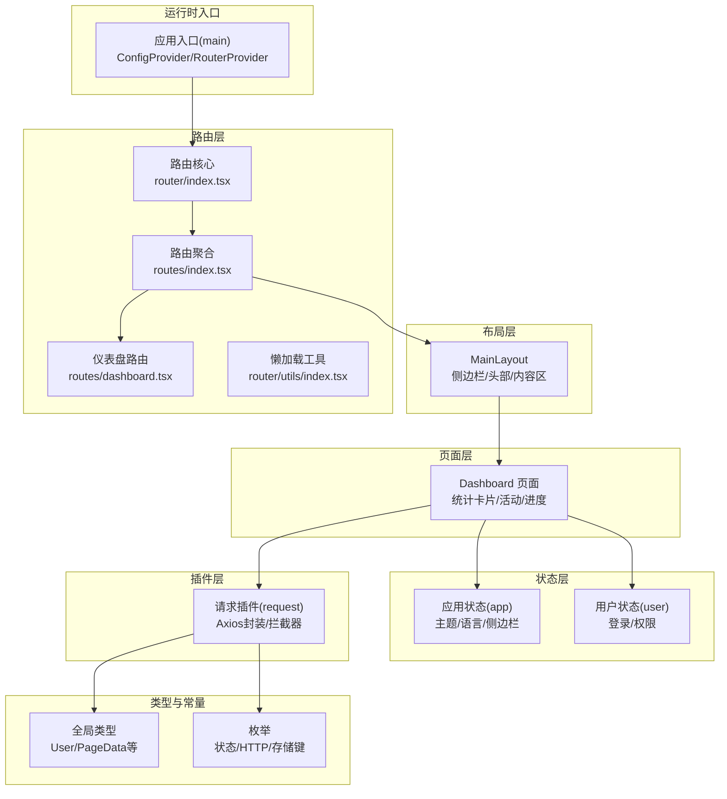
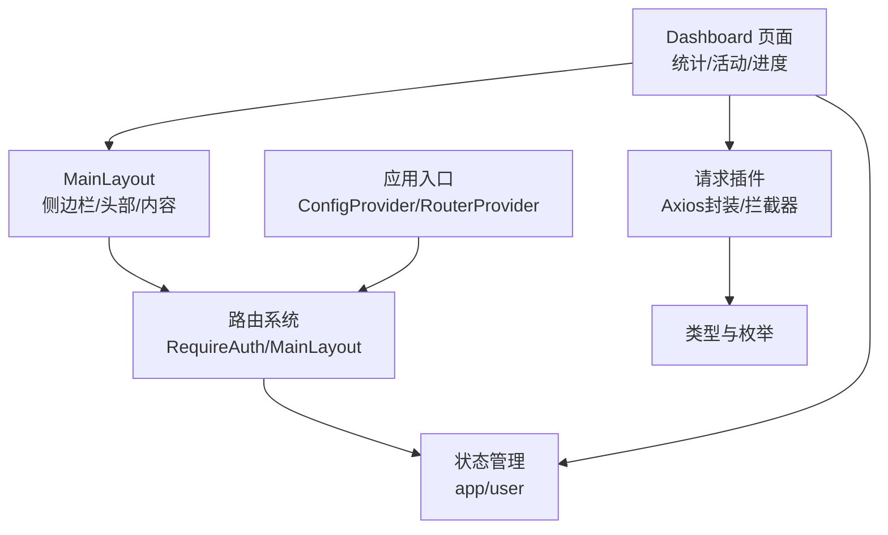
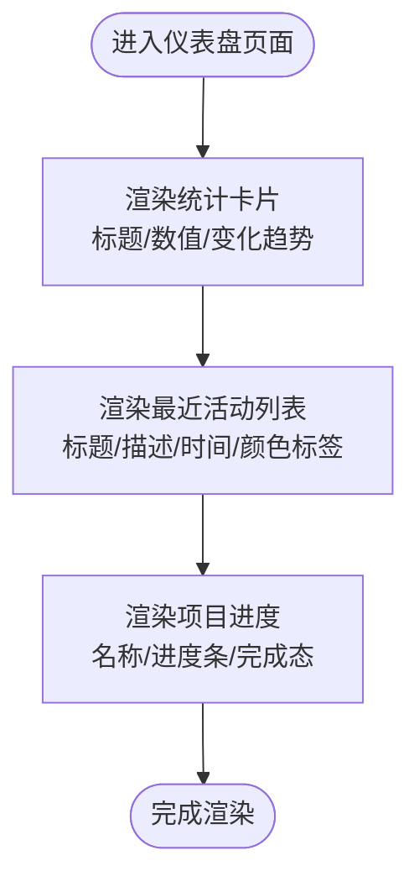
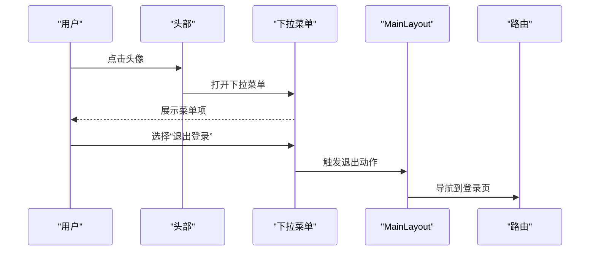
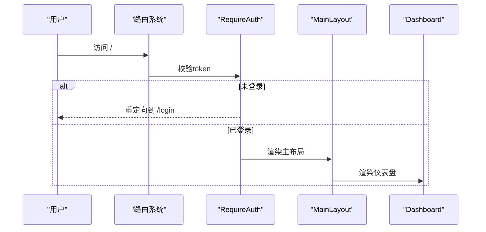
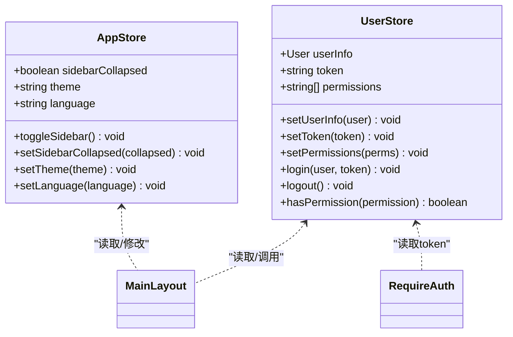
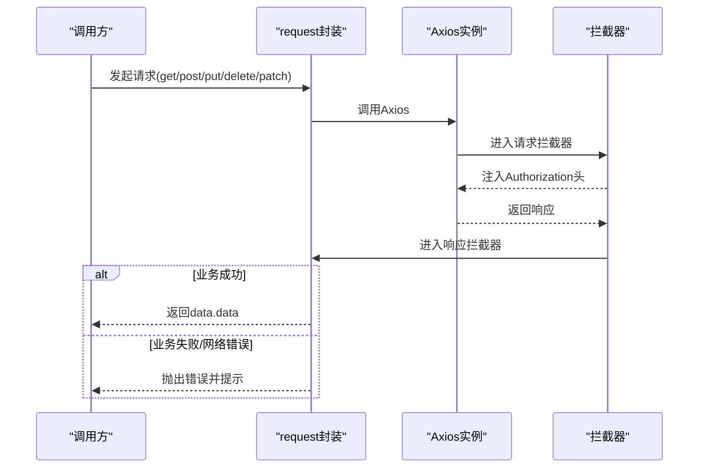
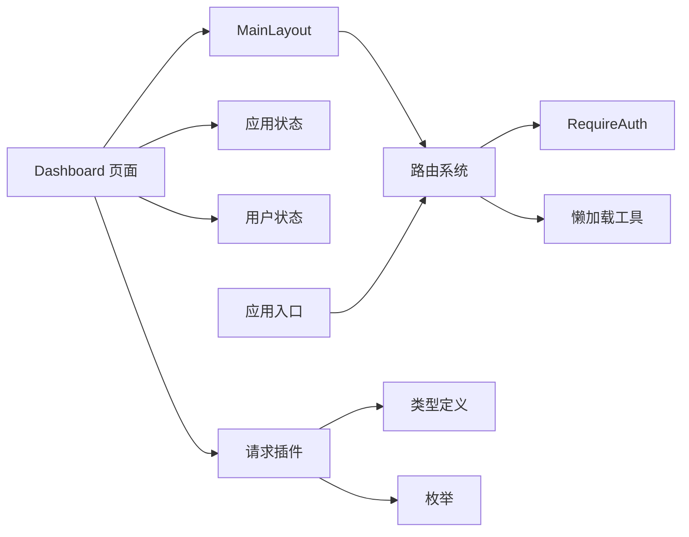

# 仪表盘系统

<cite>
**本文引用的文件**
- [src/pages/dashboard/index.tsx](file://src/pages/dashboard/index.tsx)
- [src/layouts/MainLayout.tsx](file://src/layouts/MainLayout.tsx)
- [src/router/routes/dashboard.tsx](file://src/router/routes/dashboard.tsx)
- [src/router/routes/index.tsx](file://src/router/routes/index.tsx)
- [src/router/index.tsx](file://src/router/index.tsx)
- [src/router/utils/index.tsx](file://src/router/utils/index.tsx)
- [src/stores/app.ts](file://src/stores/app.ts)
- [src/stores/user.ts](file://src/stores/user.ts)
- [src/plugins/request/index.ts](file://src/plugins/request/index.ts)
- [src/main.tsx](file://src/main.tsx)
- [src/types/index.ts](file://src/types/index.ts)
- [src/constants/enum.ts](file://src/constants/enum.ts)
- [mock/db.json](file://mock/db.json)
</cite>

## 目录

1. [简介](#简介)
2. [项目结构](#项目结构)
3. [核心组件](#核心组件)
4. [架构总览](#架构总览)
5. [详细组件分析](#详细组件分析)
6. [依赖关系分析](#依赖关系分析)
7. [性能考虑](#性能考虑)
8. [故障排查指南](#故障排查指南)
9. [结论](#结论)
10. [附录](#附录)

## 简介

本文件为仪表盘系统的综合技术文档，围绕数据统计展示、项目进度跟踪与实时活动监控三大主题，系统阐述页面布局、组件组织、状态管理、数据获取与渲染逻辑、以及整体架构设计与性能优化策略。同时提供可扩展的实践建议与使用示例路径，帮助开发者在现有基础上定制与优化仪表盘功能。

## 项目结构

该系统采用分层与按功能域组织的结构：页面层负责视图与交互；布局层提供统一的头部、侧边栏与内容区；路由层组织导航与鉴权守卫；状态层通过轻量状态库管理应用与用户态；插件层封装网络请求与拦截；类型与常量提供统一的数据契约与枚举。

图表来源

- [src/main.tsx](file://src/main.tsx#L17-L31)
- [src/router/index.tsx](file://src/router/index.tsx#L1-L9)
- [src/router/routes/index.tsx](file://src/router/routes/index.tsx#L9-L28)
- [src/router/routes/dashboard.tsx](file://src/router/routes/dashboard.tsx#L1-L17)
- [src/layouts/MainLayout.tsx](file://src/layouts/MainLayout.tsx#L73-L170)
- [src/pages/dashboard/index.tsx](file://src/pages/dashboard/index.tsx#L12-L167)
- [src/stores/app.ts](file://src/stores/app.ts#L18-L58)
- [src/stores/user.ts](file://src/stores/user.ts#L21-L75)
- [src/plugins/request/index.ts](file://src/plugins/request/index.ts#L11-L113)
- [src/types/index.ts](file://src/types/index.ts#L17-L28)
- [src/constants/enum.ts](file://src/constants/enum.ts#L4-L70)

章节来源

- [src/main.tsx](file://src/main.tsx#L17-L31)
- [src/router/index.tsx](file://src/router/index.tsx#L1-L9)
- [src/router/routes/index.tsx](file://src/router/routes/index.tsx#L9-L28)
- [src/router/routes/dashboard.tsx](file://src/router/routes/dashboard.tsx#L1-L17)
- [src/layouts/MainLayout.tsx](file://src/layouts/MainLayout.tsx#L73-L170)
- [src/pages/dashboard/index.tsx](file://src/pages/dashboard/index.tsx#L12-L167)
- [src/stores/app.ts](file://src/stores/app.ts#L18-L58)
- [src/stores/user.ts](file://src/stores/user.ts#L21-L75)
- [src/plugins/request/index.ts](file://src/plugins/request/index.ts#L11-L113)
- [src/types/index.ts](file://src/types/index.ts#L17-L28)
- [src/constants/enum.ts](file://src/constants/enum.ts#L4-L70)

## 核心组件

- 仪表盘页面组件：负责统计卡片、最近活动列表与项目进度展示，采用响应式栅格布局与Ant Design组件组合。
- 布局组件：提供统一的侧边栏、顶部导航与内容区，集成用户下拉菜单与通知徽标。
- 路由与懒加载：通过路由聚合与懒加载提升首屏性能，并在仪表盘入口处集成鉴权守卫。
- 状态管理：应用状态（主题、语言、侧边栏）与用户状态（登录态、权限）通过轻量状态库持久化管理。
- 请求插件：基于Axios封装通用请求方法与拦截器，统一封装业务错误与网络异常处理。
- 类型与常量：统一用户、分页、表格、表单等类型定义，以及状态、HTTP、存储键等枚举。

章节来源

- [src/pages/dashboard/index.tsx](file://src/pages/dashboard/index.tsx#L12-L167)
- [src/layouts/MainLayout.tsx](file://src/layouts/MainLayout.tsx#L18-L170)
- [src/router/routes/dashboard.tsx](file://src/router/routes/dashboard.tsx#L1-L17)
- [src/stores/app.ts](file://src/stores/app.ts#L18-L58)
- [src/stores/user.ts](file://src/stores/user.ts#L21-L75)
- [src/plugins/request/index.ts](file://src/plugins/request/index.ts#L11-L113)
- [src/types/index.ts](file://src/types/index.ts#L17-L28)
- [src/constants/enum.ts](file://src/constants/enum.ts#L4-L70)

## 架构总览

系统采用“页面-布局-路由-状态-插件”的分层架构，页面层专注UI与交互；布局层提供一致的导航体验；路由层负责导航与鉴权；状态层管理应用与用户态；插件层封装网络请求与拦截。类型与常量为各层提供统一契约。

图表来源

- [src/pages/dashboard/index.tsx](file://src/pages/dashboard/index.tsx#L12-L167)
- [src/layouts/MainLayout.tsx](file://src/layouts/MainLayout.tsx#L73-L170)
- [src/router/routes/index.tsx](file://src/router/routes/index.tsx#L9-L28)
- [src/stores/app.ts](file://src/stores/app.ts#L18-L58)
- [src/stores/user.ts](file://src/stores/user.ts#L21-L75)
- [src/plugins/request/index.ts](file://src/plugins/request/index.ts#L11-L113)
- [src/main.tsx](file://src/main.tsx#L17-L31)

## 详细组件分析

### 仪表盘页面组件（数据统计/活动/进度）

- 统计卡片：使用统计组件展示关键指标，支持前缀图标、数值颜色与环比变化趋势显示。
- 最近活动：使用列表组件展示事件标题、描述与时间标签，配合彩色标签标识事件类型。
- 项目进度：使用进度条组件展示项目完成百分比，根据完成度切换状态样式。

图表来源

- [src/pages/dashboard/index.tsx](file://src/pages/dashboard/index.tsx#L14-L43)
- [src/pages/dashboard/index.tsx](file://src/pages/dashboard/index.tsx#L46-L71)
- [src/pages/dashboard/index.tsx](file://src/pages/dashboard/index.tsx#L74-L79)

章节来源

- [src/pages/dashboard/index.tsx](file://src/pages/dashboard/index.tsx#L12-L167)

### 布局组件（侧边栏/头部/内容区）

- 侧边栏：可折叠，包含品牌标识与菜单项，支持主题色阴影与选中态高亮。
- 头部：左侧触发侧边栏折叠/展开，右侧包含通知徽标与用户下拉菜单（个人中心、系统设置、退出登录）。
- 内容区：承载子路由出口，提供内边距与圆角背景，支持滚动。

图表来源

- [src/layouts/MainLayout.tsx](file://src/layouts/MainLayout.tsx#L128-L153)
- [src/layouts/MainLayout.tsx](file://src/layouts/MainLayout.tsx#L48-L61)
- [src/router/routes/index.tsx](file://src/router/routes/index.tsx#L14-L16)

章节来源

- [src/layouts/MainLayout.tsx](file://src/layouts/MainLayout.tsx#L18-L170)

### 路由与懒加载（RequireAuth/MainLayout）

- 路由聚合：将认证、仪表盘与错误路由整合，根路径包裹鉴权守卫与主布局。
- 仪表盘路由：使用懒加载与骨架屏占位，提升首屏性能。
- 鉴权守卫：读取用户状态中的token，无token则重定向至登录页。

图表来源

- [src/router/routes/index.tsx](file://src/router/routes/index.tsx#L9-L28)
- [src/router/routes/dashboard.tsx](file://src/router/routes/dashboard.tsx#L1-L17)
- [src/router/utils/index.tsx](file://src/router/utils/index.tsx#L4-L20)
- [src/router/guards/RequireAuth.tsx](file://src/router/guards/RequireAuth.tsx#L11-L22)

章节来源

- [src/router/routes/index.tsx](file://src/router/routes/index.tsx#L9-L28)
- [src/router/routes/dashboard.tsx](file://src/router/routes/dashboard.tsx#L1-L17)
- [src/router/utils/index.tsx](file://src/router/utils/index.tsx#L4-L20)
- [src/router/guards/RequireAuth.tsx](file://src/router/guards/RequireAuth.tsx#L11-L22)

### 状态管理（应用状态/用户状态）

- 应用状态：管理侧边栏折叠、主题与语言，支持持久化与部分序列化。
- 用户状态：管理用户信息、token与权限，提供登录、登出与权限校验方法，支持持久化。

图表来源

- [src/stores/app.ts](file://src/stores/app.ts#L18-L58)
- [src/stores/user.ts](file://src/stores/user.ts#L21-L75)
- [src/layouts/MainLayout.tsx](file://src/layouts/MainLayout.tsx#L23-L24)
- [src/router/guards/RequireAuth.tsx](file://src/router/guards/RequireAuth.tsx#L15-L15)

章节来源

- [src/stores/app.ts](file://src/stores/app.ts#L18-L58)
- [src/stores/user.ts](file://src/stores/user.ts#L21-L75)
- [src/layouts/MainLayout.tsx](file://src/layouts/MainLayout.tsx#L23-L24)
- [src/router/guards/RequireAuth.tsx](file://src/router/guards/RequireAuth.tsx#L15-L15)

### 请求插件（Axios封装/拦截器）

- 实例配置：超时、默认Content-Type。
- 请求拦截：自动注入Authorization头（Bearer token）。
- 响应拦截：业务成功透传data.data；业务失败弹出消息并拒绝；网络错误分类提示；401跳转登录。

图表来源

- [src/plugins/request/index.ts](file://src/plugins/request/index.ts#L11-L113)

章节来源

- [src/plugins/request/index.ts](file://src/plugins/request/index.ts#L11-L113)

### 类型与常量（统一契约）

- 用户类型：包含标识、账户、昵称、邮箱、电话、头像、状态与时间戳。
- 分页类型：列表、总数、页码、页大小。
- 枚举：用户状态、订单状态、性别、主题模式、语言、HTTP状态码、存储键名。

章节来源

- [src/types/index.ts](file://src/types/index.ts#L17-L28)
- [src/types/index.ts](file://src/types/index.ts#L4-L9)
- [src/constants/enum.ts](file://src/constants/enum.ts#L4-L70)

## 依赖关系分析

- 页面依赖布局与状态；布局依赖状态与路由；路由依赖守卫与懒加载；请求插件依赖类型与常量；入口依赖路由与配置提供者。
- 组件耦合度低，职责清晰，便于扩展与维护。

图表来源

- [src/pages/dashboard/index.tsx](file://src/pages/dashboard/index.tsx#L12-L167)
- [src/layouts/MainLayout.tsx](file://src/layouts/MainLayout.tsx#L73-L170)
- [src/router/routes/index.tsx](file://src/router/routes/index.tsx#L9-L28)
- [src/router/utils/index.tsx](file://src/router/utils/index.tsx#L4-L20)
- [src/router/guards/RequireAuth.tsx](file://src/router/guards/RequireAuth.tsx#L11-L22)
- [src/stores/app.ts](file://src/stores/app.ts#L18-L58)
- [src/stores/user.ts](file://src/stores/user.ts#L21-L75)
- [src/plugins/request/index.ts](file://src/plugins/request/index.ts#L11-L113)
- [src/main.tsx](file://src/main.tsx#L17-L31)

章节来源

- [src/pages/dashboard/index.tsx](file://src/pages/dashboard/index.tsx#L12-L167)
- [src/layouts/MainLayout.tsx](file://src/layouts/MainLayout.tsx#L73-L170)
- [src/router/routes/index.tsx](file://src/router/routes/index.tsx#L9-L28)
- [src/router/utils/index.tsx](file://src/router/utils/index.tsx#L4-L20)
- [src/router/guards/RequireAuth.tsx](file://src/router/guards/RequireAuth.tsx#L11-L22)
- [src/stores/app.ts](file://src/stores/app.ts#L18-L58)
- [src/stores/user.ts](file://src/stores/user.ts#L21-L75)
- [src/plugins/request/index.ts](file://src/plugins/request/index.ts#L11-L113)
- [src/main.tsx](file://src/main.tsx#L17-L31)

## 性能考虑

- 懒加载与骨架屏：仪表盘路由与页面均采用懒加载与骨架屏，降低首屏阻塞。
- 状态持久化：应用与用户状态持久化，减少重复初始化成本。
- 组件拆分：统计卡片、活动列表、进度条均为独立渲染单元，利于按需更新。
- 请求拦截：集中处理错误与鉴权，避免重复逻辑与分支污染。

章节来源

- [src/router/routes/dashboard.tsx](file://src/router/routes/dashboard.tsx#L5-L11)
- [src/router/utils/index.tsx](file://src/router/utils/index.tsx#L4-L20)
- [src/stores/app.ts](file://src/stores/app.ts#L49-L57)
- [src/stores/user.ts](file://src/stores/user.ts#L67-L74)
- [src/plugins/request/index.ts](file://src/plugins/request/index.ts#L35-L76)

## 故障排查指南

- 登录过期或无权限：响应拦截器会识别401/403并清理token与提示，随后跳转登录页。
- 网络异常：根据状态码给出明确提示，检查网络连通性与后端服务。
- 仪表盘空白：确认路由守卫是否通过，确保token存在；检查懒加载与骨架屏是否正常渲染。
- 数据不更新：确认统计/活动/进度数据源是否正确接入，必要时引入轮询或订阅机制。

章节来源

- [src/plugins/request/index.ts](file://src/plugins/request/index.ts#L48-L76)
- [src/router/guards/RequireAuth.tsx](file://src/router/guards/RequireAuth.tsx#L15-L22)
- [src/router/routes/dashboard.tsx](file://src/router/routes/dashboard.tsx#L5-L11)
- [src/router/utils/index.tsx](file://src/router/utils/index.tsx#L4-L20)

## 结论

该仪表盘系统以清晰的分层架构与轻量状态管理为基础，结合路由懒加载与请求拦截，实现了良好的首屏性能与用户体验。统计卡片、活动列表与项目进度三大模块覆盖了核心监控场景。后续可在数据源接入、实时刷新策略与权限细化方面进一步增强。

## 附录

### 使用示例与扩展方法

- 扩展统计卡片
  - 在统计数组中新增一项，包含标题、数值、前缀图标、变化率与颜色，即可自动渲染。
  - 示例路径参考：[统计卡片数据结构](file://src/pages/dashboard/index.tsx#L14-L43)
- 自定义活动类型
  - 在活动数组中新增一条记录，设置标题、描述、时间与颜色标签，即可在最近活动中展示。
  - 示例路径参考：[活动列表数据结构](file://src/pages/dashboard/index.tsx#L46-L71)
- 项目进度展示
  - 在项目数组中新增一条记录，设置名称与进度值，即可在项目进度区域渲染对应进度条。
  - 示例路径参考：[项目进度数据结构](file://src/pages/dashboard/index.tsx#L74-L79)
- 接入真实数据源
  - 使用请求插件封装的get/post/put/delete/patch方法发起API请求，将返回数据赋值给统计、活动或进度数组。
  - 示例路径参考：[请求插件封装](file://src/plugins/request/index.ts#L79-L111)
- 实时刷新策略
  - 可在页面挂载时启动定时器或WebSocket订阅，周期性拉取最新数据并更新状态。
  - 示例路径参考：[状态持久化与更新](file://src/stores/app.ts#L18-L58)
- 权限控制
  - 使用用户状态的权限校验方法判断当前用户是否具备访问仪表盘或特定模块的权限。
  - 示例路径参考：[权限校验方法](file://src/stores/user.ts#L62-L65)
- Mock数据参考
  - 可参考模拟数据库中的用户、文章与项目数据，用于本地开发与演示。
  - 示例路径参考：[模拟数据db.json](file://mock/db.json#L1-L140)
