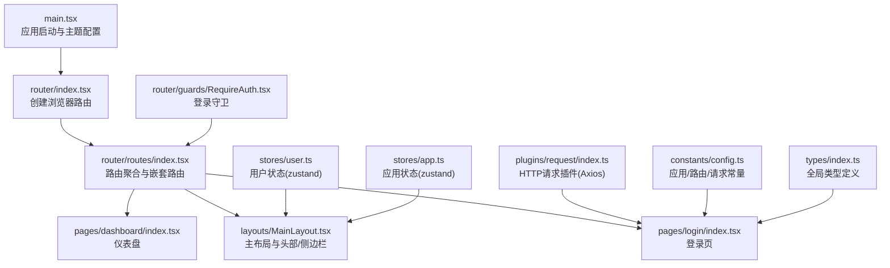
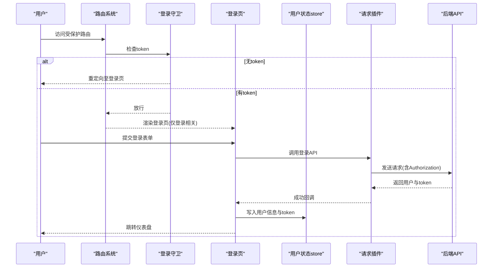
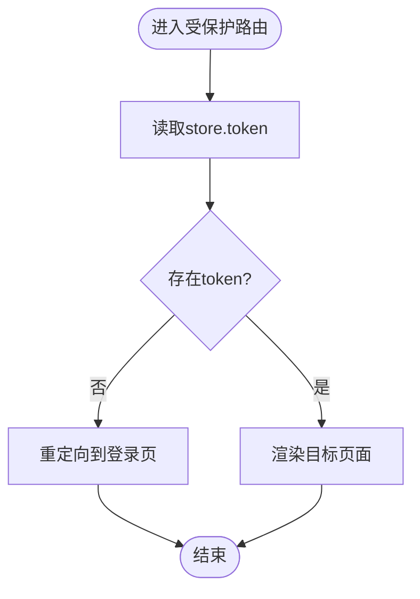
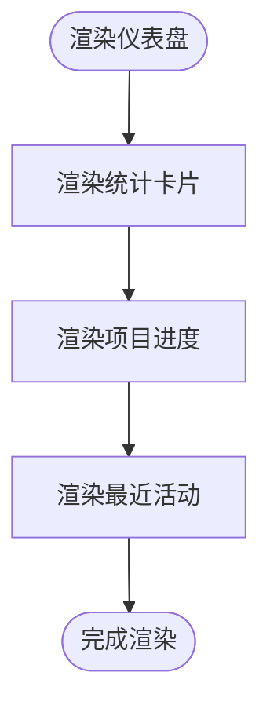
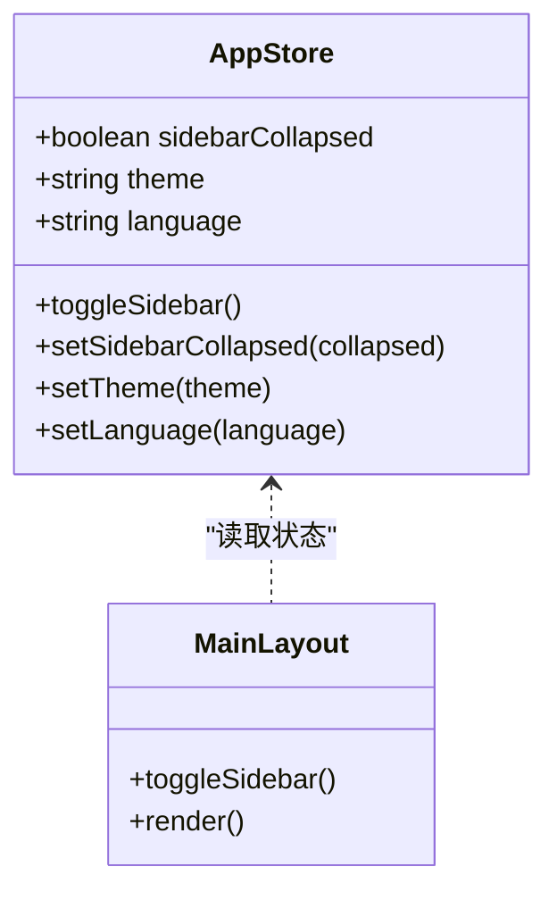
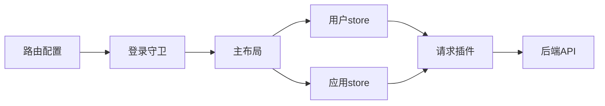
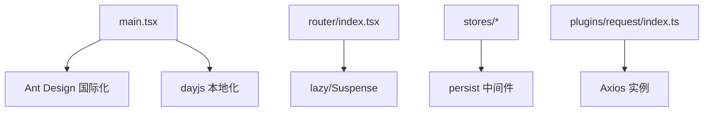

# 核心功能模块

<cite>
**本文引用的文件**
- [src/main.tsx](file://src/main.tsx)
- [src/router/index.tsx](file://src/router/index.tsx)
- [src/router/routes/index.tsx](file://src/router/routes/index.tsx)
- [src/router/routes/auth.tsx](file://src/router/routes/auth.tsx)
- [src/router/guards/RequireAuth.tsx](file://src/router/guards/RequireAuth.tsx)
- [src/router/utils/index.tsx](file://src/router/utils/index.tsx)
- [src/layouts/MainLayout.tsx](file://src/layouts/MainLayout.tsx)
- [src/pages/login/index.tsx](file://src/pages/login/index.tsx)
- [src/pages/dashboard/index.tsx](file://src/pages/dashboard/index.tsx)
- [src/stores/user.ts](file://src/stores/user.ts)
- [src/stores/app.ts](file://src/stores/app.ts)
- [src/plugins/request/index.ts](file://src/plugins/request/index.ts)
- [src/constants/config.ts](file://src/constants/config.ts)
- [src/types/index.ts](file://src/types/index.ts)
- [package.json](file://package.json)
</cite>

## 目录

1. [简介](#简介)
2. [项目结构](#项目结构)
3. [核心组件](#核心组件)
4. [架构总览](#架构总览)
5. [详细组件分析](#详细组件分析)
6. [依赖分析](#依赖分析)
7. [性能考虑](#性能考虑)
8. [故障排查指南](#故障排查指南)
9. [结论](#结论)
10. [附录](#附录)

## 简介

本文件聚焦于AI管理平台的核心功能模块，系统性梳理用户认证、仪表盘展示与系统设置等关键能力，并阐明模块间协作关系与数据流。文档面向开发者与产品人员，既提供代码级细节，也给出可操作的最佳实践与排障建议。

## 项目结构

项目采用“路由 + 布局 + 状态 + 插件 + 类型”的分层组织方式：

- 启动入口负责国际化、主题与根容器挂载
- 路由系统通过守卫控制访问，结合懒加载提升首屏性能
- 布局组件承载全局导航、侧边栏与头部交互
- 状态管理使用Zustand，持久化存储用户与应用偏好
- 请求插件封装Axios，统一鉴权头与错误处理
- 类型系统覆盖分页、用户、路由元信息、API响应等

图表来源

- [src/main.tsx](file://src/main.tsx#L1-L32)
- [src/router/index.tsx](file://src/router/index.tsx#L1-L9)
- [src/router/routes/index.tsx](file://src/router/routes/index.tsx#L1-L31)
- [src/layouts/MainLayout.tsx](file://src/layouts/MainLayout.tsx#L1-L174)
- [src/pages/login/index.tsx](file://src/pages/login/index.tsx#L1-L133)
- [src/pages/dashboard/index.tsx](file://src/pages/dashboard/index.tsx#L1-L170)
- [src/stores/user.ts](file://src/stores/user.ts#L1-L76)
- [src/stores/app.ts](file://src/stores/app.ts#L1-L59)
- [src/plugins/request/index.ts](file://src/plugins/request/index.ts#L1-L114)
- [src/constants/config.ts](file://src/constants/config.ts#L1-L76)
- [src/types/index.ts](file://src/types/index.ts#L1-L101)
- [src/router/guards/RequireAuth.tsx](file://src/router/guards/RequireAuth.tsx#L1-L25)

章节来源

- [src/main.tsx](file://src/main.tsx#L1-L32)
- [src/router/index.tsx](file://src/router/index.tsx#L1-L9)
- [src/router/routes/index.tsx](file://src/router/routes/index.tsx#L1-L31)

## 核心组件

- 用户认证与会话管理：基于Zustand的用户状态store，配合路由守卫与请求插件的Authorization头注入，实现登录态校验与自动登出
- 仪表盘系统：统计卡片、最近活动列表与项目进度展示，响应式布局适配多端
- 系统设置：主题切换(light/dark)、语言设置(zh-CN/en-US)、侧边栏折叠状态持久化
- 请求与错误处理：统一拦截器处理401/403/404/500等状态码，自动清理本地token并跳转登录

章节来源

- [src/stores/user.ts](file://src/stores/user.ts#L1-L76)
- [src/stores/app.ts](file://src/stores/app.ts#L1-L59)
- [src/plugins/request/index.ts](file://src/plugins/request/index.ts#L1-L114)
- [src/pages/dashboard/index.tsx](file://src/pages/dashboard/index.tsx#L1-L170)

## 架构总览

下图展示了从用户访问到页面渲染、状态更新与请求发送的完整链路。

图表来源

- [src/router/guards/RequireAuth.tsx](file://src/router/guards/RequireAuth.tsx#L1-L25)
- [src/pages/login/index.tsx](file://src/pages/login/index.tsx#L1-L133)
- [src/plugins/request/index.ts](file://src/plugins/request/index.ts#L1-L114)
- [src/stores/user.ts](file://src/stores/user.ts#L1-L76)

## 详细组件分析

### 用户认证系统

- 登录页面实现
  - 使用表单校验与异步请求，提交后调用状态store写入用户信息与token
  - 成功后提示消息并跳转首页
- 权限验证机制
  - 路由守卫读取store中的token，无token则重定向至登录页
  - 用户store提供hasPermission判断，支持通配符“\*”
- 会话管理
  - 请求拦截器在headers中附加Authorization头
  - 响应拦截器处理401自动清理token并跳转登录
  - 登出时清空store并移除本地token

图表来源

- [src/router/guards/RequireAuth.tsx](file://src/router/guards/RequireAuth.tsx#L1-L25)

章节来源

- [src/pages/login/index.tsx](file://src/pages/login/index.tsx#L1-L133)
- [src/router/guards/RequireAuth.tsx](file://src/router/guards/RequireAuth.tsx#L1-L25)
- [src/stores/user.ts](file://src/stores/user.ts#L1-L76)
- [src/plugins/request/index.ts](file://src/plugins/request/index.ts#L1-L114)

### 仪表盘系统

- 数据统计展示
  - 使用统计卡片展示关键指标，包含数值、图标与环比变化
- 项目进度跟踪
  - 以进度条呈现项目完成度，支持“完成(success)”状态
- 实时活动监控
  - 列表展示最近事件，包含标题、描述与时间标签

图表来源

- [src/pages/dashboard/index.tsx](file://src/pages/dashboard/index.tsx#L1-L170)

章节来源

- [src/pages/dashboard/index.tsx](file://src/pages/dashboard/index.tsx#L1-L170)

### 系统设置与主题切换

- 主题切换
  - 应用store维护theme字段，支持light/dark
  - 主题变更影响布局组件的样式变量
- 语言设置
  - 应用store维护language字段，支持zh-CN/en-US
  - 启动入口已配置Ant Design语言包与dayjs本地化
- 响应式布局
  - 仪表盘使用栅格系统，自适应不同屏幕尺寸

图表来源

- [src/stores/app.ts](file://src/stores/app.ts#L1-L59)
- [src/layouts/MainLayout.tsx](file://src/layouts/MainLayout.tsx#L1-L174)

章节来源

- [src/stores/app.ts](file://src/stores/app.ts#L1-L59)
- [src/layouts/MainLayout.tsx](file://src/layouts/MainLayout.tsx#L1-L174)
- [src/main.tsx](file://src/main.tsx#L1-L32)

### 模块协作与数据流

- 路由与布局
  - 路由聚合定义根路径与子路由，RequireAuth包裹主布局
  - MainLayout消费用户与应用store，提供顶部导航与侧边栏
- 状态与持久化
  - 用户store与应用store均使用persist中间件，分别持久化token与用户信息、主题、语言、侧边栏状态
- 请求与错误处理
  - 请求插件统一注入Authorization头，处理业务错误与HTTP错误码
  - 401场景自动清理token并跳转登录

图表来源

- [src/router/routes/index.tsx](file://src/router/routes/index.tsx#L1-L31)
- [src/router/guards/RequireAuth.tsx](file://src/router/guards/RequireAuth.tsx#L1-L25)
- [src/layouts/MainLayout.tsx](file://src/layouts/MainLayout.tsx#L1-L174)
- [src/stores/user.ts](file://src/stores/user.ts#L1-L76)
- [src/stores/app.ts](file://src/stores/app.ts#L1-L59)
- [src/plugins/request/index.ts](file://src/plugins/request/index.ts#L1-L114)

章节来源

- [src/router/routes/index.tsx](file://src/router/routes/index.tsx#L1-L31)
- [src/layouts/MainLayout.tsx](file://src/layouts/MainLayout.tsx#L1-L174)
- [src/stores/user.ts](file://src/stores/user.ts#L1-L76)
- [src/stores/app.ts](file://src/stores/app.ts#L1-L59)
- [src/plugins/request/index.ts](file://src/plugins/request/index.ts#L1-L114)

## 依赖分析

- 启动与国际化
  - 在入口中配置Ant Design语言包与dayjs本地化，确保UI与日期显示符合预期
- 路由与懒加载
  - 使用lazy与Suspense实现按需加载，结合白名单路由减少非必要资源加载
- 状态管理
  - Zustand + persist + immer组合，兼顾易用性与性能；仅持久化必要字段
- 请求层
  - Axios实例集中配置超时、拦截器与统一错误处理，避免分散逻辑

图表来源

- [src/main.tsx](file://src/main.tsx#L1-L32)
- [src/router/index.tsx](file://src/router/index.tsx#L1-L9)
- [src/router/utils/index.tsx](file://src/router/utils/index.tsx#L1-L23)
- [src/stores/user.ts](file://src/stores/user.ts#L1-L76)
- [src/stores/app.ts](file://src/stores/app.ts#L1-L59)
- [src/plugins/request/index.ts](file://src/plugins/request/index.ts#L1-L114)

章节来源

- [src/main.tsx](file://src/main.tsx#L1-L32)
- [src/router/utils/index.tsx](file://src/router/utils/index.tsx#L1-L23)
- [src/stores/user.ts](file://src/stores/user.ts#L1-L76)
- [src/stores/app.ts](file://src/stores/app.ts#L1-L59)
- [src/plugins/request/index.ts](file://src/plugins/request/index.ts#L1-L114)

## 性能考虑

- 路由懒加载与骨架屏
  - 使用lazy与Suspense在路由级别实现按需加载，避免首屏阻塞
- 状态最小化与持久化
  - 仅持久化token、用户信息、主题、语言与侧边栏状态，降低存储压力
- 请求缓存与重试
  - 当前未实现请求缓存与重试策略，可在插件层扩展以提升弱网体验
- 图表与大数据渲染
  - 仪表盘当前为静态数据，若接入真实数据，建议对列表与图表进行虚拟滚动或分页

## 故障排查指南

- 登录后无法进入受保护页面
  - 检查store是否正确写入token，确认路由守卫读取逻辑
  - 参考路径：[src/router/guards/RequireAuth.tsx](file://src/router/guards/RequireAuth.tsx#L1-L25)，[src/stores/user.ts](file://src/stores/user.ts#L1-L76)
- 登录成功但出现401错误
  - 检查请求拦截器是否正确注入Authorization头，确认后端返回token格式
  - 参考路径：[src/plugins/request/index.ts](file://src/plugins/request/index.ts#L1-L114)
- 页面空白或加载缓慢
  - 确认lazy与Suspense配置，检查路由懒加载是否生效
  - 参考路径：[src/router/utils/index.tsx](file://src/router/utils/index.tsx#L1-L23)，[src/router/routes/auth.tsx](file://src/router/routes/auth.tsx#L1-L15)
- 主题或语言不生效
  - 确认应用store状态更新与入口国际化配置
  - 参考路径：[src/stores/app.ts](file://src/stores/app.ts#L1-L59)，[src/main.tsx](file://src/main.tsx#L1-L32)

章节来源

- [src/router/guards/RequireAuth.tsx](file://src/router/guards/RequireAuth.tsx#L1-L25)
- [src/stores/user.ts](file://src/stores/user.ts#L1-L76)
- [src/plugins/request/index.ts](file://src/plugins/request/index.ts#L1-L114)
- [src/router/utils/index.tsx](file://src/router/utils/index.tsx#L1-L23)
- [src/router/routes/auth.tsx](file://src/router/routes/auth.tsx#L1-L15)
- [src/stores/app.ts](file://src/stores/app.ts#L1-L59)
- [src/main.tsx](file://src/main.tsx#L1-L32)

## 结论

本项目通过清晰的分层设计与轻量的状态管理，实现了认证、布局与数据展示的核心能力。建议后续在请求层引入缓存与重试策略，并完善权限细化与动态菜单生成，以进一步提升稳定性与可扩展性。

## 附录

- 代码示例与使用模式
  - 登录流程：参考[登录页](file://src/pages/login/index.tsx#L1-L133)与[用户store](file://src/stores/user.ts#L1-L76)
  - 路由守卫：参考[RequireAuth](file://src/router/guards/RequireAuth.tsx#L1-L25)
  - 请求插件：参考[请求插件](file://src/plugins/request/index.ts#L1-L114)
  - 仪表盘：参考[仪表盘页面](file://src/pages/dashboard/index.tsx#L1-L170)
  - 应用配置：参考[应用配置](file://src/constants/config.ts#L1-L76)
  - 类型定义：参考[全局类型](file://src/types/index.ts#L1-L101)
- 依赖清单
  - React、React Router、Ant Design、Axios、Zustand、Immer、ahooks等
  - 参考路径：[package.json](file://package.json#L1-L81)
