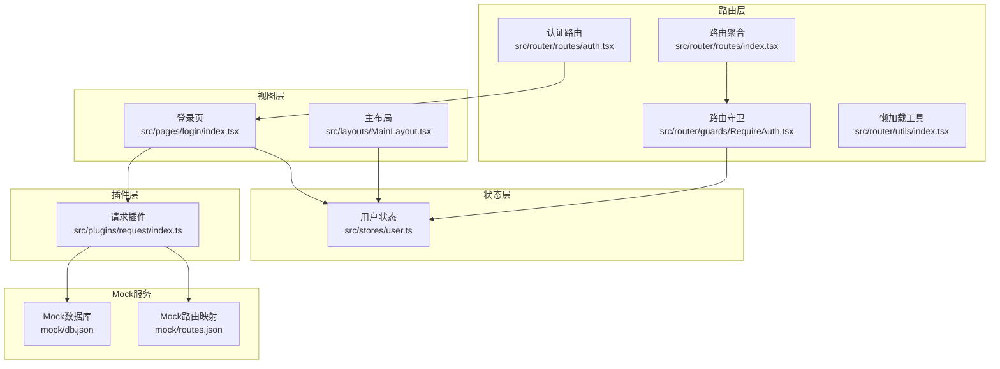
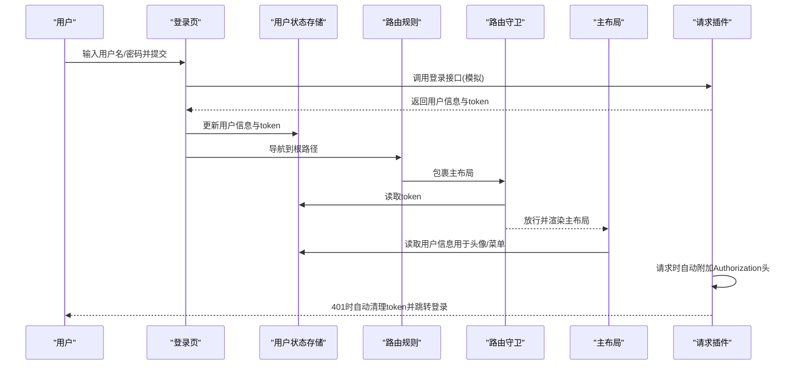
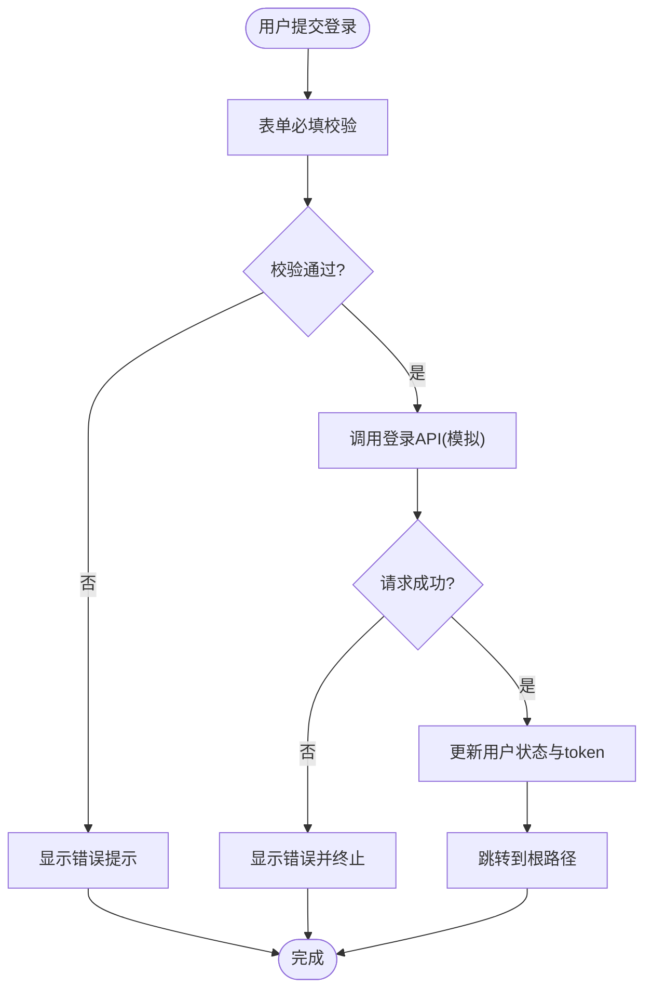
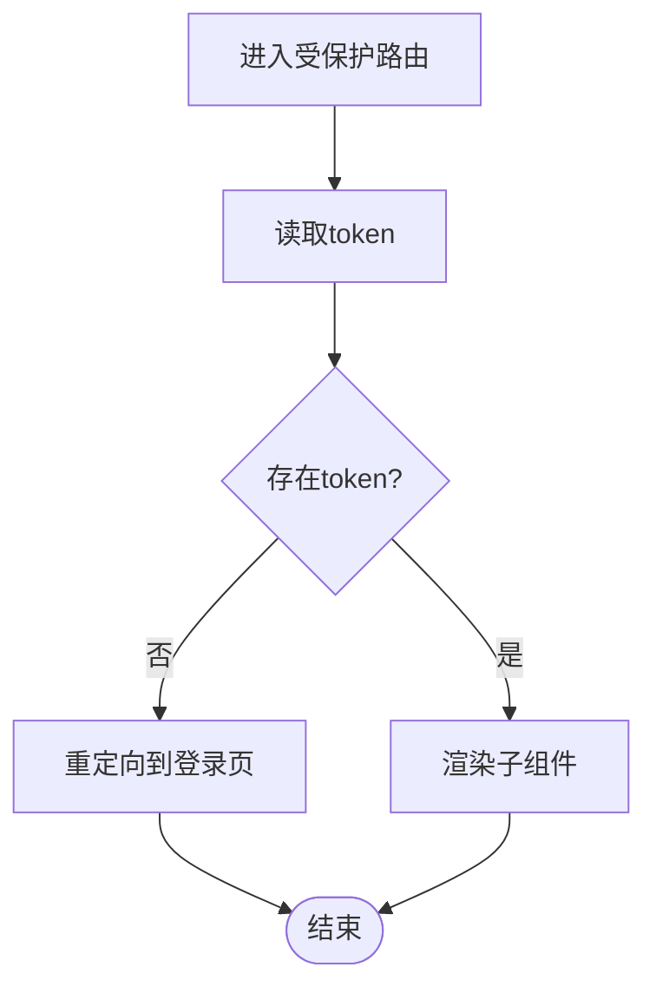
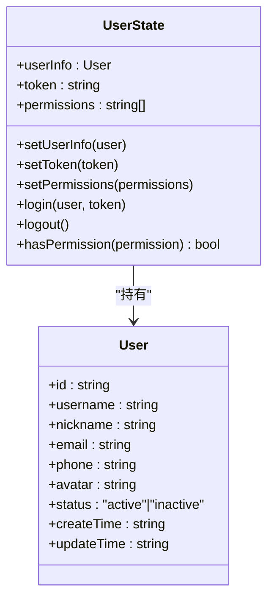
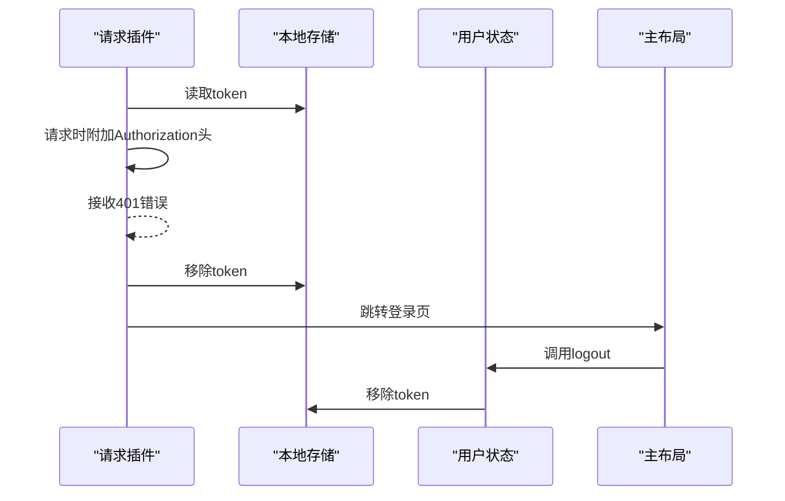
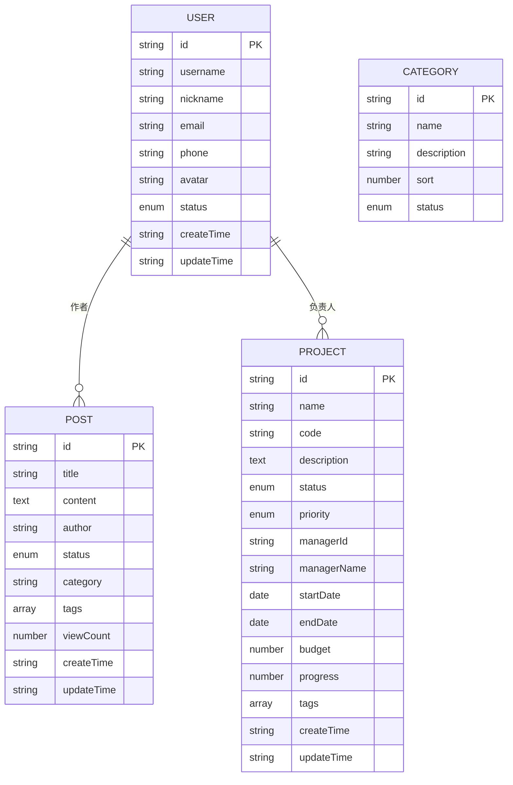
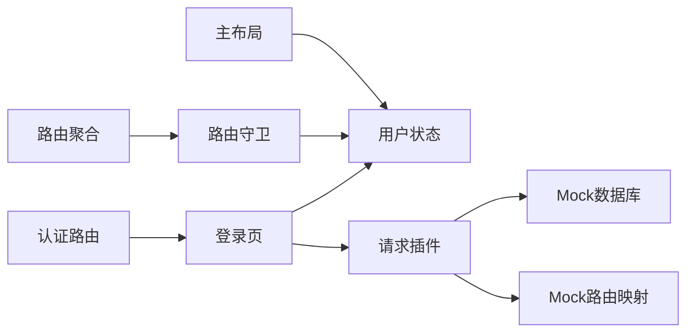

# 用户认证系统

<cite>
**本文档引用的文件**
- [src/pages/login/index.tsx](file://src/pages/login/index.tsx)
- [src/router/guards/RequireAuth.tsx](file://src/router/guards/RequireAuth.tsx)
- [src/stores/user.ts](file://src/stores/user.ts)
- [src/plugins/request/index.ts](file://src/plugins/request/index.ts)
- [src/router/routes/auth.tsx](file://src/router/routes/auth.tsx)
- [src/router/routes/index.tsx](file://src/router/routes/index.tsx)
- [src/router/utils/index.tsx](file://src/router/utils/index.tsx)
- [src/layouts/MainLayout.tsx](file://src/layouts/MainLayout.tsx)
- [src/main.tsx](file://src/main.tsx)
- [src/types/index.ts](file://src/types/index.ts)
- [mock/db.json](file://mock/db.json)
- [mock/routes.json](file://mock/routes.json)
- [package.json](file://package.json)
</cite>

## 目录

1. [简介](#简介)
2. [项目结构](#项目结构)
3. [核心组件](#核心组件)
4. [架构总览](#架构总览)
5. [详细组件分析](#详细组件分析)
6. [依赖关系分析](#依赖关系分析)
7. [性能考量](#性能考量)
8. [故障排除指南](#故障排除指南)
9. [结论](#结论)
10. [附录](#附录)

## 简介

本项目是一个基于 React + TypeScript 的前端管理后台，采用 Zustand 状态管理、React Router v6 路由守卫、Ant Design 组件库与 axios 请求封装，实现了完整的用户认证与权限控制体系。系统通过 Mock API 提供登录能力，支持表单验证、用户状态持久化、路由守卫、权限校验与会话管理（含自动登出）。

## 项目结构

项目采用按功能分层的组织方式：

- 页面层：登录页、仪表盘、错误页等
- 路由层：路由配置、路由守卫、懒加载工具
- 状态层：用户状态存储（Zustand + persist）
- 插件层：HTTP 请求封装（axios + 拦截器）
- 布局层：主布局与侧边栏、头部、下拉菜单
- Mock 层：本地 JSON Server 数据与路由映射

**图表来源**

- [src/pages/login/index.tsx](file://src/pages/login/index.tsx#L1-L133)
- [src/router/routes/index.tsx](file://src/router/routes/index.tsx#L1-L31)
- [src/router/guards/RequireAuth.tsx](file://src/router/guards/RequireAuth.tsx#L1-L25)
- [src/stores/user.ts](file://src/stores/user.ts#L1-L76)
- [src/plugins/request/index.ts](file://src/plugins/request/index.ts#L1-L114)
- [mock/db.json](file://mock/db.json#L1-L140)
- [mock/routes.json](file://mock/routes.json#L1-L11)

**章节来源**

- [src/main.tsx](file://src/main.tsx#L1-L32)
- [package.json](file://package.json#L1-L81)

## 核心组件

- 登录页：负责表单渲染、字段校验、提交处理与登录成功后的状态更新与跳转
- 路由守卫：在进入受保护路由前检查 token，无 token 则重定向至登录页
- 用户状态存储：集中管理用户信息、token、权限与登录/登出动作，支持持久化
- 请求插件：统一注入 Authorization 头，处理 401 自动登出与通用错误提示
- 主布局：提供用户头像、下拉菜单、退出登录入口与侧边栏切换

**章节来源**

- [src/pages/login/index.tsx](file://src/pages/login/index.tsx#L1-L133)
- [src/router/guards/RequireAuth.tsx](file://src/router/guards/RequireAuth.tsx#L1-L25)
- [src/stores/user.ts](file://src/stores/user.ts#L1-L76)
- [src/plugins/request/index.ts](file://src/plugins/request/index.ts#L1-L114)
- [src/layouts/MainLayout.tsx](file://src/layouts/MainLayout.tsx#L1-L174)

## 架构总览

系统认证流程围绕“登录 → 状态更新 → 路由守卫 → 请求拦截 → 自动登出”展开，形成闭环的会话管理机制。

**图表来源**

- [src/pages/login/index.tsx](file://src/pages/login/index.tsx#L32-L50)
- [src/stores/user.ts](file://src/stores/user.ts#L46-L60)
- [src/router/routes/index.tsx](file://src/router/routes/index.tsx#L9-L28)
- [src/router/guards/RequireAuth.tsx](file://src/router/guards/RequireAuth.tsx#L11-L22)
- [src/layouts/MainLayout.tsx](file://src/layouts/MainLayout.tsx#L18-L25)
- [src/plugins/request/index.ts](file://src/plugins/request/index.ts#L19-L76)

## 详细组件分析

### 登录页面实现原理

- 表单验证：使用 Ant Design Form 对用户名与密码进行必填校验；记住我复选框用于后续扩展（当前未实现持久化登录）
- 用户输入处理：onFinish 回调中收集表单值并触发登录 API 调用
- Mock API 调用：loginApi 使用 Promise 模拟异步登录，返回固定用户与 token
- 成功回调：useRequest 的 onSuccess 中弹出成功消息、调用用户状态存储的 login 方法、跳转到根路径

**图表来源**

- [src/pages/login/index.tsx](file://src/pages/login/index.tsx#L36-L50)
- [src/plugins/request/index.ts](file://src/plugins/request/index.ts#L19-L32)

**章节来源**

- [src/pages/login/index.tsx](file://src/pages/login/index.tsx#L1-L133)

### 权限验证机制与路由守卫

- 路由守卫 RequireAuth：读取用户状态中的 token，若为空则重定向到登录页；否则放行子组件
- 路由配置：根路径 '/' 由 RequireAuth 包裹，确保所有子路由均需登录态
- 懒加载：使用 lazyLoad 对路由组件进行懒加载，提升首屏性能

**图表来源**

- [src/router/guards/RequireAuth.tsx](file://src/router/guards/RequireAuth.tsx#L11-L22)
- [src/router/routes/index.tsx](file://src/router/routes/index.tsx#L14-L17)
- [src/router/utils/index.tsx](file://src/router/utils/index.tsx#L4-L20)

**章节来源**

- [src/router/guards/RequireAuth.tsx](file://src/router/guards/RequireAuth.tsx#L1-L25)
- [src/router/routes/index.tsx](file://src/router/routes/index.tsx#L1-L31)
- [src/router/utils/index.tsx](file://src/router/utils/index.tsx#L1-L23)

### 用户状态与权限模型

- 状态结构：userInfo、token、permissions
- 动作方法：setUserInfo、setToken、setPermissions、login、logout、hasPermission
- 持久化：使用 persist 中间件仅持久化 token 与 userInfo，避免敏感信息泄露
- 权限判断：支持精确匹配与通配符 '\*'，简化权限控制

**图表来源**

- [src/stores/user.ts](file://src/stores/user.ts#L6-L19)
- [src/types/index.ts](file://src/types/index.ts#L17-L28)

**章节来源**

- [src/stores/user.ts](file://src/stores/user.ts#L1-L76)
- [src/types/index.ts](file://src/types/index.ts#L1-L101)

### 会话管理策略

- 登录状态维护：登录成功后将 token 写入状态存储；请求拦截器自动在 Authorization 头中携带 token
- 自动登出：响应拦截器捕获 401 错误，清空本地 token 并跳转到登录页
- 用户状态持久化：仅持久化 token 与用户基本信息，避免敏感数据长期驻留
- 退出登录：主布局下拉菜单提供退出入口，调用 logout 清空状态并移除 token

**图表来源**

- [src/plugins/request/index.ts](file://src/plugins/request/index.ts#L19-L76)
- [src/stores/user.ts](file://src/stores/user.ts#L53-L60)
- [src/layouts/MainLayout.tsx](file://src/layouts/MainLayout.tsx#L56-L59)

**章节来源**

- [src/plugins/request/index.ts](file://src/plugins/request/index.ts#L1-L114)
- [src/stores/user.ts](file://src/stores/user.ts#L1-L76)
- [src/layouts/MainLayout.tsx](file://src/layouts/MainLayout.tsx#L1-L174)

### Mock API 与数据模型

- Mock 登录：loginApi 返回固定用户与 token，模拟真实登录流程
- Mock 数据库：db.json 提供用户、文章、分类、项目等基础数据
- Mock 路由映射：routes.json 定义 API 路径到本地数据的映射，便于与后端接口对齐

**图表来源**

- [mock/db.json](file://mock/db.json#L1-L140)
- [src/types/index.ts](file://src/types/index.ts#L17-L28)

**章节来源**

- [src/pages/login/index.tsx](file://src/pages/login/index.tsx#L14-L30)
- [mock/db.json](file://mock/db.json#L1-L140)
- [mock/routes.json](file://mock/routes.json#L1-L11)

## 依赖关系分析

- 组件耦合：登录页依赖用户状态存储与请求插件；路由守卫依赖用户状态存储；主布局依赖用户状态存储与应用状态存储
- 外部依赖：React Router v6 提供路由与导航；Ant Design 提供 UI 组件与主题；axios 提供 HTTP 请求；Zustand 提供轻量状态管理
- 潜在循环依赖：当前结构清晰，未发现直接循环依赖

**图表来源**

- [src/pages/login/index.tsx](file://src/pages/login/index.tsx#L1-L133)
- [src/router/routes/index.tsx](file://src/router/routes/index.tsx#L1-L31)
- [src/router/guards/RequireAuth.tsx](file://src/router/guards/RequireAuth.tsx#L1-L25)
- [src/layouts/MainLayout.tsx](file://src/layouts/MainLayout.tsx#L1-L174)
- [src/plugins/request/index.ts](file://src/plugins/request/index.ts#L1-L114)
- [mock/db.json](file://mock/db.json#L1-L140)
- [mock/routes.json](file://mock/routes.json#L1-L11)

**章节来源**

- [package.json](file://package.json#L20-L56)

## 性能考量

- 懒加载：路由组件与认证路由均使用懒加载，减少首屏包体与初次渲染时间
- 状态持久化：仅持久化必要字段，降低本地存储压力
- 请求拦截：统一注入 token 与错误处理，避免重复逻辑与分支
- UI 组件：Ant Design 组件按需引入，减少打包体积

[本节为通用指导，无需具体文件分析]

## 故障排除指南

- 登录后无法进入主页
  - 检查路由守卫是否正确读取 token
  - 确认登录成功回调是否调用了用户状态存储的 login 方法
- 401 后未自动登出
  - 检查请求拦截器的 401 处理逻辑与本地存储清理
- 退出登录后仍可访问受保护页面
  - 确认 logout 是否被调用且移除了本地 token
- 表单校验不生效
  - 检查 Ant Design Form 的 rules 配置与字段名称一致性

**章节来源**

- [src/router/guards/RequireAuth.tsx](file://src/router/guards/RequireAuth.tsx#L11-L22)
- [src/stores/user.ts](file://src/stores/user.ts#L53-L60)
- [src/plugins/request/index.ts](file://src/plugins/request/index.ts#L34-L76)

## 结论

该认证系统通过清晰的分层设计与轻量的状态管理，实现了从登录到权限控制的完整闭环。Mock API 使前后端解耦，路由守卫与请求拦截器保证了会话安全与用户体验。建议在生产环境中替换为真实后端接口，并补充更细粒度的权限控制与审计日志。

[本节为总结性内容，无需具体文件分析]

## 附录

### 扩展认证功能的使用模式

- 替换 Mock 登录为真实 API：将 loginApi 替换为实际登录接口调用，返回真实用户与 token
- 增强权限模型：在用户状态中增加角色与菜单权限，结合路由 meta 字段实现细粒度权限控制
- 添加刷新令牌：在请求拦截器中处理 401 时尝试刷新 token，失败则自动登出
- 记住我功能：在登录表单中启用 remember 选项，将 token 写入 Cookie 或本地存储并设置过期时间

**章节来源**

- [src/pages/login/index.tsx](file://src/pages/login/index.tsx#L108-L112)
- [src/plugins/request/index.ts](file://src/plugins/request/index.ts#L34-L76)
- [src/stores/user.ts](file://src/stores/user.ts#L67-L74)

### 安全最佳实践

- 强制 HTTPS：确保 token 传输与存储的安全性
- 最小权限原则：仅授予必要的权限，避免通配符滥用
- 定期轮换：实现 token 刷新与失效机制
- 输入校验：对所有用户输入进行严格校验与清洗
- 日志审计：记录关键操作与异常事件，便于追踪与分析

[本节为通用指导，无需具体文件分析]
