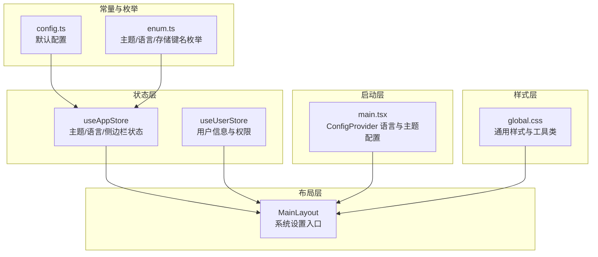
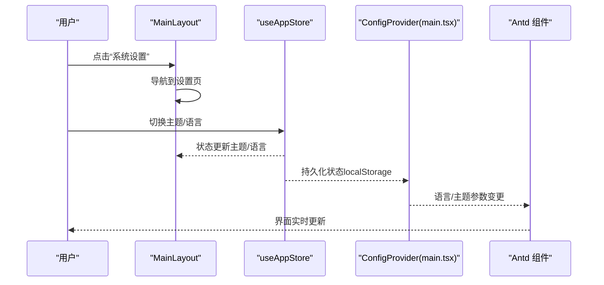
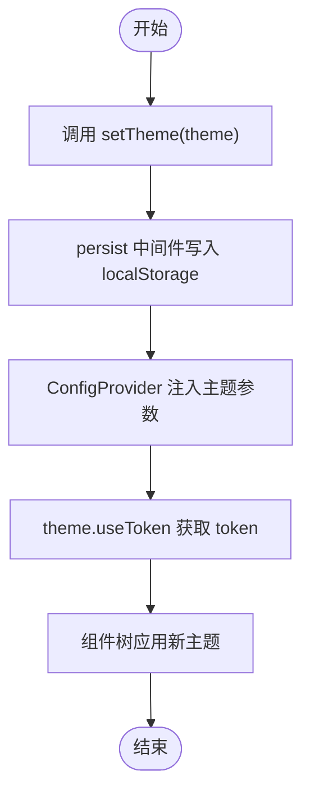
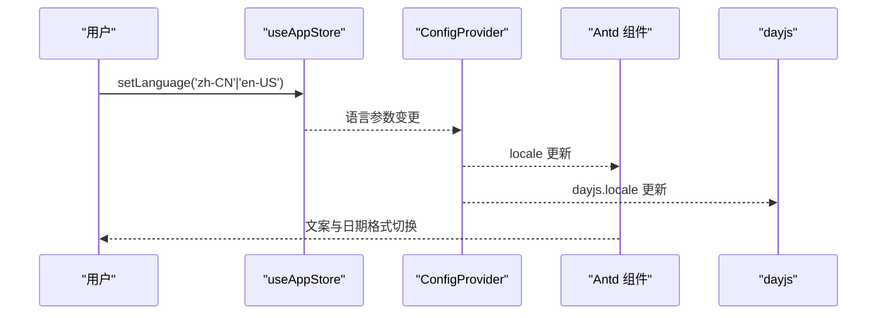
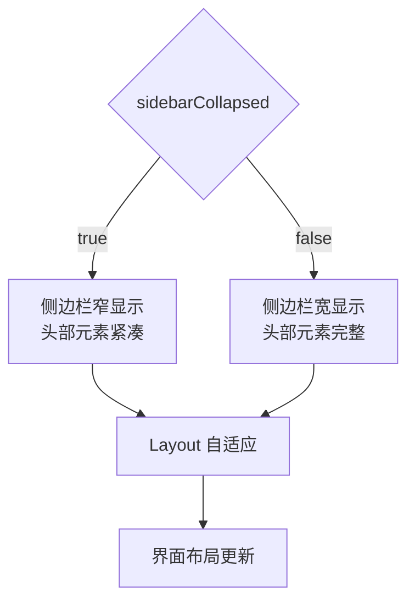
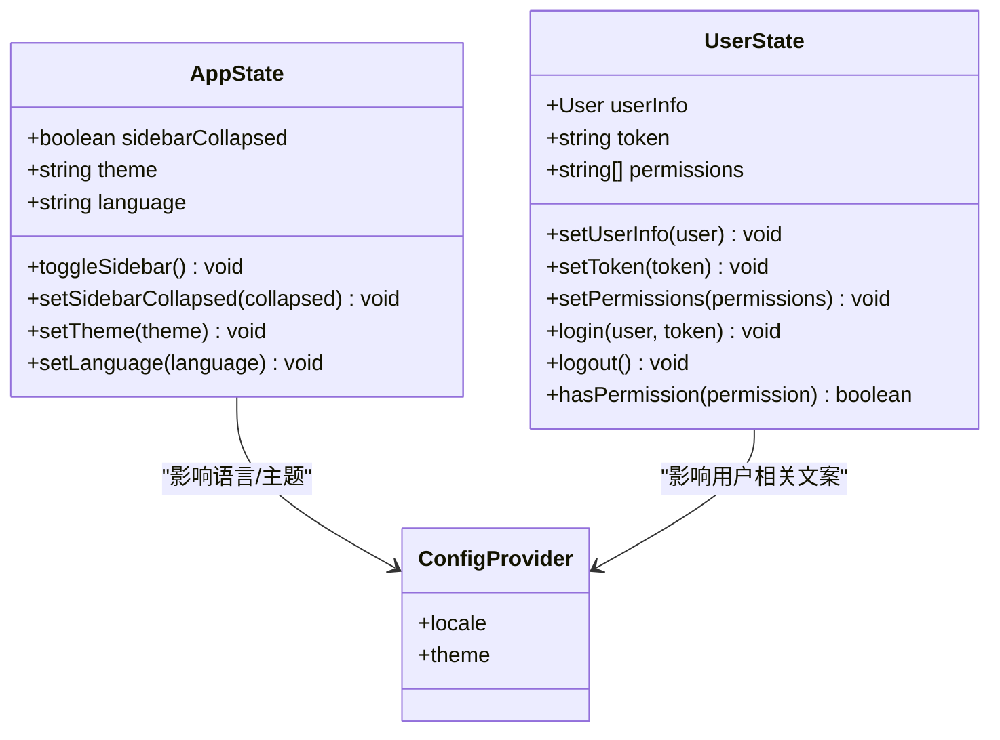
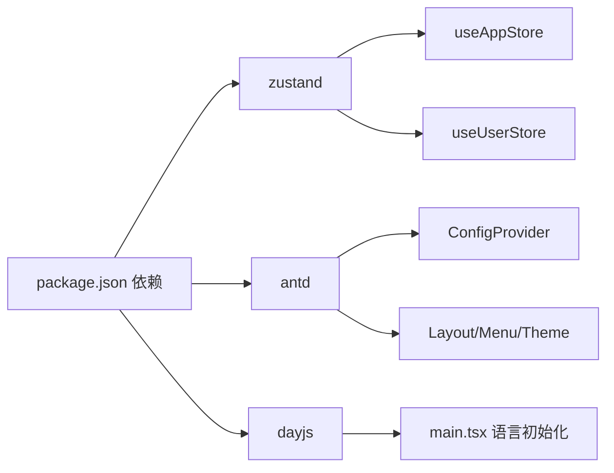

# 系统设置功能

<cite>
**本文档引用的文件**
- [src/stores/app.ts](file://src/stores/app.ts)
- [src/constants/config.ts](file://src/constants/config.ts)
- [src/constants/enum.ts](file://src/constants/enum.ts)
- [src/layouts/MainLayout.tsx](file://src/layouts/MainLayout.tsx)
- [src/styles/global.css](file://src/styles/global.css)
- [src/main.tsx](file://src/main.tsx)
- [package.json](file://package.json)
- [src/stores/index.ts](file://src/stores/index.ts)
- [src/stores/user.ts](file://src/stores/user.ts)
</cite>

## 目录

1. [简介](#简介)
2. [项目结构](#项目结构)
3. [核心组件](#核心组件)
4. [架构总览](#架构总览)
5. [详细组件分析](#详细组件分析)
6. [依赖关系分析](#依赖关系分析)
7. [性能考虑](#性能考虑)
8. [故障排除指南](#故障排除指南)
9. [结论](#结论)
10. [附录](#附录)

## 简介

本文件系统性梳理了本项目的系统设置功能，重点覆盖以下方面：

- 主题切换机制：主题配置、动态样式加载、状态同步与持久化
- 语言设置功能：多语言支持、本地化配置、界面切换
- 响应式布局设计：断点与自适应策略、移动端适配
- 整体架构：状态管理、配置持久化、实时生效机制
- 扩展指南：如何新增设置项与自定义功能

## 项目结构

系统设置功能主要分布在以下模块：

- 状态层：应用状态存储（主题、语言、侧边栏折叠状态）
- 布局层：主布局组件承载设置入口与交互
- 样式层：全局样式与工具类
- 启动层：应用初始化时的语言与主题配置
- 常量与枚举：默认值与可选值定义

**图表来源**

- [src/stores/app.ts](file://src/stores/app.ts#L1-L59)
- [src/stores/user.ts](file://src/stores/user.ts#L1-L75)
- [src/layouts/MainLayout.tsx](file://src/layouts/MainLayout.tsx#L1-L174)
- [src/styles/global.css](file://src/styles/global.css#L1-L82)
- [src/main.tsx](file://src/main.tsx#L1-L31)
- [src/constants/config.ts](file://src/constants/config.ts#L1-L76)
- [src/constants/enum.ts](file://src/constants/enum.ts#L1-L70)

**章节来源**

- [src/stores/app.ts](file://src/stores/app.ts#L1-L59)
- [src/layouts/MainLayout.tsx](file://src/layouts/MainLayout.tsx#L1-L174)
- [src/styles/global.css](file://src/styles/global.css#L1-L82)
- [src/main.tsx](file://src/main.tsx#L1-L31)
- [src/constants/config.ts](file://src/constants/config.ts#L1-L76)
- [src/constants/enum.ts](file://src/constants/enum.ts#L1-L70)

## 核心组件

- 应用状态存储（useAppStore）
  - 状态：sidebarCollapsed（侧边栏折叠）、theme（主题）、language（语言）
  - 动作：toggleSidebar、setSidebarCollapsed、setTheme、setLanguage
  - 持久化：使用 persist 中间件，仅持久化主题、语言、侧边栏状态
- 布局组件（MainLayout）
  - 提供“系统设置”入口，导航到设置页面
  - 使用 Ant Design 的 theme.useToken 获取主题变量，用于统一配色
- 启动配置（main.tsx）
  - 通过 ConfigProvider 设置默认语言与主题基础参数
  - 初始化 dayjs 语言环境
- 常量与枚举
  - config.ts：默认语言、默认主题、分页等应用级配置
  - enum.ts：主题模式、语言、存储键名等枚举定义

**章节来源**

- [src/stores/app.ts](file://src/stores/app.ts#L1-L59)
- [src/layouts/MainLayout.tsx](file://src/layouts/MainLayout.tsx#L1-L174)
- [src/main.tsx](file://src/main.tsx#L1-L31)
- [src/constants/config.ts](file://src/constants/config.ts#L1-L76)
- [src/constants/enum.ts](file://src/constants/enum.ts#L1-L70)

## 架构总览

系统设置采用“状态驱动 + 配置提供者”的架构：

- 状态驱动：useAppStore 管理主题与语言状态，并通过持久化确保刷新后仍保持
- 配置提供者：main.tsx 的 ConfigProvider 将语言与主题参数注入全局组件树
- 布局联动：MainLayout 读取状态并根据主题变量渲染统一风格

**图表来源**

- [src/layouts/MainLayout.tsx](file://src/layouts/MainLayout.tsx#L1-L174)
- [src/stores/app.ts](file://src/stores/app.ts#L1-L59)
- [src/main.tsx](file://src/main.tsx#L1-L31)

## 详细组件分析

### 主题切换机制

- 主题配置
  - 枚举定义：Light/Dark/Auto（enum.ts）
  - 默认值：Light（config.ts）
  - 状态存储：useAppStore.setTheme 更新主题状态
- 动态样式加载
  - Ant Design 通过 ConfigProvider 的 theme 属性提供主题参数
  - 布局组件使用 theme.useToken 获取 token，实现统一配色
- 状态同步与持久化
  - persist 中间件将主题状态持久化至 localStorage
  - 页面刷新后自动恢复主题

**图表来源**

- [src/stores/app.ts](file://src/stores/app.ts#L1-L59)
- [src/constants/enum.ts](file://src/constants/enum.ts#L30-L37)
- [src/constants/config.ts](file://src/constants/config.ts#L13-L18)
- [src/main.tsx](file://src/main.tsx#L19-L27)

**章节来源**

- [src/stores/app.ts](file://src/stores/app.ts#L1-L59)
- [src/constants/enum.ts](file://src/constants/enum.ts#L30-L37)
- [src/constants/config.ts](file://src/constants/config.ts#L13-L18)
- [src/main.tsx](file://src/main.tsx#L19-L27)

### 语言设置功能

- 多语言支持
  - Ant Design 提供 zhCN/enUS 语言包
  - ConfigProvider 的 locale 属性控制全局语言
  - dayjs.locale 初始化日期本地化
- 本地化配置
  - 默认语言：config.ts.defaultLanguage
  - 枚举：Language.ZhCN/EnUS（enum.ts）
- 界面切换
  - useAppStore.setLanguage 更新语言状态
  - ConfigProvider 实时生效，界面文本与日期格式随之变化

**图表来源**

- [src/stores/app.ts](file://src/stores/app.ts#L1-L59)
- [src/main.tsx](file://src/main.tsx#L3-L15)
- [src/constants/config.ts](file://src/constants/config.ts#L13-L14)
- [src/constants/enum.ts](file://src/constants/enum.ts#L40-L45)

**章节来源**

- [src/stores/app.ts](file://src/stores/app.ts#L1-L59)
- [src/main.tsx](file://src/main.tsx#L3-L15)
- [src/constants/config.ts](file://src/constants/config.ts#L13-L14)
- [src/constants/enum.ts](file://src/constants/enum.ts#L40-L45)

### 响应式布局设计

- 断点与自适应策略
  - 使用 Ant Design Layout 组件实现侧边栏折叠与内容区域自适应
  - MainLayout 根据 sidebarCollapsed 控制侧边栏宽度与头部元素显示
- 移动端适配
  - 全局样式提供 flex 工具类与尺寸工具类，便于在小屏设备上快速排版
  - 建议在业务组件中结合媒体查询或 Antd 响应式断点进行进一步优化

**图表来源**

- [src/layouts/MainLayout.tsx](file://src/layouts/MainLayout.tsx#L73-L105)
- [src/styles/global.css](file://src/styles/global.css#L36-L82)

**章节来源**

- [src/layouts/MainLayout.tsx](file://src/layouts/MainLayout.tsx#L73-L105)
- [src/styles/global.css](file://src/styles/global.css#L36-L82)

### 状态管理与持久化

- 状态模型
  - 应用状态：sidebarCollapsed、theme、language
  - 用户状态：userInfo、token、permissions
- 持久化策略
  - useAppStore：仅持久化主题、语言、侧边栏状态
  - useUserStore：持久化 token 与 userInfo
- 实时生效
  - ConfigProvider 与 theme.useToken 使语言与主题变更即时反映到组件树

**图表来源**

- [src/stores/app.ts](file://src/stores/app.ts#L5-L16)
- [src/stores/user.ts](file://src/stores/user.ts#L6-L19)
- [src/main.tsx](file://src/main.tsx#L19-L27)

**章节来源**

- [src/stores/app.ts](file://src/stores/app.ts#L1-L59)
- [src/stores/user.ts](file://src/stores/user.ts#L1-L75)
- [src/main.tsx](file://src/main.tsx#L19-L27)

## 依赖关系分析

- 关键依赖
  - Zustand：状态管理（useAppStore、useUserStore）
  - Ant Design：UI 组件与 ConfigProvider、主题系统
  - dayjs：本地化日期处理
- 内部依赖
  - stores/index.ts 统一导出 store，便于组件按需引入
  - enum.ts 为配置与状态提供类型安全的枚举值

**图表来源**

- [package.json](file://package.json#L20-L36)
- [src/stores/app.ts](file://src/stores/app.ts#L1-L3)
- [src/stores/user.ts](file://src/stores/user.ts#L1-L4)
- [src/main.tsx](file://src/main.tsx#L1-L10)

**章节来源**

- [package.json](file://package.json#L20-L36)
- [src/stores/index.ts](file://src/stores/index.ts#L1-L3)

## 性能考虑

- 状态粒度控制：仅持久化必要字段，减少存储与序列化开销
- 组件渲染优化：通过 theme.useToken 获取 token，避免不必要的重渲染
- 语言切换成本：ConfigProvider 的 locale 切换为全局生效，建议在设置页集中处理，避免频繁切换

## 故障排除指南

- 语言未生效
  - 检查 ConfigProvider 的 locale 是否正确传入
  - 确认 dayjs.locale 已初始化
- 主题不生效
  - 确认 theme.useToken 在组件中使用
  - 检查 ConfigProvider 的 theme 参数是否正确
- 设置项未持久化
  - 确认 persist 中间件已启用且字段在 partialize 中包含
  - 检查浏览器 localStorage 权限

**章节来源**

- [src/main.tsx](file://src/main.tsx#L19-L27)
- [src/stores/app.ts](file://src/stores/app.ts#L49-L57)

## 结论

本项目的系统设置功能以轻量、清晰的方式实现了主题与语言的动态切换，并通过 ConfigProvider 与 Zustand 状态管理形成闭环。整体架构具备良好的扩展性，便于后续新增设置项与自定义功能。

## 附录

### 配置示例与扩展指南

- 新增主题模式
  - 在枚举中添加新值（如 Auto），并在状态存储中扩展 setTheme 的处理逻辑
  - 在 ConfigProvider 中根据新模式计算实际主题参数
- 新增语言
  - 引入新的语言包并加入 ConfigProvider 的 locale
  - 在枚举与默认配置中添加新语言值
- 新增设置项
  - 在 useAppStore 中添加状态字段与对应动作
  - 在持久化配置中包含新字段
  - 在设置页面中提供 UI 控件并绑定到对应动作

**章节来源**

- [src/constants/enum.ts](file://src/constants/enum.ts#L30-L45)
- [src/constants/config.ts](file://src/constants/config.ts#L13-L18)
- [src/stores/app.ts](file://src/stores/app.ts#L5-L16)
- [src/stores/app.ts](file://src/stores/app.ts#L49-L57)
- [src/main.tsx](file://src/main.tsx#L19-L27)
