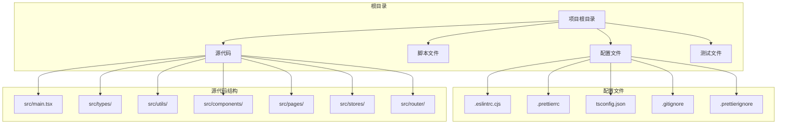
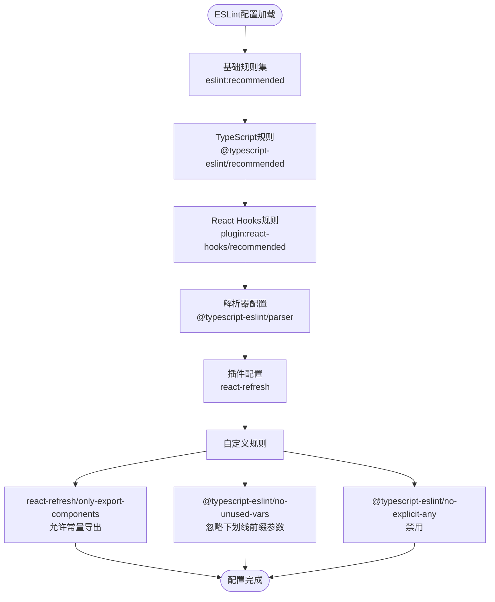
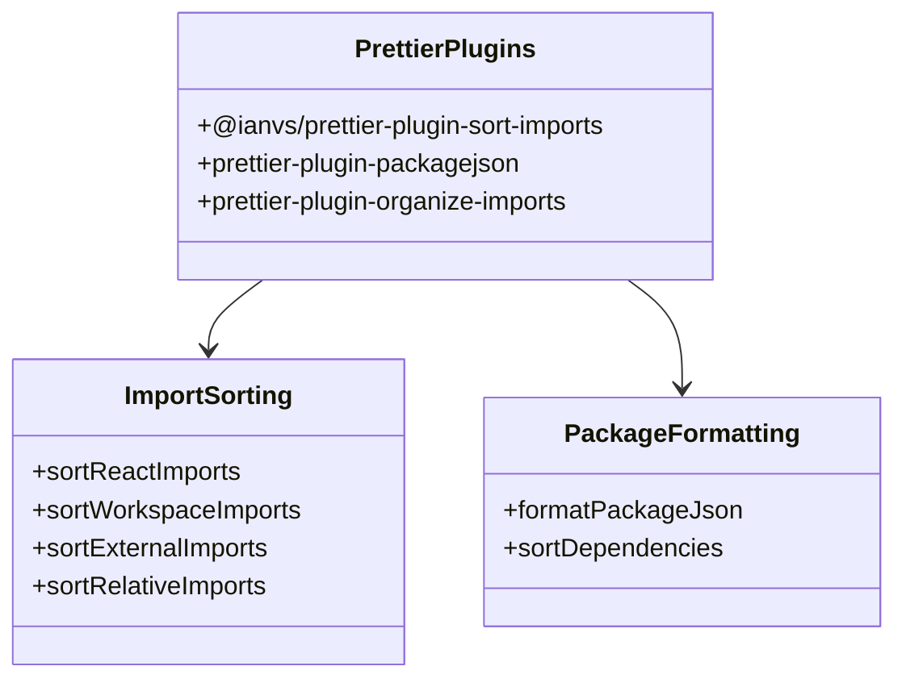
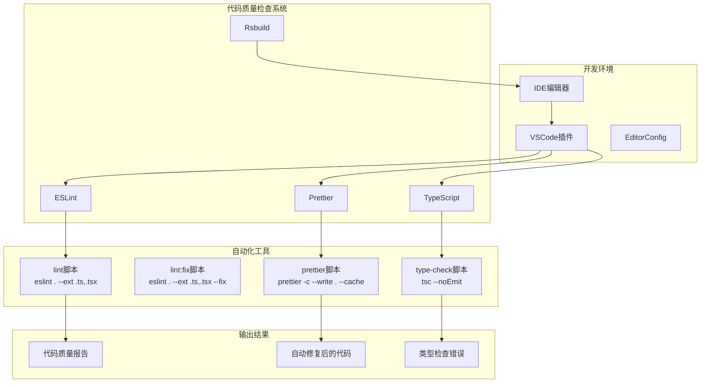
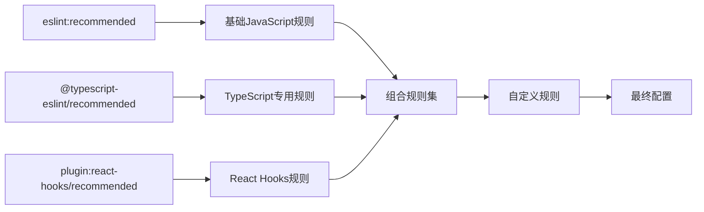
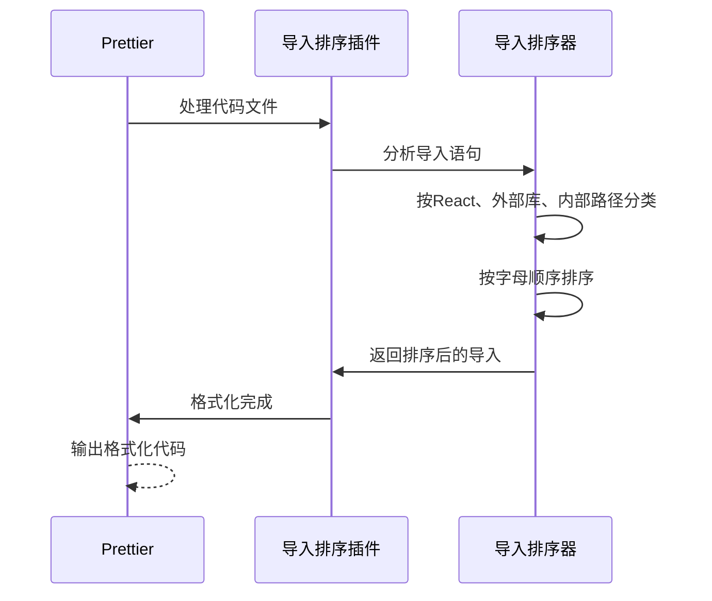
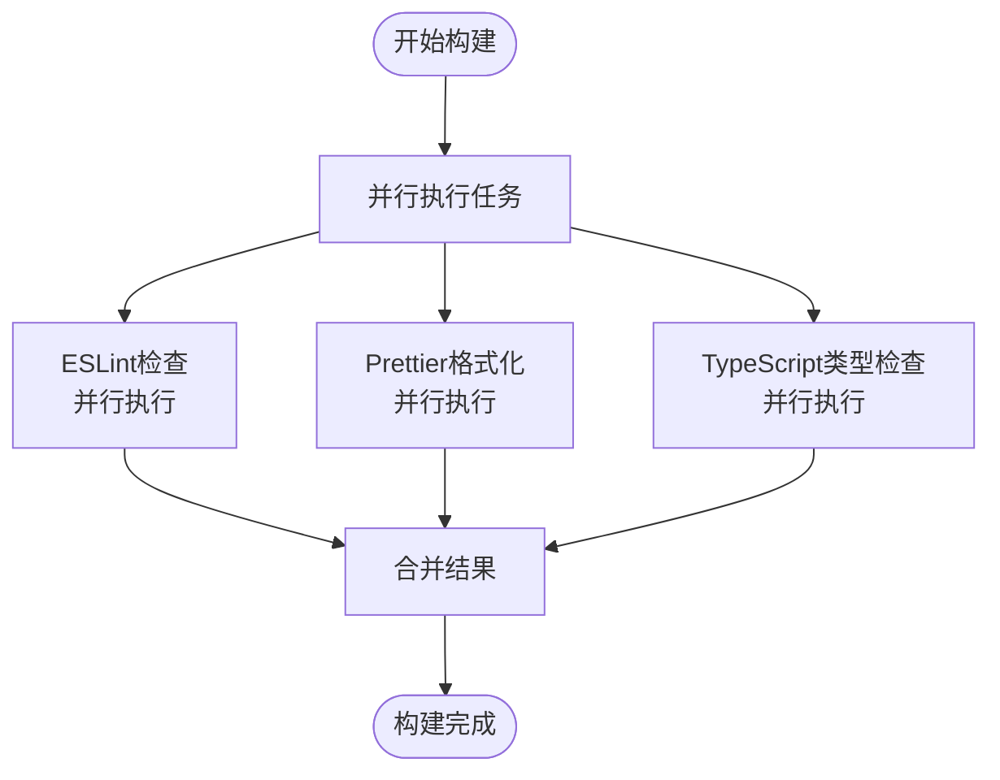

# 代码质量检查

<cite>
**本文档引用的文件**
- [.eslintrc.cjs](file://.eslintrc.cjs)
- [.prettierrc](file://.prettierrc)
- [.prettierignore](file://.prettierignore)
- [tsconfig.json](file://tsconfig.json)
- [package.json](file://package.json)
- [rsbuild.config.ts](file://rsbuild.config.ts)
- [.gitignore](file://.gitignore)
- [src/main.tsx](file://src/main.tsx)
- [src/types/index.ts](file://src/types/index.ts)
- [src/utils/index.ts](file://src/utils/index.ts)
- [.ai/core/coding-standards.md](file://.ai/core/coding-standards.md)
</cite>

## 目录

1. [简介](#简介)
2. [项目结构](#项目结构)
3. [核心组件](#核心组件)
4. [架构概览](#架构概览)
5. [详细组件分析](#详细组件分析)
6. [依赖关系分析](#依赖关系分析)
7. [性能考虑](#性能考虑)
8. [故障排除指南](#故障排除指南)
9. [结论](#结论)
10. [附录](#附录)

## 简介

本项目采用现代化的前端代码质量检查体系，集成了ESLint、Prettier和TypeScript类型检查，构建了完整的代码质量保障机制。该体系支持React Hooks规则、TypeScript严格模式、自动导入排序、包文件格式化等功能，为团队提供了统一的代码标准和质量保证体系。

项目基于React 18、TypeScript 5.5和Rsbuild构建工具，采用模块化架构设计，通过脚本命令实现了本地检查、CI/CD集成和自动化修复的完整工作流程。

## 项目结构

项目采用清晰的分层架构，主要目录结构如下：



**图表来源**

- [package.json](file://package.json#L1-L81)
- [tsconfig.json](file://tsconfig.json#L1-L24)
- [rsbuild.config.ts](file://rsbuild.config.ts#L1-L30)

**章节来源**

- [package.json](file://package.json#L1-L81)
- [tsconfig.json](file://tsconfig.json#L1-L24)
- [rsbuild.config.ts](file://rsbuild.config.ts#L1-L30)

## 核心组件

### ESLint配置系统

项目使用ESLint作为主要的代码质量检查工具，配置文件位于根目录的`.eslintrc.cjs`中。该配置继承了多个推荐规则集，并针对React和TypeScript进行了专门优化。

#### 主要配置特点

- **基础环境**: 浏览器环境和ES2020标准
- **扩展规则集**:
  - eslint:recommended - ESLint官方推荐规则
  - @typescript-eslint/recommended - TypeScript专用规则
  - plugin:react-hooks/recommended - React Hooks规则
- **解析器**: @typescript-eslint/parser - 支持TypeScript语法
- **插件**: react-refresh - 支持热更新组件检测

#### 规则定制

项目对部分规则进行了定制化配置：



**图表来源**

- [.eslintrc.cjs](file://.eslintrc.cjs#L1-L21)

**章节来源**

- [.eslintrc.cjs](file://.eslintrc.cjs#L1-L21)

### Prettier格式化系统

Prettier作为代码格式化工具，配置文件位于`.prettierrc`中，提供了统一的代码风格标准。

#### 格式化规则配置

- **打印宽度**: 80字符
- **单引号**: 启用
- **尾随逗号**: 全部启用
- **Prose Wrap**: 根据文件类型智能处理

#### 插件功能

项目集成了多个Prettier插件：



**图表来源**

- [.prettierrc](file://.prettierrc#L1-L22)

**章节来源**

- [.prettierrc](file://.prettierrc#L1-L22)

### TypeScript类型检查系统

TypeScript配置文件位于`tsconfig.json`中，采用了严格的类型检查策略。

#### 编译选项

- **目标版本**: ES2022
- **模块系统**: ESNext
- **严格模式**: 完全启用
- **路径映射**: @/_ -> src/_

#### 严格性规则

项目启用了多项严格性检查：

- noUnusedLocals - 未使用局部变量
- noUnusedParameters - 未使用参数
- noFallthroughCasesInSwitch - switch遗漏case

**章节来源**

- [tsconfig.json](file://tsconfig.json#L1-L24)

## 架构概览

项目构建了一个完整的代码质量检查生态系统，各组件协同工作：



**图表来源**

- [package.json](file://package.json#L6-L18)
- [.eslintrc.cjs](file://.eslintrc.cjs#L1-L21)
- [.prettierrc](file://.prettierrc#L1-L22)
- [tsconfig.json](file://tsconfig.json#L1-L24)

## 详细组件分析

### ESLint规则配置详解

#### 规则继承体系

项目采用多层规则继承策略：



**图表来源**

- [.eslintrc.cjs](file://.eslintrc.cjs#L4-L8)

#### 自定义规则分析

项目实施了以下关键自定义规则：

1. **react-refresh/only-export-components**: 允许常量导出，提高开发体验
2. **@typescript-eslint/no-explicit-any**: 禁用any类型，确保类型安全
3. **@typescript-eslint/no-unused-vars**: 忽略下划线前缀的未使用参数

**章节来源**

- [.eslintrc.cjs](file://.eslintrc.cjs#L12-L19)

### Prettier插件系统

#### 导入排序插件

@ianvs/prettier-plugin-sort-imports提供了智能的导入排序功能：



**图表来源**

- [.prettierrc](file://.prettierrc#L3-L7)

**章节来源**

- [.prettierrc](file://.prettierrc#L1-L22)

### TypeScript配置优化

#### 路径映射配置

项目使用了灵活的路径映射系统：

```mermaid
graph LR
Config[tsconfig.json] --> PathMapping[路径映射配置]
PathMapping --> AtAlias[@/* -> src/*]
AtAlias --> ModuleResolution[模块解析]
ModuleResolution --> Bundler[bundler]
ModuleResolution --> AllowExtensions[允许TS扩展]
ModuleResolution --> ResolveJson[JSON模块解析]
Bundler --> IsolatedModules[隔离模块]
AllowExtensions --> NoEmit[无输出编译]
ResolveJson --> JSX[JSX支持]
```

**图表来源**

- [tsconfig.json](file://tsconfig.json#L18-L21)

**章节来源**

- [tsconfig.json](file://tsconfig.json#L1-L24)

## 依赖关系分析

项目依赖关系呈现清晰的层次结构：

```mermaid
graph TB
subgraph "运行时依赖"
React[react: ^18.3.0]
ReactDOM[react-dom: ^18.3.0]
Antd[antd: ^5.29.3]
Axios[axios: ^1.7.0]
Zustand[zustand: ^5.0.11]
end
subgraph "开发时依赖"
ESLint[eslint: ^10.0.3]
TSParser[@typescript-eslint/parser: ^8.0.0]
TSPlugin[@typescript-eslint/eslint-plugin: ^8.0.0]
HooksPlugin[eslint-plugin-react-hooks: ^7.0.1]
RefreshPlugin[eslint-plugin-react-refresh: ^0.5.2]
Prettier[prettier: ^3.8.1]
SortImports[@ianvs/prettier-plugin-sort-imports: ^4.7.1]
PackageJson[prettier-plugin-packagejson: ^3.0.0]
Rsbuild[@rsbuild/core: ^1.7.0]
RsbuildReact[@rsbuild/plugin-react: ^1.3.0]
TypeScript[typescript: ^5.5.0]
end
subgraph "构建工具"
Rsbuild --> React
Rsbuild --> TypeScript
Rsbuild --> Prettier
end
ESLint --> TSParser
ESLint --> TSPlugin
ESLint --> HooksPlugin
ESLint --> RefreshPlugin
Prettier --> SortImports
Prettier --> PackageJson
```

**图表来源**

- [package.json](file://package.json#L20-L56)

**章节来源**

- [package.json](file://package.json#L1-L81)

## 性能考虑

### 缓存机制

项目充分利用了各种缓存机制来提升性能：

1. **ESLint缓存**: 通过`.eslintcache`文件缓存检查结果
2. **Prettier缓存**: 使用`--cache`标志减少重复格式化
3. **TypeScript增量编译**: 利用TypeScript的增量编译特性

### 并行处理

构建系统支持并行处理多个任务：



## 故障排除指南

### 常见问题及解决方案

#### ESLint配置问题

**问题**: 规则冲突或配置不生效
**解决方案**:

1. 检查`.eslintrc.cjs`中的规则继承顺序
2. 确认插件版本兼容性
3. 验证解析器配置正确性

#### Prettier格式化问题

**问题**: 导入排序不符合预期
**解决方案**:

1. 检查`.prettierrc`中的导入排序配置
2. 验证插件安装和版本
3. 确认文件路径映射正确

#### TypeScript类型检查问题

**问题**: 类型检查报错或性能问题
**解决方案**:

1. 检查`tsconfig.json`中的严格性配置
2. 验证路径映射设置
3. 确认模块解析配置

**章节来源**

- [.gitignore](file://.gitignore#L42-L43)
- [.prettierignore](file://.prettierignore#L1-L3)

## 结论

该项目构建了一个完善的代码质量检查体系，通过ESLint、Prettier和TypeScript的有机结合，实现了：

1. **统一的代码标准**: 通过配置文件确保团队代码风格一致性
2. **自动化质量控制**: 本地检查和CI/CD集成确保代码质量
3. **开发体验优化**: 自动修复和热更新支持提升开发效率
4. **可扩展性**: 模块化配置便于后续扩展和维护

该体系为团队建立了可靠的质量保证机制，有助于长期维护和团队协作。

## 附录

### 配置最佳实践

#### ESLint配置建议

1. **规则优先级**: 基础规则优先，然后是TypeScript规则，最后是自定义规则
2. **插件管理**: 定期更新插件版本，确保兼容性和安全性
3. **性能优化**: 启用缓存机制，避免重复检查

#### Prettier配置建议

1. **格式化策略**: 保持统一的格式化规则，避免团队分歧
2. **插件选择**: 根据项目需求选择合适的插件组合
3. **文件忽略**: 合理配置忽略文件，避免不必要的格式化

#### TypeScript配置建议

1. **严格性**: 建议保持严格模式，确保类型安全
2. **路径映射**: 使用合理的路径映射简化导入语句
3. **模块解析**: 选择适合项目的模块解析策略

### 工作流程建议

1. **本地开发**: 使用ESLint和Prettier进行实时检查和格式化
2. **提交前检查**: 在提交前运行完整的代码质量检查
3. **CI/CD集成**: 在持续集成中自动执行代码质量检查
4. **定期维护**: 定期更新依赖和配置，保持技术栈先进性
