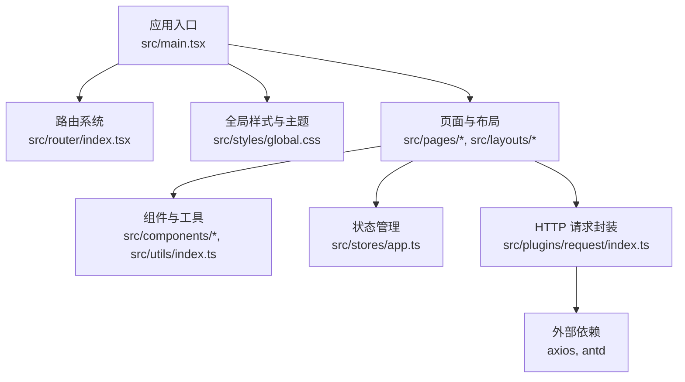
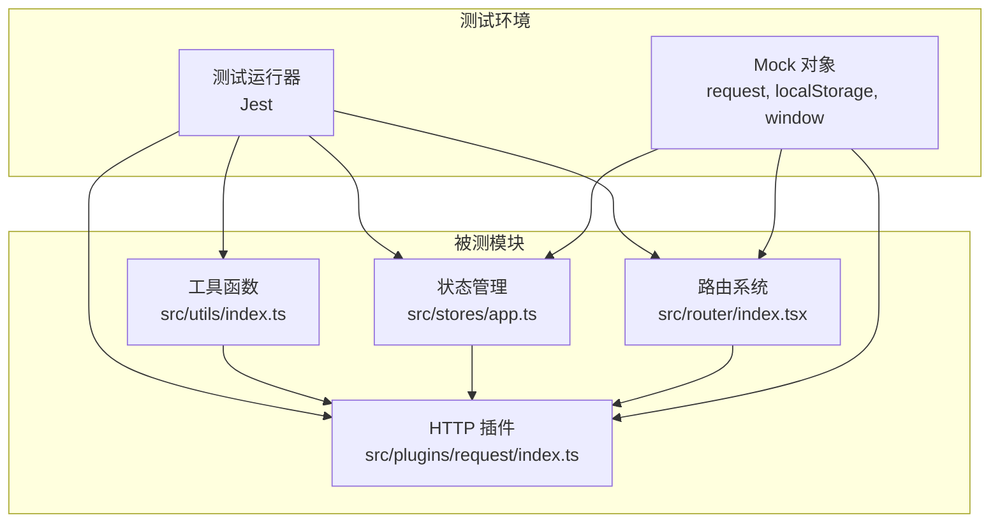
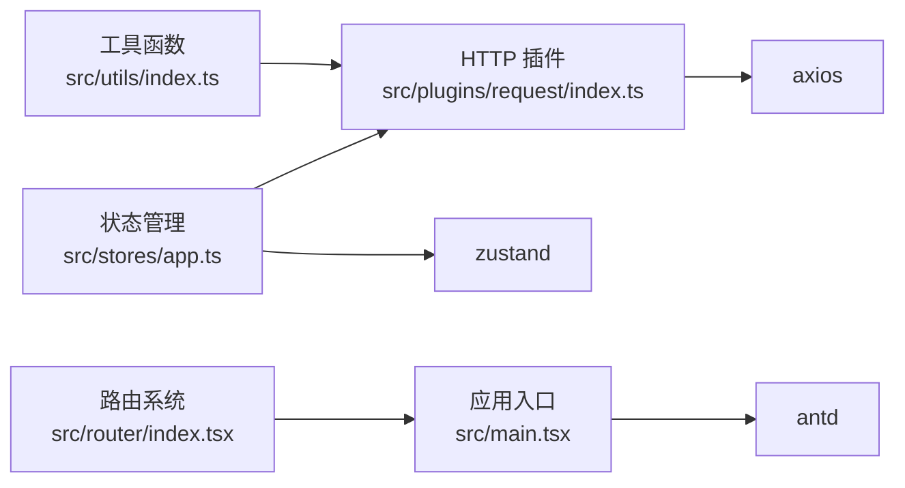

# 单元测试

<cite>
**本文引用的文件**
- [package.json](file://package.json)
- [tsconfig.json](file://tsconfig.json)
- [.eslintrc.cjs](file://.eslintrc.cjs)
- [src/main.tsx](file://src/main.tsx)
- [src/router/index.tsx](file://src/router/index.tsx)
- [src/plugins/request/index.ts](file://src/plugins/request/index.ts)
- [src/stores/app.ts](file://src/stores/app.ts)
- [src/utils/index.ts](file://src/utils/index.ts)
- [mock/db.json](file://mock/db.json)
- [mock/routes.json](file://mock/routes.json)
</cite>

## 目录

1. [引言](#引言)
2. [项目结构](#项目结构)
3. [核心组件](#核心组件)
4. [架构总览](#架构总览)
5. [详细组件分析](#详细组件分析)
6. [依赖分析](#依赖分析)
7. [性能考虑](#性能考虑)
8. [故障排查指南](#故障排查指南)
9. [结论](#结论)
10. [附录](#附录)

## 引言

本指南面向在 React + TypeScript 项目中落地单元测试的团队与个人，目标是帮助你从零搭建测试环境（含 Jest 配置建议）、建立测试文件组织与命名规范、编写组件、自定义 Hooks、工具函数的测试用例，并掌握 Mock 策略（API、状态管理、路由等），覆盖异步逻辑、错误处理与渲染场景。同时给出覆盖率要求与报告生成建议，以保障代码质量与测试完整性。

## 项目结构

本项目采用模块化目录划分，前端入口通过 RouterProvider 注入路由；数据访问通过 axios 封装的 request 工具；状态管理采用 Zustand；工具函数集中在 utils；路由与插件位于 router 与 plugins 目录。这些模块构成了单元测试的主要对象与边界。

图表来源

- [src/main.tsx](file://src/main.tsx#L1-L32)
- [src/router/index.tsx](file://src/router/index.tsx#L1-L9)
- [src/plugins/request/index.ts](file://src/plugins/request/index.ts#L1-L114)
- [src/stores/app.ts](file://src/stores/app.ts#L1-L59)
- [src/utils/index.ts](file://src/utils/index.ts#L1-L106)

章节来源

- [src/main.tsx](file://src/main.tsx#L1-L32)
- [src/router/index.tsx](file://src/router/index.tsx#L1-L9)

## 核心组件

- 应用入口与渲染：负责挂载 RouterProvider 并注入全局主题与语言配置，是测试渲染树的根节点。
- 路由系统：集中导出路由配置与浏览器路由实例，便于在测试中替换或注入。
- HTTP 请求封装：统一处理鉴权头、响应拦截与错误提示，是测试中重点 Mock 的对象。
- 状态管理（Zustand）：包含主题、语言、侧边栏折叠等状态，适合纯函数式测试。
- 工具函数：日期格式化、金额/数字格式化、防抖/节流、深拷贝、下载等，适合纯函数测试。

章节来源

- [src/main.tsx](file://src/main.tsx#L1-L32)
- [src/router/index.tsx](file://src/router/index.tsx#L1-L9)
- [src/plugins/request/index.ts](file://src/plugins/request/index.ts#L1-L114)
- [src/stores/app.ts](file://src/stores/app.ts#L1-L59)
- [src/utils/index.ts](file://src/utils/index.ts#L1-L106)

## 架构总览

下图展示了测试视角下的关键交互：组件/工具函数通过 request 发起网络请求，Zustand 提供状态，路由系统控制页面切换，Ant Design 提供 UI 与消息提示。

图表来源

- [src/plugins/request/index.ts](file://src/plugins/request/index.ts#L1-L114)
- [src/stores/app.ts](file://src/stores/app.ts#L1-L59)
- [src/router/index.tsx](file://src/router/index.tsx#L1-L9)
- [src/utils/index.ts](file://src/utils/index.ts#L1-L106)

## 详细组件分析

### 测试环境搭建与配置（Jest + TypeScript）

- 安装与脚本
  - 建议新增测试脚本与命令，如 test、test:watch、test:coverage 等，结合覆盖率阈值与报告输出。
  - 可参考现有构建脚本与类型检查脚本进行组合。
- TypeScript 支持
  - 使用 tsconfig.json 中的路径别名与严格模式，确保测试文件可正确解析与编译。
- 依赖准备
  - 基于现有 package.json 中的依赖，补充测试相关依赖（如 @testing-library/react、jest、@types/jest、ts-jest 等）。
- Mock 数据与本地服务
  - 项目已提供 mock/db.json 与 mock/routes.json，可用于本地 API 模拟与路由重写，测试时可启动 json-server 作为后端 Mock。

章节来源

- [package.json](file://package.json#L1-L81)
- [tsconfig.json](file://tsconfig.json#L1-L24)
- [mock/db.json](file://mock/db.json)
- [mock/routes.json](file://mock/routes.json)

### 测试文件组织与命名约定

- 目录结构
  - 在各模块目录下新增 **tests** 或 tests 子目录，按“被测文件同级”的原则组织，便于维护与查找。
- 命名约定
  - 被测文件与测试文件一一对应，例如 utils/index.ts 对应 utils/**tests**/index.test.ts。
  - 测试文件统一以 .test.ts 结尾，避免与源码混淆。
- 导入路径
  - 使用与 tsconfig.json 中一致的路径别名，保证测试导入与生产代码一致。

章节来源

- [tsconfig.json](file://tsconfig.json#L17-L20)

### 组件测试（渲染、交互、状态）

- 渲染断言
  - 使用测试运行器提供的渲染能力，断言组件是否渲染、文本内容、属性是否存在。
- 事件触发
  - 模拟用户交互（点击、输入等），断言回调是否被调用、状态是否更新。
- 外部依赖隔离
  - 对 request、localStorage、window 等进行 Mock，确保测试稳定且可重复。
- 示例场景
  - 登录页渲染与提交流程（含表单校验、错误提示）。
  - 主题切换按钮触发状态变化（Zustand）。
  - 金额/日期格式化组件渲染与文案断言。

章节来源

- [src/main.tsx](file://src/main.tsx#L1-L32)
- [src/plugins/request/index.ts](file://src/plugins/request/index.ts#L1-L114)
- [src/stores/app.ts](file://src/stores/app.ts#L1-L59)
- [src/utils/index.ts](file://src/utils/index.ts#L1-L106)

### 自定义 Hooks 测试

- 目标
  - 验证 Hooks 的状态、副作用、返回值与依赖变更行为。
- 方法
  - 使用测试运行器提供的渲染钩子，将被测组件包裹在测试环境中，断言 Hooks 行为。
  - 对外部依赖（如 request、定时器、全局对象）进行 Mock。
- 示例场景
  - useAppStore 的主题切换、语言设置、侧边栏折叠状态变更。
  - 与请求相关的自定义 Hooks（如基于 useRequest 的数据加载），验证加载态、成功态、错误态。

章节来源

- [src/stores/app.ts](file://src/stores/app.ts#L1-L59)

### 工具函数测试

- 目标
  - 验证格式化函数、防抖/节流、深拷贝、空值判断等纯函数的正确性。
- 方法
  - 输入不同边界值与异常值，断言输出与期望一致。
  - 对依赖的第三方库（如 dayjs）进行 Mock，避免时间相关测试不稳定。
- 示例场景
  - formatDate/formatDateTime 的多种输入与格式化结果。
  - formatMoney/formatNumber 的数值与分隔符断言。
  - debounce/throttle 的执行时机与调用次数断言。
  - deepClone 与 isEmpty 的行为验证。

章节来源

- [src/utils/index.ts](file://src/utils/index.ts#L1-L106)

### Mock 策略与最佳实践

- API Mock
  - 使用 jest.mock 或动态 Mock，替换 request 模块的默认导出，返回预设数据或抛出错误。
  - 对于真实后端，可启动 json-server（mock/db.json + mock/routes.json），在测试前启动、测试后关闭。
- 状态管理 Mock
  - 对 Zustand 的 store 进行替换或代理，注入测试专用的初始状态与行为。
- 路由 Mock
  - 在测试中注入内存历史或自定义路由上下文，避免真实 DOM 与浏览器 API 干扰。
- 全局对象 Mock
  - 对 localStorage、sessionStorage、window、navigator 等进行 Mock，确保跨平台一致性。

章节来源

- [src/plugins/request/index.ts](file://src/plugins/request/index.ts#L1-L114)
- [src/stores/app.ts](file://src/stores/app.ts#L1-L59)
- [mock/db.json](file://mock/db.json)
- [mock/routes.json](file://mock/routes.json)

### 异步逻辑与错误处理测试

- 异步逻辑
  - 使用 async/await 或测试运行器的等待断言，验证 Promise 链路、超时与取消行为。
- 错误处理
  - 模拟网络错误、401/403/404/500 等状态码，断言错误提示、状态回退与用户引导。
- 重试与降级
  - 验证重试机制与降级 UI，确保用户体验与数据一致性。

章节来源

- [src/plugins/request/index.ts](file://src/plugins/request/index.ts#L34-L76)

### 测试覆盖率与报告

- 覆盖率要求建议
  - 语句覆盖率、分支覆盖率、函数覆盖率、行覆盖率均建议不低于 80%，关键路径不低于 90%。
- 报告生成
  - 在测试脚本中启用覆盖率输出，生成 HTML/JSON 报告，集成到 CI/CD 流水线。
- 持续改进
  - 定期审查未覆盖的分支与边界条件，逐步提升覆盖率与质量。

## 依赖分析

- 组件耦合
  - 组件与 utils、stores、plugins 的耦合度适中，便于独立测试。
- 外部依赖
  - axios、antd、dayjs、zustand 等为测试中的主要 Mock 对象。
- 路由与渲染
  - RouterProvider 与 ConfigProvider 为测试渲染树的关键节点，需在测试中正确注入。

图表来源

- [src/utils/index.ts](file://src/utils/index.ts#L1-L106)
- [src/plugins/request/index.ts](file://src/plugins/request/index.ts#L1-L114)
- [src/stores/app.ts](file://src/stores/app.ts#L1-L59)
- [src/router/index.tsx](file://src/router/index.tsx#L1-L9)
- [src/main.tsx](file://src/main.tsx#L1-L32)

章节来源

- [src/plugins/request/index.ts](file://src/plugins/request/index.ts#L1-L114)
- [src/stores/app.ts](file://src/stores/app.ts#L1-L59)
- [src/router/index.tsx](file://src/router/index.tsx#L1-L9)
- [src/main.tsx](file://src/main.tsx#L1-L32)

## 性能考虑

- 测试执行速度
  - 合理拆分测试文件，避免单文件过大；对耗时的异步逻辑使用 Mock 与超时控制。
- 内存与副作用
  - 在测试前后清理定时器、事件监听器与全局状态，防止测试间相互影响。
- Mock 粒度
  - 对高频调用的依赖进行细粒度 Mock，减少真实 I/O 与网络请求。

## 故障排查指南

- 常见问题
  - 路径别名解析失败：检查 tsconfig.json 的 baseUrl 与 paths 是否与测试导入一致。
  - 请求拦截器导致断言失败：在测试中 Mock request 模块或清除拦截器。
  - 状态管理副作用：确保在测试中注入可控的 store 实例或使用测试专用初始化。
- 调试技巧
  - 使用测试运行器的调试模式，逐步定位断言失败点。
  - 输出中间状态与返回值，辅助定位逻辑分支问题。

章节来源

- [tsconfig.json](file://tsconfig.json#L17-L20)
- [src/plugins/request/index.ts](file://src/plugins/request/index.ts#L19-L32)
- [src/stores/app.ts](file://src/stores/app.ts#L18-L58)

## 结论

通过明确的测试环境搭建、规范化的文件组织与命名、完善的 Mock 策略以及对异步与错误处理的覆盖，可以在本项目中建立起高质量的单元测试体系。建议持续完善覆盖率与报告机制，并将测试纳入日常开发流程，以保障代码质量与可维护性。

## 附录

- 本地 Mock 服务
  - 项目提供 mock/db.json 与 mock/routes.json，可在测试前启动 json-server 作为后端 Mock。
- 类型与规则
  - 项目使用 TypeScript 严格模式与 ESLint 规则，测试文件同样建议遵循相同风格与规则。

章节来源

- [mock/db.json](file://mock/db.json)
- [mock/routes.json](file://mock/routes.json)
- [.eslintrc.cjs](file://.eslintrc.cjs#L1-L20)
