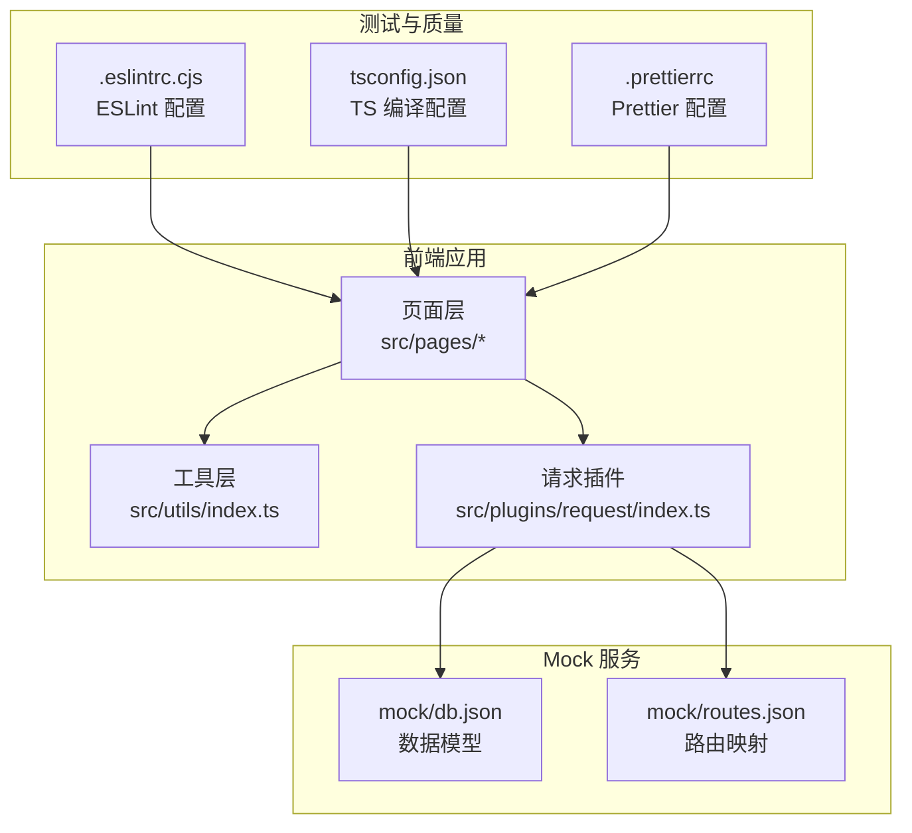
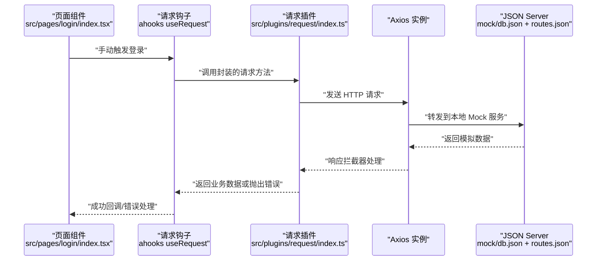
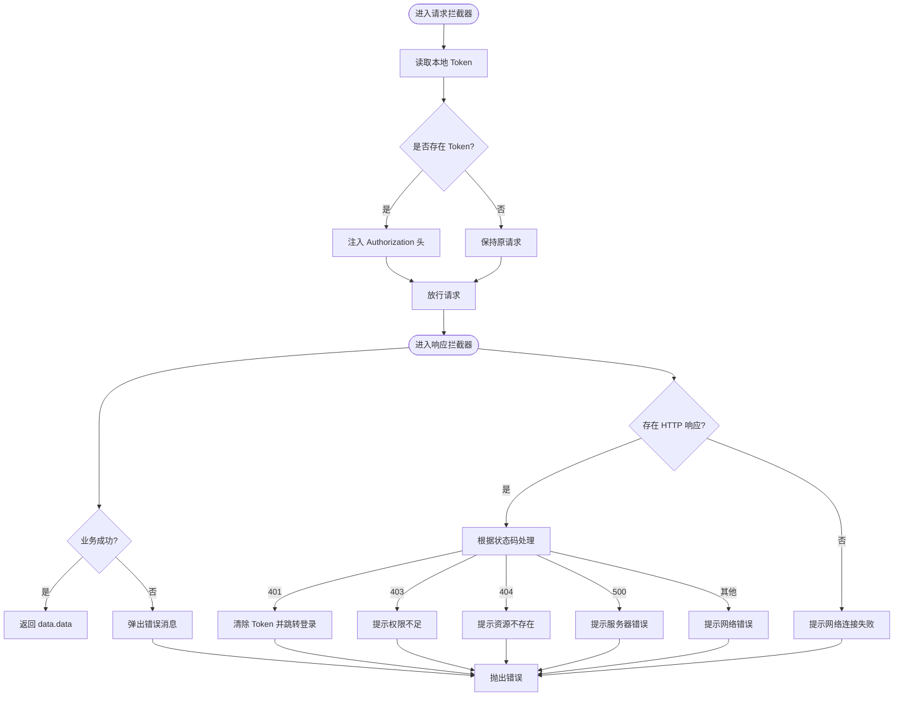
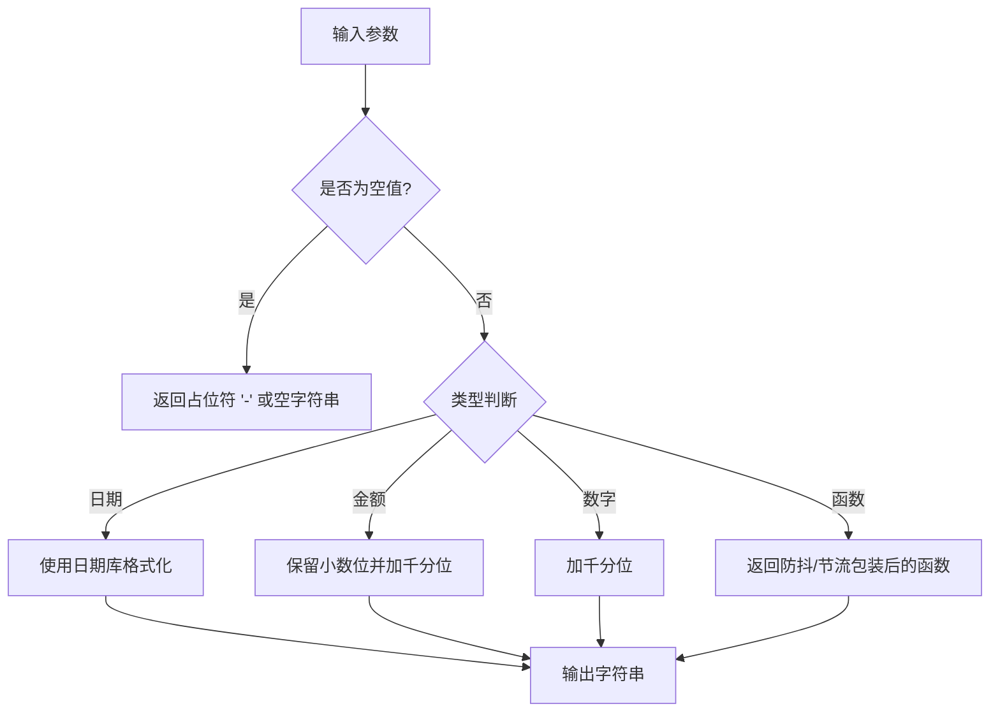
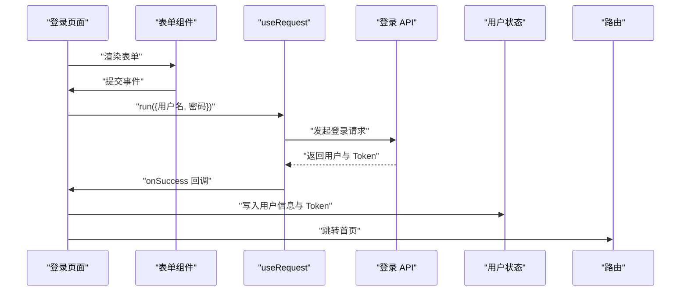
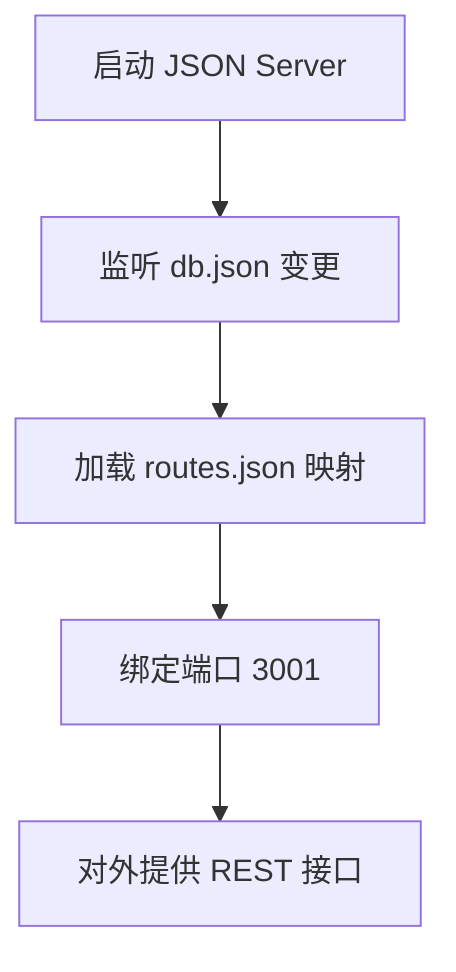
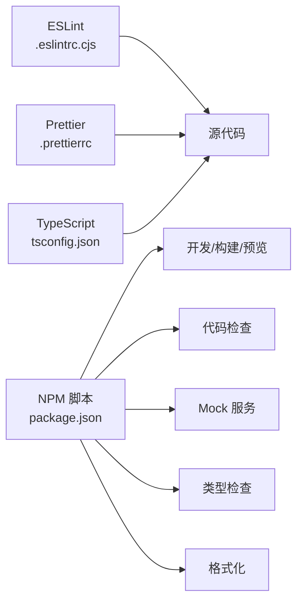

# 测试与调试

<cite>
**本文引用的文件**
- [package.json](file://package.json)
- [.eslintrc.cjs](file://.eslintrc.cjs)
- [.prettierrc](file://.prettierrc)
- [tsconfig.json](file://tsconfig.json)
- [mock/db.json](file://mock/db.json)
- [mock/routes.json](file://mock/routes.json)
- [src/plugins/request/index.ts](file://src/plugins/request/index.ts)
- [src/utils/index.ts](file://src/utils/index.ts)
- [src/pages/login/index.tsx](file://src/pages/login/index.tsx)
</cite>

## 目录

1. [引言](#引言)
2. [项目结构](#项目结构)
3. [核心组件](#核心组件)
4. [架构总览](#架构总览)
5. [详细组件分析](#详细组件分析)
6. [依赖分析](#依赖分析)
7. [性能考虑](#性能考虑)
8. [故障排查指南](#故障排查指南)
9. [结论](#结论)
10. [附录](#附录)

## 引言

本指南面向本项目的测试与调试工作，围绕以下目标展开：

- 单元测试与集成测试的编写方法与最佳实践
- Jest 配置与测试用例设计思路
- Mock 数据服务在测试中的应用与数据模拟策略
- 调试技巧与工具使用（浏览器开发者工具、React DevTools、网络请求调试）
- 代码质量检查（ESLint 规则、Prettier 格式化、TypeScript 类型检查）的配置与使用
- 提供可落地的测试示例与调试案例，帮助团队建立完善的测试与调试工作流程

## 项目结构

本项目采用模块化与分层架构：

- 插件层：统一的请求封装与拦截器逻辑
- 工具层：通用工具函数（日期、防抖节流、深拷贝等）
- 页面层：业务页面（如登录页），演示了手动触发请求与状态更新
- Mock 层：本地 JSON Server 模拟后端接口，支持路由映射与数据持久化
- 质量保障：ESLint、Prettier、TypeScript 编译配置

**图示来源**

- [src/plugins/request/index.ts](file://src/plugins/request/index.ts#L1-L114)
- [src/utils/index.ts](file://src/utils/index.ts#L1-L106)
- [mock/db.json](file://mock/db.json#L1-L140)
- [mock/routes.json](file://mock/routes.json#L1-L11)
- [.eslintrc.cjs](file://.eslintrc.cjs#L1-L21)
- [tsconfig.json](file://tsconfig.json#L1-L24)
- [.prettierrc](file://.prettierrc#L1-L22)

**章节来源**

- [package.json](file://package.json#L1-L81)
- [src/plugins/request/index.ts](file://src/plugins/request/index.ts#L1-L114)
- [src/utils/index.ts](file://src/utils/index.ts#L1-L106)
- [mock/db.json](file://mock/db.json#L1-L140)
- [mock/routes.json](file://mock/routes.json#L1-L11)
- [.eslintrc.cjs](file://.eslintrc.cjs#L1-L21)
- [tsconfig.json](file://tsconfig.json#L1-L24)
- [.prettierrc](file://.prettierrc#L1-L22)

## 核心组件

- 请求插件（Axios 实例 + 拦截器）：负责统一添加认证头、统一封装响应、错误处理与业务态判断
- 工具函数：提供日期格式化、金额/数字格式化、下载、深拷贝、防抖/节流、ID 生成、空值判断等
- 登录页面：演示手动触发请求、成功回调、消息提示与路由跳转
- Mock 数据与路由：提供用户、文章、分类、项目等实体的本地数据与 RESTful 映射

**章节来源**

- [src/plugins/request/index.ts](file://src/plugins/request/index.ts#L1-L114)
- [src/utils/index.ts](file://src/utils/index.ts#L1-L106)
- [src/pages/login/index.tsx](file://src/pages/login/index.tsx#L1-L50)
- [mock/db.json](file://mock/db.json#L1-L140)
- [mock/routes.json](file://mock/routes.json#L1-L11)

## 架构总览

下图展示了“页面 → 请求插件 → Mock 服务”的典型调用链路，以及质量工具对代码的约束。

**图示来源**

- [src/pages/login/index.tsx](file://src/pages/login/index.tsx#L32-L50)
- [src/plugins/request/index.ts](file://src/plugins/request/index.ts#L78-L111)
- [mock/db.json](file://mock/db.json#L1-L140)
- [mock/routes.json](file://mock/routes.json#L1-L11)

## 详细组件分析

### 组件A：请求插件与拦截器

- 功能要点
  - 创建 Axios 实例并设置超时与默认头
  - 请求拦截器：从本地存储读取 Token 并注入 Authorization 头
  - 响应拦截器：解析业务成功/失败态、统一封装错误消息、处理 401/403/404/500 等状态码
  - 封装常用请求方法：get/post/put/delete/patch
- 测试关注点
  - 认证头注入逻辑（有无 Token 的分支）
  - 响应拦截器对不同业务码与 HTTP 码的处理
  - 错误消息提示与路由跳转（401 场景）

**图示来源**

- [src/plugins/request/index.ts](file://src/plugins/request/index.ts#L19-L76)

**章节来源**

- [src/plugins/request/index.ts](file://src/plugins/request/index.ts#L1-L114)

### 组件B：工具函数与数据格式化

- 功能要点
  - 日期/日期时间格式化
  - 金额与数字格式化
  - 文件下载、深拷贝
  - 防抖/节流、唯一 ID 生成、空值判断
- 测试关注点
  - 边界输入（空值、特殊数值、非法日期）
  - 格式化结果的稳定性与一致性
  - 防抖/节流的时间窗口与调用次数控制

**图示来源**

- [src/utils/index.ts](file://src/utils/index.ts#L6-L105)

**章节来源**

- [src/utils/index.ts](file://src/utils/index.ts#L1-L106)

### 组件C：登录页面与手动触发请求

- 功能要点
  - 表单收集用户名/密码/记住我
  - 使用手动触发的请求钩子执行登录
  - 成功回调中展示消息、写入用户信息与 Token、跳转首页
- 测试关注点
  - 表单校验与提交流程
  - 手动触发请求的时机与参数传递
  - 成功回调的副作用（消息、状态、导航）

**图示来源**

- [src/pages/login/index.tsx](file://src/pages/login/index.tsx#L32-L50)

**章节来源**

- [src/pages/login/index.tsx](file://src/pages/login/index.tsx#L1-L50)

### 组件D：Mock 数据服务与路由映射

- 数据模型
  - 用户、文章、分类、项目等实体，包含基础字段与状态
- 路由映射
  - 将 /auth/_、/users/_、/posts/_、/categories/_ 等路径映射到本地数据集合
- 测试关注点
  - 数据集合的完整性与一致性
  - 路由映射是否覆盖所需接口
  - 通过 JSON Server 启动与端口配置验证

**图示来源**

- [mock/db.json](file://mock/db.json#L1-L140)
- [mock/routes.json](file://mock/routes.json#L1-L11)
- [package.json](file://package.json#L11-L11)

**章节来源**

- [mock/db.json](file://mock/db.json#L1-L140)
- [mock/routes.json](file://mock/routes.json#L1-L11)
- [package.json](file://package.json#L11-L11)

## 依赖分析

- 质量工具链
  - ESLint：推荐规则 + TypeScript 解析器 + React Hooks 规则 + 自定义规则
  - Prettier：导入排序插件、包文件插件、缩进宽度、尾逗号、单引号等
  - TypeScript：严格模式、未使用变量/参数检测、路径别名、JSX 策略
- 运行脚本
  - 开发/构建/预览
  - Lint 与自动修复
  - Mock 服务（JSON Server）
  - 类型检查与格式化

**图示来源**

- [.eslintrc.cjs](file://.eslintrc.cjs#L1-L21)
- [.prettierrc](file://.prettierrc#L1-L22)
- [tsconfig.json](file://tsconfig.json#L1-L24)
- [package.json](file://package.json#L6-L18)

**章节来源**

- [.eslintrc.cjs](file://.eslintrc.cjs#L1-L21)
- [.prettierrc](file://.prettierrc#L1-L22)
- [tsconfig.json](file://tsconfig.json#L1-L24)
- [package.json](file://package.json#L1-L81)

## 性能考虑

- 请求拦截器与响应拦截器的开销较小，但需避免在拦截器中执行重计算
- 工具函数中的防抖/节流可显著降低高频事件的处理压力
- Mock 服务仅用于开发与测试，生产环境应指向真实后端，避免跨域与代理复杂度
- 代码质量工具应在 CI 中启用，以减少回归风险

## 故障排查指南

- 网络请求失败
  - 检查请求拦截器是否正确注入 Token
  - 查看响应拦截器对 401/403/404/500 的处理逻辑
  - 使用浏览器网络面板确认请求头、状态码与响应体
- Mock 服务不可用
  - 确认端口占用与 db.json、routes.json 的语法
  - 使用命令行启动并观察控制台输出
- 类型错误
  - 运行类型检查脚本定位问题
  - 在编辑器中启用 TS 检查实时反馈
- 代码风格不一致
  - 先运行格式化脚本，再执行 Lint 修复

**章节来源**

- [src/plugins/request/index.ts](file://src/plugins/request/index.ts#L19-L76)
- [mock/db.json](file://mock/db.json#L1-L140)
- [mock/routes.json](file://mock/routes.json#L1-L11)
- [package.json](file://package.json#L9-L18)
- [tsconfig.json](file://tsconfig.json#L13-L16)

## 结论

本指南提供了从请求插件、工具函数到页面组件与 Mock 服务的全链路测试与调试建议，并结合现有的 ESLint、Prettier、TypeScript 配置，形成可执行的质量保障体系。建议在实际开发中：

- 优先编写单元测试覆盖关键工具函数与拦截器逻辑
- 使用 Mock 服务进行集成测试，确保端到端流程稳定
- 将调试工具与质量工具纳入日常开发流水线，持续改进代码质量与可维护性

## 附录

### 单元测试最佳实践（概念性指导）

- 测试用例设计
  - 输入边界与异常场景（空值、非法参数、超时）
  - 分支覆盖（认证头存在/不存在、业务成功/失败、HTTP 码）
- Mock 策略
  - 对外部依赖（网络、存储）进行隔离
  - 使用轻量级 Mock 数据与桩函数
- 断言与覆盖率
  - 关注行为而非实现细节
  - 通过覆盖率指标识别薄弱环节

### 集成测试与 Mock 数据服务

- 使用 JSON Server 提供的 REST 接口进行端到端验证
- 通过 routes.json 映射关键业务路径，保证测试覆盖面
- 在测试前准备稳定的初始数据集，确保可重复性

### 调试技巧与工具

- 浏览器开发者工具
  - 控制台：查看错误堆栈与日志
  - 网络面板：核对请求头、响应体与状态码
  - 存储面板：检查 Token 与本地缓存
- React DevTools
  - 组件树与状态快照，定位渲染与状态更新问题
- 日志与消息
  - 在拦截器与页面回调中增加必要日志，便于回溯

### 代码质量检查配置与使用

- ESLint
  - 规则：推荐规则 + TypeScript 推荐 + React Hooks 推荐
  - 自定义：允许常量导出组件、忽略未使用变量的下划线前缀
- Prettier
  - 导入排序、包文件插件、打印宽度、尾逗号、单引号
- TypeScript
  - 严格模式、未使用变量/参数检测、路径别名与 JSX 策略

**章节来源**

- [.eslintrc.cjs](file://.eslintrc.cjs#L1-L21)
- [.prettierrc](file://.prettierrc#L1-L22)
- [tsconfig.json](file://tsconfig.json#L1-L24)
- [package.json](file://package.json#L9-L18)
