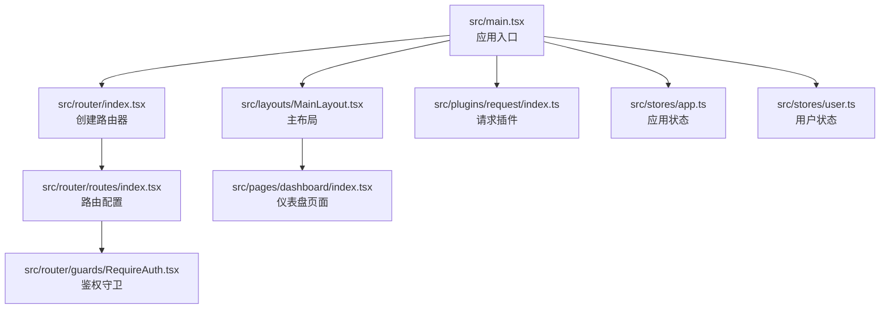
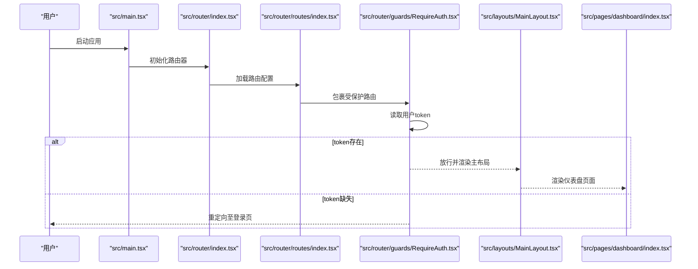
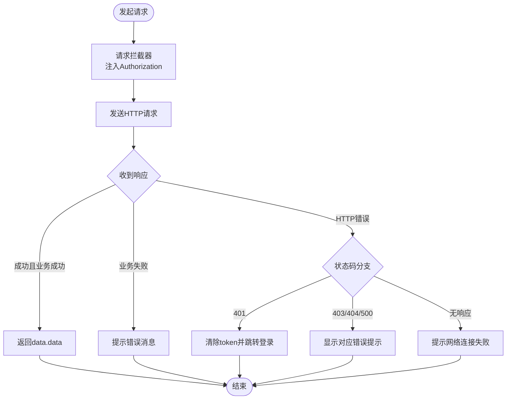
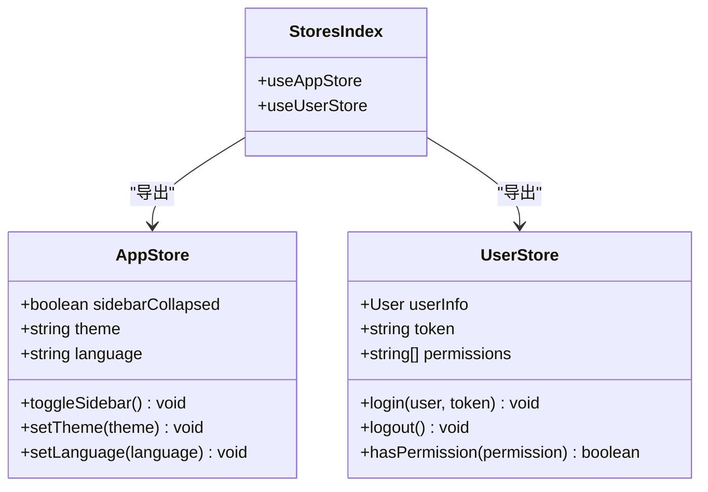
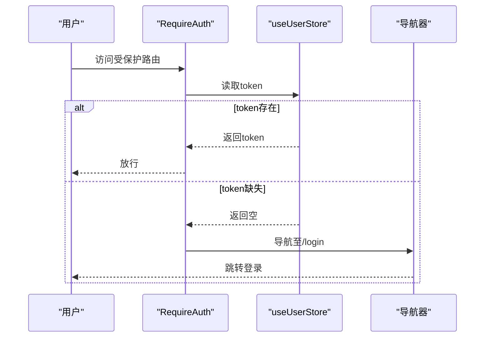
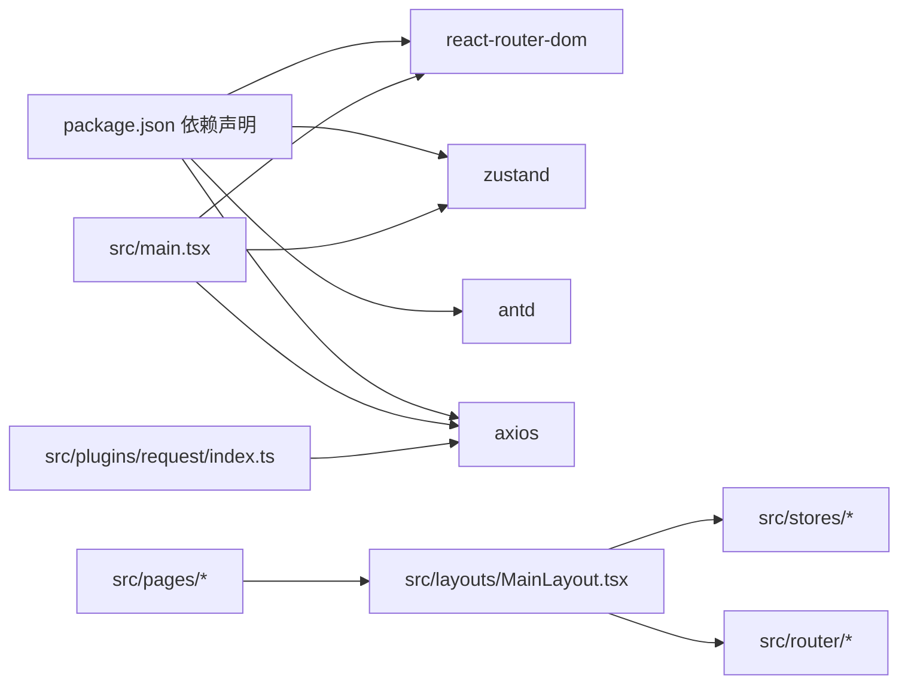

# 调试工具与技巧

<cite>
**本文引用的文件**
- [src/main.tsx](file://src/main.tsx)
- [package.json](file://package.json)
- [src/router/index.tsx](file://src/router/index.tsx)
- [src/router/routes/index.tsx](file://src/router/routes/index.tsx)
- [src/router/guards/RequireAuth.tsx](file://src/router/guards/RequireAuth.tsx)
- [src/plugins/request/index.ts](file://src/plugins/request/index.ts)
- [src/stores/app.ts](file://src/stores/app.ts)
- [src/stores/user.ts](file://src/stores/user.ts)
- [src/stores/index.ts](file://src/stores/index.ts)
- [src/layouts/MainLayout.tsx](file://src/layouts/MainLayout.tsx)
- [src/pages/dashboard/index.tsx](file://src/pages/dashboard/index.tsx)
- [src/pages/login/index.tsx](file://src/pages/login/index.tsx)
- [src/types/index.ts](file://src/types/index.ts)
- [mock/db.json](file://mock/db.json)
</cite>

## 目录

1. [简介](#简介)
2. [项目结构](#项目结构)
3. [核心组件](#核心组件)
4. [架构总览](#架构总览)
5. [详细组件分析](#详细组件分析)
6. [依赖关系分析](#依赖关系分析)
7. [性能考虑](#性能考虑)
8. [故障排查指南](#故障排查指南)
9. [结论](#结论)
10. [附录](#附录)

## 简介

本指南面向前端工程师与全栈开发者，围绕浏览器开发者工具与常见调试技巧展开，结合本项目的实际代码结构，提供可操作的调试流程与最佳实践。内容覆盖：

- 浏览器开发者工具：Elements、Console、Network、Sources 面板的使用要点与典型场景
- React DevTools：安装与使用（组件树、Props/State 检查、性能分析）
- 网络请求调试：API 调用监控、响应时间分析、错误排查
- 状态管理调试：Zustand 状态检查、持久化与 Immer 使用注意事项
- 路由状态跟踪：鉴权守卫、路由切换与导航行为
- 常见调试场景：组件渲染问题、状态更新异常、路由跳转错误等

## 项目结构

本项目采用“按功能分层 + 路由模块化”的组织方式，关键目录与职责如下：

- src/main.tsx：应用入口，挂载 RouterProvider 并注入主题与国际化配置
- src/router/\*：路由定义与鉴权守卫
- src/plugins/request/index.ts：统一请求封装与拦截器
- src/stores/\*：Zustand 状态管理（应用态与用户态）
- src/layouts/_ 与 src/pages/_：布局与页面组件
- mock/\*：本地 JSON Server 数据与路由映射

图表来源

- [src/main.tsx](file://src/main.tsx#L1-L32)
- [src/router/index.tsx](file://src/router/index.tsx#L1-L9)
- [src/router/routes/index.tsx](file://src/router/routes/index.tsx#L1-L31)
- [src/router/guards/RequireAuth.tsx](file://src/router/guards/RequireAuth.tsx#L1-L25)
- [src/layouts/MainLayout.tsx](file://src/layouts/MainLayout.tsx#L1-L174)
- [src/pages/dashboard/index.tsx](file://src/pages/dashboard/index.tsx#L1-L170)
- [src/plugins/request/index.ts](file://src/plugins/request/index.ts#L1-L114)
- [src/stores/app.ts](file://src/stores/app.ts#L1-L59)
- [src/stores/user.ts](file://src/stores/user.ts#L1-L76)

章节来源

- [src/main.tsx](file://src/main.tsx#L1-L32)
- [src/router/index.tsx](file://src/router/index.tsx#L1-L9)
- [src/router/routes/index.tsx](file://src/router/routes/index.tsx#L1-L31)
- [src/router/guards/RequireAuth.tsx](file://src/router/guards/RequireAuth.tsx#L1-L25)
- [src/layouts/MainLayout.tsx](file://src/layouts/MainLayout.tsx#L1-L174)
- [src/pages/dashboard/index.tsx](file://src/pages/dashboard/index.tsx#L1-L170)
- [src/plugins/request/index.ts](file://src/plugins/request/index.ts#L1-L114)
- [src/stores/app.ts](file://src/stores/app.ts#L1-L59)
- [src/stores/user.ts](file://src/stores/user.ts#L1-L76)

## 核心组件

- 应用入口与主题配置：在入口中通过 ConfigProvider 注入 Ant Design 主题与语言包，并通过 RouterProvider 提供路由上下文
- 路由与鉴权：使用 createBrowserRouter 定义路由，RequireAuth 守卫基于用户 token 决定是否放行
- 请求插件：基于 axios 的统一实例，内置请求/响应拦截器，集中处理认证头、业务错误与通用提示
- 状态管理：Zustand 结合 persist 与 immer，分别维护应用态（主题、语言、侧边栏）与用户态（登录信息、权限）
- 页面与布局：MainLayout 提供全局布局、侧边栏、头部与 Outlet；Dashboard 展示静态统计与列表

章节来源

- [src/main.tsx](file://src/main.tsx#L1-L32)
- [src/router/index.tsx](file://src/router/index.tsx#L1-L9)
- [src/router/guards/RequireAuth.tsx](file://src/router/guards/RequireAuth.tsx#L1-L25)
- [src/plugins/request/index.ts](file://src/plugins/request/index.ts#L1-L114)
- [src/stores/app.ts](file://src/stores/app.ts#L1-L59)
- [src/stores/user.ts](file://src/stores/user.ts#L1-L76)
- [src/layouts/MainLayout.tsx](file://src/layouts/MainLayout.tsx#L1-L174)
- [src/pages/dashboard/index.tsx](file://src/pages/dashboard/index.tsx#L1-L170)

## 架构总览

下图展示从入口到页面渲染、路由守卫、状态与请求的整体交互路径。

图表来源

- [src/main.tsx](file://src/main.tsx#L1-L32)
- [src/router/index.tsx](file://src/router/index.tsx#L1-L9)
- [src/router/routes/index.tsx](file://src/router/routes/index.tsx#L1-L31)
- [src/router/guards/RequireAuth.tsx](file://src/router/guards/RequireAuth.tsx#L1-L25)
- [src/layouts/MainLayout.tsx](file://src/layouts/MainLayout.tsx#L1-L174)
- [src/pages/dashboard/index.tsx](file://src/pages/dashboard/index.tsx#L1-L170)

## 详细组件分析

### 浏览器开发者工具使用指南

- Elements 面板
  - 场景：检查布局元素、样式覆盖、响应式断点、事件绑定
  - 实战：在 MainLayout 中定位 Sider/Header/Content 区域，验证折叠状态下的宽度与阴影效果
- Console 面板
  - 场景：打印变量、断点调试、错误堆栈、性能计时
  - 实战：在路由守卫与登录页中插入断点，观察 token 读取与导航行为
- Network 面板
  - 场景：监控 API 请求、响应时间、状态码、请求头与 Cookie
  - 实战：登录后观察 Authorization 头部是否携带 Bearer Token；拦截器对 401/403/404/500 的处理
- Sources 面板
  - 场景：设置断点、条件断点、调用栈、XHR/fetch 断点
  - 实战：在请求插件的拦截器与页面逻辑中设置断点，逐步执行并观察状态变化

### React DevTools 使用指南

- 安装与启用
  - 在浏览器扩展商店安装官方 React DevTools 扩展
  - 在开发模式下运行应用，打开 React DevTools 面板
- 组件树查看
  - 查看 MainLayout、RequireAuth、Dashboard 等组件的层级与渲染次数
- Props 与 State 检查
  - 在组件树中选中组件，查看 props 与 state，核对 token、userInfo、sidebarCollapsed 等关键字段
- 性能分析
  - 使用 Profiler 记录渲染过程，识别重复渲染与长任务
  - 关注 Zustand 状态变更导致的重渲染，必要时使用 selector 与 shallow 比较策略

### 网络请求调试技巧

- API 调用监控
  - 在 Network 面板过滤 XHR/fetch，查看请求 URL、方法、请求头与响应体
  - 观察请求插件中的拦截器是否正确注入 Authorization 头
- 响应时间分析
  - 关注瀑布图与每段耗时，定位慢请求与阻塞点
- 错误排查
  - 401：检查本地 token 是否存在，拦截器是否移除了 token 并跳转登录
  - 403/404/500：根据拦截器分支提示，确认业务错误与服务端状态
  - 网络失败：检查拦截器的兜底提示与错误返回

图表来源

- [src/plugins/request/index.ts](file://src/plugins/request/index.ts#L1-L114)

章节来源

- [src/plugins/request/index.ts](file://src/plugins/request/index.ts#L1-L114)

### 状态管理调试（Zustand）

- 状态结构与动作
  - 应用态：sidebarCollapsed、theme、language；动作包括 toggleSidebar、setTheme、setLanguage 等
  - 用户态：userInfo、token、permissions；动作包括 login、logout、hasPermission 等
- 持久化与 Immer
  - persist 中间件将部分状态持久化到 localStorage；partialize 控制序列化字段
  - immer 中间件支持不可变更新风格，便于调试时观察状态变化
- 调试建议
  - 在 React DevTools 中查看组件订阅的状态片段，避免不必要的重渲染
  - 使用 Redux DevTools（需额外配置）或控制台打印关键状态变更
  - 对于复杂更新，拆分为小步骤，确保 Immer 更新路径清晰

图表来源

- [src/stores/app.ts](file://src/stores/app.ts#L1-L59)
- [src/stores/user.ts](file://src/stores/user.ts#L1-L76)
- [src/stores/index.ts](file://src/stores/index.ts#L1-L3)

章节来源

- [src/stores/app.ts](file://src/stores/app.ts#L1-L59)
- [src/stores/user.ts](file://src/stores/user.ts#L1-L76)
- [src/stores/index.ts](file://src/stores/index.ts#L1-L3)

### 路由状态跟踪

- 路由守卫
  - RequireAuth 通过 useUserStore 读取 token，无 token 则重定向至登录页
  - 可结合浏览器地址栏与 Network 面板验证跳转时机与请求触发
- 路由配置
  - routes/index.tsx 组织各模块路由，MainLayout 作为受保护路由的根布局
- 调试建议
  - 在守卫组件中设置断点，观察 token 变化与导航行为
  - 使用 React DevTools 的 Profiler 检测路由切换引发的重渲染

图表来源

- [src/router/guards/RequireAuth.tsx](file://src/router/guards/RequireAuth.tsx#L1-L25)
- [src/stores/user.ts](file://src/stores/user.ts#L1-L76)

章节来源

- [src/router/guards/RequireAuth.tsx](file://src/router/guards/RequireAuth.tsx#L1-L25)
- [src/router/routes/index.tsx](file://src/router/routes/index.tsx#L1-L31)
- [src/stores/user.ts](file://src/stores/user.ts#L1-L76)

### 常见调试场景与解决方案

- 组件渲染问题
  - 症状：布局错位、样式不生效、图标未显示
  - 排查：在 Elements 面板检查 DOM 结构与计算样式；在 Console 面板输出关键变量
  - 解决：修正样式优先级、确保图标组件正确导入与渲染
- 状态更新异常
  - 症状：点击按钮无反应、UI 不刷新
  - 排查：在 React DevTools 中确认组件订阅的状态片段；检查 Zustand 动作是否被调用
  - 解决：确保动作函数正确更新状态；避免不必要的重渲染
- 路由跳转错误
  - 症状：无法进入受保护页面、反复跳转登录
  - 排查：在 RequireAuth 中设置断点，检查 token 获取与导航逻辑
  - 解决：确保登录成功后写入 token；清理无效 token 后重定向登录

章节来源

- [src/layouts/MainLayout.tsx](file://src/layouts/MainLayout.tsx#L1-L174)
- [src/router/guards/RequireAuth.tsx](file://src/router/guards/RequireAuth.tsx#L1-L25)
- [src/stores/user.ts](file://src/stores/user.ts#L1-L76)

## 依赖关系分析

- 外部依赖
  - React、React Router、Ant Design、Zustand、Axios 等
- 内部依赖
  - main.tsx 依赖 router、layout、store、request
  - layout 依赖 store 与 router hooks
  - pages 依赖 layout 与 store
  - request 插件被多处页面与 hooks 使用

图表来源

- [package.json](file://package.json#L20-L36)
- [src/main.tsx](file://src/main.tsx#L1-L32)
- [src/layouts/MainLayout.tsx](file://src/layouts/MainLayout.tsx#L1-L174)
- [src/plugins/request/index.ts](file://src/plugins/request/index.ts#L1-L114)

章节来源

- [package.json](file://package.json#L20-L36)
- [src/main.tsx](file://src/main.tsx#L1-L32)
- [src/layouts/MainLayout.tsx](file://src/layouts/MainLayout.tsx#L1-L174)
- [src/plugins/request/index.ts](file://src/plugins/request/index.ts#L1-L114)

## 性能考虑

- 渲染性能
  - 使用 React DevTools Profiler 识别长任务与重复渲染
  - 在组件中使用选择性订阅，减少无关状态引起的重渲染
- 网络性能
  - 合理设置超时与重试策略；在 Network 面板观察慢请求并优化接口设计
- 状态性能
  - Zustand 中避免一次性更新过多字段；必要时拆分 store 或使用 selector

## 故障排查指南

- 登录后仍被重定向至登录页
  - 检查登录页成功回调是否调用了用户 store 的 login 动作
  - 在 Network 面板确认登录请求成功并返回 token
- 401 错误频繁出现
  - 检查请求拦截器是否正确注入 Authorization 头
  - 观察拦截器对 401 的处理逻辑：清除 token 并跳转登录
- 页面空白或布局异常
  - 在 Elements 面板检查 DOM 结构与样式
  - 在 Console 面板查看是否有运行时错误
- 状态不同步
  - 在 React DevTools 中确认组件订阅的状态片段
  - 检查 persist 的序列化字段是否包含所需状态

章节来源

- [src/pages/login/index.tsx](file://src/pages/login/index.tsx#L1-L133)
- [src/plugins/request/index.ts](file://src/plugins/request/index.ts#L1-L114)
- [src/router/guards/RequireAuth.tsx](file://src/router/guards/RequireAuth.tsx#L1-L25)
- [src/stores/user.ts](file://src/stores/user.ts#L1-L76)

## 结论

通过合理运用浏览器开发者工具、React DevTools 与 Zustand 的调试能力，可以高效定位并解决组件渲染、状态更新与路由跳转等问题。建议在日常开发中：

- 建立统一的请求规范与拦截器策略
- 使用选择性订阅与最小化状态更新
- 在关键节点设置断点与日志，配合 Network 与 Profiler 快速定位问题

## 附录

- 本地 Mock 数据
  - 使用脚本启动 JSON Server，访问 mock 数据并映射到路由
  - 可用于离线调试与接口联调

章节来源

- [mock/db.json](file://mock/db.json#L1-L140)
- [package.json](file://package.json#L11-L11)
