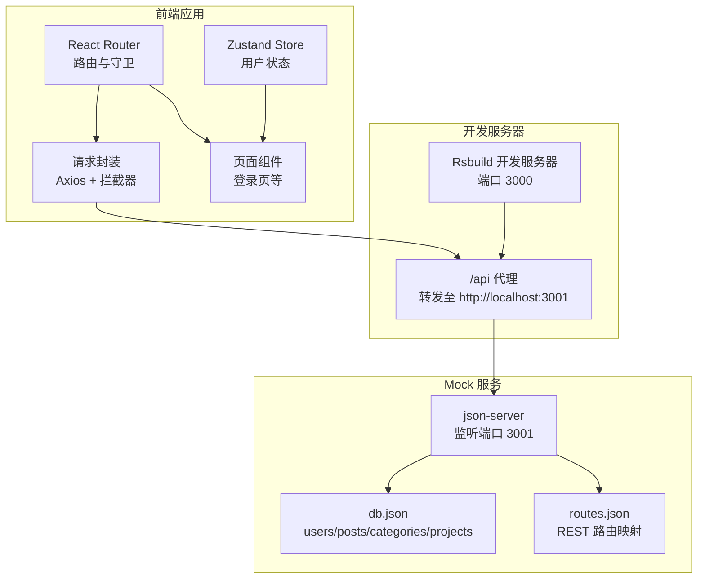
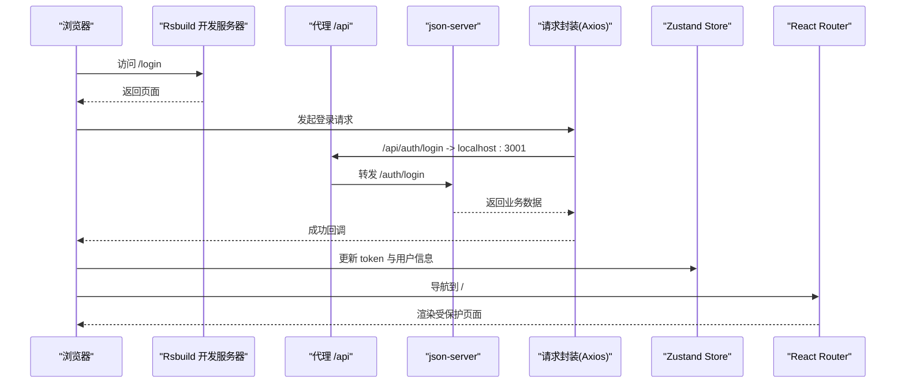
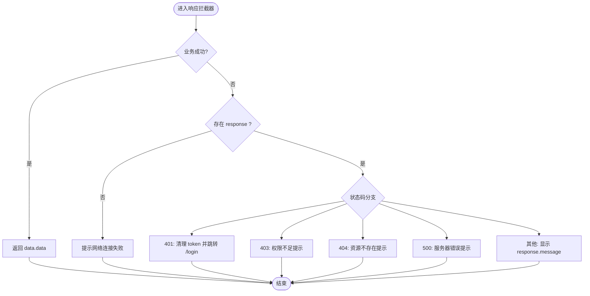
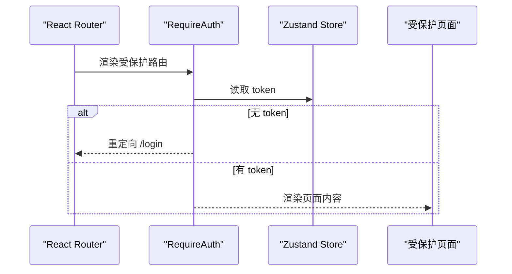
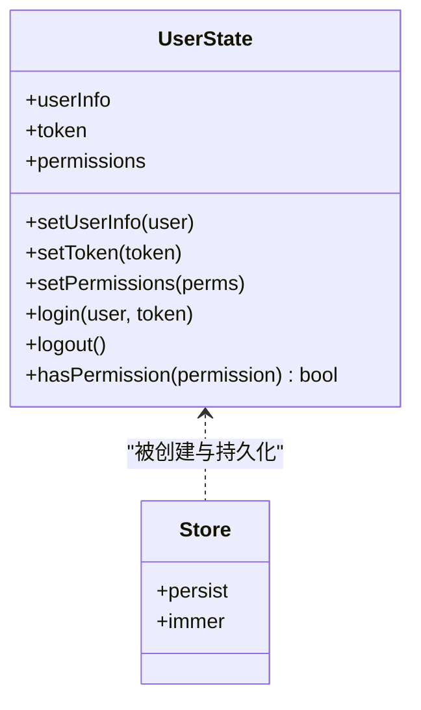
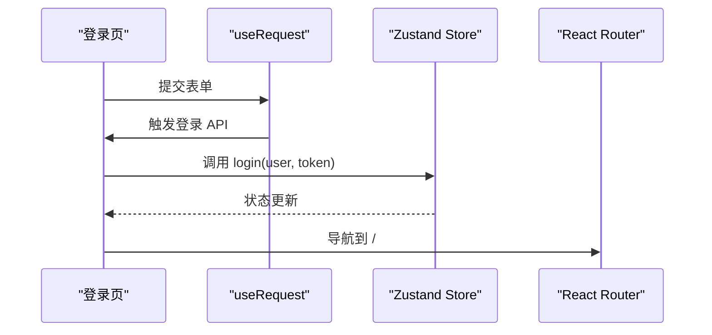
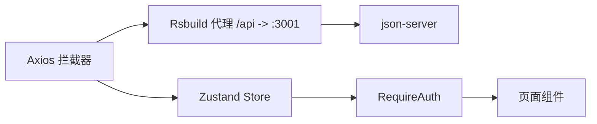

# 集成测试

<cite>
**本文引用的文件**
- [mock/db.json](file://mock/db.json)
- [mock/routes.json](file://mock/routes.json)
- [src/plugins/request/index.ts](file://src/plugins/request/index.ts)
- [package.json](file://package.json)
- [rsbuild.config.ts](file://rsbuild.config.ts)
- [src/router/index.tsx](file://src/router/index.tsx)
- [src/router/routes/index.tsx](file://src/router/routes/index.tsx)
- [src/router/guards/RequireAuth.tsx](file://src/router/guards/RequireAuth.tsx)
- [src/router/routes/auth.tsx](file://src/router/routes/auth.tsx)
- [src/router/routes/dashboard.tsx](file://src/router/routes/dashboard.tsx)
- [src/pages/login/index.tsx](file://src/pages/login/index.tsx)
- [src/stores/user.ts](file://src/stores/user.ts)
- [src/constants/config.ts](file://src/constants/config.ts)
- [src/types/index.ts](file://src/types/index.ts)
</cite>

## 目录

1. [简介](#简介)
2. [项目结构](#项目结构)
3. [核心组件](#核心组件)
4. [架构总览](#架构总览)
5. [详细组件分析](#详细组件分析)
6. [依赖分析](#依赖分析)
7. [性能考虑](#性能考虑)
8. [故障排查指南](#故障排查指南)
9. [结论](#结论)
10. [附录](#附录)

## 简介

本指南面向需要对本项目进行端到端集成测试的工程师与测试人员，重点围绕以下目标展开：

- 利用项目内置的 Mock 数据服务（基于 json-server）进行真实端到端测试，覆盖 db.json 与 routes.json 的配置与使用。
- 实施 API 层集成测试策略：模拟 HTTP 请求、验证响应数据、覆盖错误场景（如 401/403/404/500）。
- 测试组件间交互、状态管理（Zustand Store）与路由跳转的正确性。
- 提供可复现的测试案例：用户登录流程、数据加载、表单提交等完整业务流程。
- 给出测试数据准备、测试环境搭建与测试执行的最佳实践。

## 项目结构

本项目采用前端工程化组织方式，核心与测试相关的关键位置如下：

- Mock 数据与路由映射：mock/db.json、mock/routes.json
- 请求封装与拦截器：src/plugins/request/index.ts
- 开发代理与端口：rsbuild.config.ts 中配置了 /api 代理至本地 Mock 服务
- 路由与守卫：src/router/_ 与 src/router/guards/_
- 状态管理：src/stores/user.ts（Zustand）
- 页面组件：src/pages/login/index.tsx 等
- 类型定义：src/types/index.ts
- 工程脚本：package.json 中提供 mock 启动命令

图表来源

- [rsbuild.config.ts](file://rsbuild.config.ts#L11-L22)
- [mock/db.json](file://mock/db.json#L1-L140)
- [mock/routes.json](file://mock/routes.json#L1-L11)
- [src/plugins/request/index.ts](file://src/plugins/request/index.ts#L1-L114)
- [src/router/index.tsx](file://src/router/index.tsx#L1-L9)
- [src/stores/user.ts](file://src/stores/user.ts#L1-L76)
- [src/pages/login/index.tsx](file://src/pages/login/index.tsx#L1-L133)

章节来源

- [package.json](file://package.json#L11-L11)
- [rsbuild.config.ts](file://rsbuild.config.ts#L1-L30)
- [mock/db.json](file://mock/db.json#L1-L140)
- [mock/routes.json](file://mock/routes.json#L1-L11)

## 核心组件

- Mock 数据服务（json-server）
  - 通过 db.json 提供 users、posts、categories、projects 等集合的 CRUD 接口。
  - 通过 routes.json 将 /api 前缀的请求映射到对应资源路径，便于与前端统一。
- 请求封装与拦截器（Axios）
  - 自动注入 Authorization 头（localStorage 中的 token）。
  - 统一处理业务成功/失败、HTTP 错误码与网络异常，并在 401 时触发路由跳转。
- 路由与守卫
  - RequireAuth 基于 Store 中 token 决定是否放行。
  - 路由模块化拆分，支持懒加载与权限控制。
- 状态管理（Zustand）
  - 用户信息、token、权限与登录/登出动作，持久化部分状态。
- 页面组件
  - 登录页使用本地 Promise 模拟登录 API，成功后写入 Store 并导航。

章节来源

- [src/plugins/request/index.ts](file://src/plugins/request/index.ts#L1-L114)
- [src/router/guards/RequireAuth.tsx](file://src/router/guards/RequireAuth.tsx#L1-L25)
- [src/stores/user.ts](file://src/stores/user.ts#L1-L76)
- [src/pages/login/index.tsx](file://src/pages/login/index.tsx#L1-L133)

## 架构总览

下图展示了从浏览器发起请求到 Mock 服务返回数据的完整链路，以及与前端状态与路由的交互关系。

图表来源

- [rsbuild.config.ts](file://rsbuild.config.ts#L13-L20)
- [src/plugins/request/index.ts](file://src/plugins/request/index.ts#L19-L76)
- [src/stores/user.ts](file://src/stores/user.ts#L46-L60)
- [src/router/guards/RequireAuth.tsx](file://src/router/guards/RequireAuth.tsx#L11-L22)
- [src/pages/login/index.tsx](file://src/pages/login/index.tsx#L36-L50)

## 详细组件分析

### Mock 数据服务与路由映射

- db.json
  - 提供 users、posts、categories、projects 等集合，用于端到端测试数据源。
  - 建议在测试前先读取并理解各集合的字段结构，确保断言准确。
- routes.json
  - 将 /api 前缀的请求映射到对应资源路径，便于统一调用。
  - 例如：/api/users 对应 /users；/api/users/:id 对应 /users/:id。
- 启动方式
  - 使用 npm 脚本启动 json-server，监听 3001 端口并加载 db.json 与 routes.json。

章节来源

- [mock/db.json](file://mock/db.json#L1-L140)
- [mock/routes.json](file://mock/routes.json#L1-L11)
- [package.json](file://package.json#L11-L11)

### 请求封装与拦截器（API 层集成测试要点）

- 请求拦截器
  - 自动从 localStorage 读取 token 并附加到 Authorization 头。
- 响应拦截器
  - 业务成功：当 data.success 或 code=200 时返回 data.data。
  - 业务失败：弹出错误消息并抛出错误。
  - HTTP 错误：根据状态码执行不同分支（401 触发清理 token 并跳转 /login；403/404/500 等提示相应错误）。
  - 网络异常：提示“网络连接失败”。
- 测试策略建议
  - 模拟 200 成功响应：断言返回的数据结构与字段。
  - 模拟 401 未授权：断言清除 token、弹出提示、跳转 /login。
  - 模拟 403/404/500：断言对应错误提示。
  - 模拟网络异常：断言“网络连接失败”。

图表来源

- [src/plugins/request/index.ts](file://src/plugins/request/index.ts#L34-L76)

章节来源

- [src/plugins/request/index.ts](file://src/plugins/request/index.ts#L19-L76)

### 路由与守卫（路由跳转与权限集成测试）

- RequireAuth
  - 若无 token，则重定向到 /login。
  - 有 token 则渲染子组件。
- 路由模块化
  - authRoutes、dashboardRoutes、errorRoutes 等按功能拆分，便于独立测试。
- 测试策略建议
  - 未登录访问受保护路由：断言跳转 /login。
  - 已登录访问受保护路由：断言渲染主布局与子页面。
  - 登录成功后 token 存储与导航：结合 Store 测试。

图表来源

- [src/router/guards/RequireAuth.tsx](file://src/router/guards/RequireAuth.tsx#L11-L22)
- [src/router/routes/index.tsx](file://src/router/routes/index.tsx#L9-L28)
- [src/stores/user.ts](file://src/stores/user.ts#L53-L60)

章节来源

- [src/router/guards/RequireAuth.tsx](file://src/router/guards/RequireAuth.tsx#L1-L25)
- [src/router/routes/index.tsx](file://src/router/routes/index.tsx#L1-L31)
- [src/stores/user.ts](file://src/stores/user.ts#L1-L76)

### 状态管理（Zustand Store）

- 关键状态与动作
  - userInfo、token、permissions
  - setUserInfo、setToken、setPermissions、login、logout、hasPermission
- 持久化策略
  - 仅持久化 token 与 userInfo，避免敏感信息泄露。
- 测试策略建议
  - 登录成功：断言 token 与 userInfo 更新，且 Store 中存在 token。
  - 登出：断言 token 清除、userInfo 归零、permissions 清空。
  - 权限判断：断言 hasPermission 返回值符合预期。

图表来源

- [src/stores/user.ts](file://src/stores/user.ts#L21-L75)

章节来源

- [src/stores/user.ts](file://src/stores/user.ts#L1-L76)

### 页面组件（登录流程与表单提交）

- 登录页 LoginPage
  - 使用本地 Promise 模拟登录 API，成功后调用 Store.login 并导航到根路径。
  - 表单校验与加载态处理。
- 测试策略建议
  - 表单必填项校验：断言错误提示与按钮禁用状态。
  - 登录成功：断言 Store 登录成功、弹出成功消息、导航到 /。
  - 登录失败：断言错误消息与状态不变。

图表来源

- [src/pages/login/index.tsx](file://src/pages/login/index.tsx#L36-L50)
- [src/stores/user.ts](file://src/stores/user.ts#L46-L51)

章节来源

- [src/pages/login/index.tsx](file://src/pages/login/index.tsx#L1-L133)
- [src/stores/user.ts](file://src/stores/user.ts#L1-L76)

## 依赖分析

- 开发代理
  - Rsbuild 将 /api 前缀请求代理到 http://localhost:3001，确保前端与 Mock 服务解耦。
- 请求封装
  - Axios 实例与拦截器负责统一处理认证、业务错误与网络异常。
- 路由与状态
  - 路由守卫依赖 Store 中 token；Store 与页面组件通过状态更新联动。

图表来源

- [rsbuild.config.ts](file://rsbuild.config.ts#L13-L20)
- [src/plugins/request/index.ts](file://src/plugins/request/index.ts#L19-L76)
- [src/router/guards/RequireAuth.tsx](file://src/router/guards/RequireAuth.tsx#L11-L22)
- [src/stores/user.ts](file://src/stores/user.ts#L46-L60)

章节来源

- [rsbuild.config.ts](file://rsbuild.config.ts#L1-L30)
- [src/plugins/request/index.ts](file://src/plugins/request/index.ts#L1-L114)
- [src/router/guards/RequireAuth.tsx](file://src/router/guards/RequireAuth.tsx#L1-L25)
- [src/stores/user.ts](file://src/stores/user.ts#L1-L76)

## 性能考虑

- Mock 服务并发与延迟
  - 在测试中可通过调整请求并发与延迟模拟，评估前端在弱网或高并发下的表现。
- 前端渲染与懒加载
  - 路由懒加载与组件懒加载有助于减少初始包体，提升首屏性能。
- 状态更新与重渲染
  - Store 的细粒度更新可降低不必要的重渲染，建议在测试中关注渲染次数与性能指标。

## 故障排查指南

- 无法访问 Mock 数据
  - 确认 json-server 是否正常启动（端口 3001），检查 db.json 与 routes.json 是否存在语法错误。
- 401 未授权频繁出现
  - 检查 localStorage 中是否存在 token；确认请求拦截器是否正确附加 Authorization 头。
- 路由跳转异常
  - 检查 RequireAuth 是否正确读取 Store 中 token；确认路由配置与懒加载是否正确。
- 网络连接失败
  - 检查 Rsbuild 代理配置是否指向正确的 Mock 服务地址与端口。

章节来源

- [mock/db.json](file://mock/db.json#L1-L140)
- [mock/routes.json](file://mock/routes.json#L1-L11)
- [src/plugins/request/index.ts](file://src/plugins/request/index.ts#L19-L76)
- [rsbuild.config.ts](file://rsbuild.config.ts#L13-L20)
- [src/router/guards/RequireAuth.tsx](file://src/router/guards/RequireAuth.tsx#L11-L22)

## 结论

通过合理利用 Mock 数据服务与请求拦截器，结合路由守卫与状态管理，可以构建一套稳定、可重复的端到端集成测试方案。建议在测试中覆盖成功路径、错误场景与边界条件，并配合脚本自动化启动与停止测试环境，以提高效率与一致性。

## 附录

### 测试数据准备

- 使用 db.json 中的集合作为测试数据源，确保字段与类型与前端期望一致。
- 如需新增测试数据，可在对应集合中追加记录，并在测试中通过 GET/POST/PUT/DELETE 验证行为。

章节来源

- [mock/db.json](file://mock/db.json#L1-L140)

### 测试环境搭建与执行

- 启动 Mock 服务
  - 执行脚本：参见 package.json 中的 mock 命令。
- 启动前端开发服务器
  - 执行脚本：dev，确保代理 /api 指向 http://localhost:3001。
- 执行集成测试
  - 可使用任意端到端测试框架（如 Playwright/Cypress）编写测试用例，访问 /login 并完成登录流程，随后验证路由跳转与页面渲染。

章节来源

- [package.json](file://package.json#L11-L11)
- [rsbuild.config.ts](file://rsbuild.config.ts#L11-L22)

### API 层集成测试清单

- 成功场景
  - 登录接口：断言返回 token 与用户信息，Store 登录成功，导航到 /。
  - 数据加载：GET /api/users、/api/posts 等，断言列表与分页字段。
- 错误场景
  - 401：断言清除 token、提示“登录已过期”，跳转 /login。
  - 403：断言“没有权限访问”。
  - 404：断言“请求的资源不存在”。
  - 500：断言“服务器内部错误”。
  - 网络异常：断言“网络连接失败”。

章节来源

- [src/plugins/request/index.ts](file://src/plugins/request/index.ts#L34-L76)
- [src/pages/login/index.tsx](file://src/pages/login/index.tsx#L36-L50)
- [src/stores/user.ts](file://src/stores/user.ts#L46-L60)

### 路由与状态集成测试清单

- 未登录访问受保护路由：断言跳转 /login。
- 已登录访问受保护路由：断言渲染主布局与子页面。
- 登录成功后 Store 状态：断言 token 与 userInfo 存在，权限数组初始化为空。
- 登出后 Store 状态：断言 token 清除、userInfo 归零、permissions 清空。

章节来源

- [src/router/guards/RequireAuth.tsx](file://src/router/guards/RequireAuth.tsx#L11-L22)
- [src/stores/user.ts](file://src/stores/user.ts#L53-L65)

### 典型测试案例：用户登录流程

- 步骤
  - 打开 /login。
  - 输入用户名与密码，点击登录。
  - 断言成功消息、Store 登录成功、导航到 /。
- 依赖
  - 登录页组件、请求封装、Store、路由守卫。

章节来源

- [src/pages/login/index.tsx](file://src/pages/login/index.tsx#L36-L50)
- [src/plugins/request/index.ts](file://src/plugins/request/index.ts#L79-L111)
- [src/stores/user.ts](file://src/stores/user.ts#L46-L51)
- [src/router/guards/RequireAuth.tsx](file://src/router/guards/RequireAuth.tsx#L11-L22)

### 典型测试案例：数据加载与表格渲染

- 步骤
  - 登录后访问 /dashboard 或相关页面。
  - 触发数据加载（GET /api/users 等）。
  - 断言列表渲染、分页字段、排序与筛选。
- 依赖
  - 请求封装、类型定义、页面组件。

章节来源

- [src/plugins/request/index.ts](file://src/plugins/request/index.ts#L79-L111)
- [src/types/index.ts](file://src/types/index.ts#L3-L15)
- [src/router/routes/dashboard.tsx](file://src/router/routes/dashboard.tsx#L7-L14)

### 典型测试案例：表单提交

- 步骤
  - 打开表单页面。
  - 填写必填字段，触发提交。
  - 断言成功消息、Store 更新、列表刷新。
- 依赖
  - 请求封装、Store、页面组件。

章节来源

- [src/pages/login/index.tsx](file://src/pages/login/index.tsx#L45-L50)
- [src/plugins/request/index.ts](file://src/plugins/request/index.ts#L79-L111)
- [src/stores/user.ts](file://src/stores/user.ts#L28-L44)
