# Zustand集成与配置

<cite>
**本文档引用的文件**
- [package.json](file://package.json)
- [src/stores/index.ts](file://src/stores/index.ts)
- [src/stores/app.ts](file://src/stores/app.ts)
- [src/stores/user.ts](file://src/stores/user.ts)
- [src/types/index.ts](file://src/types/index.ts)
- [src/layouts/MainLayout.tsx](file://src/layouts/MainLayout.tsx)
- [src/pages/login/index.tsx](file://src/pages/login/index.tsx)
- [.ai/core/architecture.md](file://.ai/core/architecture.md)
</cite>

## 目录

1. [简介](#简介)
2. [项目结构](#项目结构)
3. [核心组件](#核心组件)
4. [架构概览](#架构概览)
5. [详细组件分析](#详细组件分析)
6. [依赖关系分析](#依赖关系分析)
7. [性能考虑](#性能考虑)
8. [故障排除指南](#故障排除指南)
9. [结论](#结论)
10. [附录](#附录)

## 简介

本项目采用Zustand作为主要的状态管理解决方案，实现了完整的状态持久化和不可变更新功能。通过集成persist和immer中间件，项目提供了以下核心能力：

- **状态持久化**：自动将关键状态保存到浏览器本地存储
- **不可变更新**：使用Immer库实现简洁的不可变状态更新语法
- **类型安全**：完整的TypeScript类型定义确保编译时类型检查
- **模块化设计**：按领域划分的状态存储，便于维护和扩展

## 项目结构

项目采用基于领域的状态管理架构，所有状态存储位于`src/stores/`目录下：

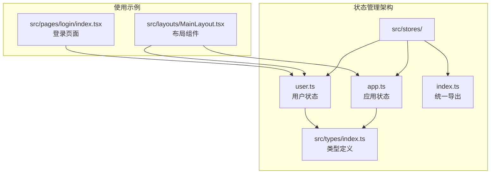

**图表来源**

- [src/stores/index.ts](file://src/stores/index.ts#L1-L3)
- [src/stores/app.ts](file://src/stores/app.ts#L1-L59)
- [src/stores/user.ts](file://src/stores/user.ts#L1-L76)

**章节来源**

- [src/stores/index.ts](file://src/stores/index.ts#L1-L3)
- [src/stores/app.ts](file://src/stores/app.ts#L1-L59)
- [src/stores/user.ts](file://src/stores/user.ts#L1-L76)

## 核心组件

### Zustand基础配置

项目使用Zustand的create函数创建状态存储，采用泛型接口定义确保类型安全：

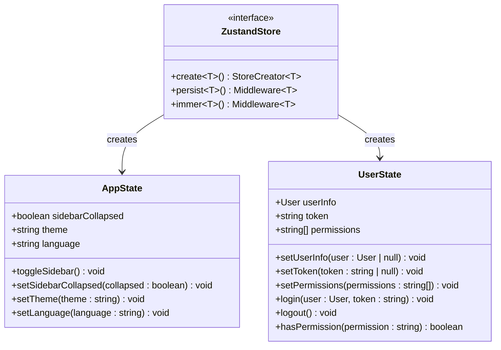

**图表来源**

- [src/stores/app.ts](file://src/stores/app.ts#L5-L16)
- [src/stores/user.ts](file://src/stores/user.ts#L6-L19)

### 中间件集成模式

项目采用中间件组合模式，先应用immer中间件，再应用persist中间件：

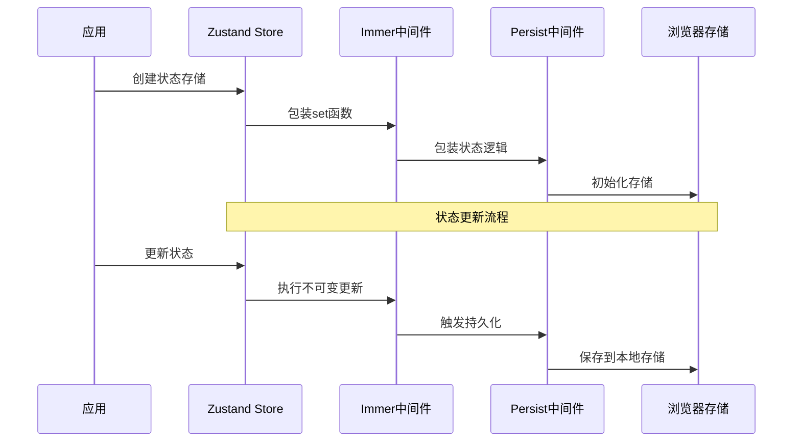

**图表来源**

- [src/stores/app.ts](file://src/stores/app.ts#L18-L58)
- [src/stores/user.ts](file://src/stores/user.ts#L21-L75)

**章节来源**

- [src/stores/app.ts](file://src/stores/app.ts#L1-L59)
- [src/stores/user.ts](file://src/stores/user.ts#L1-L76)

## 架构概览

### 状态管理架构图

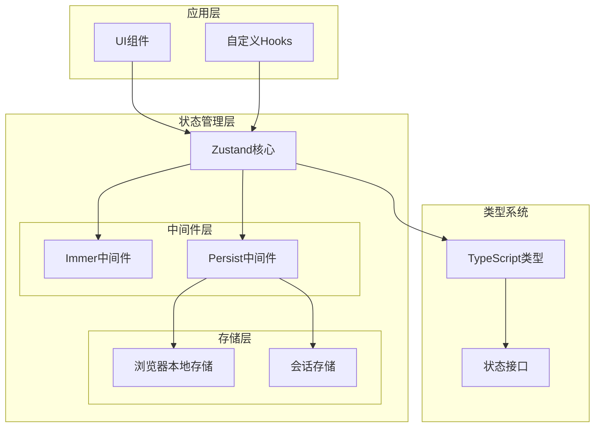

**图表来源**

- [package.json](file://package.json#L20-L36)
- [src/stores/app.ts](file://src/stores/app.ts#L1-L59)
- [src/stores/user.ts](file://src/stores/user.ts#L1-L76)

### 状态流程序列图

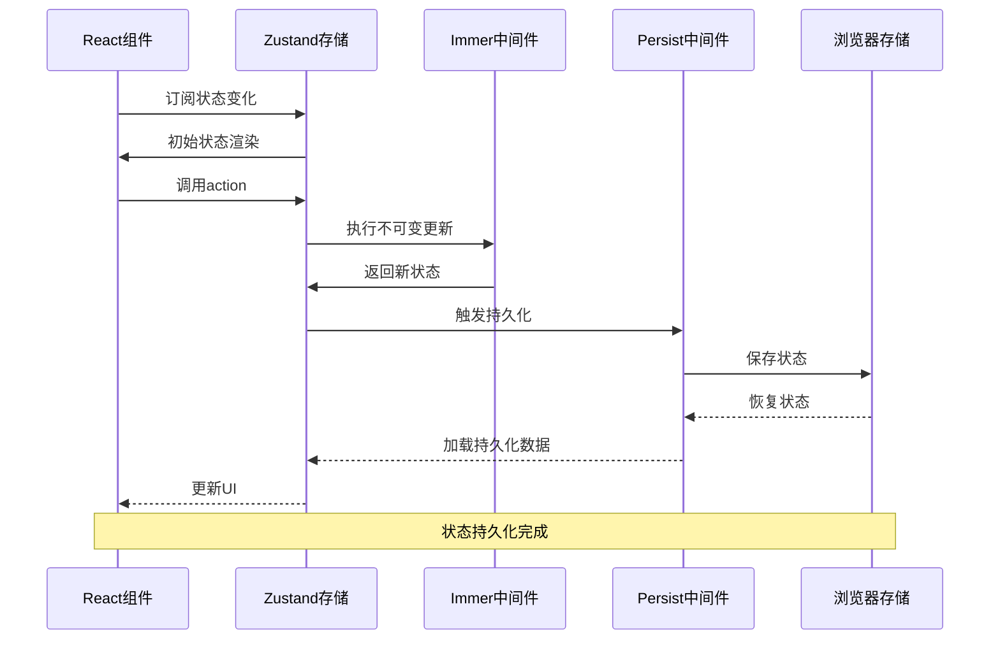

**图表来源**

- [src/layouts/MainLayout.tsx](file://src/layouts/MainLayout.tsx#L23-L24)
- [src/pages/login/index.tsx](file://src/pages/login/index.tsx#L34-L43)

## 详细组件分析

### 应用状态存储 (app.ts)

应用状态存储负责管理全局应用配置，包括侧边栏状态、主题设置和语言选择。

#### 状态结构设计

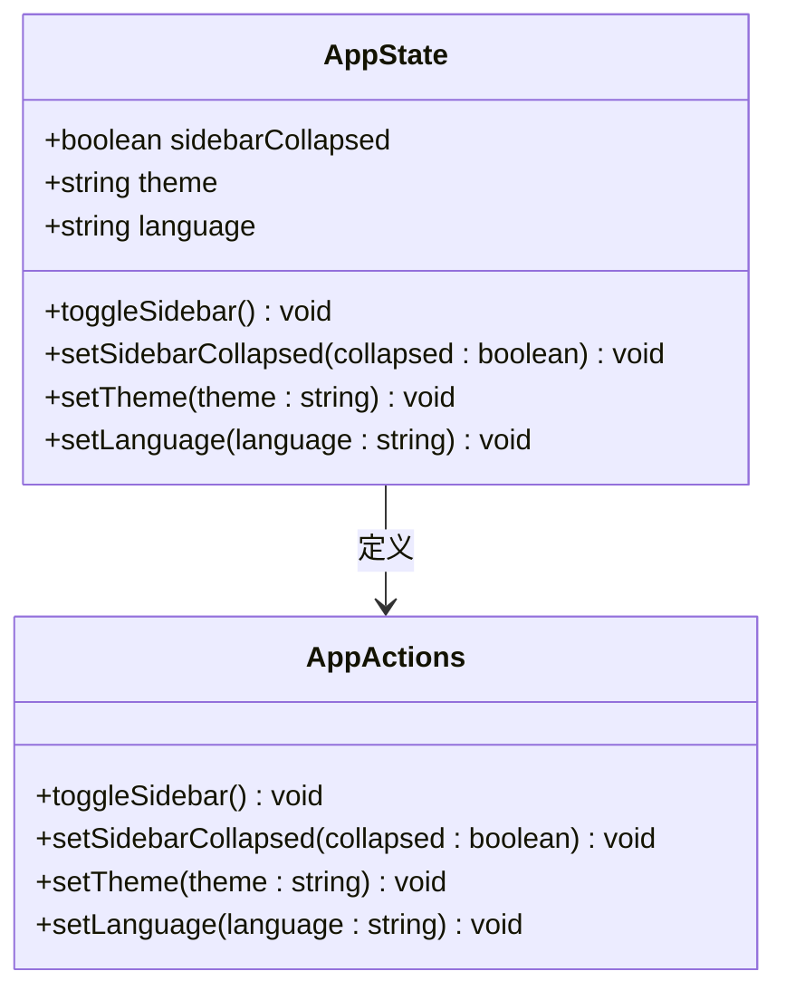

**图表来源**

- [src/stores/app.ts](file://src/stores/app.ts#L5-L16)

#### 中间件配置详解

应用状态存储采用了完整的中间件配置：

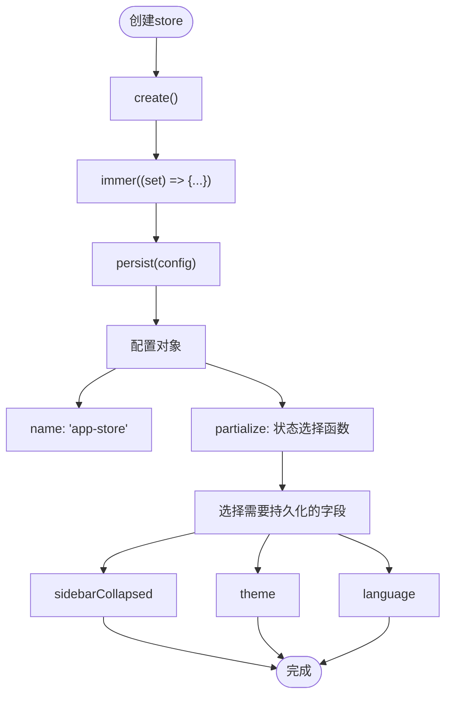

**图表来源**

- [src/stores/app.ts](file://src/stores/app.ts#L18-L58)

#### 使用示例

应用状态在主布局组件中被广泛使用：

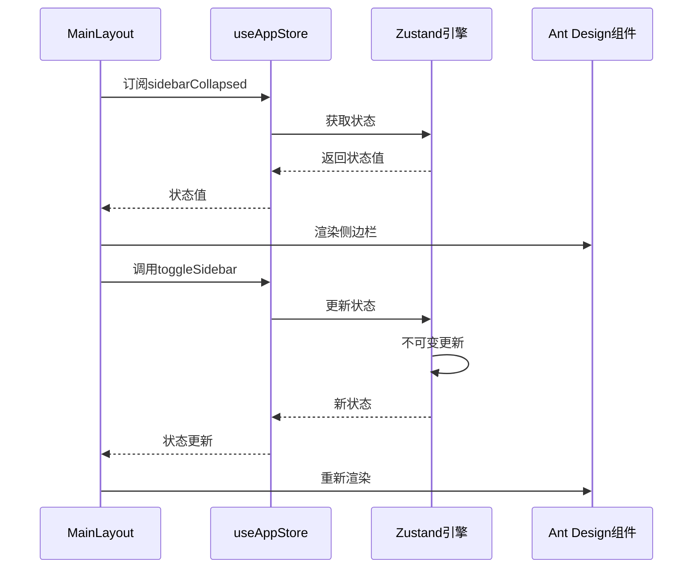

**图表来源**

- [src/layouts/MainLayout.tsx](file://src/layouts/MainLayout.tsx#L23-L24)

**章节来源**

- [src/stores/app.ts](file://src/stores/app.ts#L1-L59)
- [src/layouts/MainLayout.tsx](file://src/layouts/MainLayout.tsx#L23-L24)

### 用户状态存储 (user.ts)

用户状态存储负责管理用户认证信息、权限控制和用户资料。

#### 类型系统集成

用户状态存储充分利用了TypeScript的类型系统：

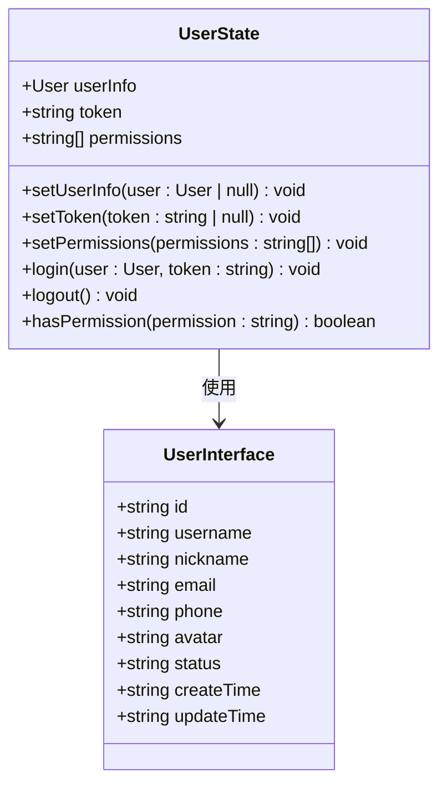

**图表来源**

- [src/stores/user.ts](file://src/stores/user.ts#L6-L19)
- [src/types/index.ts](file://src/types/index.ts#L17-L28)

#### 权限管理系统

用户状态存储实现了完整的权限控制系统：

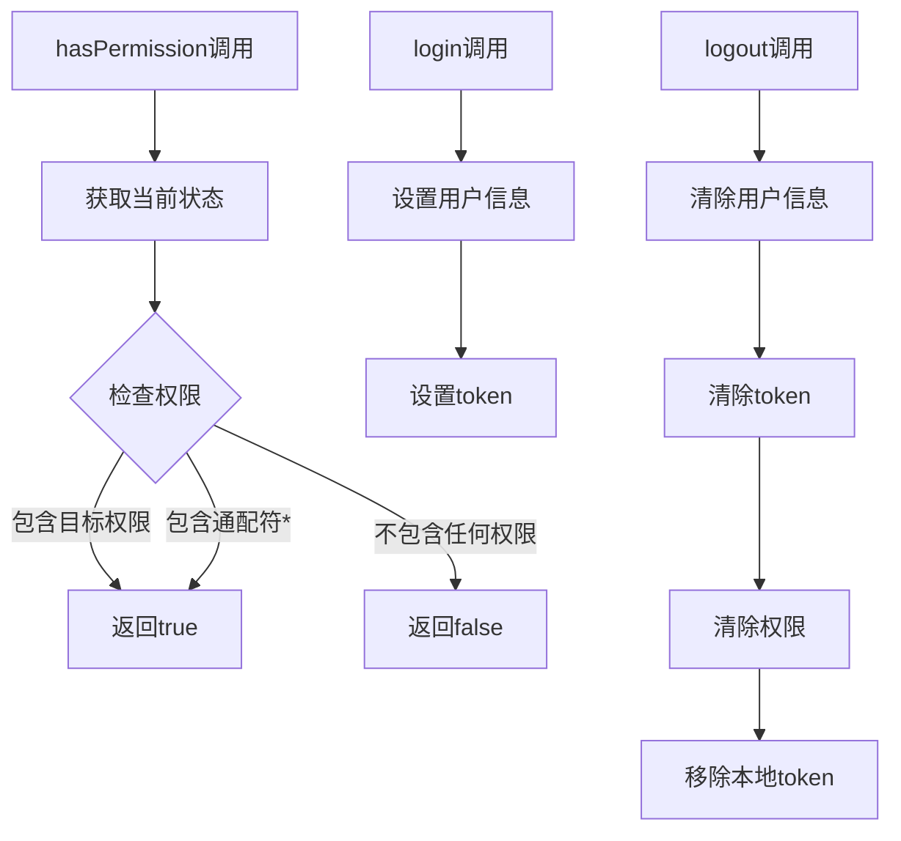

**图表来源**

- [src/stores/user.ts](file://src/stores/user.ts#L62-L65)
- [src/stores/user.ts](file://src/stores/user.ts#L53-L60)

**章节来源**

- [src/stores/user.ts](file://src/stores/user.ts#L1-L76)
- [src/types/index.ts](file://src/types/index.ts#L17-L28)

### 统一导出模块

项目通过统一导出模块简化了状态存储的导入使用：

```mermaid
graph LR
subgraph "导出模块"
IndexTS[src/stores/index.ts]
ExportUser[export { useUserStore }]
ExportApp[export { useAppStore }]
end
subgraph "使用模块"
MainLayout[src/layouts/MainLayout.tsx]
LoginPage[src/pages/login/index.tsx]
end
IndexTS --> ExportUser
IndexTS --> ExportApp
ExportUser --> MainLayout
ExportUser --> LoginPage
ExportApp --> MainLayout
```

**图表来源**

- [src/stores/index.ts](file://src/stores/index.ts#L1-L3)

**章节来源**

- [src/stores/index.ts](file://src/stores/index.ts#L1-L3)

## 依赖关系分析

### 外部依赖关系

项目对Zustand及其中间件的依赖关系如下：

```mermaid
graph TB
subgraph "项目依赖"
PackageJSON[package.json]
Zustand[zustand@^5.0.11]
Immer[immer@^11.1.4]
Persist[zustand/middleware]
ImmerMiddleware[zustand/middleware/immer]
end
subgraph "内部模块"
AppStore[src/stores/app.ts]
UserStore[src/stores/user.ts]
IndexExport[src/stores/index.ts]
end
PackageJSON --> Zustand
PackageJSON --> Immer
Zustand --> Persist
Zustand --> ImmerMiddleware
AppStore --> Zustand
AppStore --> Persist
AppStore --> ImmerMiddleware
UserStore --> Zustand
UserStore --> Persist
UserStore --> ImmerMiddleware
IndexExport --> AppStore
IndexExport --> UserStore
```

**图表来源**

- [package.json](file://package.json#L20-L36)
- [src/stores/app.ts](file://src/stores/app.ts#L1-L3)
- [src/stores/user.ts](file://src/stores/user.ts#L1-L4)

### 内部模块依赖

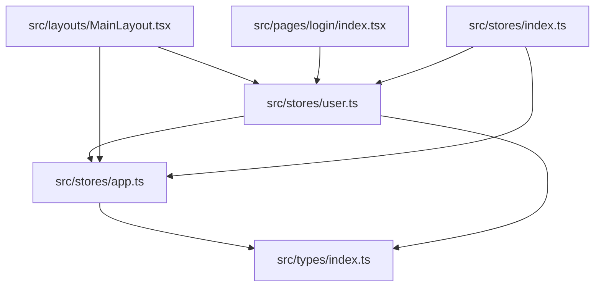

**图表来源**

- [src/stores/app.ts](file://src/stores/app.ts#L1-L3)
- [src/stores/user.ts](file://src/stores/user.ts#L1-L4)
- [src/layouts/MainLayout.tsx](file://src/layouts/MainLayout.tsx#L14)
- [src/pages/login/index.tsx](file://src/pages/login/index.tsx#L6)

**章节来源**

- [package.json](file://package.json#L20-L36)
- [src/stores/app.ts](file://src/stores/app.ts#L1-L59)
- [src/stores/user.ts](file://src/stores/user.ts#L1-L76)

## 性能考虑

### 中间件性能优化

项目在性能方面的考虑主要体现在以下几个方面：

1. **状态选择性持久化**：通过`partialize`函数只持久化必要的状态字段
2. **不可变更新优化**：Immer中间件提供高效的不可变更新机制
3. **组件订阅优化**：使用选择器模式减少不必要的组件重渲染

### 最佳实践建议

基于项目现有实现，以下是推荐的性能优化策略：

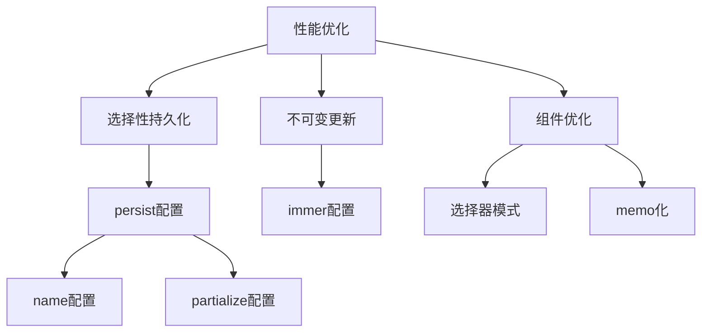

## 故障排除指南

### 常见问题诊断

#### 状态未持久化问题

当遇到状态未持久化的问题时，可以按照以下步骤排查：

1. **检查存储键名冲突**：确认`name`配置是否与其他存储冲突
2. **验证partialize函数**：确保只返回需要持久化的状态字段
3. **检查浏览器存储限制**：确认localStorage容量是否足够

#### 类型安全问题

如果遇到TypeScript类型错误：

1. **检查接口定义**：确保状态接口与实际状态结构一致
2. **验证泛型参数**：确认create函数的泛型参数正确
3. **检查类型导入**：确保相关类型定义已正确导入

**章节来源**

- [src/stores/app.ts](file://src/stores/app.ts#L49-L57)
- [src/stores/user.ts](file://src/stores/user.ts#L67-L73)

## 结论

本项目成功集成了Zustand状态管理库，通过以下关键特性实现了高效的状态管理：

1. **完整的中间件集成**：同时使用persist和immer中间件，提供持久化和不可变更新能力
2. **类型安全设计**：完整的TypeScript类型定义确保编译时类型检查
3. **模块化架构**：按领域划分的状态存储便于维护和扩展
4. **最佳实践遵循**：遵循Zustand官方推荐的使用模式

项目展示了现代React应用中状态管理的最佳实践，为后续功能扩展奠定了坚实的基础。

## 附录

### 配置参考

#### persist中间件配置选项

| 选项        | 类型                     | 描述         | 默认值         |
| ----------- | ------------------------ | ------------ | -------------- |
| name        | string                   | 存储键名     | 必填           |
| storage     | Storage                  | 存储实现     | localStorage   |
| partialize  | (state: S) => Partial<S> | 状态选择函数 | undefined      |
| serialize   | (state: S) => string     | 序列化函数   | JSON.stringify |
| deserialize | (str: string) => S       | 反序列化函数 | JSON.parse     |

#### immer中间件配置选项

| 选项     | 类型                       | 描述       | 默认值    |
| -------- | -------------------------- | ---------- | --------- |
| enhancer | (fn: StoreApi) => StoreApi | 增强函数   | undefined |
| devmode  | boolean                    | 开发者模式 | false     |

### 使用示例路径

- [应用状态创建](file://src/stores/app.ts#L18-L58)
- [用户状态创建](file://src/stores/user.ts#L21-L75)
- [状态导出模块](file://src/stores/index.ts#L1-L3)
- [布局组件使用](file://src/layouts/MainLayout.tsx#L23-L24)
- [登录页面使用](file://src/pages/login/index.tsx#L34-L43)
