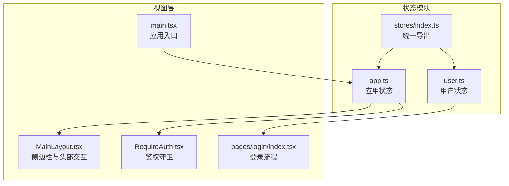
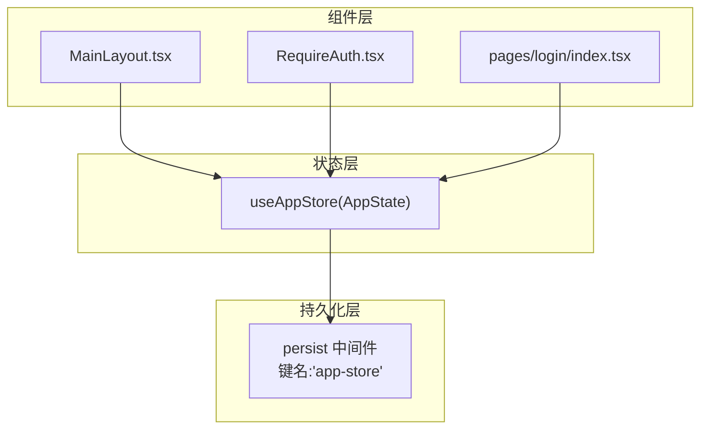
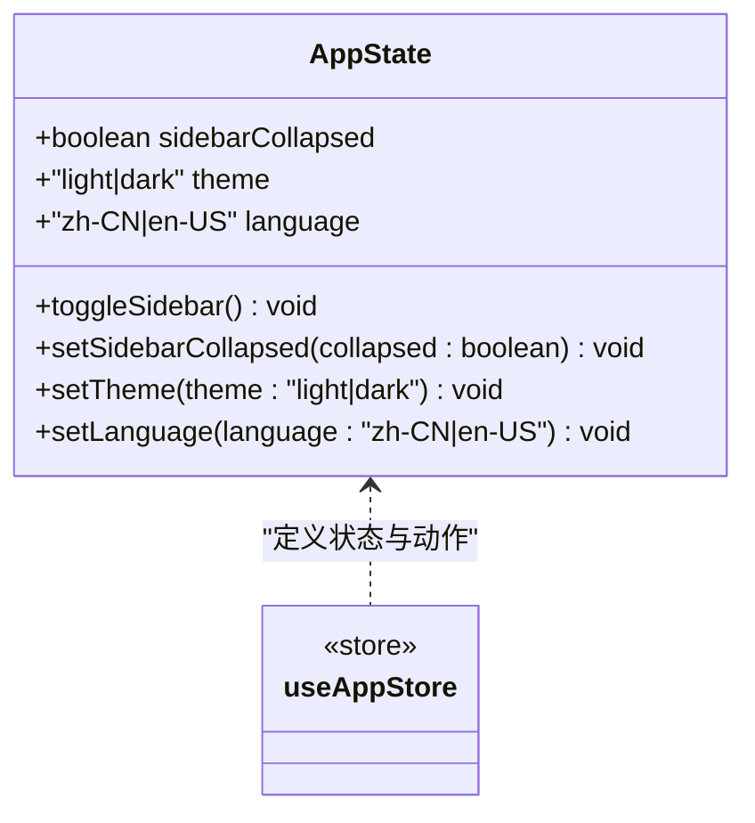
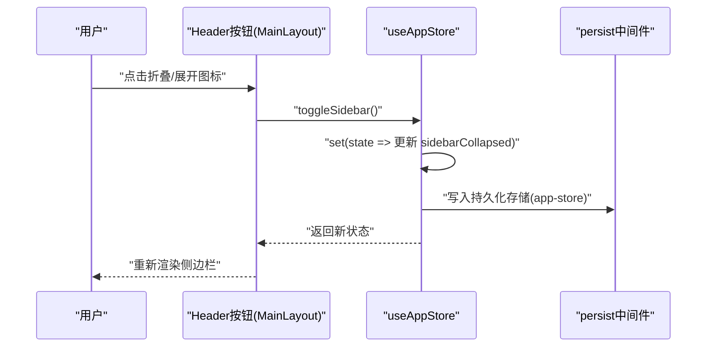
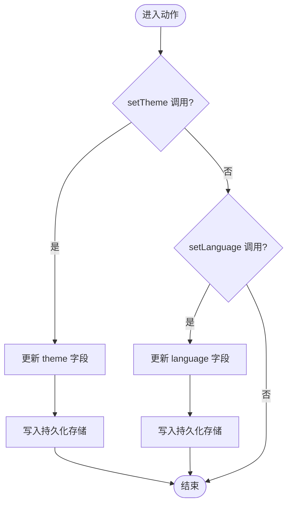
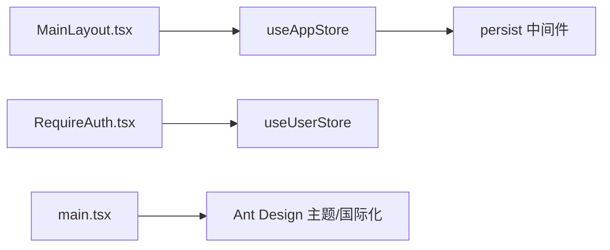

# 应用状态管理

<cite>
**本文引用的文件**
- [src/stores/app.ts](file://src/stores/app.ts)
- [src/stores/index.ts](file://src/stores/index.ts)
- [src/layouts/MainLayout.tsx](file://src/layouts/MainLayout.tsx)
- [src/constants/config.ts](file://src/constants/config.ts)
- [src/constants/enum.ts](file://src/constants/enum.ts)
- [src/main.tsx](file://src/main.tsx)
- [src/router/guards/RequireAuth.tsx](file://src/router/guards/RequireAuth.tsx)
- [src/pages/login/index.tsx](file://src/pages/login/index.tsx)
</cite>

## 目录

1. [简介](#简介)
2. [项目结构](#项目结构)
3. [核心组件](#核心组件)
4. [架构概览](#架构概览)
5. [详细组件分析](#详细组件分析)
6. [依赖分析](#依赖分析)
7. [性能考虑](#性能考虑)
8. [故障排查指南](#故障排查指南)
9. [结论](#结论)
10. [附录](#附录)

## 简介

本文件系统性梳理应用状态管理的设计与实现，重点围绕应用层状态（App Store）展开，覆盖以下主题：

- 设计理念与职责边界：集中管理全局状态（侧边栏折叠、主题、语言），通过轻量中间件实现状态持久化与不可变更新。
- 数据模型与默认值：明确每个状态字段的数据类型、初始值及取值范围。
- 动作方法与使用场景：toggleSidebar、setSidebarCollapsed、setTheme、setLanguage 的实现原理与典型调用点。
- 持久化策略：持久化键名、持久化范围与选择理由。
- 使用最佳实践：状态订阅、更新与性能优化建议，并给出在组件中使用状态与监听变化的参考路径。

## 项目结构

应用状态管理位于 stores 目录，采用按功能域拆分的模块化组织方式：

- app.ts：应用级全局状态（侧边栏、主题、语言）
- user.ts：用户相关状态（用户信息、令牌、权限）
- index.ts：导出各 store 实例，便于统一导入

**图表来源**

- [src/stores/app.ts](file://src/stores/app.ts#L1-L59)
- [src/stores/index.ts](file://src/stores/index.ts#L1-L3)
- [src/layouts/MainLayout.tsx](file://src/layouts/MainLayout.tsx#L1-L174)
- [src/router/guards/RequireAuth.tsx](file://src/router/guards/RequireAuth.tsx#L1-L25)
- [src/pages/login/index.tsx](file://src/pages/login/index.tsx#L1-L133)
- [src/main.tsx](file://src/main.tsx#L1-L32)

**章节来源**

- [src/stores/app.ts](file://src/stores/app.ts#L1-L59)
- [src/stores/index.ts](file://src/stores/index.ts#L1-L3)

## 核心组件

本节聚焦应用状态（App Store）的核心数据结构与动作方法，阐明其职责边界与默认行为。

- 状态字段
  - sidebarCollapsed: boolean
    - 类型：布尔值
    - 默认值：false
    - 语义：控制侧边栏是否折叠
  - theme: 'light' | 'dark'
    - 类型：字面量联合类型
    - 默认值：'light'
    - 语义：当前主题模式
  - language: 'zh-CN' | 'en-US'
    - 类型：字面量联合类型
    - 默认值：'zh-CN'
    - 语义：当前界面语言

- 动作方法
  - toggleSidebar(): 切换 sidebarCollapsed 的布尔值
  - setSidebarCollapsed(collapsed: boolean): 直接设置 sidebarCollapsed
  - setTheme(theme: 'light' | 'dark'): 设置主题
  - setLanguage(language: 'zh-CN' | 'en-US'): 设置语言

- 持久化配置
  - 存储键名：'app-store'
  - 持久化字段：sidebarCollapsed、theme、language
  - 选择理由：这些状态直接影响用户体验与界面呈现，需要跨会话保持一致；避免持久化过多字段以降低存储开销与潜在风险。

**章节来源**

- [src/stores/app.ts](file://src/stores/app.ts#L5-L16)
- [src/stores/app.ts](file://src/stores/app.ts#L18-L58)
- [src/stores/app.ts](file://src/stores/app.ts#L49-L57)

## 架构概览

下图展示了应用状态在运行时的交互关系：组件通过 hooks 订阅状态，触发动作更新状态，持久化中间件负责同步到本地存储。

**图表来源**

- [src/layouts/MainLayout.tsx](file://src/layouts/MainLayout.tsx#L13-L24)
- [src/router/guards/RequireAuth.tsx](file://src/router/guards/RequireAuth.tsx#L4-L15)
- [src/pages/login/index.tsx](file://src/pages/login/index.tsx#L6-L40)
- [src/stores/app.ts](file://src/stores/app.ts#L18-L58)

## 详细组件分析

### 应用状态（App Store）类图

该类图映射实际代码中的状态字段与动作方法，体现不可变更新与持久化策略。

**图表来源**

- [src/stores/app.ts](file://src/stores/app.ts#L5-L16)
- [src/stores/app.ts](file://src/stores/app.ts#L18-L48)

**章节来源**

- [src/stores/app.ts](file://src/stores/app.ts#L5-L16)
- [src/stores/app.ts](file://src/stores/app.ts#L18-L48)

### 侧边栏状态切换序列图

演示从用户点击到状态更新再到 UI 反应的完整流程。

**图表来源**

- [src/layouts/MainLayout.tsx](file://src/layouts/MainLayout.tsx#L119-L125)
- [src/stores/app.ts](file://src/stores/app.ts#L25-L29)
- [src/stores/app.ts](file://src/stores/app.ts#L49-L57)

**章节来源**

- [src/layouts/MainLayout.tsx](file://src/layouts/MainLayout.tsx#L119-L125)
- [src/stores/app.ts](file://src/stores/app.ts#L25-L29)

### 主题与语言设置流程图

展示 setTheme 与 setLanguage 的执行路径与持久化写入。

**图表来源**

- [src/stores/app.ts](file://src/stores/app.ts#L37-L47)
- [src/stores/app.ts](file://src/stores/app.ts#L49-L57)

**章节来源**

- [src/stores/app.ts](file://src/stores/app.ts#L37-L47)
- [src/stores/app.ts](file://src/stores/app.ts#L49-L57)

### 在组件中使用应用状态的最佳实践

- 订阅状态
  - 在组件中直接解构所需字段，例如在布局组件中订阅侧边栏折叠状态与切换动作。
  - 参考路径：[src/layouts/MainLayout.tsx](file://src/layouts/MainLayout.tsx#L23-L24)
- 触发动作
  - 将动作绑定到 UI 事件，如点击按钮触发 toggleSidebar。
  - 参考路径：[src/layouts/MainLayout.tsx](file://src/layouts/MainLayout.tsx#L119-L125)
- 条件渲染与样式
  - 根据 sidebarCollapsed 控制侧边栏宽度与标题显示，减少不必要的重渲染。
  - 参考路径：[src/layouts/MainLayout.tsx](file://src/layouts/MainLayout.tsx#L75-L97)
- 持久化验证
  - 在浏览器开发者工具的 Application/Local Storage 中确认键名为 'app-store' 的条目存在且包含期望字段。
  - 参考路径：[src/stores/app.ts](file://src/stores/app.ts#L50-L55)

**章节来源**

- [src/layouts/MainLayout.tsx](file://src/layouts/MainLayout.tsx#L23-L24)
- [src/layouts/MainLayout.tsx](file://src/layouts/MainLayout.tsx#L75-L97)
- [src/stores/app.ts](file://src/stores/app.ts#L50-L55)

## 依赖分析

- 组件对状态的依赖
  - MainLayout 依赖 useAppStore 的 sidebarCollapsed 与 toggleSidebar
  - RequireAuth 依赖 useAppStore 的 token（间接通过用户状态）
- 状态对持久化的依赖
  - persist 中间件为 app-store 提供跨会话持久化能力
- 入口对状态的影响
  - main.tsx 作为应用入口，不直接依赖 App Store，但 Ant Design 的 ConfigProvider 与主题 token 影响 UI 渲染

**图表来源**

- [src/layouts/MainLayout.tsx](file://src/layouts/MainLayout.tsx#L13-L24)
- [src/router/guards/RequireAuth.tsx](file://src/router/guards/RequireAuth.tsx#L4-L15)
- [src/stores/app.ts](file://src/stores/app.ts#L18-L58)
- [src/main.tsx](file://src/main.tsx#L17-L31)

**章节来源**

- [src/layouts/MainLayout.tsx](file://src/layouts/MainLayout.tsx#L13-L24)
- [src/router/guards/RequireAuth.tsx](file://src/router/guards/RequireAuth.tsx#L4-L15)
- [src/stores/app.ts](file://src/stores/app.ts#L18-L58)
- [src/main.tsx](file://src/main.tsx#L17-L31)

## 性能考虑

- 仅订阅必要字段：避免因全局状态变更导致的不必要重渲染。例如只订阅 sidebarCollapsed 而非整个状态对象。
- 合理拆分 store：将用户状态与应用状态分离，降低耦合度与更新频率。
- 持久化粒度控制：仅持久化关键状态（如主题、语言、侧边栏折叠），避免存储冗余或敏感信息。
- 不可变更新：通过中间件确保状态更新为不可变操作，提升调试与追踪效率。
- 事件绑定去抖：对于频繁触发的动作（如窗口尺寸变化），可在组件层进行节流/防抖处理。

## 故障排查指南

- 症状：刷新后主题或语言未生效
  - 排查：确认浏览器 Local Storage 中是否存在键名为 'app-store' 的条目，且包含 theme 与 language 字段。
  - 参考路径：[src/stores/app.ts](file://src/stores/app.ts#L50-L55)
- 症状：侧边栏切换无效
  - 排查：检查组件中是否正确解构并调用 toggleSidebar；确认事件绑定是否正确。
  - 参考路径：[src/layouts/MainLayout.tsx](file://src/layouts/MainLayout.tsx#L119-L125)
- 症状：登录后仍被重定向至登录页
  - 排查：确认鉴权守卫读取的是 token 字段；检查登录流程是否正确写入用户状态。
  - 参考路径：[src/router/guards/RequireAuth.tsx](file://src/router/guards/RequireAuth.tsx#L15-L15)、[src/pages/login/index.tsx](file://src/pages/login/index.tsx#L34-L43)

**章节来源**

- [src/stores/app.ts](file://src/stores/app.ts#L50-L55)
- [src/layouts/MainLayout.tsx](file://src/layouts/MainLayout.tsx#L119-L125)
- [src/router/guards/RequireAuth.tsx](file://src/router/guards/RequireAuth.tsx#L15-L15)
- [src/pages/login/index.tsx](file://src/pages/login/index.tsx#L34-L43)

## 结论

本项目采用轻量、清晰的状态管理模式：以 Zustand 为核心，结合 Immer 保证不可变更新，借助 persist 实现关键全局状态的持久化。应用状态（App Store）聚焦于侧边栏、主题与语言三大维度，职责边界明确，易于维护与扩展。通过合理的订阅与更新策略，可在保证性能的同时提供一致的用户体验。

## 附录

- 默认值与取值范围对照
  - sidebarCollapsed: false
  - theme: 'light' | 'dark'
  - language: 'zh-CN' | 'en-US'
- 持久化键名
  - 'app-store'
- 相关常量与枚举
  - 默认主题与语言：参考应用配置常量
  - 主题与语言枚举：用于类型约束与扩展
  - 参考路径：[src/constants/config.ts](file://src/constants/config.ts#L13-L18)、[src/constants/enum.ts](file://src/constants/enum.ts#L33-L45)

**章节来源**

- [src/constants/config.ts](file://src/constants/config.ts#L13-L18)
- [src/constants/enum.ts](file://src/constants/enum.ts#L33-L45)
