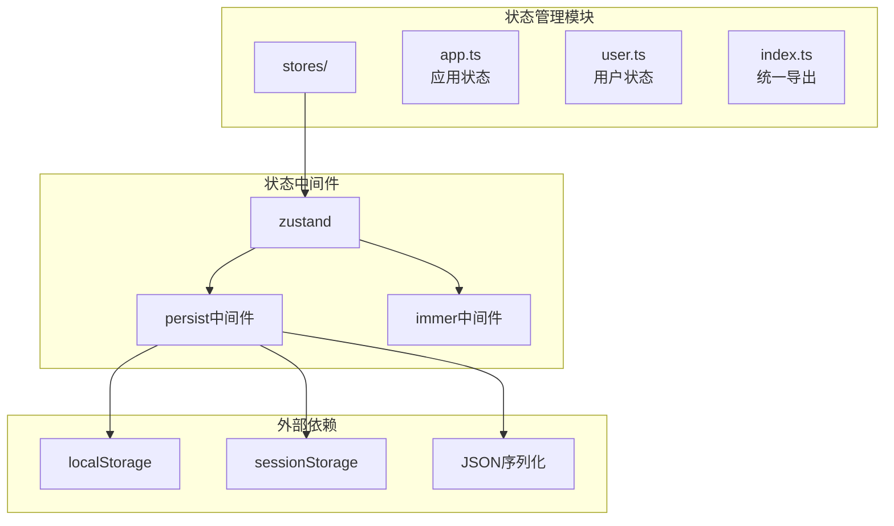
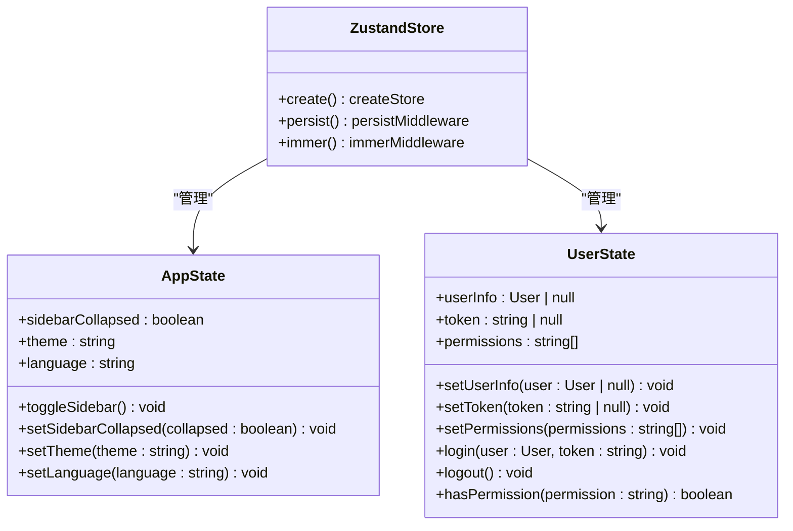
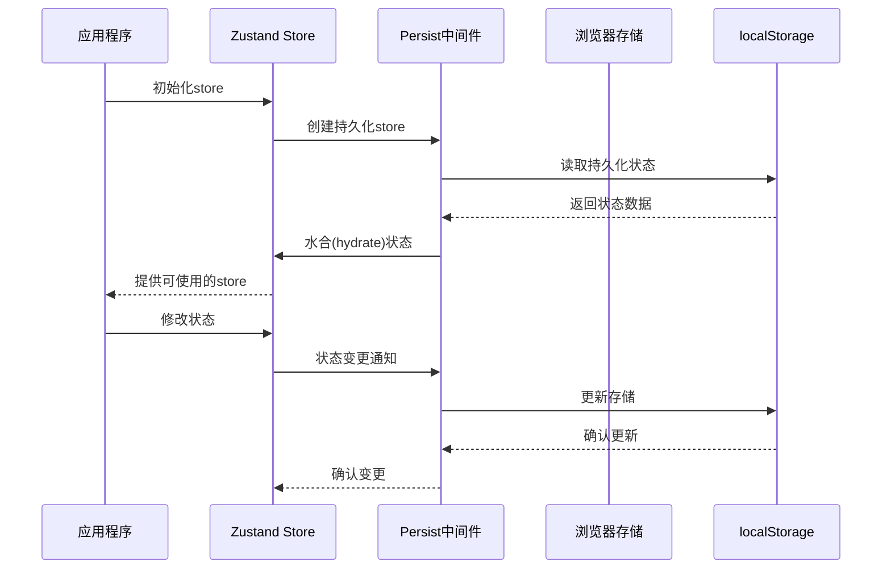
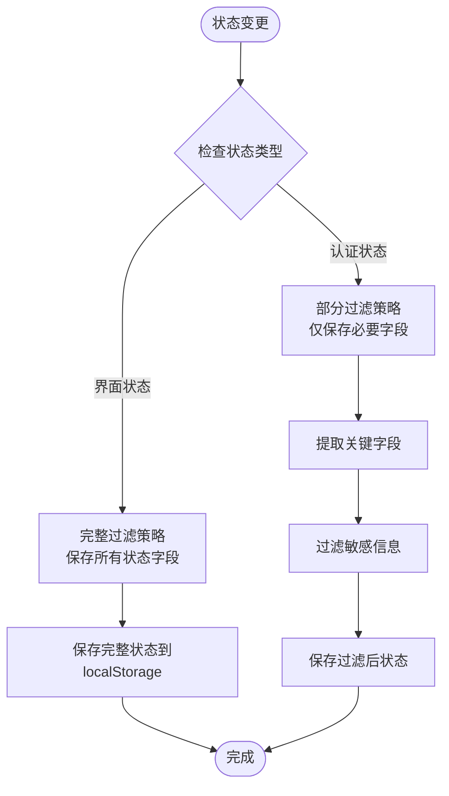
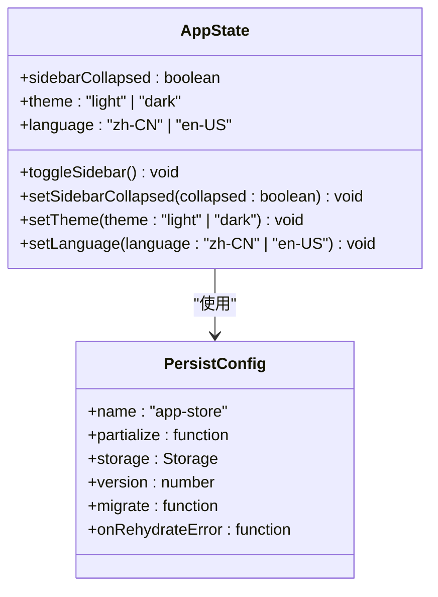
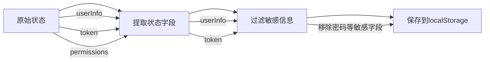
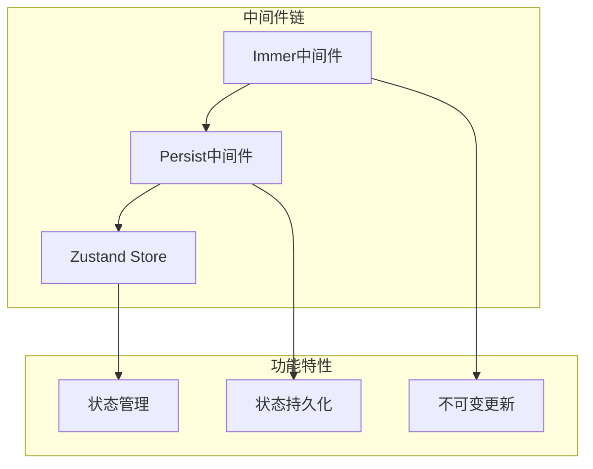
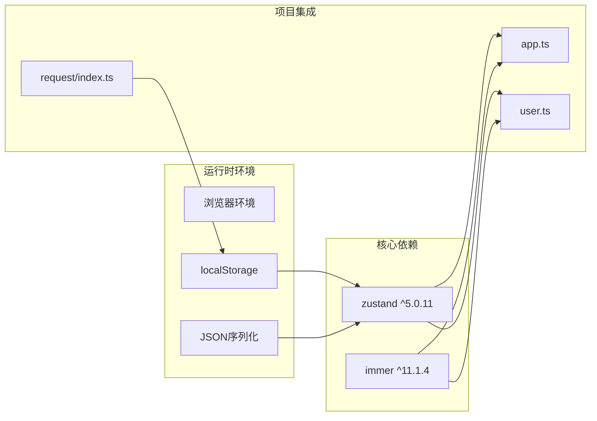
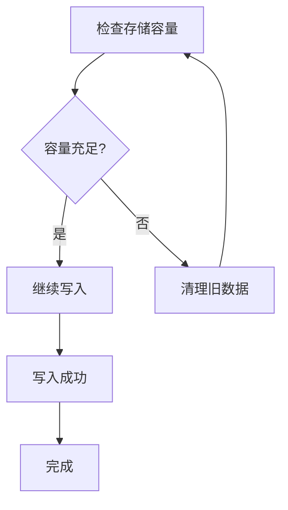

# 状态持久化机制

<cite>
**本文档引用的文件**
- [app.ts](file://src/stores/app.ts)
- [user.ts](file://src/stores/user.ts)
- [index.ts](file://src/stores/index.ts)
- [architecture.md](file://.ai/core/architecture.md)
- [index.ts](file://src/plugins/request/index.ts)
- [package.json](file://package.json)
</cite>

## 目录

1. [简介](#简介)
2. [项目结构](#项目结构)
3. [核心组件](#核心组件)
4. [架构概览](#架构概览)
5. [详细组件分析](#详细组件分析)
6. [依赖关系分析](#依赖关系分析)
7. [性能考虑](#性能考虑)
8. [故障排除指南](#故障排除指南)
9. [结论](#结论)

## 简介

本项目采用Zustand作为状态管理解决方案，并通过其内置的persist中间件实现状态持久化功能。Zustand是一个轻量级的状态管理库，具有简洁的API和优秀的性能表现。在本项目中，状态持久化主要用于保存用户界面偏好设置、主题配置以及用户认证信息等。

状态持久化机制的核心优势包括：

- **自动序列化/反序列化**：无需手动处理JSON转换
- **内存与存储同步**：确保内存中的状态与持久化存储保持一致
- **版本兼容性**：支持状态结构变更时的数据迁移
- **类型安全**：完整的TypeScript支持

## 项目结构

项目采用模块化的状态管理架构，每个功能域都有独立的状态存储文件：



**图表来源**

- [app.ts](file://src/stores/app.ts#L1-L59)
- [user.ts](file://src/stores/user.ts#L1-L76)
- [architecture.md](file://.ai/core/architecture.md#L140-L181)

**章节来源**

- [app.ts](file://src/stores/app.ts#L1-L59)
- [user.ts](file://src/stores/user.ts#L1-L76)
- [index.ts](file://src/stores/index.ts#L1-L3)

## 核心组件

### Zustand状态管理基础

Zustand提供了简洁的状态管理API，通过`create`函数创建状态存储。每个store都包含状态定义和操作方法：



**图表来源**

- [app.ts](file://src/stores/app.ts#L5-L16)
- [user.ts](file://src/stores/user.ts#L6-L19)

### 持久化中间件配置

每个store都通过`persist`中间件实现持久化功能，配置参数包括：

| 配置项           | 类型     | 必需 | 描述                                 |
| ---------------- | -------- | ---- | ------------------------------------ |
| name             | string   | 是   | 存储键名，用于区分不同store          |
| partialize       | function | 可选 | 状态过滤函数，决定哪些状态会被持久化 |
| storage          | Storage  | 可选 | 存储引擎，默认使用localStorage       |
| version          | number   | 可选 | 状态版本号，用于迁移                 |
| migrate          | function | 可选 | 数据迁移函数                         |
| onRehydrateError | function | 可选 | 水合错误回调                         |

**章节来源**

- [app.ts](file://src/stores/app.ts#L49-L57)
- [user.ts](file://src/stores/user.ts#L67-L74)

## 架构概览

### 状态持久化工作流程



**图表来源**

- [app.ts](file://src/stores/app.ts#L18-L58)
- [user.ts](file://src/stores/user.ts#L21-L75)

### 状态过滤策略

项目实现了两种不同的状态过滤策略：

1. **完整状态持久化**（app-store）：保存所有界面相关状态
2. **敏感状态过滤**（user-store）：仅保存必要的认证信息



**图表来源**

- [app.ts](file://src/stores/app.ts#L51-L56)
- [user.ts](file://src/stores/user.ts#L69-L73)

## 详细组件分析

### 应用状态存储（App Store）

应用状态存储负责管理用户界面的全局状态，包括侧边栏折叠状态、主题设置和语言配置。

#### 状态结构设计



**图表来源**

- [app.ts](file://src/stores/app.ts#L5-L16)
- [app.ts](file://src/stores/app.ts#L49-L57)

#### 状态过滤实现

应用状态采用了完整的状态过滤策略，确保所有界面相关配置都能被正确持久化：

```typescript
// 状态过滤函数示例
partialize: (state) => ({
  sidebarCollapsed: state.sidebarCollapsed,
  theme: state.theme,
  language: state.language,
});
```

这种设计的优势：

- **用户体验一致性**：用户偏好的界面设置能够跨会话保持
- **配置完整性**：主题和语言设置不会丢失
- **性能优化**：只保存必要的状态字段

**章节来源**

- [app.ts](file://src/stores/app.ts#L18-L58)

### 用户状态存储（User Store）

用户状态存储专门处理用户认证和权限管理相关的状态。

#### 敏感状态处理

用户状态采用了更严格的状态过滤策略，仅保存必要的认证信息：



**图表来源**

- [user.ts](file://src/stores/user.ts#L69-L73)

#### 登出清理机制

当用户登出时，系统不仅清除store中的状态，还会同步清理localStorage中的token：

```typescript
logout: () => {
  set((state) => {
    state.userInfo = null;
    state.token = null;
    state.permissions = [];
  });
  localStorage.removeItem('token');
};
```

这种双重清理机制确保了敏感信息不会残留在客户端存储中。

**章节来源**

- [user.ts](file://src/stores/user.ts#L53-L60)

### 状态中间件组合

项目采用了中间件组合的设计模式，将persist和immer中间件结合使用：



**图表来源**

- [app.ts](file://src/stores/app.ts#L1-L3)
- [user.ts](file://src/stores/user.ts#L1-L4)

**章节来源**

- [app.ts](file://src/stores/app.ts#L1-L3)
- [user.ts](file://src/stores/user.ts#L1-L4)

## 依赖关系分析

### 外部依赖关系

项目的状态持久化功能依赖于以下外部库：



**图表来源**

- [package.json](file://package.json#L20-L36)
- [app.ts](file://src/stores/app.ts#L1-L3)
- [user.ts](file://src/stores/user.ts#L1-L4)

### 版本兼容性

根据package.json配置，项目使用了以下版本：

- **Zustand**: ^5.0.11（支持persist中间件）
- **Immer**: ^11.1.4（提供不可变更新能力）

这些版本确保了状态持久化功能的稳定性和兼容性。

**章节来源**

- [package.json](file://package.json#L20-L36)

## 性能考虑

### 内存使用优化

1. **增量更新**：只持久化状态过滤函数返回的部分状态
2. **序列化开销**：避免不必要的深度序列化操作
3. **存储空间**：合理控制持久化状态的大小

### 加载性能

1. **异步水合**：状态从localStorage异步加载，不影响初始渲染
2. **懒加载策略**：非关键状态可以在需要时才加载
3. **缓存机制**：利用浏览器的localStorage缓存提升访问速度

### 存储容量管理



## 故障排除指南

### 常见问题及解决方案

#### 1. 状态无法持久化

**症状**：刷新页面后状态丢失
**原因**：

- localStorage不可用
- 存储键名冲突
- 序列化失败

**解决方案**：

- 检查浏览器是否禁用了localStorage
- 确认store名称唯一性
- 验证状态对象的可序列化性

#### 2. 状态恢复错误

**症状**：应用启动时报错或状态异常
**原因**：

- 数据格式不匹配
- 版本不兼容
- 迁移逻辑错误

**解决方案**：

- 实现适当的错误处理回调
- 使用版本控制进行数据迁移
- 在开发环境中测试迁移逻辑

#### 3. 敏感信息泄露

**症状**：localStorage中包含敏感数据
**原因**：状态过滤策略不当
**解决方案**：

- 实施严格的敏感信息过滤
- 定期审查状态过滤函数
- 使用更安全的存储方案

**章节来源**

- [user.ts](file://src/stores/user.ts#L59-L60)

## 结论

本项目的状态持久化机制通过Zustand的persist中间件实现了高效、可靠的状态管理。主要特点包括：

1. **模块化设计**：每个功能域都有独立的状态存储，便于维护和扩展
2. **类型安全**：完整的TypeScript支持确保开发时的类型安全
3. **灵活的过滤策略**：针对不同类型的敏感度实施差异化处理
4. **错误处理机制**：完善的错误处理和恢复策略
5. **性能优化**：合理的内存使用和加载策略

通过合理的状态过滤、敏感信息保护和错误处理机制，该状态持久化方案为用户提供了良好的使用体验，同时确保了数据的安全性和系统的稳定性。
