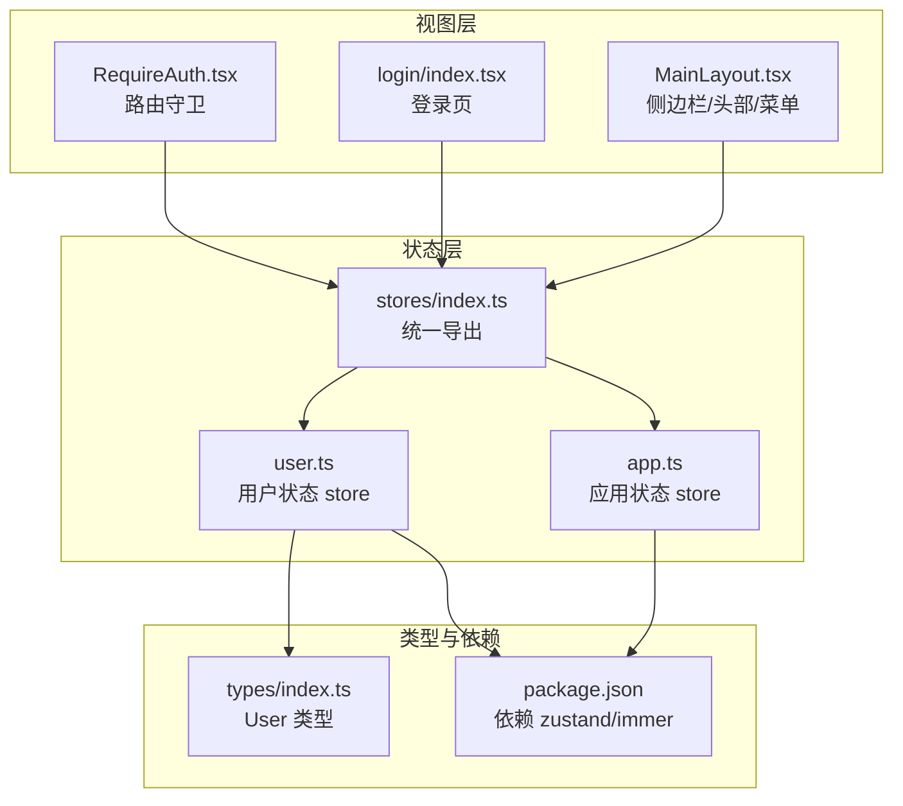
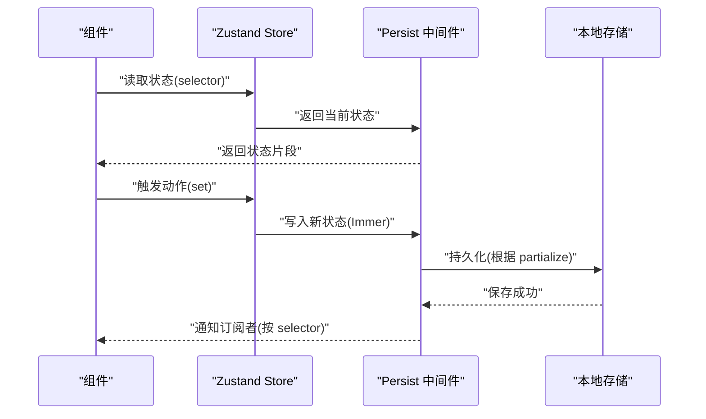
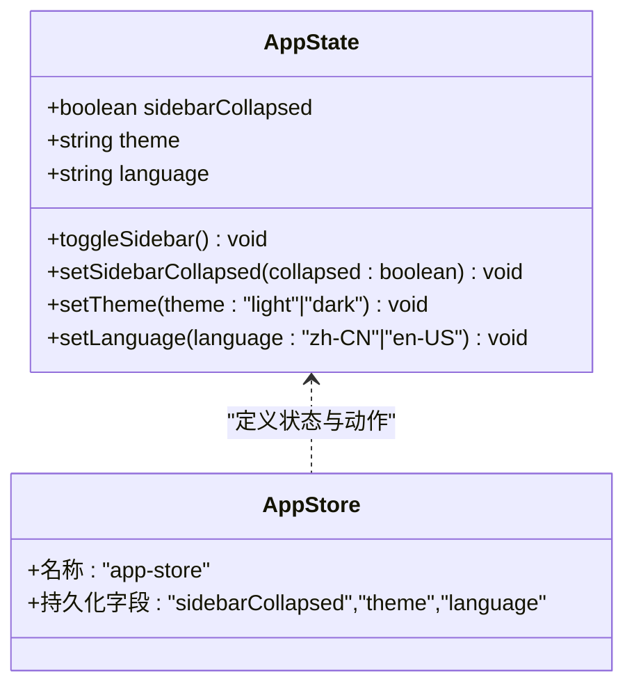
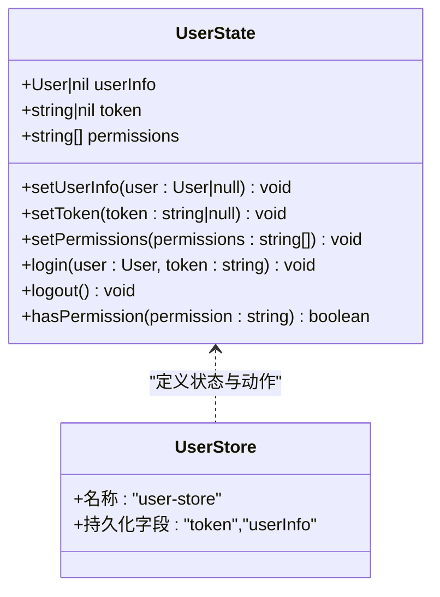
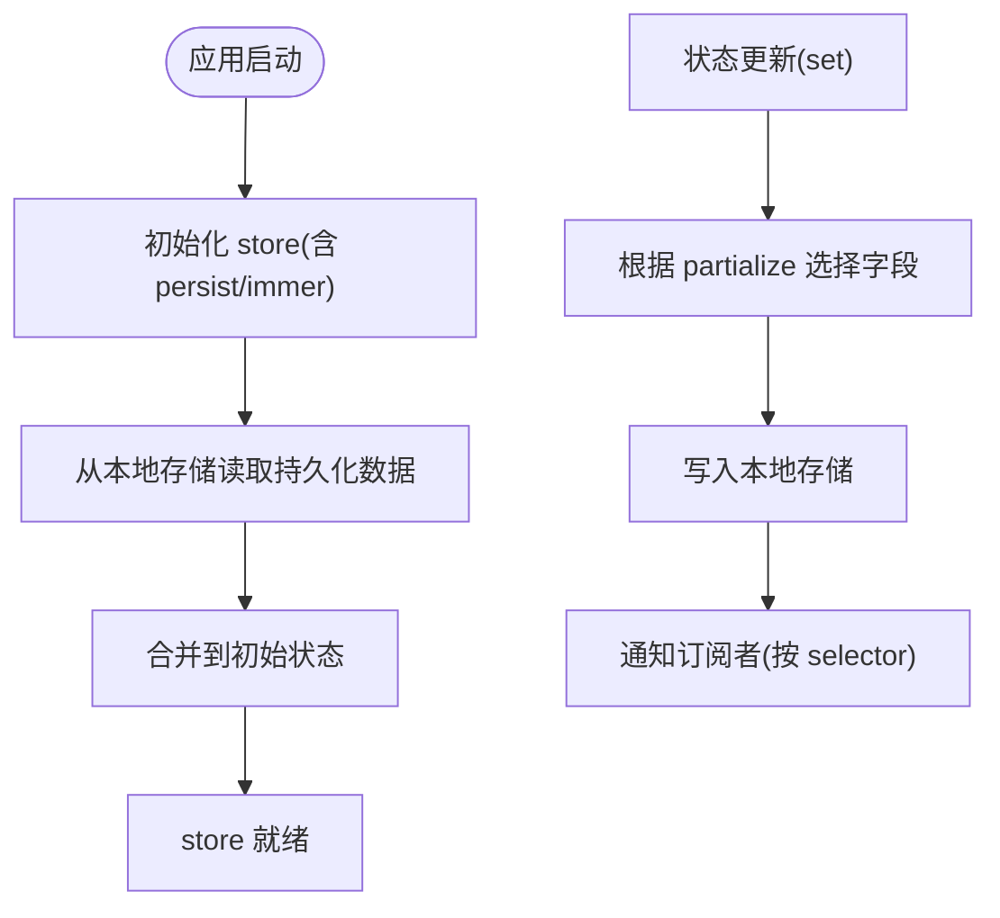
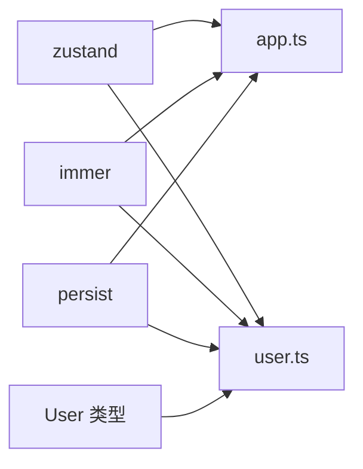

# 状态管理

<cite>
**本文引用的文件**
- [src/stores/index.ts](file://src/stores/index.ts)
- [src/stores/app.ts](file://src/stores/app.ts)
- [src/stores/user.ts](file://src/stores/user.ts)
- [src/types/index.ts](file://src/types/index.ts)
- [src/layouts/MainLayout.tsx](file://src/layouts/MainLayout.tsx)
- [src/pages/login/index.tsx](file://src/pages/login/index.tsx)
- [src/router/guards/RequireAuth.tsx](file://src/router/guards/RequireAuth.tsx)
- [package.json](file://package.json)
</cite>

## 目录

1. [简介](#简介)
2. [项目结构](#项目结构)
3. [核心组件](#核心组件)
4. [架构总览](#架构总览)
5. [详细组件分析](#详细组件分析)
6. [依赖关系分析](#依赖关系分析)
7. [性能考量](#性能考量)
8. [故障排查指南](#故障排查指南)
9. [结论](#结论)
10. [附录：最佳实践与示例路径](#附录最佳实践与示例路径)

## 简介

本项目采用 Zustand v5 作为状态管理方案，结合 Immer 中间件实现不可变更新，通过 Persist 中间件实现状态持久化到本地存储。项目内存在两个核心 store：

- 应用状态（app store）：负责界面主题、语言、侧边栏折叠等全局 UI 状态
- 用户状态（user store）：负责用户信息、令牌、权限等认证与用户态相关状态

同时，项目提供了统一的导出入口，便于在组件中按需引入。

## 项目结构

Zustand 相关代码集中在 src/stores 目录，配合路由守卫与页面组件共同完成认证与 UI 状态控制。

图表来源

- [src/stores/app.ts](file://src/stores/app.ts#L1-L59)
- [src/stores/user.ts](file://src/stores/user.ts#L1-L76)
- [src/stores/index.ts](file://src/stores/index.ts#L1-L3)
- [src/layouts/MainLayout.tsx](file://src/layouts/MainLayout.tsx#L14-L24)
- [src/pages/login/index.tsx](file://src/pages/login/index.tsx#L6-L43)
- [src/router/guards/RequireAuth.tsx](file://src/router/guards/RequireAuth.tsx#L4-L15)
- [src/types/index.ts](file://src/types/index.ts#L17-L28)
- [package.json](file://package.json#L20-L36)

章节来源

- [src/stores/index.ts](file://src/stores/index.ts#L1-L3)
- [src/stores/app.ts](file://src/stores/app.ts#L1-L59)
- [src/stores/user.ts](file://src/stores/user.ts#L1-L76)
- [src/types/index.ts](file://src/types/index.ts#L17-L28)
- [package.json](file://package.json#L20-L36)

## 核心组件

- 应用状态（app store）
  - 状态字段：sidebarCollapsed（侧边栏折叠）、theme（主题）、language（语言）
  - 动作：toggleSidebar、setSidebarCollapsed、setTheme、setLanguage
  - 持久化：仅持久化 sidebarCollapsed、theme、language
- 用户状态（user store）
  - 状态字段：userInfo（用户信息）、token（访问令牌）、permissions（权限列表）
  - 动作：setUserInfo、setToken、setPermissions、login、logout、hasPermission
  - 持久化：仅持久化 token 与 userInfo
  - 退出登录时清理本地存储中的 token

章节来源

- [src/stores/app.ts](file://src/stores/app.ts#L5-L16)
- [src/stores/app.ts](file://src/stores/app.ts#L18-L58)
- [src/stores/user.ts](file://src/stores/user.ts#L6-L19)
- [src/stores/user.ts](file://src/stores/user.ts#L21-L75)

## 架构总览

Zustand 在本项目中的应用遵循“单一职责”的 store 设计：app store 负责 UI 展现相关状态，user store 负责认证与用户态。二者通过中间件组合实现不可变更新与持久化，组件通过 selector 订阅所需状态片段，避免不必要重渲染。

图表来源

- [src/stores/app.ts](file://src/stores/app.ts#L18-L58)
- [src/stores/user.ts](file://src/stores/user.ts#L21-L75)

## 详细组件分析

### 应用状态（app store）分析

- 设计模式
  - 使用 create 创建 store，结合 persist 与 immer 中间件
  - 通过接口定义明确的状态与动作签名
- 数据模型
  - sidebarCollapsed: boolean
  - theme: 'light' | 'dark'
  - language: 'zh-CN' | 'en-US'
- 动作组织
  - toggleSidebar：切换侧边栏折叠状态
  - setSidebarCollapsed：设置侧边栏折叠状态
  - setTheme：设置主题
  - setLanguage：设置语言
- 持久化策略
  - 名称：app-store
  - 只持久化 sidebarCollapsed、theme、language

图表来源

- [src/stores/app.ts](file://src/stores/app.ts#L5-L16)
- [src/stores/app.ts](file://src/stores/app.ts#L18-L58)

章节来源

- [src/stores/app.ts](file://src/stores/app.ts#L5-L16)
- [src/stores/app.ts](file://src/stores/app.ts#L18-L58)

### 用户状态（user store）分析

- 设计模式
  - 使用 create 创建 store，结合 persist 与 immer 中间件
  - 通过接口定义明确的状态与动作签名
- 数据模型
  - userInfo: User | null
  - token: string | null
  - permissions: string[]
- 动作组织
  - setUserInfo：设置用户信息
  - setToken：设置令牌
  - setPermissions：设置权限列表
  - login：一次性设置用户与令牌
  - logout：清空用户态并移除本地 token
  - hasPermission：基于权限列表判断是否拥有某权限
- 持久化策略
  - 名称：user-store
  - 只持久化 token 与 userInfo

图表来源

- [src/stores/user.ts](file://src/stores/user.ts#L6-L19)
- [src/stores/user.ts](file://src/stores/user.ts#L21-L75)
- [src/types/index.ts](file://src/types/index.ts#L17-L28)

章节来源

- [src/stores/user.ts](file://src/stores/user.ts#L6-L19)
- [src/stores/user.ts](file://src/stores/user.ts#L21-L75)
- [src/types/index.ts](file://src/types/index.ts#L17-L28)

### 组件集成与使用示例

#### 在布局组件中使用 app store

- 订阅状态：从 useAppStore 解构 sidebarCollapsed、toggleSidebar
- 触发动作：点击图标调用 toggleSidebar 切换侧边栏折叠状态
- 作用：控制侧边栏显示/隐藏与标题文案

章节来源

- [src/layouts/MainLayout.tsx](file://src/layouts/MainLayout.tsx#L23-L24)

#### 在登录页中使用 user store

- 订阅动作：从 useUserStore 获取 state.login
- 异步登录：使用外部请求钩子发起登录，成功后调用 login(user, token)
- 导航跳转：登录成功后跳转至首页

章节来源

- [src/pages/login/index.tsx](file://src/pages/login/index.tsx#L34-L43)

#### 在路由守卫中使用 user store

- 订阅状态：使用 selector 读取 token
- 权限控制：无 token 则重定向到登录页

章节来源

- [src/router/guards/RequireAuth.tsx](file://src/router/guards/RequireAuth.tsx#L15-L19)

### 状态持久化流程与数据同步

- 持久化触发时机
  - 每次状态更新后，persist 中间件根据 partialize 选择性写入本地存储
- 恢复流程
  - 应用启动时，persist 中间件从本地存储读取匹配键值，合并到初始状态
- 数据同步方式
  - 通过中间件的 name 与 partialize 控制持久化范围，避免持久化敏感或冗余数据

图表来源

- [src/stores/app.ts](file://src/stores/app.ts#L49-L57)
- [src/stores/user.ts](file://src/stores/user.ts#L67-L73)

章节来源

- [src/stores/app.ts](file://src/stores/app.ts#L49-L57)
- [src/stores/user.ts](file://src/stores/user.ts#L67-L73)

## 依赖关系分析

- Zustand 生态
  - zustand：核心状态库
  - immer：不可变更新中间件
  - persist：持久化中间件
- 类型依赖
  - User 类型来自 src/types/index.ts，用于 user store 的 userInfo 字段

图表来源

- [package.json](file://package.json#L20-L36)
- [src/stores/app.ts](file://src/stores/app.ts#L1-L3)
- [src/stores/user.ts](file://src/stores/user.ts#L1-L4)
- [src/types/index.ts](file://src/types/index.ts#L17-L28)

章节来源

- [package.json](file://package.json#L20-L36)
- [src/stores/app.ts](file://src/stores/app.ts#L1-L3)
- [src/stores/user.ts](file://src/stores/user.ts#L1-L4)
- [src/types/index.ts](file://src/types/index.ts#L17-L28)

## 性能考量

- 选择器订阅
  - 使用 selector 仅订阅需要的状态片段，减少不必要的重渲染
  - 示例：路由守卫中仅读取 token，登录页中仅读取 login 动作
- 不可变更新
  - 通过 immer 中间件简化不可变更新逻辑，降低心智负担
- 持久化粒度
  - 通过 partialize 精准控制持久化字段，避免持久化大对象或敏感数据
- 动作拆分
  - 将复杂业务拆分为多个小动作，提升可维护性与可测试性

章节来源

- [src/router/guards/RequireAuth.tsx](file://src/router/guards/RequireAuth.tsx#L15-L15)
- [src/pages/login/index.tsx](file://src/pages/login/index.tsx#L34-L34)
- [src/stores/app.ts](file://src/stores/app.ts#L49-L57)
- [src/stores/user.ts](file://src/stores/user.ts#L67-L73)

## 故障排查指南

- 无法登录或跳转异常
  - 检查登录页是否正确调用 state.login 并传入用户与令牌
  - 检查路由守卫是否正确读取 token
- 侧边栏状态未生效
  - 检查布局组件是否正确订阅 sidebarCollapsed 与 toggleSidebar
- 主题/语言未持久化
  - 检查 app store 的 persist 配置与 partialize 是否包含对应字段
- 令牌未持久化或被清除
  - 检查 user store 的 persist 配置与 logout 是否误删 token 键

章节来源

- [src/pages/login/index.tsx](file://src/pages/login/index.tsx#L34-L43)
- [src/router/guards/RequireAuth.tsx](file://src/router/guards/RequireAuth.tsx#L15-L19)
- [src/layouts/MainLayout.tsx](file://src/layouts/MainLayout.tsx#L23-L24)
- [src/stores/app.ts](file://src/stores/app.ts#L49-L57)
- [src/stores/user.ts](file://src/stores/user.ts#L59-L59)

## 结论

本项目通过 Zustand 实现了清晰的分层状态管理：UI 展现状态集中于 app store，用户态与认证状态集中于 user store。借助 persist 与 immer 中间件，实现了简洁的持久化与不可变更新；通过 selector 订阅与动作拆分，提升了性能与可维护性。建议在后续扩展中继续遵循现有模式，保持 store 的单一职责与最小暴露面。

## 附录：最佳实践与示例路径

- 创建 store
  - 参考路径：[src/stores/app.ts](file://src/stores/app.ts#L18-L58)
  - 参考路径：[src/stores/user.ts](file://src/stores/user.ts#L21-L75)
- 定义动作
  - 参考路径：[src/stores/app.ts](file://src/stores/app.ts#L25-L47)
  - 参考路径：[src/stores/user.ts](file://src/stores/user.ts#L28-L65)
- 订阅状态变化
  - 参考路径：[src/layouts/MainLayout.tsx](file://src/layouts/MainLayout.tsx#L23-L24)
  - 参考路径：[src/router/guards/RequireAuth.tsx](file://src/router/guards/RequireAuth.tsx#L15-L15)
- 异步操作处理
  - 参考路径：[src/pages/login/index.tsx](file://src/pages/login/index.tsx#L36-L43)
- 状态持久化
  - 参考路径：[src/stores/app.ts](file://src/stores/app.ts#L49-L57)
  - 参考路径：[src/stores/user.ts](file://src/stores/user.ts#L67-L73)
