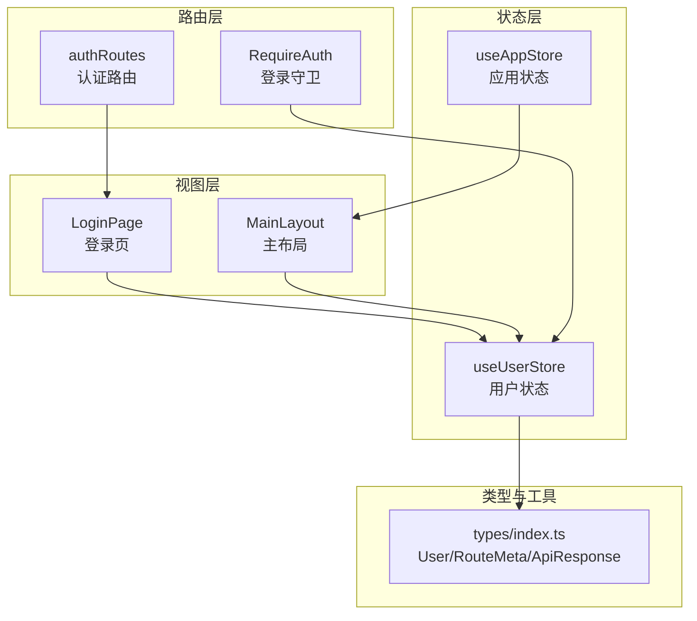
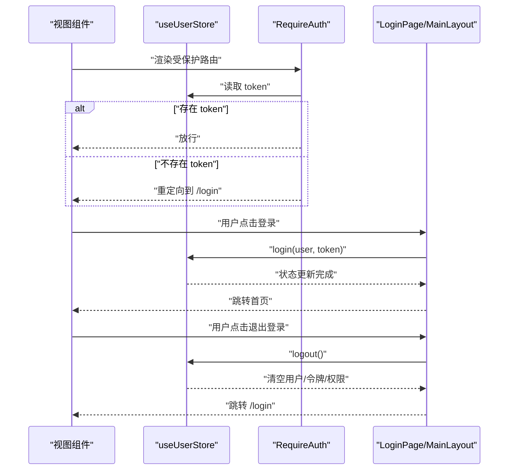
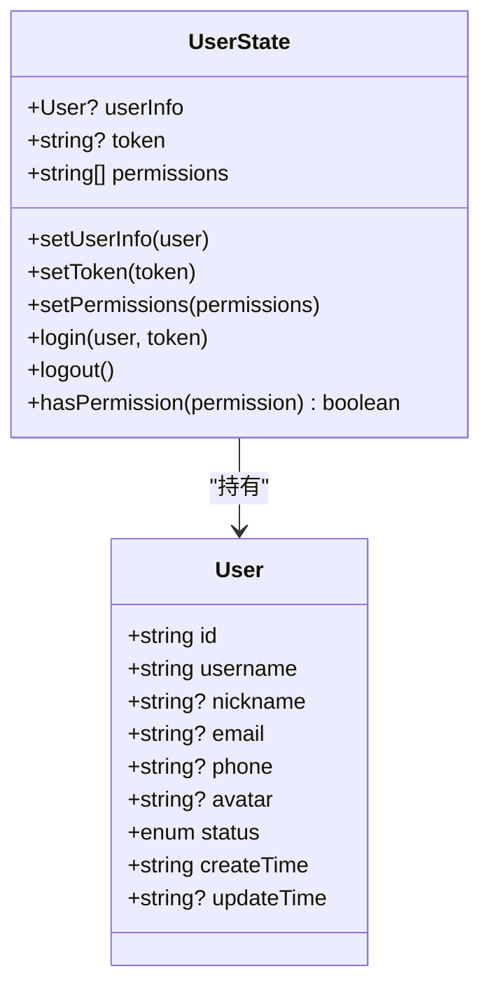
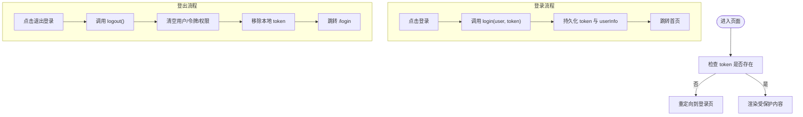
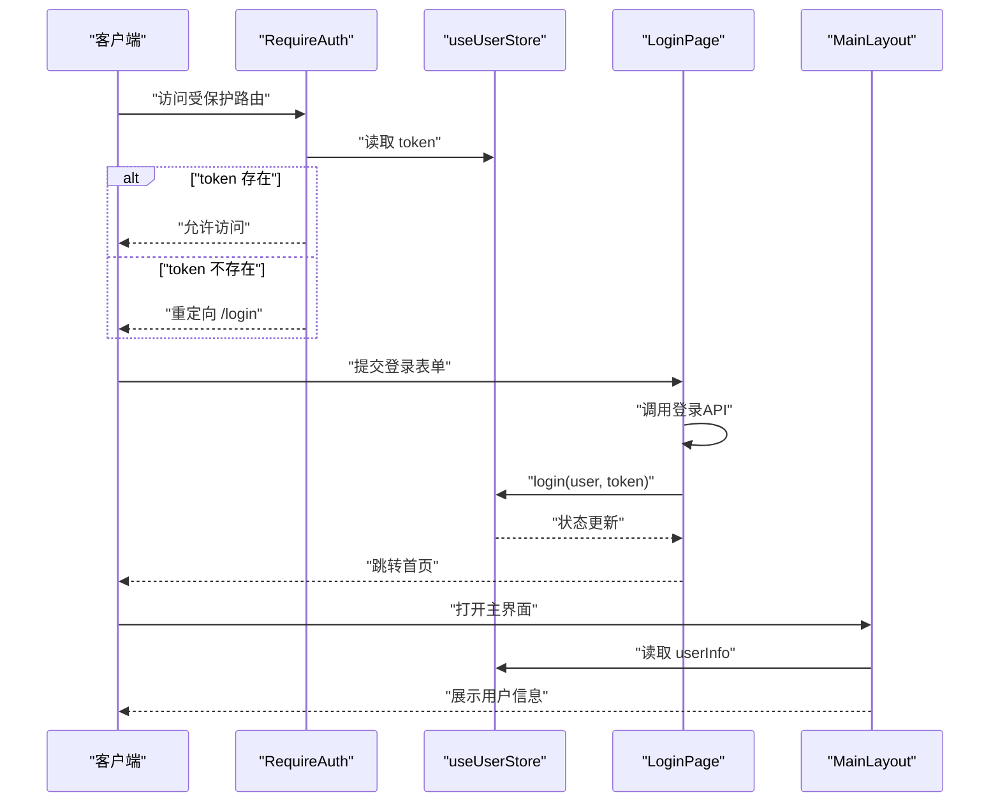
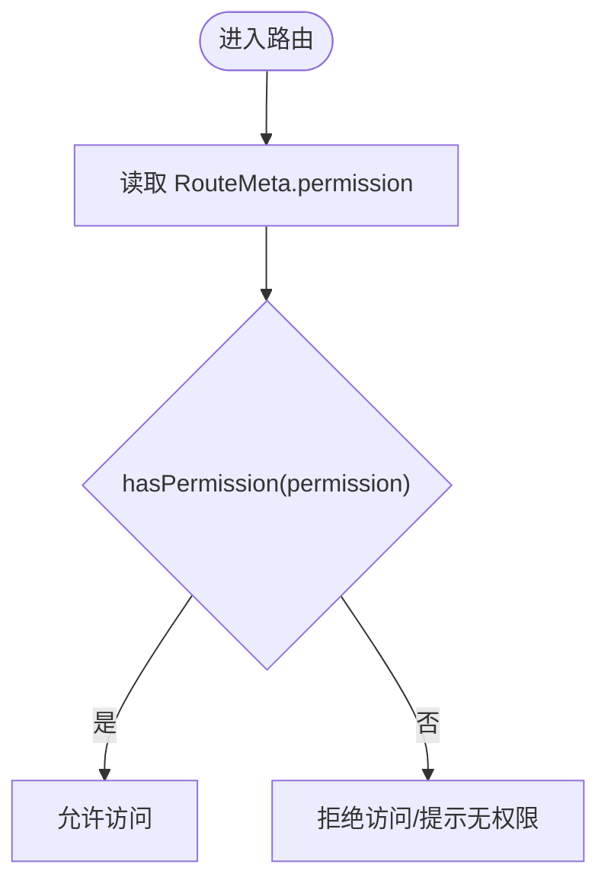
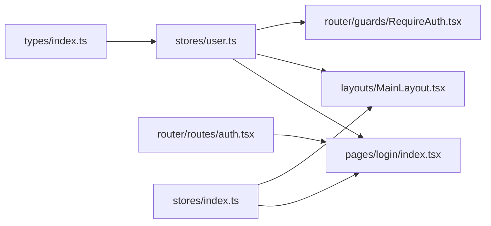

# 用户状态管理

<cite>
**本文引用的文件**
- [src/stores/user.ts](file://src/stores/user.ts)
- [src/types/index.ts](file://src/types/index.ts)
- [src/router/guards/RequireAuth.tsx](file://src/router/guards/RequireAuth.tsx)
- [src/pages/login/index.tsx](file://src/pages/login/index.tsx)
- [src/layouts/MainLayout.tsx](file://src/layouts/MainLayout.tsx)
- [src/stores/index.ts](file://src/stores/index.ts)
- [src/router/routes/auth.tsx](file://src/router/routes/auth.tsx)
- [src/main.tsx](file://src/main.tsx)
- [mock/routes.json](file://mock/routes.json)
</cite>

## 目录

1. [简介](#简介)
2. [项目结构](#项目结构)
3. [核心组件](#核心组件)
4. [架构总览](#架构总览)
5. [详细组件分析](#详细组件分析)
6. [依赖关系分析](#依赖关系分析)
7. [性能考量](#性能考量)
8. [故障排查指南](#故障排查指南)
9. [结论](#结论)
10. [附录](#附录)

## 简介

本文件聚焦于用户状态管理模块，系统性阐述基于 Zustand 的用户状态设计与实现，涵盖数据模型、状态生命周期、与认证系统的集成、权限校验机制以及最佳实践。通过登录、登出、状态更新等流程，结合路由守卫与布局组件，形成完整的前端用户态闭环。

## 项目结构

围绕用户状态管理的关键目录与文件如下：

- 状态存储：src/stores/user.ts（用户store）、src/stores/app.ts（应用store）
- 类型定义：src/types/index.ts（用户、路由元信息、API响应等）
- 路由与守卫：src/router/guards/RequireAuth.tsx（登录守卫）、src/router/routes/auth.tsx（认证路由）
- 页面与组件：src/pages/login/index.tsx（登录页）、src/layouts/MainLayout.tsx（主布局）
- 导出入口：src/stores/index.ts（统一导出）

图表来源

- [src/stores/user.ts](file://src/stores/user.ts#L1-L76)
- [src/stores/app.ts](file://src/stores/app.ts#L1-L59)
- [src/pages/login/index.tsx](file://src/pages/login/index.tsx#L1-L133)
- [src/layouts/MainLayout.tsx](file://src/layouts/MainLayout.tsx#L1-L174)
- [src/router/guards/RequireAuth.tsx](file://src/router/guards/RequireAuth.tsx#L1-L25)
- [src/router/routes/auth.tsx](file://src/router/routes/auth.tsx#L1-L15)
- [src/types/index.ts](file://src/types/index.ts#L1-L101)

章节来源

- [src/stores/user.ts](file://src/stores/user.ts#L1-L76)
- [src/types/index.ts](file://src/types/index.ts#L17-L28)
- [src/router/guards/RequireAuth.tsx](file://src/router/guards/RequireAuth.tsx#L1-L25)
- [src/pages/login/index.tsx](file://src/pages/login/index.tsx#L1-L133)
- [src/layouts/MainLayout.tsx](file://src/layouts/MainLayout.tsx#L1-L174)
- [src/stores/index.ts](file://src/stores/index.ts#L1-L3)
- [src/router/routes/auth.tsx](file://src/router/routes/auth.tsx#L1-L15)
- [src/main.tsx](file://src/main.tsx#L1-L32)

## 核心组件

- 用户状态存储（useUserStore）：集中管理用户信息、认证令牌与权限列表；提供登录、登出、权限判断等动作。
- 登录页面（LoginPage）：发起登录请求，接收返回的用户与令牌，调用 store 完成状态写入并跳转。
- 主布局（MainLayout）：展示当前用户头像与昵称，提供退出登录入口，触发 store 登出并导航至登录页。
- 登录守卫（RequireAuth）：根据 store 中是否存在 token 决定是否放行受保护路由。
- 认证路由（authRoutes）：定义登录页路由，配合守卫实现未登录拦截。
- 类型定义（types/index.ts）：User 接口定义用户基础字段，RouteMeta 定义路由权限标识。

章节来源

- [src/stores/user.ts](file://src/stores/user.ts#L6-L19)
- [src/pages/login/index.tsx](file://src/pages/login/index.tsx#L32-L50)
- [src/layouts/MainLayout.tsx](file://src/layouts/MainLayout.tsx#L18-L61)
- [src/router/guards/RequireAuth.tsx](file://src/router/guards/RequireAuth.tsx#L11-L22)
- [src/router/routes/auth.tsx](file://src/router/routes/auth.tsx#L7-L12)
- [src/types/index.ts](file://src/types/index.ts#L17-L28)

## 架构总览

用户状态管理采用“状态存储 + 路由守卫 + 视图组件”的分层架构：

- 状态存储层：Zustand + persist（持久化）+ immer（不可变更新）组合，确保状态可序列化与高效更新。
- 视图层：登录页负责写入用户与令牌；主布局读取用户信息并提供登出入口。
- 路由层：RequireAuth 基于 token 控制访问；authRoutes 定义登录页路由。
- 类型层：统一的 User/RouteMeta/ApiResponse 等类型，保证跨模块契约一致。

图表来源

- [src/router/guards/RequireAuth.tsx](file://src/router/guards/RequireAuth.tsx#L11-L22)
- [src/pages/login/index.tsx](file://src/pages/login/index.tsx#L34-L43)
- [src/layouts/MainLayout.tsx](file://src/layouts/MainLayout.tsx#L56-L61)
- [src/stores/user.ts](file://src/stores/user.ts#L46-L60)

## 详细组件分析

### 用户状态数据模型

- 用户信息（userInfo）：User 类型，包含 id、username、nickname、email、phone、avatar、status、createTime、updateTime 等字段。
- 认证令牌（token）：字符串或空，作为登录态标识。
- 权限列表（permissions）：字符串数组，支持通配符“\*”表示全部权限。

图表来源

- [src/types/index.ts](file://src/types/index.ts#L17-L28)
- [src/stores/user.ts](file://src/stores/user.ts#L6-L19)

章节来源

- [src/types/index.ts](file://src/types/index.ts#L17-L28)
- [src/stores/user.ts](file://src/stores/user.ts#L6-L19)

### 用户状态生命周期

- 初始化：userInfo/token/permissions 均为空或默认值。
- 登录：login 动作写入用户与令牌；persist 将 token 与 userInfo 写入本地存储。
- 权限校验：hasPermission 支持精确匹配与通配符“\*”。
- 登出：logout 清空用户、令牌与权限，并移除本地存储中的 token；导航至登录页。

图表来源

- [src/router/guards/RequireAuth.tsx](file://src/router/guards/RequireAuth.tsx#L15-L21)
- [src/pages/login/index.tsx](file://src/pages/login/index.tsx#L34-L43)
- [src/layouts/MainLayout.tsx](file://src/layouts/MainLayout.tsx#L56-L61)
- [src/stores/user.ts](file://src/stores/user.ts#L46-L60)

章节来源

- [src/stores/user.ts](file://src/stores/user.ts#L21-L76)
- [src/pages/login/index.tsx](file://src/pages/login/index.tsx#L32-L50)
- [src/layouts/MainLayout.tsx](file://src/layouts/MainLayout.tsx#L56-L61)
- [src/router/guards/RequireAuth.tsx](file://src/router/guards/RequireAuth.tsx#L11-L22)

### 与认证系统的集成

- 路由守卫 RequireAuth：从 store 读取 token，无 token 则重定向至登录页。
- 登录页 LoginPage：使用 useRequest 发起登录请求，成功后调用 store.login 并跳转首页。
- Mock 路由映射：mock/routes.json 中包含 /auth/login 等路径映射，便于联调时对接后端接口。
- 主布局 MainLayout：读取 userInfo 展示头像与昵称，提供退出登录入口。

图表来源

- [src/router/guards/RequireAuth.tsx](file://src/router/guards/RequireAuth.tsx#L11-L22)
- [src/pages/login/index.tsx](file://src/pages/login/index.tsx#L34-L43)
- [src/layouts/MainLayout.tsx](file://src/layouts/MainLayout.tsx#L24-L151)
- [mock/routes.json](file://mock/routes.json#L1-L10)

章节来源

- [src/router/guards/RequireAuth.tsx](file://src/router/guards/RequireAuth.tsx#L1-L25)
- [src/pages/login/index.tsx](file://src/pages/login/index.tsx#L14-L43)
- [src/layouts/MainLayout.tsx](file://src/layouts/MainLayout.tsx#L18-L61)
- [mock/routes.json](file://mock/routes.json#L1-L10)

### 权限控制与路由元信息

- RouteMeta.permission：支持字符串或字符串数组，用于声明路由所需权限。
- useUserStore.hasPermission：判断当前权限列表是否包含目标权限或通配符“\*”。

图表来源

- [src/types/index.ts](file://src/types/index.ts#L30-L37)
- [src/stores/user.ts](file://src/stores/user.ts#L62-L65)

章节来源

- [src/types/index.ts](file://src/types/index.ts#L30-L37)
- [src/stores/user.ts](file://src/stores/user.ts#L62-L65)

### 最佳实践

- 状态保护
  - 使用 RequireAuth 在路由层进行统一拦截，避免在组件内重复判断。
  - 仅持久化必要字段（如 token 与 userInfo），减少存储体积与安全风险。
- 敏感信息处理
  - 登出时清除 token 与敏感权限，确保本地无残留。
  - 避免在 store 中存储明文密码等高敏信息。
- 状态同步策略
  - 登录成功后优先更新 store，再执行页面跳转，保证后续渲染读取到最新状态。
  - 在全局布局中读取 userInfo，统一展示用户头像与昵称，提升一致性。
- 权限校验
  - 采用通配符“\*”简化超级权限场景；在业务组件中使用 hasPermission 进行细粒度控制。
- 组件使用示例
  - 获取用户信息：在组件中订阅 store 的 userInfo 字段。
  - 处理认证状态：通过 token 判断登录态，结合 RequireAuth 实现路由级保护。
  - 实现权限控制：在需要权限的按钮或菜单项上使用 hasPermission 判断显示/启用状态。

章节来源

- [src/router/guards/RequireAuth.tsx](file://src/router/guards/RequireAuth.tsx#L11-L22)
- [src/stores/user.ts](file://src/stores/user.ts#L67-L74)
- [src/layouts/MainLayout.tsx](file://src/layouts/MainLayout.tsx#L24-L151)
- [src/stores/user.ts](file://src/stores/user.ts#L62-L65)

## 依赖关系分析

- useUserStore 依赖类型定义 User，提供登录、登出、权限判断等动作。
- LoginPage 依赖 useUserStore 的 login 动作与 useRequest 执行登录 API。
- MainLayout 依赖 useUserStore 的 userInfo 与 logout 动作。
- RequireAuth 依赖 useUserStore 的 token 字段进行路由拦截。
- authRoutes 定义登录页路由，与 LoginPage 对应。
- stores/index.ts 统一导出 useUserStore，便于全局按需引入。

图表来源

- [src/types/index.ts](file://src/types/index.ts#L17-L28)
- [src/stores/user.ts](file://src/stores/user.ts#L1-L76)
- [src/pages/login/index.tsx](file://src/pages/login/index.tsx#L1-L133)
- [src/layouts/MainLayout.tsx](file://src/layouts/MainLayout.tsx#L1-L174)
- [src/router/guards/RequireAuth.tsx](file://src/router/guards/RequireAuth.tsx#L1-L25)
- [src/router/routes/auth.tsx](file://src/router/routes/auth.tsx#L1-L15)
- [src/stores/index.ts](file://src/stores/index.ts#L1-L3)

章节来源

- [src/stores/user.ts](file://src/stores/user.ts#L1-L76)
- [src/stores/index.ts](file://src/stores/index.ts#L1-L3)
- [src/pages/login/index.tsx](file://src/pages/login/index.tsx#L1-L133)
- [src/layouts/MainLayout.tsx](file://src/layouts/MainLayout.tsx#L1-L174)
- [src/router/guards/RequireAuth.tsx](file://src/router/guards/RequireAuth.tsx#L1-L25)
- [src/router/routes/auth.tsx](file://src/router/routes/auth.tsx#L1-L15)
- [src/types/index.ts](file://src/types/index.ts#L17-L28)

## 性能考量

- 状态粒度：将 token 与 userInfo 独立持久化，避免冗余字段影响读写性能。
- 更新策略：使用 immer 中间件进行不可变更新，减少不必要的重渲染。
- 路由拦截：在路由层进行轻量判断，避免在每个组件中重复计算登录态。
- 组件订阅：仅订阅必要的状态片段（如 token 或 userInfo），降低订阅范围。

## 故障排查指南

- 登录后仍被重定向到登录页
  - 检查 store.login 是否正确写入 token；确认 RequireAuth 读取逻辑。
  - 参考：[src/pages/login/index.tsx](file://src/pages/login/index.tsx#L34-L43)、[src/router/guards/RequireAuth.tsx](file://src/router/guards/RequireAuth.tsx#L15-L21)
- 登出后本地仍有 token
  - 确认 logout 动作是否调用并移除了本地 token。
  - 参考：[src/stores/user.ts](file://src/stores/user.ts#L53-L60)
- 权限按钮不显示或禁用
  - 检查 permissions 是否正确设置；确认 hasPermission 的传入权限是否匹配。
  - 参考：[src/stores/user.ts](file://src/stores/user.ts#L62-L65)
- 用户头像与昵称未显示
  - 检查 userInfo 是否已写入；确认 MainLayout 中的读取逻辑。
  - 参考：[src/layouts/MainLayout.tsx](file://src/layouts/MainLayout.tsx#L145-L151)

章节来源

- [src/pages/login/index.tsx](file://src/pages/login/index.tsx#L34-L43)
- [src/router/guards/RequireAuth.tsx](file://src/router/guards/RequireAuth.tsx#L15-L21)
- [src/stores/user.ts](file://src/stores/user.ts#L53-L65)
- [src/layouts/MainLayout.tsx](file://src/layouts/MainLayout.tsx#L145-L151)

## 结论

该用户状态管理方案以 Zustand 为核心，结合 persist 与 immer，实现了简洁高效的用户态管理。通过 RequireAuth 路由守卫、登录页与主布局的协同，形成了从登录到登出的完整生命周期闭环。配合类型定义与权限判断，满足了权限控制与用户体验的双重需求。建议在后续迭代中进一步完善权限拉取与刷新、多租户/多角色支持以及更细粒度的状态拆分。

## 附录

- 关键实现位置参考
  - 用户状态定义与动作：[src/stores/user.ts](file://src/stores/user.ts#L6-L19)
  - 用户类型定义：[src/types/index.ts](file://src/types/index.ts#L17-L28)
  - 登录流程调用：[src/pages/login/index.tsx](file://src/pages/login/index.tsx#L34-L43)
  - 登出路由与跳转：[src/layouts/MainLayout.tsx](file://src/layouts/MainLayout.tsx#L56-L61)
  - 路由守卫逻辑：[src/router/guards/RequireAuth.tsx](file://src/router/guards/RequireAuth.tsx#L15-L21)
  - 认证路由定义：[src/router/routes/auth.tsx](file://src/router/routes/auth.tsx#L7-L12)
  - 统一导出入口：[src/stores/index.ts](file://src/stores/index.ts#L1-L3)
  - Mock 路由映射：[mock/routes.json](file://mock/routes.json#L1-L10)
