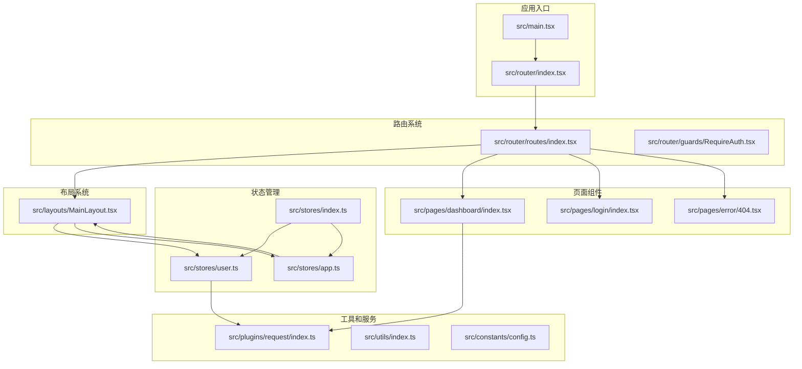
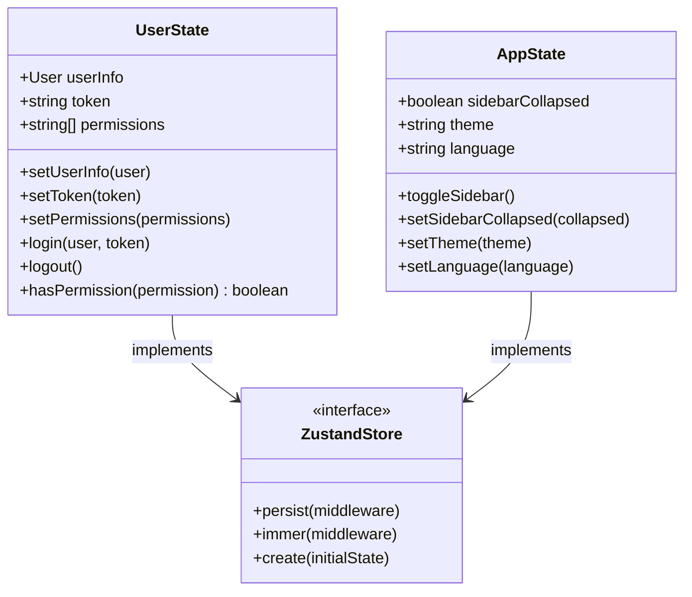
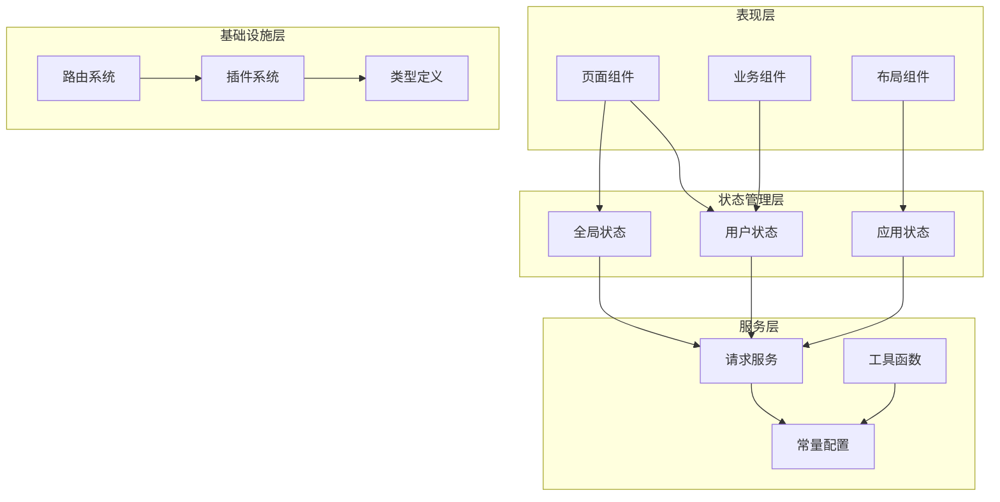
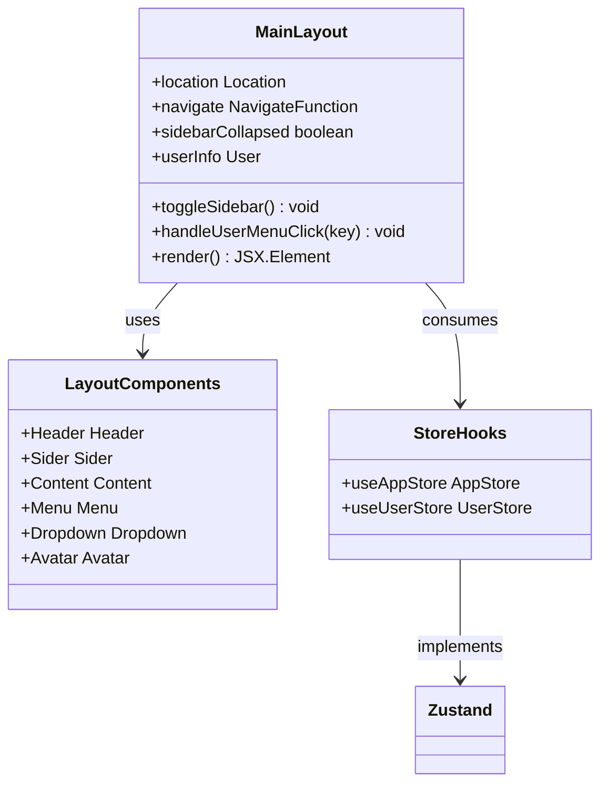
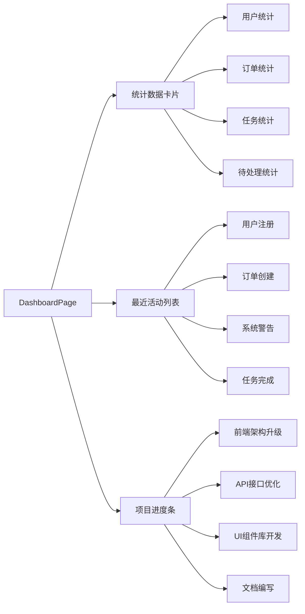
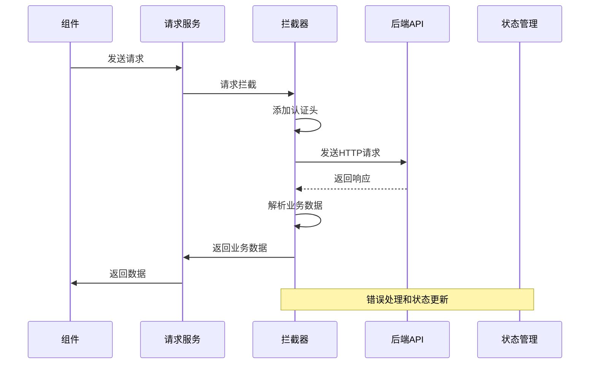
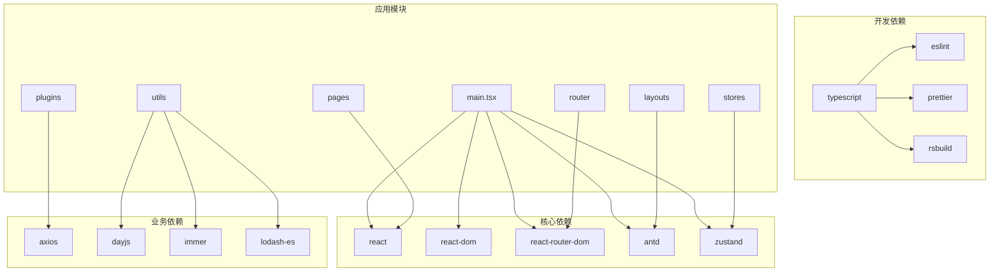

# 组件文档结构

<cite>
**本文档引用的文件**
- [package.json](file://package.json)
- [main.tsx](file://src/main.tsx)
- [router/index.tsx](file://src/router/index.tsx)
- [routes/index.tsx](file://src/router/routes/index.tsx)
- [MainLayout.tsx](file://src/layouts/MainLayout.tsx)
- [user.ts](file://src/stores/user.ts)
- [app.ts](file://src/stores/app.ts)
- [config.ts](file://src/constants/config.ts)
- [index.ts](file://src/types/index.ts)
- [dashboard/index.tsx](file://src/pages/dashboard/index.tsx)
- [request/index.ts](file://src/plugins/request/index.ts)
- [utils/index.ts](file://src/utils/index.ts)
</cite>

## 目录

1. [项目概述](#项目概述)
2. [项目结构](#项目结构)
3. [核心组件](#核心组件)
4. [架构概览](#架构概览)
5. [详细组件分析](#详细组件分析)
6. [依赖关系分析](#依赖关系分析)
7. [性能考虑](#性能考虑)
8. [故障排除指南](#故障排除指南)
9. [结论](#结论)

## 项目概述

这是一个基于React 18、TypeScript、Ant Design和Zustand的状态管理系统的AI管理系统前端应用。项目采用现代化的前端技术栈，提供了完整的用户认证、权限管理和数据展示功能。

**章节来源**

- [package.json:1-86](file://package.json#L1-L86)

## 项目结构

项目采用模块化的文件组织方式，主要分为以下核心目录：



**图表来源**

- [main.tsx:1-32](file://src/main.tsx#L1-L32)
- [router/index.tsx:1-9](file://src/router/index.tsx#L1-L9)
- [routes/index.tsx:1-31](file://src/router/routes/index.tsx#L1-L31)

**章节来源**

- [main.tsx:1-32](file://src/main.tsx#L1-L32)
- [router/index.tsx:1-9](file://src/router/index.tsx#L1-L9)
- [routes/index.tsx:1-31](file://src/router/routes/index.tsx#L1-L31)

## 核心组件

### 状态管理组件

项目使用Zustand作为状态管理解决方案，提供了两个核心状态存储：

1. **用户状态存储** (`useUserStore`)
2. **应用状态存储** (`useAppStore`)



**图表来源**

- [user.ts:6-76](file://src/stores/user.ts#L6-L76)
- [app.ts:5-59](file://src/stores/app.ts#L5-L59)

### 路由系统

项目采用React Router v6的现代路由系统，支持嵌套路由和路由守卫：

```mermaid
flowchart TD
A[根路由] --> B[认证路由]
A --> C[主布局路由]
C --> D[仪表板路由]
C --> E[错误处理路由]
B --> F[/login]
B --> G[/register]
D --> H[/dashboard]
D --> I[/project]
D --> J[/checkups]
D --> K[/pregnancy-info]
D --> L[/user]
A --> M[RequireAuth守卫]
M --> N[鉴权检查]
N --> |通过| C
N --> |失败| F
```

**图表来源**

- [routes/index.tsx:9-28](file://src/router/routes/index.tsx#L9-L28)
- [router/index.tsx:1-9](file://src/router/index.tsx#L1-L9)

**章节来源**

- [user.ts:1-76](file://src/stores/user.ts#L1-L76)
- [app.ts:1-59](file://src/stores/app.ts#L1-L59)
- [routes/index.tsx:1-31](file://src/router/routes/index.tsx#L1-L31)

## 架构概览

项目采用分层架构设计，各层职责明确：



**图表来源**

- [MainLayout.tsx:18-174](file://src/layouts/MainLayout.tsx#L18-L174)
- [request/index.ts:1-115](file://src/plugins/request/index.ts#L1-L115)

## 详细组件分析

### 主布局组件 (MainLayout)

主布局组件是整个应用的核心容器，提供统一的导航和布局结构：



**图表来源**

- [MainLayout.tsx:18-174](file://src/layouts/MainLayout.tsx#L18-L174)

#### 布局特性

1. **响应式侧边栏**：支持折叠/展开功能
2. **用户菜单**：提供个人中心、系统设置和退出登录
3. **通知系统**：集成消息提醒功能
4. **主题支持**：动态主题切换

**章节来源**

- [MainLayout.tsx:1-174](file://src/layouts/MainLayout.tsx#L1-L174)

### 仪表板页面

仪表板页面提供数据统计和业务概览功能：



**图表来源**

- [dashboard/index.tsx:12-170](file://src/pages/dashboard/index.tsx#L12-L170)

#### 数据展示组件

1. **统计卡片**：显示关键业务指标
2. **进度条**：展示项目完成度
3. **活动列表**：记录系统重要事件

**章节来源**

- [dashboard/index.tsx:1-170](file://src/pages/dashboard/index.tsx#L1-L170)

### 请求服务层

封装了HTTP请求处理逻辑，提供统一的API调用接口：



**图表来源**

- [request/index.ts:20-77](file://src/plugins/request/index.ts#L20-L77)

#### 功能特性

1. **自动认证**：自动添加JWT令牌
2. **统一解包**：解析业务响应格式
3. **错误处理**：集中处理各种HTTP状态码
4. **类型安全**：完整的TypeScript类型支持

**章节来源**

- [request/index.ts:1-115](file://src/plugins/request/index.ts#L1-L115)

### 工具函数库

提供常用的工具函数和辅助方法：

| 类别     | 函数           | 功能描述       |
| -------- | -------------- | -------------- |
| 日期处理 | formatDate     | 格式化日期显示 |
| 日期处理 | formatDateTime | 格式化日期时间 |
| 数字处理 | formatMoney    | 格式化金额显示 |
| 数字处理 | formatNumber   | 格式化数字显示 |
| 文件操作 | downloadFile   | 下载文件功能   |
| 对象操作 | deepClone      | 深拷贝对象     |
| 性能优化 | debounce       | 防抖函数       |
| 性能优化 | throttle       | 节流函数       |
| 标识符   | generateId     | 生成唯一ID     |
| 值检测   | isEmpty        | 检查空值       |

**章节来源**

- [utils/index.ts:1-106](file://src/utils/index.ts#L1-L106)

## 依赖关系分析

项目依赖关系图展示了核心模块之间的依赖关系：



**图表来源**

- [package.json:31-71](file://package.json#L31-L71)
- [main.tsx:1-32](file://src/main.tsx#L1-L32)

**章节来源**

- [package.json:1-86](file://package.json#L1-L86)

## 性能考虑

### 状态管理优化

1. **选择性订阅**：使用Zustand的细粒度状态更新
2. **持久化存储**：关键状态本地持久化
3. **immer中间件**：不可变更新优化

### 组件渲染优化

1. **React.memo**：对纯组件进行记忆化
2. **useMemo/useCallback**：缓存计算结果和回调函数
3. **懒加载**：路由级别的代码分割

### 网络请求优化

1. **请求缓存**：避免重复请求相同数据
2. **防抖节流**：优化高频操作
3. **超时控制**：合理的请求超时设置

## 故障排除指南

### 常见问题及解决方案

| 问题类型 | 症状         | 可能原因        | 解决方案                      |
| -------- | ------------ | --------------- | ----------------------------- |
| 认证失败 | 401错误      | Token过期或无效 | 清除本地存储的token并重新登录 |
| 权限不足 | 403错误      | 用户权限不足    | 检查用户角色和权限配置        |
| 网络超时 | 请求超时     | 网络连接问题    | 检查网络状态和API可用性       |
| 页面空白 | 组件渲染失败 | 依赖注入错误    | 检查Provider包装和依赖注入    |

### 调试技巧

1. **浏览器开发者工具**：监控网络请求和状态变化
2. **Redux DevTools**：调试Zustand状态管理
3. **React Developer Tools**：分析组件树和渲染性能

**章节来源**

- [request/index.ts:49-77](file://src/plugins/request/index.ts#L49-L77)

## 结论

本项目展现了现代React应用的最佳实践，采用了清晰的架构设计和完善的组件体系。通过模块化的文件组织、类型安全的TypeScript实现、以及高效的Zustand状态管理，为复杂的业务场景提供了可靠的前端解决方案。

项目的可维护性和扩展性都得到了充分考虑，为后续的功能扩展和团队协作奠定了良好的基础。
