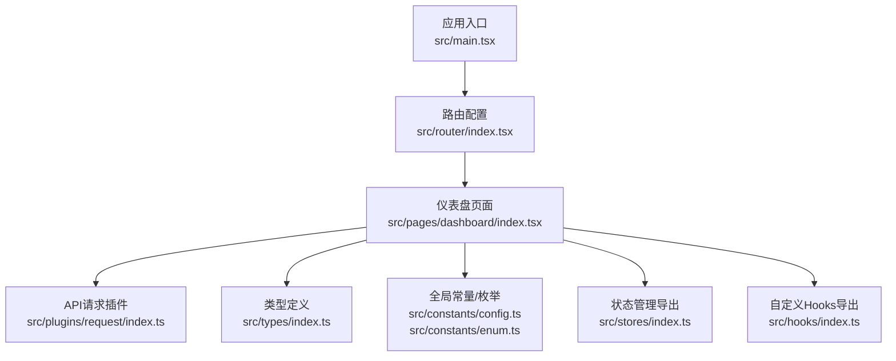
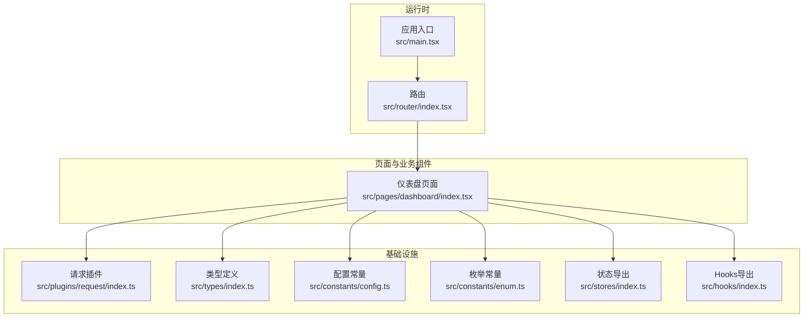
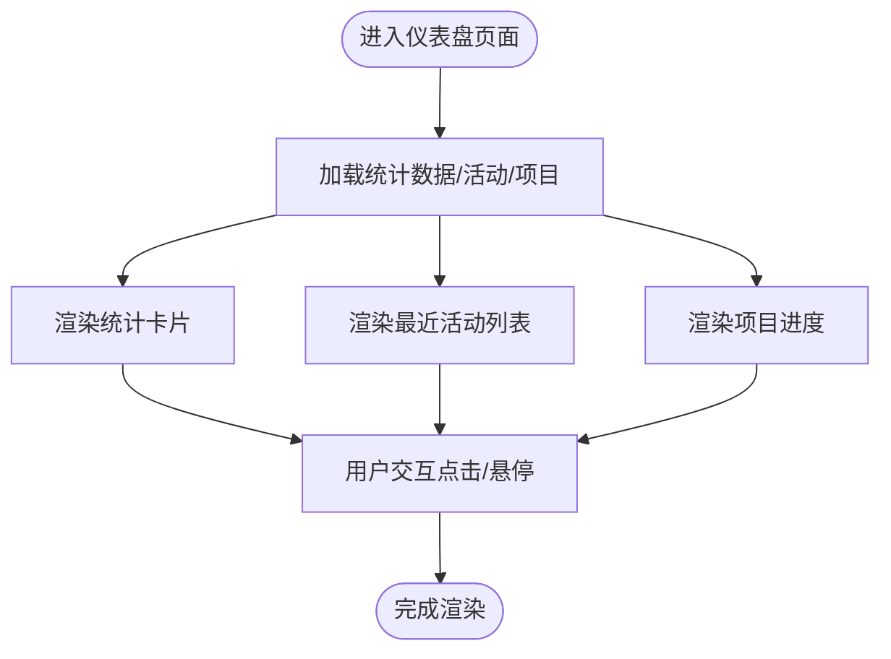
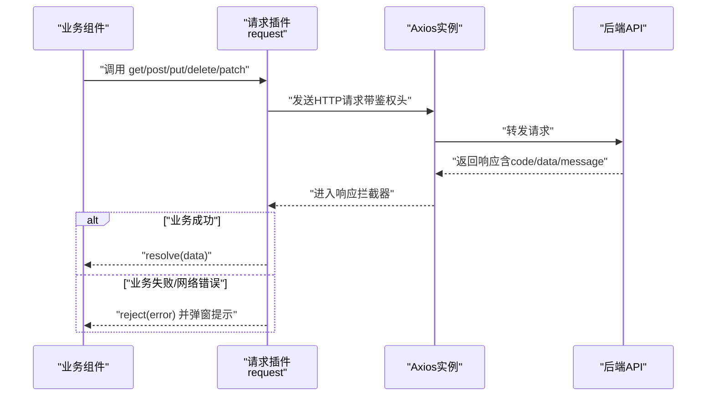
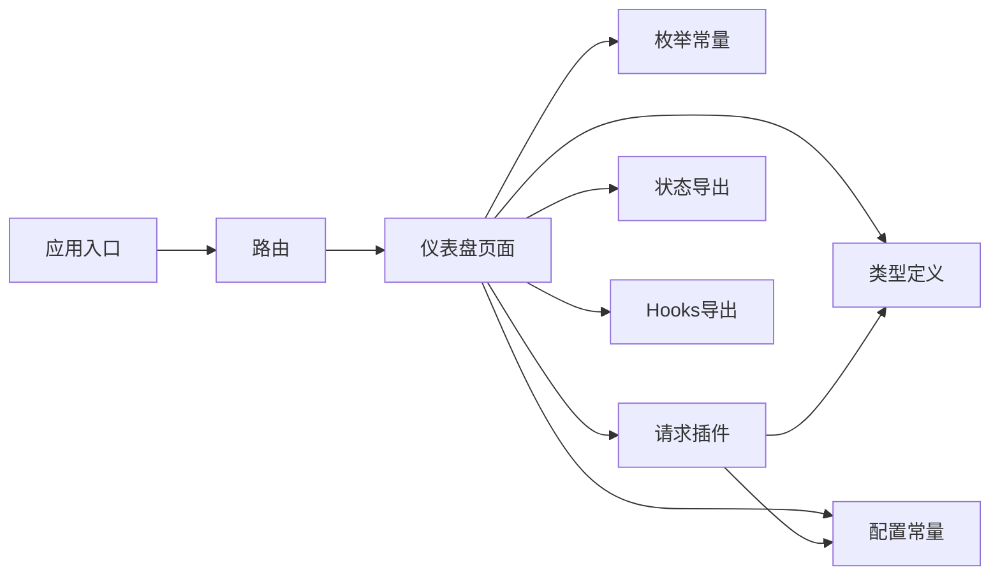

# 业务组件

<cite>
**本文引用的文件**
- [src/main.tsx](file://src/main.tsx)
- [src/pages/dashboard/index.tsx](file://src/pages/dashboard/index.tsx)
- [src/router/index.tsx](file://src/router/index.tsx)
- [src/plugins/request/index.ts](file://src/plugins/request/index.ts)
- [src/types/index.ts](file://src/types/index.ts)
- [src/constants/enum.ts](file://src/constants/enum.ts)
- [src/constants/config.ts](file://src/constants/config.ts)
- [src/stores/index.ts](file://src/stores/index.ts)
- [src/hooks/index.ts](file://src/hooks/index.ts)
</cite>

## 目录

1. [引言](#引言)
2. [项目结构](#项目结构)
3. [核心组件](#核心组件)
4. [架构总览](#架构总览)
5. [组件详细分析](#组件详细分析)
6. [依赖关系分析](#依赖关系分析)
7. [性能考量](#性能考量)
8. [故障排查指南](#故障排查指南)
9. [结论](#结论)
10. [附录](#附录)

## 引言

本文件面向AI管理平台的业务组件，系统化阐述业务组件的定义与分类标准，梳理数据驱动、状态管理与事件处理等设计原则；明确业务组件与API层的集成方式（数据获取、状态更新、错误处理）；给出开发规范与最佳实践（命名约定、Props设计、事件回调），并提供可复用的使用示例与集成指南，帮助开发者高效构建与维护业务组件。

## 项目结构

项目采用按功能域划分的目录组织方式：页面级组件位于 pages，通用业务组件位于 components（当前仓库未包含该目录文件，但后续可在此扩展），API封装位于 plugins/request，类型定义位于 types，全局常量与枚举位于 constants，状态管理位于 stores，路由在 router 中集中配置。

图表来源

- [src/main.tsx](file://src/main.tsx#L1-L32)
- [src/router/index.tsx](file://src/router/index.tsx#L1-L9)
- [src/pages/dashboard/index.tsx](file://src/pages/dashboard/index.tsx#L1-L170)
- [src/plugins/request/index.ts](file://src/plugins/request/index.ts#L1-L114)
- [src/types/index.ts](file://src/types/index.ts#L1-L101)
- [src/constants/config.ts](file://src/constants/config.ts#L1-L76)
- [src/constants/enum.ts](file://src/constants/enum.ts#L1-L70)
- [src/stores/index.ts](file://src/stores/index.ts#L1-L3)
- [src/hooks/index.ts](file://src/hooks/index.ts#L1-L6)

章节来源

- [src/main.tsx](file://src/main.tsx#L1-L32)
- [src/router/index.tsx](file://src/router/index.tsx#L1-L9)

## 核心组件

本节对当前仓库中体现“业务组件”特征的核心模块进行归纳与说明：

- 仪表盘页面组件（DashboardPage）
  - 职责：聚合统计卡片、最近活动列表、项目进度展示等业务视图元素，作为业务组件的典型载体。
  - 特点：以Ant Design组件为基础，通过本地静态数据渲染，体现“数据驱动”的视图层设计。
  - 参考路径：[src/pages/dashboard/index.tsx](file://src/pages/dashboard/index.tsx#L1-L170)

- API请求插件（request）
  - 职责：统一封装HTTP请求，内置请求/响应拦截器，处理鉴权头、业务错误与网络异常。
  - 特点：提供统一的get/post/put/delete/patch方法，屏蔽底层细节，便于业务组件调用。
  - 参考路径：[src/plugins/request/index.ts](file://src/plugins/request/index.ts#L1-L114)

- 类型与常量体系
  - 类型定义：PageData、User、MenuItem、TableColumn、FormField、ApiResponse、ApiError等，支撑业务组件的数据契约。
  - 常量与枚举：APP_CONFIG、ROUTE_CONFIG、REQUEST_CONFIG、HttpStatus、StorageKey等，统一配置与取值来源。
  - 参考路径：
    - [src/types/index.ts](file://src/types/index.ts#L1-L101)
    - [src/constants/config.ts](file://src/constants/config.ts#L1-L76)
    - [src/constants/enum.ts](file://src/constants/enum.ts#L1-L70)

- 状态与Hooks
  - 状态导出：stores/index.ts导出useUserStore/useAppStore，为业务组件提供状态读写能力。
  - Hooks导出：hooks/index.ts预留自定义Hooks出口，建议遵循ahooks生态。
  - 参考路径：
    - [src/stores/index.ts](file://src/stores/index.ts#L1-L3)
    - [src/hooks/index.ts](file://src/hooks/index.ts#L1-L6)

章节来源

- [src/pages/dashboard/index.tsx](file://src/pages/dashboard/index.tsx#L1-L170)
- [src/plugins/request/index.ts](file://src/plugins/request/index.ts#L1-L114)
- [src/types/index.ts](file://src/types/index.ts#L1-L101)
- [src/constants/config.ts](file://src/constants/config.ts#L1-L76)
- [src/constants/enum.ts](file://src/constants/enum.ts#L1-L70)
- [src/stores/index.ts](file://src/stores/index.ts#L1-L3)
- [src/hooks/index.ts](file://src/hooks/index.ts#L1-L6)

## 架构总览

下图展示了从入口到页面、再到API与类型系统的端到端流程，体现业务组件在系统中的位置与职责边界。

图表来源

- [src/main.tsx](file://src/main.tsx#L1-L32)
- [src/router/index.tsx](file://src/router/index.tsx#L1-L9)
- [src/pages/dashboard/index.tsx](file://src/pages/dashboard/index.tsx#L1-L170)
- [src/plugins/request/index.ts](file://src/plugins/request/index.ts#L1-L114)
- [src/types/index.ts](file://src/types/index.ts#L1-L101)
- [src/constants/config.ts](file://src/constants/config.ts#L1-L76)
- [src/constants/enum.ts](file://src/constants/enum.ts#L1-L70)
- [src/stores/index.ts](file://src/stores/index.ts#L1-L3)
- [src/hooks/index.ts](file://src/hooks/index.ts#L1-L6)

## 组件详细分析

### 仪表盘页面组件（DashboardPage）

- 设计原则
  - 数据驱动：通过statistics、activities、projects等数据源驱动视图渲染，避免硬编码逻辑。
  - 组件组合：使用Ant Design的Card、Row、Col、Statistic、Progress、List等组件进行布局与展示。
  - 状态管理：当前示例为本地静态数据，推荐在真实场景中接入状态管理（如stores）与API请求插件。
- 关键交互与事件
  - 列表项点击、卡片hover等交互可通过Ant Design组件的回调属性扩展。
- 错误与边界
  - 当前无网络或数据异常处理，建议在集成API后补充加载态、空态与错误态。
- 参考路径
  - [src/pages/dashboard/index.tsx](file://src/pages/dashboard/index.tsx#L1-L170)

图表来源

- [src/pages/dashboard/index.tsx](file://src/pages/dashboard/index.tsx#L1-L170)

章节来源

- [src/pages/dashboard/index.tsx](file://src/pages/dashboard/index.tsx#L1-L170)

### API层集成（request）

- 数据获取
  - 通过get/post/put/delete/patch方法发起请求，返回Promise形式的数据体。
- 状态更新
  - 在业务组件中结合状态管理（stores）实现数据的读取与更新。
- 错误处理
  - 响应拦截器统一处理业务错误与HTTP错误，自动弹窗提示并抛出错误，便于上层捕获与降级。
- 鉴权与配置
  - 请求拦截器自动注入Authorization头；支持超时、重试策略配置（可在REQUEST_CONFIG中扩展）。
- 参考路径
  - [src/plugins/request/index.ts](file://src/plugins/request/index.ts#L1-L114)
  - [src/constants/config.ts](file://src/constants/config.ts#L33-L45)

图表来源

- [src/plugins/request/index.ts](file://src/plugins/request/index.ts#L1-L114)

章节来源

- [src/plugins/request/index.ts](file://src/plugins/request/index.ts#L1-L114)
- [src/constants/config.ts](file://src/constants/config.ts#L33-L45)

### 类型与常量体系

- 类型契约
  - PageData/PageQuery/User/MenuItem/TableColumn/FormField/ApiResponse/ApiError等，确保组件间数据一致性。
- 配置与枚举
  - APP_CONFIG/ROUTE_CONFIG/REQUEST_CONFIG提供默认行为；HttpStatus/StorageKey/ThemeMode/Language等统一取值来源。
- 参考路径
  - [src/types/index.ts](file://src/types/index.ts#L1-L101)
  - [src/constants/config.ts](file://src/constants/config.ts#L1-L76)
  - [src/constants/enum.ts](file://src/constants/enum.ts#L1-L70)

章节来源

- [src/types/index.ts](file://src/types/index.ts#L1-L101)
- [src/constants/config.ts](file://src/constants/config.ts#L1-L76)
- [src/constants/enum.ts](file://src/constants/enum.ts#L1-L70)

### 状态与Hooks

- 状态导出
  - stores/index.ts导出useUserStore/useAppStore，业务组件可通过其读取/更新全局状态。
- Hooks导出
  - hooks/index.ts预留自定义Hooks出口，建议优先使用ahooks生态，保持一致的生命周期与副作用管理。
- 参考路径
  - [src/stores/index.ts](file://src/stores/index.ts#L1-L3)
  - [src/hooks/index.ts](file://src/hooks/index.ts#L1-L6)

章节来源

- [src/stores/index.ts](file://src/stores/index.ts#L1-L3)
- [src/hooks/index.ts](file://src/hooks/index.ts#L1-L6)

## 依赖关系分析

- 页面到基础设施
  - 仪表盘页面依赖类型定义、常量配置、请求插件与状态/Hooks导出。
- 请求插件与类型/常量
  - 请求插件依赖类型定义（ApiResponse）与配置常量（REQUEST_CONFIG）。
- 入口到路由
  - 应用入口通过ConfigProvider与RouterProvider装配全局主题与路由。

图表来源

- [src/pages/dashboard/index.tsx](file://src/pages/dashboard/index.tsx#L1-L170)
- [src/plugins/request/index.ts](file://src/plugins/request/index.ts#L1-L114)
- [src/types/index.ts](file://src/types/index.ts#L1-L101)
- [src/constants/config.ts](file://src/constants/config.ts#L1-L76)
- [src/constants/enum.ts](file://src/constants/enum.ts#L1-L70)
- [src/stores/index.ts](file://src/stores/index.ts#L1-L3)
- [src/hooks/index.ts](file://src/hooks/index.ts#L1-L6)
- [src/main.tsx](file://src/main.tsx#L1-L32)
- [src/router/index.tsx](file://src/router/index.tsx#L1-L9)

章节来源

- [src/main.tsx](file://src/main.tsx#L1-L32)
- [src/router/index.tsx](file://src/router/index.tsx#L1-L9)
- [src/pages/dashboard/index.tsx](file://src/pages/dashboard/index.tsx#L1-L170)
- [src/plugins/request/index.ts](file://src/plugins/request/index.ts#L1-L114)
- [src/types/index.ts](file://src/types/index.ts#L1-L101)
- [src/constants/config.ts](file://src/constants/config.ts#L1-L76)
- [src/constants/enum.ts](file://src/constants/enum.ts#L1-L70)
- [src/stores/index.ts](file://src/stores/index.ts#L1-L3)
- [src/hooks/index.ts](file://src/hooks/index.ts#L1-L6)

## 性能考量

- 渲染优化
  - 使用Ant Design组件的懒加载与虚拟化（如大数据表格）减少重排。
  - 对频繁更新的数据采用浅比较与memo化，避免不必要的重渲染。
- 网络优化
  - 合理设置请求超时与重试策略（REQUEST_CONFIG），在业务组件中配合加载态与骨架屏提升体验。
- 状态管理
  - 将大对象拆分为细粒度store，降低全局状态变更带来的影响范围。
- 参考路径
  - [src/constants/config.ts](file://src/constants/config.ts#L33-L45)
  - [src/stores/index.ts](file://src/stores/index.ts#L1-L3)

## 故障排查指南

- 常见问题定位
  - 401未授权：检查本地token是否过期或缺失，确认请求拦截器是否正确注入Authorization头。
  - 403禁止访问：检查权限控制与路由守卫配置。
  - 404资源不存在：核对API路径与后端接口。
  - 500服务器错误：查看后端日志与响应message。
  - 网络异常：检查网络连通性与代理配置。
- 处理建议
  - 在业务组件中捕获Promise reject并显示友好提示。
  - 对高频请求增加防抖/节流，避免重复触发。
- 参考路径
  - [src/plugins/request/index.ts](file://src/plugins/request/index.ts#L48-L76)

章节来源

- [src/plugins/request/index.ts](file://src/plugins/request/index.ts#L48-L76)

## 结论

本项目以清晰的目录结构与完善的基础设施（类型、常量、请求插件、状态/Hooks导出）为业务组件提供了坚实基础。建议在后续迭代中：

- 将仪表盘页面改造为数据驱动的远程数据源，结合状态管理与请求插件实现完整闭环。
- 规范组件命名与Props设计，统一事件回调签名，提升可维护性。
- 在各页面组件中引入错误边界与加载态，完善用户体验。

## 附录

### 业务组件分类与定义

- 仪表盘组件
  - 定义：用于展示关键指标、活动与进度的汇总视图，强调数据可视化与概览性。
  - 示例参考：[src/pages/dashboard/index.tsx](file://src/pages/dashboard/index.tsx#L1-L170)
- 项目管理组件
  - 定义：围绕项目生命周期的增删改查、进度跟踪与协作信息展示。
  - 建议：基于TableColumn/FormField等类型定义构建表格与表单，结合request与stores实现CRUD。
- 用户管理组件
  - 定义：用户信息展示、状态切换、权限分配等功能集合。
  - 建议：利用User类型与UserStatus枚举，结合请求插件与状态管理实现统一的数据流。

### 开发规范与最佳实践

- 命名约定
  - 组件文件：PascalCase，如 DashboardPage.tsx。
  - Props接口：以ComponentNameProps命名，如 DashboardPageProps。
- Props设计
  - 必填项与可选项分离，提供默认值与类型约束。
  - 使用类型定义（如TableColumn、FormField）保证一致性。
- 事件回调
  - 统一回调命名（onLoad/onSuccess/onError），并在组件内做好错误捕获与提示。
- 参考路径
  - [src/types/index.ts](file://src/types/index.ts#L49-L85)
  - [src/constants/enum.ts](file://src/constants/enum.ts#L4-L8)

### API集成与错误处理

- 数据获取
  - 通过request.get/post/put/delete/patch发起请求，返回Promise。
- 状态更新
  - 在业务组件中使用状态管理（如useUserStore）更新全局状态。
- 错误处理
  - 借助请求插件的响应拦截器统一处理业务错误与HTTP错误，上层组件负责UI反馈。
- 参考路径
  - [src/plugins/request/index.ts](file://src/plugins/request/index.ts#L78-L111)
  - [src/stores/index.ts](file://src/stores/index.ts#L1-L3)
