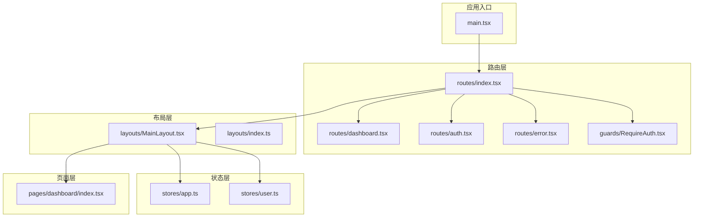
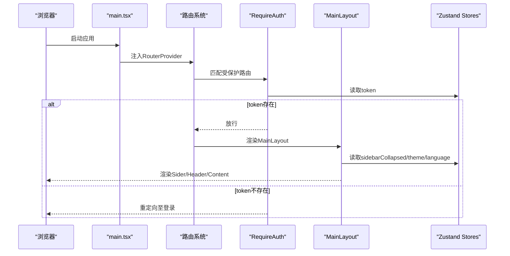
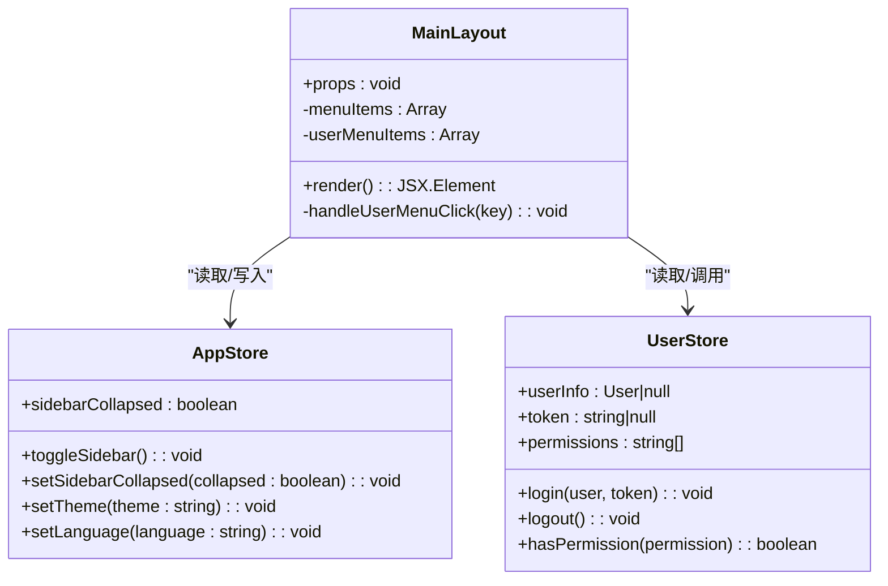
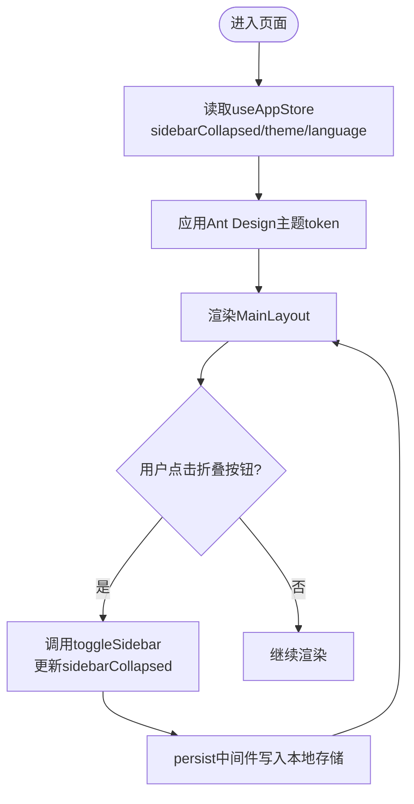
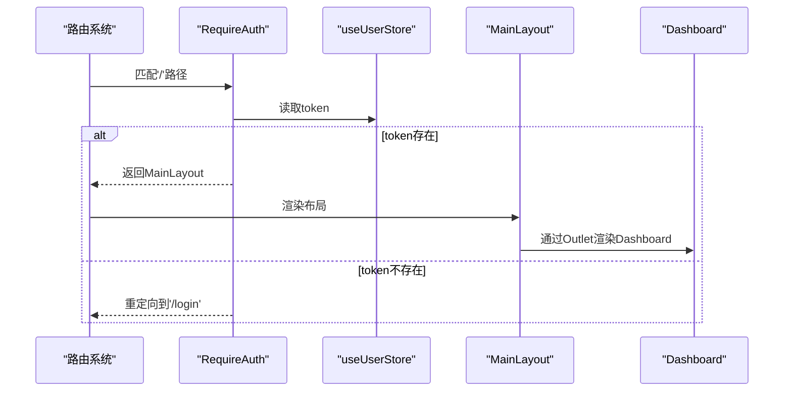
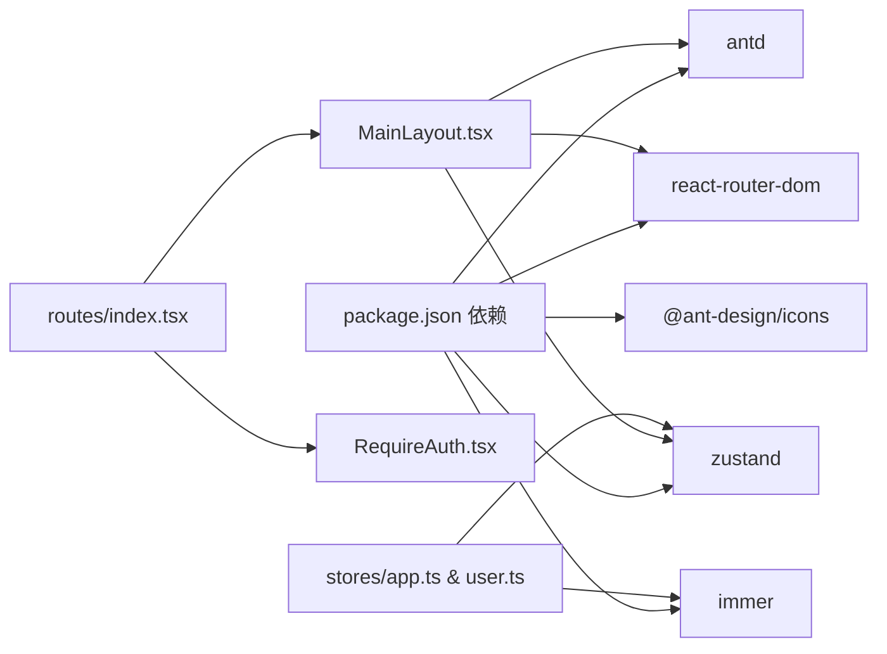

# 布局组件

<cite>
**本文引用的文件列表**
- [src/layouts/MainLayout.tsx](file://src/layouts/MainLayout.tsx)
- [src/layouts/index.ts](file://src/layouts/index.ts)
- [src/stores/app.ts](file://src/stores/app.ts)
- [src/stores/user.ts](file://src/stores/user.ts)
- [src/router/guards/RequireAuth.tsx](file://src/router/guards/RequireAuth.tsx)
- [src/router/routes/index.tsx](file://src/router/routes/index.tsx)
- [src/router/routes/dashboard.tsx](file://src/router/routes/dashboard.tsx)
- [src/router/routes/auth.tsx](file://src/router/routes/auth.tsx)
- [src/router/routes/error.tsx](file://src/router/routes/error.tsx)
- [src/router/utils/index.tsx](file://src/router/utils/index.tsx)
- [src/main.tsx](file://src/main.tsx)
- [src/constants/config.ts](file://src/constants/config.ts)
- [src/pages/dashboard/index.tsx](file://src/pages/dashboard/index.tsx)
- [package.json](file://package.json)
</cite>

## 目录

1. [简介](#简介)
2. [项目结构](#项目结构)
3. [核心组件](#核心组件)
4. [架构总览](#架构总览)
5. [组件详解](#组件详解)
6. [依赖关系分析](#依赖关系分析)
7. [性能与可维护性](#性能与可维护性)
8. [故障排查指南](#故障排查指南)
9. [结论](#结论)
10. [附录：使用示例与定制化指南](#附录使用示例与定制化指南)

## 简介

本文件聚焦于AI管理平台的布局组件，系统性解析MainLayout组件的设计架构与实现细节，涵盖侧边栏(Sider)、头部(Header)、内容(Content)三大区域的布局策略与交互逻辑；深入说明布局状态管理机制（菜单折叠、主题、语言等）；阐述与路由守卫、状态管理、权限控制的集成方式；并提供布局定制化方案与使用示例，帮助开发者快速理解与扩展布局系统。

## 项目结构

布局系统位于src/layouts目录，采用“布局组件 + 路由 + 状态管理”的分层组织：

- 布局组件：MainLayout.tsx负责整体布局与交互
- 路由与守卫：RequireAuth.tsx进行鉴权保护，路由配置在routes目录
- 状态管理：Zustand stores(app.ts, user.ts)提供应用态与用户态
- 页面内容：Dashboard等页面通过Outlet渲染到Content区域

图表来源

- [src/main.tsx](file://src/main.tsx#L17-L31)
- [src/router/routes/index.tsx](file://src/router/routes/index.tsx#L9-L28)
- [src/router/guards/RequireAuth.tsx](file://src/router/guards/RequireAuth.tsx#L11-L22)
- [src/layouts/MainLayout.tsx](file://src/layouts/MainLayout.tsx#L18-L171)
- [src/stores/app.ts](file://src/stores/app.ts#L18-L58)
- [src/stores/user.ts](file://src/stores/user.ts#L21-L75)
- [src/router/routes/dashboard.tsx](file://src/router/routes/dashboard.tsx#L7-L14)
- [src/router/routes/auth.tsx](file://src/router/routes/auth.tsx#L7-L12)
- [src/router/routes/error.tsx](file://src/router/routes/error.tsx#L7-L13)
- [src/pages/dashboard/index.tsx](file://src/pages/dashboard/index.tsx#L12-L167)

章节来源

- [src/main.tsx](file://src/main.tsx#L17-L31)
- [src/router/routes/index.tsx](file://src/router/routes/index.tsx#L9-L28)
- [src/layouts/MainLayout.tsx](file://src/layouts/MainLayout.tsx#L18-L171)

## 核心组件

- MainLayout：Ant Design Layout容器，包含Sider、Header、Content三大区域，负责菜单折叠、用户下拉、通知徽标、面包屑占位等
- 状态管理：useAppStore提供sidebarCollapsed、theme、language；useUserStore提供token、userInfo、权限集合
- 路由守卫：RequireAuth在访问受保护路由前校验token
- 页面内容：Dashboard作为默认子路由展示

章节来源

- [src/layouts/MainLayout.tsx](file://src/layouts/MainLayout.tsx#L18-L171)
- [src/stores/app.ts](file://src/stores/app.ts#L5-L16)
- [src/stores/user.ts](file://src/stores/user.ts#L6-L19)
- [src/router/guards/RequireAuth.tsx](file://src/router/guards/RequireAuth.tsx#L11-L22)

## 架构总览

MainLayout作为根布局，承载全局样式与主题，内部通过Ant Design Layout划分区域；路由系统通过RequireAuth保护受控页面，将MainLayout作为壳包裹；状态管理通过Zustand持久化存储应用态与用户态，供布局组件读取与更新。

图表来源

- [src/main.tsx](file://src/main.tsx#L17-L31)
- [src/router/routes/index.tsx](file://src/router/routes/index.tsx#L11-L17)
- [src/router/guards/RequireAuth.tsx](file://src/router/guards/RequireAuth.tsx#L15-L19)
- [src/layouts/MainLayout.tsx](file://src/layouts/MainLayout.tsx#L23-L24)

## 组件详解

### MainLayout 设计与实现

- 结构组成
  - Sider：可折叠侧边栏，包含Logo区与菜单区；支持折叠状态与阴影样式
  - Header：顶部工具栏，包含折叠触发器、通知徽标、用户下拉菜单
  - Content：主内容区，使用Outlet渲染当前路由页面
- 交互逻辑
  - 折叠切换：通过useAppStore.toggleSidebar改变sidebarCollapsed
  - 菜单跳转：点击菜单项或头部折叠按钮触发navigate
  - 用户菜单：支持个人中心、系统设置、退出登录
- 主题与样式
  - 使用Ant Design主题token动态计算背景色、边框色、圆角等
  - Sider与Header、Content均应用统一的阴影与圆角风格

图表来源

- [src/layouts/MainLayout.tsx](file://src/layouts/MainLayout.tsx#L18-L171)
- [src/stores/app.ts](file://src/stores/app.ts#L18-L58)
- [src/stores/user.ts](file://src/stores/user.ts#L21-L75)

章节来源

- [src/layouts/MainLayout.tsx](file://src/layouts/MainLayout.tsx#L73-L171)
- [src/stores/app.ts](file://src/stores/app.ts#L18-L58)
- [src/stores/user.ts](file://src/stores/user.ts#L21-L75)

### 状态管理机制

- 应用状态（useAppStore）
  - 字段：sidebarCollapsed、theme、language
  - 行为：toggleSidebar、setSidebarCollapsed、setTheme、setLanguage
  - 持久化：通过persist中间件保存到本地存储，仅持久化sidebarCollapsed、theme、language
- 用户状态（useUserStore）
  - 字段：userInfo、token、permissions
  - 行为：login、logout、setUserInfo、setToken、setPermissions、hasPermission
  - 持久化：仅持久化token与userInfo，避免敏感信息泄露
- 主题与国际化
  - 应用启动时通过ConfigProvider设置Ant Design主题与语言
  - 布局中通过theme.useToken()获取token，动态适配颜色与圆角

图表来源

- [src/stores/app.ts](file://src/stores/app.ts#L18-L58)
- [src/main.tsx](file://src/main.tsx#L19-L29)
- [src/layouts/MainLayout.tsx](file://src/layouts/MainLayout.tsx#L21-L24)

章节来源

- [src/stores/app.ts](file://src/stores/app.ts#L18-L58)
- [src/stores/user.ts](file://src/stores/user.ts#L21-L75)
- [src/main.tsx](file://src/main.tsx#L19-L29)

### 路由与守卫集成

- 路由配置
  - 根路径'/'使用RequireAuth保护，内部渲染MainLayout
  - 子路由包含auth、dashboard、error模块
  - 默认子路由重定向至/dashboard
- 路由懒加载
  - 通过lazy与Suspense实现按需加载，提升首屏性能
- 权限控制
  - RequireAuth基于useUserStore.token判断是否放行
  - 登出时清理token，自动跳转登录页

图表来源

- [src/router/routes/index.tsx](file://src/router/routes/index.tsx#L11-L17)
- [src/router/guards/RequireAuth.tsx](file://src/router/guards/RequireAuth.tsx#L15-L19)
- [src/router/utils/index.tsx](file://src/router/utils/index.tsx#L4-L20)
- [src/router/routes/dashboard.tsx](file://src/router/routes/dashboard.tsx#L7-L14)

章节来源

- [src/router/routes/index.tsx](file://src/router/routes/index.tsx#L9-L28)
- [src/router/guards/RequireAuth.tsx](file://src/router/guards/RequireAuth.tsx#L11-L22)
- [src/router/utils/index.tsx](file://src/router/utils/index.tsx#L4-L20)

### 响应式与主题切换

- 响应式断点
  - Ant Design内置响应式断点，布局在不同屏幕尺寸下自动调整
  - Dashboard页面使用Grid的xs/sm/lg属性实现卡片栅格化
- 主题切换
  - useAppStore.setTheme可切换light/dark
  - ConfigProvider在应用入口处设置Ant Design主题token
  - 布局组件通过theme.useToken()动态适配颜色

章节来源

- [src/pages/dashboard/index.tsx](file://src/pages/dashboard/index.tsx#L84-L113)
- [src/stores/app.ts](file://src/stores/app.ts#L37-L41)
- [src/main.tsx](file://src/main.tsx#L19-L29)

### 与权限控制的集成

- 当前实现
  - 路由层通过RequireAuth基于token进行基础鉴权
  - 用户态包含permissions数组，提供hasPermission方法
- 扩展建议
  - 在MainLayout中根据权限动态渲染菜单项
  - 在路由层结合权限进行细粒度控制

章节来源

- [src/router/guards/RequireAuth.tsx](file://src/router/guards/RequireAuth.tsx#L15-L19)
- [src/stores/user.ts](file://src/stores/user.ts#L62-L65)

## 依赖关系分析

- 组件耦合
  - MainLayout依赖useAppStore与useUserStore，耦合度低，便于测试与替换
  - 路由层通过RequireAuth与布局解耦
- 外部依赖
  - Ant Design Layout、Menu、Dropdown、Avatar、Badge等组件
  - react-router-dom负责路由与导航
  - Zustand提供轻量级状态管理
- 潜在风险
  - 若菜单项未与路由key一致，可能导致选中态不正确
  - 本地存储持久化可能暴露敏感信息，已通过partialize限制

图表来源

- [package.json](file://package.json#L20-L36)
- [src/layouts/MainLayout.tsx](file://src/layouts/MainLayout.tsx#L1-L12)
- [src/router/routes/index.tsx](file://src/router/routes/index.tsx#L3-L7)
- [src/stores/app.ts](file://src/stores/app.ts#L1-L3)
- [src/stores/user.ts](file://src/stores/user.ts#L1-L4)

章节来源

- [package.json](file://package.json#L20-L36)
- [src/layouts/MainLayout.tsx](file://src/layouts/MainLayout.tsx#L1-L12)
- [src/router/routes/index.tsx](file://src/router/routes/index.tsx#L3-L7)
- [src/stores/app.ts](file://src/stores/app.ts#L1-L3)
- [src/stores/user.ts](file://src/stores/user.ts#L1-L4)

## 性能与可维护性

- 性能优化
  - 路由懒加载减少首屏体积
  - Zustand无样板代码，状态更新局部化
  - Ant Design组件按需引入，避免全量打包
- 可维护性
  - 布局与业务解耦，易于扩展
  - 状态集中管理，职责清晰
  - 常量配置集中于constants，便于统一维护

[本节为通用指导，无需特定文件引用]

## 故障排查指南

- 登录后无法进入受保护页面
  - 检查useUserStore.token是否正确设置
  - 确认RequireAuth是否生效
- 侧边栏无法折叠
  - 检查useAppStore.toggleSidebar是否被调用
  - 确认localStorage中app-store持久化数据
- 主题切换无效
  - 检查ConfigProvider theme配置
  - 确认useAppStore.setTheme调用链路
- 菜单项选中态异常
  - 确保菜单key与当前路由路径一致
  - 检查selectedKeys绑定逻辑

章节来源

- [src/router/guards/RequireAuth.tsx](file://src/router/guards/RequireAuth.tsx#L15-L19)
- [src/stores/user.ts](file://src/stores/user.ts#L46-L60)
- [src/stores/app.ts](file://src/stores/app.ts#L25-L41)
- [src/layouts/MainLayout.tsx](file://src/layouts/MainLayout.tsx#L98-L104)

## 结论

MainLayout以简洁的结构与清晰的状态分离，实现了可扩展的管理平台布局。通过路由守卫与状态管理的配合，既保证了安全性，又提供了良好的用户体验。后续可在菜单动态化、权限细化、主题与语言的联动等方面进一步增强。

[本节为总结性内容，无需特定文件引用]

## 附录：使用示例与定制化指南

### 使用示例

- 在路由中使用MainLayout
  - 将MainLayout包裹在RequireAuth内，作为根布局
  - 子路由通过index.tsx导出，统一挂载到'/'路径下
- 在页面中渲染内容
  - Dashboard等页面通过Outlet渲染到Content区域
  - 可通过lazyLoad实现按需加载

章节来源

- [src/router/routes/index.tsx](file://src/router/routes/index.tsx#L11-L17)
- [src/router/utils/index.tsx](file://src/router/utils/index.tsx#L4-L20)
- [src/pages/dashboard/index.tsx](file://src/pages/dashboard/index.tsx#L12-L167)

### 定制化方案

- 菜单配置
  - 在MainLayout.menuItems中添加新的菜单项，确保key与目标路由一致
  - 可结合useUserStore.permissions动态渲染菜单
- 面包屑导航
  - 在Header区域预留面包屑占位，通过路由meta或自定义hooks生成
- 顶部操作区
  - 在Header右侧区域扩展操作按钮，如搜索、刷新、设置等
- 响应式与主题
  - 通过ConfigProvider与useAppStore.setTheme实现主题切换
  - 利用Ant Design Grid实现响应式布局

章节来源

- [src/layouts/MainLayout.tsx](file://src/layouts/MainLayout.tsx#L64-L71)
- [src/stores/app.ts](file://src/stores/app.ts#L37-L41)
- [src/constants/config.ts](file://src/constants/config.ts#L13-L18)
