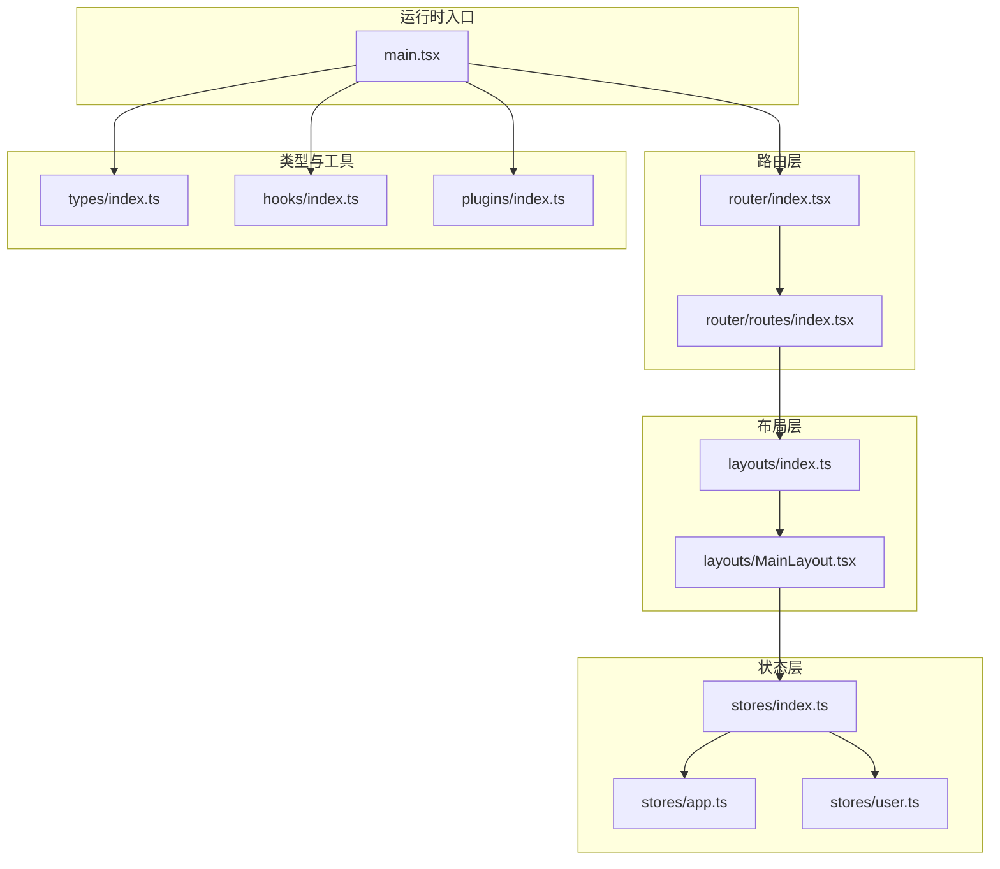
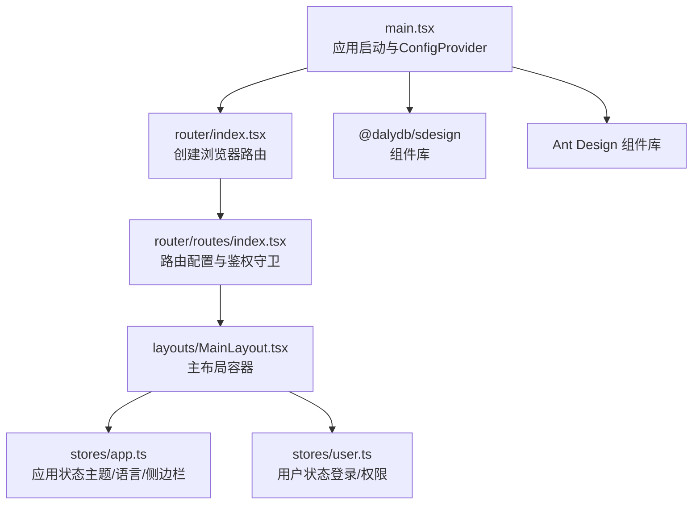
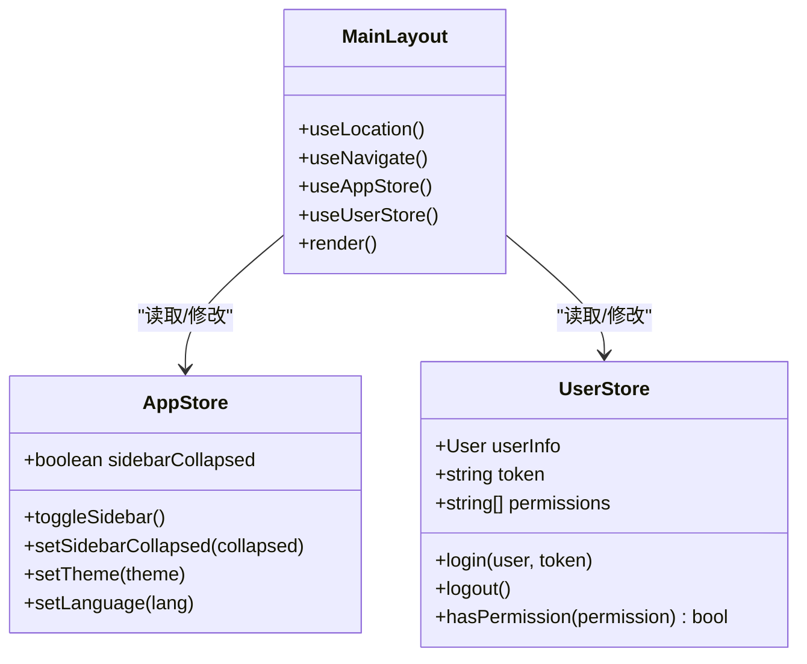
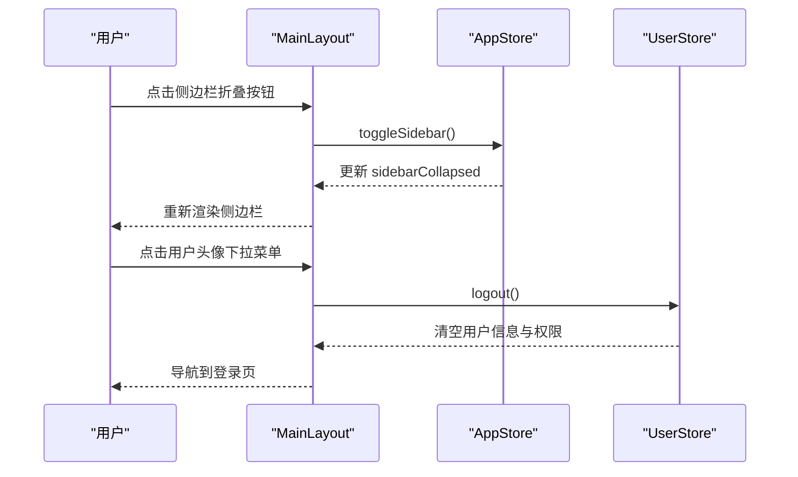
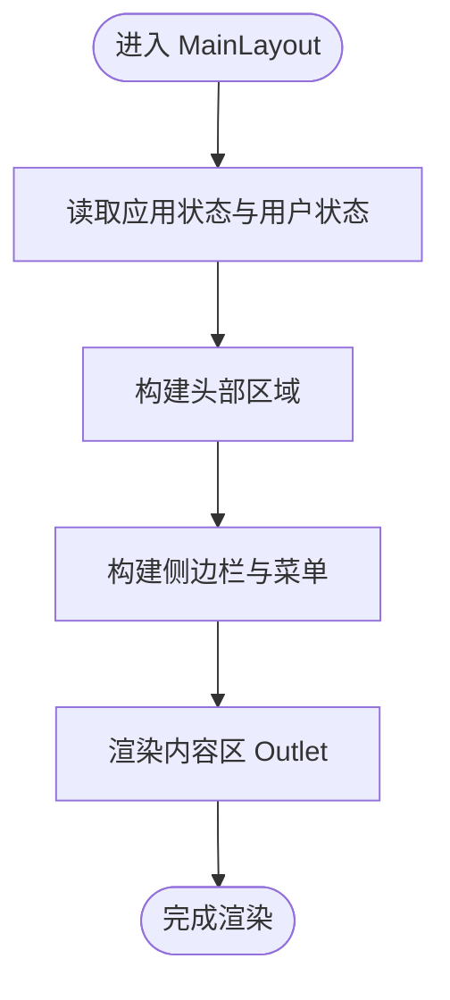
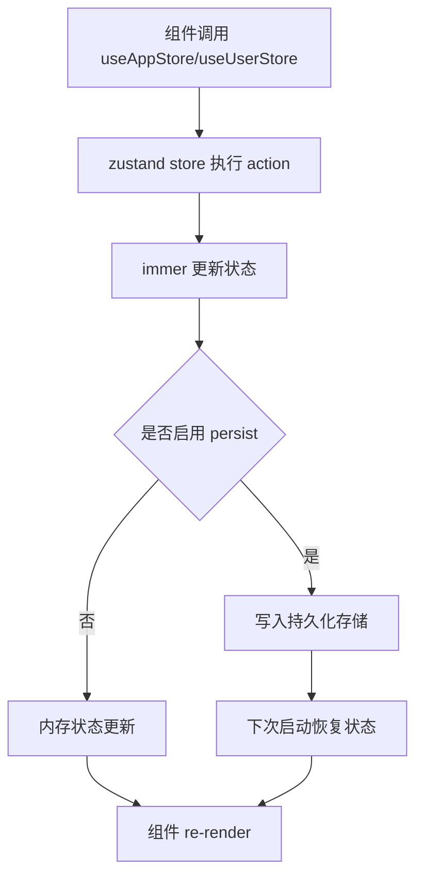
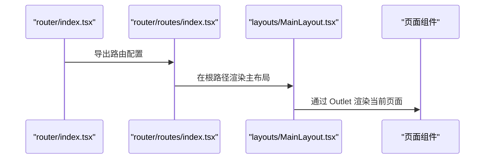
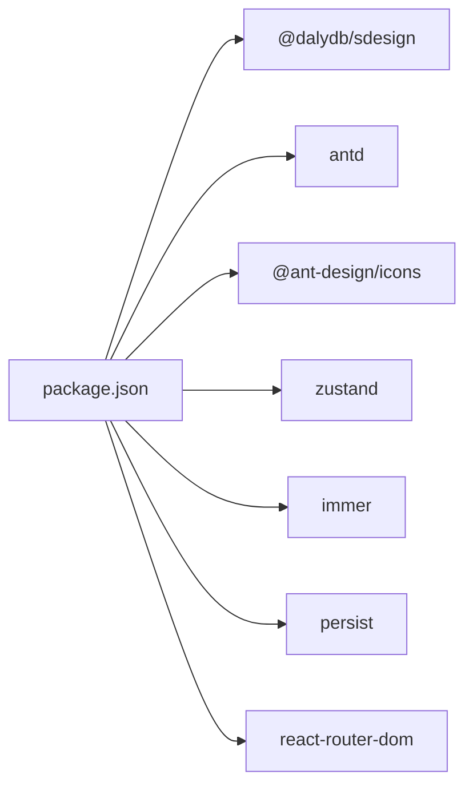

# 组件系统

<cite>
**本文引用的文件**
- [src/layouts/MainLayout.tsx](file://src/layouts/MainLayout.tsx)
- [src/layouts/index.ts](file://src/layouts/index.ts)
- [src/stores/app.ts](file://src/stores/app.ts)
- [src/stores/user.ts](file://src/stores/user.ts)
- [src/stores/index.ts](file://src/stores/index.ts)
- [src/router/index.tsx](file://src/router/index.tsx)
- [src/router/routes/index.tsx](file://src/router/routes/index.tsx)
- [src/main.tsx](file://src/main.tsx)
- [package.json](file://package.json)
- [src/types/index.ts](file://src/types/index.ts)
- [src/hooks/index.ts](file://src/hooks/index.ts)
- [src/plugins/index.ts](file://src/plugins/index.ts)
</cite>

## 目录

1. [简介](#简介)
2. [项目结构](#项目结构)
3. [核心组件](#核心组件)
4. [架构总览](#架构总览)
5. [详细组件分析](#详细组件分析)
6. [依赖分析](#依赖分析)
7. [性能考虑](#性能考虑)
8. [故障排查指南](#故障排查指南)
9. [结论](#结论)
10. [附录](#附录)

## 简介

本文件面向AI管理平台的组件系统，重点围绕布局组件与状态管理展开，系统性阐述以下内容：

- 布局组件设计理念与MainLayout实现细节
- 业务组件与通用组件的分类标准与开发规范
- 组件间通信机制（props传递、状态共享、事件处理）
- 组件库集成（@dalydb/sdesign）的使用与定制
- 组件开发最佳实践（性能优化、可复用性设计、测试策略）
- 组件使用示例与集成指南

## 项目结构

项目采用按功能域分层组织方式：路由、页面、布局、状态、类型、插件、工具等模块清晰分离。组件系统的核心入口在路由层，通过主布局包裹页面内容，并通过状态库统一管理应用级状态。

图示来源

- [src/main.tsx](file://src/main.tsx#L1-L32)
- [src/router/index.tsx](file://src/router/index.tsx#L1-L9)
- [src/router/routes/index.tsx](file://src/router/routes/index.tsx#L1-L31)
- [src/layouts/index.ts](file://src/layouts/index.ts#L1-L3)
- [src/layouts/MainLayout.tsx](file://src/layouts/MainLayout.tsx#L1-L174)
- [src/stores/index.ts](file://src/stores/index.ts#L1-L3)
- [src/stores/app.ts](file://src/stores/app.ts#L1-L59)
- [src/stores/user.ts](file://src/stores/user.ts#L1-L76)
- [src/types/index.ts](file://src/types/index.ts#L1-L101)
- [src/hooks/index.ts](file://src/hooks/index.ts#L1-L6)
- [src/plugins/index.ts](file://src/plugins/index.ts#L1-L2)

章节来源

- [src/main.tsx](file://src/main.tsx#L1-L32)
- [src/router/index.tsx](file://src/router/index.tsx#L1-L9)
- [src/router/routes/index.tsx](file://src/router/routes/index.tsx#L1-L31)
- [src/layouts/index.ts](file://src/layouts/index.ts#L1-L3)
- [src/layouts/MainLayout.tsx](file://src/layouts/MainLayout.tsx#L1-L174)
- [src/stores/index.ts](file://src/stores/index.ts#L1-L3)
- [src/stores/app.ts](file://src/stores/app.ts#L1-L59)
- [src/stores/user.ts](file://src/stores/user.ts#L1-L76)
- [src/types/index.ts](file://src/types/index.ts#L1-L101)
- [src/hooks/index.ts](file://src/hooks/index.ts#L1-L6)
- [src/plugins/index.ts](file://src/plugins/index.ts#L1-L2)

## 核心组件

- 主布局组件 MainLayout：提供全局侧边栏、头部导航、内容区占位与用户下拉菜单，负责应用级交互与状态联动。
- 应用状态库：基于zustand + immer + persist，提供主题、语言、侧边栏折叠状态与用户信息、权限、令牌等。
- 路由与守卫：通过路由配置与鉴权守卫组合，将页面渲染在主布局内部，形成统一的页面骨架。
- 类型与工具：集中定义分页、表格、表单、用户等通用类型，以及可选的自定义Hooks与插件入口。

章节来源

- [src/layouts/MainLayout.tsx](file://src/layouts/MainLayout.tsx#L1-L174)
- [src/stores/app.ts](file://src/stores/app.ts#L1-L59)
- [src/stores/user.ts](file://src/stores/user.ts#L1-L76)
- [src/router/routes/index.tsx](file://src/router/routes/index.tsx#L1-L31)
- [src/types/index.ts](file://src/types/index.ts#L1-L101)
- [src/hooks/index.ts](file://src/hooks/index.ts#L1-L6)
- [src/plugins/index.ts](file://src/plugins/index.ts#L1-L2)

## 架构总览

整体架构围绕“路由 -> 布局 -> 页面”的层级关系展开，状态通过独立的状态模块集中管理，UI组件主要来自Ant Design与自研组件库@dalydb/sdesign。

图示来源

- [src/main.tsx](file://src/main.tsx#L1-L32)
- [src/router/index.tsx](file://src/router/index.tsx#L1-L9)
- [src/router/routes/index.tsx](file://src/router/routes/index.tsx#L1-L31)
- [src/layouts/MainLayout.tsx](file://src/layouts/MainLayout.tsx#L1-L174)
- [src/stores/app.ts](file://src/stores/app.ts#L1-L59)
- [src/stores/user.ts](file://src/stores/user.ts#L1-L76)
- [package.json](file://package.json#L20-L36)

## 详细组件分析

### MainLayout 组件分析

MainLayout是应用的顶层布局容器，承担以下职责：

- 侧边栏控制：根据应用状态切换折叠/展开，并渲染菜单项。
- 头部区域：左侧提供侧边栏折叠按钮，右侧提供通知徽标与用户下拉菜单。
- 内容区：通过Outlet承载当前路由页面。
- 状态联动：读取应用状态与用户状态，执行切换主题、语言、用户登出等动作。

图示来源

- [src/layouts/MainLayout.tsx](file://src/layouts/MainLayout.tsx#L1-L174)
- [src/stores/app.ts](file://src/stores/app.ts#L1-L59)
- [src/stores/user.ts](file://src/stores/user.ts#L1-L76)

图示来源

- [src/layouts/MainLayout.tsx](file://src/layouts/MainLayout.tsx#L48-L61)
- [src/stores/user.ts](file://src/stores/user.ts#L53-L60)
- [src/stores/app.ts](file://src/stores/app.ts#L25-L29)

图示来源

- [src/layouts/MainLayout.tsx](file://src/layouts/MainLayout.tsx#L18-L171)

章节来源

- [src/layouts/MainLayout.tsx](file://src/layouts/MainLayout.tsx#L1-L174)
- [src/stores/app.ts](file://src/stores/app.ts#L1-L59)
- [src/stores/user.ts](file://src/stores/user.ts#L1-L76)

### 状态管理策略

- 应用状态（app.ts）：维护主题、语言、侧边栏折叠等应用级偏好；使用持久化中间件仅保存必要字段，减少存储开销。
- 用户状态（user.ts）：维护用户信息、令牌与权限集合；提供登录、登出与权限校验方法；登出时清理本地存储。
- 状态访问：通过统一导出的钩子在组件中直接消费，避免跨组件重复订阅。

图示来源

- [src/stores/app.ts](file://src/stores/app.ts#L18-L58)
- [src/stores/user.ts](file://src/stores/user.ts#L21-L75)

章节来源

- [src/stores/app.ts](file://src/stores/app.ts#L1-L59)
- [src/stores/user.ts](file://src/stores/user.ts#L1-L76)
- [src/stores/index.ts](file://src/stores/index.ts#L1-L3)

### 路由与布局集成

- 路由入口：创建浏览器路由对象，集中导出。
- 路由配置：根路径使用鉴权守卫包装主布局，子路由在主布局内渲染。
- 页面渲染：通过Outlet占位，实现页面级别的动态切换。

图示来源

- [src/router/index.tsx](file://src/router/index.tsx#L1-L9)
- [src/router/routes/index.tsx](file://src/router/routes/index.tsx#L9-L28)
- [src/layouts/MainLayout.tsx](file://src/layouts/MainLayout.tsx#L166-L166)

章节来源

- [src/router/index.tsx](file://src/router/index.tsx#L1-L9)
- [src/router/routes/index.tsx](file://src/router/routes/index.tsx#L1-L31)

### 组件库集成（@dalydb/sdesign）

- 依赖声明：在依赖列表中引入@ant-design/icons、antd与@dalydb/sdesign。
- 使用建议：优先使用Ant Design提供的成熟组件；在需要定制风格或特定交互时，结合@sdesign的组件进行补充。
- 定制选项：可通过ConfigProvider统一设置主题色、圆角半径等全局样式；在需要时可引入@sdesign的主题变量或样式覆盖。

章节来源

- [package.json](file://package.json#L20-L36)
- [src/main.tsx](file://src/main.tsx#L19-L29)

### 业务组件与通用组件的分类与规范

- 分类标准
  - 通用组件：与业务解耦、可复用性强的UI组件（如表格、表单、弹窗等），通常位于components目录或由组件库提供。
  - 业务组件：与具体业务强相关的页面或复合组件，通常位于pages目录下，围绕路由组织。
- 开发规范
  - 单一职责：每个组件聚焦一个明确的功能点。
  - 可复用性：通过props抽象输入，尽量避免硬编码业务数据。
  - 类型安全：使用types中的接口约束props与返回值。
  - 性能友好：避免不必要的重渲染，合理拆分组件与使用memo。
  - 可测试性：保持纯函数逻辑与副作用分离，便于单元测试与快照测试。

章节来源

- [src/types/index.ts](file://src/types/index.ts#L1-L101)
- [src/hooks/index.ts](file://src/hooks/index.ts#L1-L6)
- [src/plugins/index.ts](file://src/plugins/index.ts#L1-L2)

### 组件间通信机制

- Props传递：父组件向子组件传递只读数据与回调函数，子组件通过回调向上游传递事件。
- 状态共享：通过zustand状态库集中管理跨组件共享的状态，组件通过store钩子读取与更新。
- 事件处理：在布局中处理用户菜单点击、侧边栏折叠等事件，触发对应的状态变更与导航跳转。
- 路由联动：通过navigate在组件内触发路由变化，配合Outlet实现页面切换。

章节来源

- [src/layouts/MainLayout.tsx](file://src/layouts/MainLayout.tsx#L48-L61)
- [src/stores/app.ts](file://src/stores/app.ts#L25-L29)
- [src/stores/user.ts](file://src/stores/user.ts#L53-L60)
- [src/router/routes/index.tsx](file://src/router/routes/index.tsx#L14-L16)

## 依赖分析

- 运行时依赖
  - @dalydb/sdesign：组件库，提供可定制UI组件。
  - antd 与 @ant-design/icons：基础UI与图标库。
  - zustand + immer + persist：轻量状态管理方案。
  - react-router-dom：路由与导航。
- 开发依赖
  - Rsbuild、TypeScript、ESLint、Prettier等工具链保证开发体验与代码质量。

图示来源

- [package.json](file://package.json#L20-L36)

章节来源

- [package.json](file://package.json#L1-L81)

## 性能考虑

- 状态粒度：将应用状态与用户状态拆分，避免无关状态导致的不必要重渲染。
- 持久化策略：仅持久化必要字段，减少存储体积与初始化开销。
- 组件拆分：将头部、侧边栏、内容区拆分为独立组件，按需渲染。
- 图标与样式：使用按需引入与主题变量，避免全局样式污染。
- 路由懒加载：对大型页面采用懒加载策略，降低首屏负担。

## 故障排查指南

- 登录后无法进入受保护页面
  - 检查鉴权守卫是否正确包裹主布局与路由配置。
  - 确认用户状态中token是否存在且有效。
- 侧边栏折叠状态异常
  - 检查应用状态store中sidebarCollapsed的初始值与toggle逻辑。
- 用户头像显示为空
  - 检查用户状态中userInfo.avatar字段是否正确设置。
- 主题或语言未生效
  - 检查ConfigProvider的theme与locale配置是否正确传入。

章节来源

- [src/router/routes/index.tsx](file://src/router/routes/index.tsx#L14-L16)
- [src/stores/user.ts](file://src/stores/user.ts#L53-L60)
- [src/stores/app.ts](file://src/stores/app.ts#L25-L29)
- [src/main.tsx](file://src/main.tsx#L19-L29)

## 结论

本组件系统以MainLayout为核心，结合zustand状态管理与Ant Design生态，实现了统一的布局骨架与灵活的状态共享。通过清晰的路由与类型约束，提升了可维护性与可扩展性。建议在后续迭代中持续完善通用组件库与业务组件的分层，强化测试与性能监控，确保系统长期稳定演进。

## 附录

- 快速上手步骤
  - 在路由中新增页面并将其作为MainLayout的子路由。
  - 在页面中使用types中的接口定义数据结构与表单配置。
  - 通过useAppStore/useUserStore读取或更新状态。
  - 使用@ant-design/icons与antd组件构建界面。
  - 如需定制UI，引入@dalydb/sdesign并在ConfigProvider中统一配置主题。

章节来源

- [src/router/routes/index.tsx](file://src/router/routes/index.tsx#L18-L25)
- [src/types/index.ts](file://src/types/index.ts#L1-L101)
- [src/stores/index.ts](file://src/stores/index.ts#L1-L3)
- [package.json](file://package.json#L20-L36)
- [src/main.tsx](file://src/main.tsx#L19-L29)
