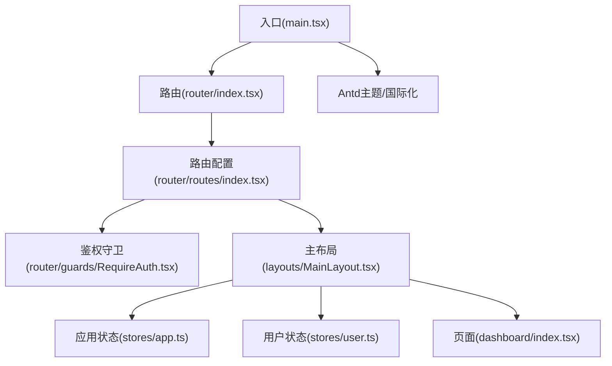
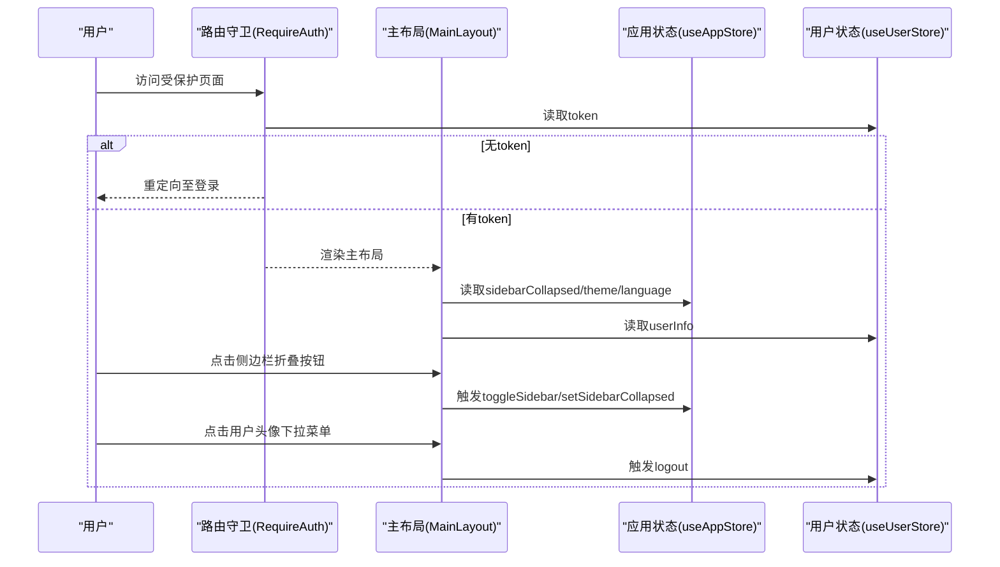
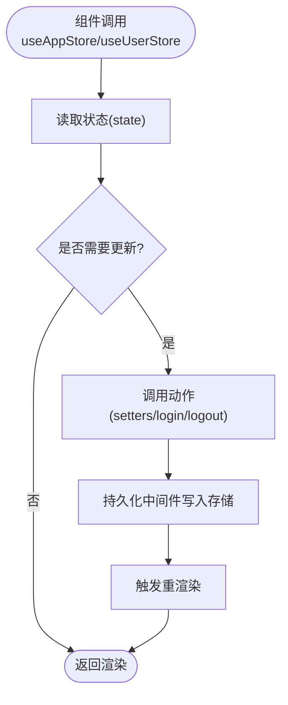
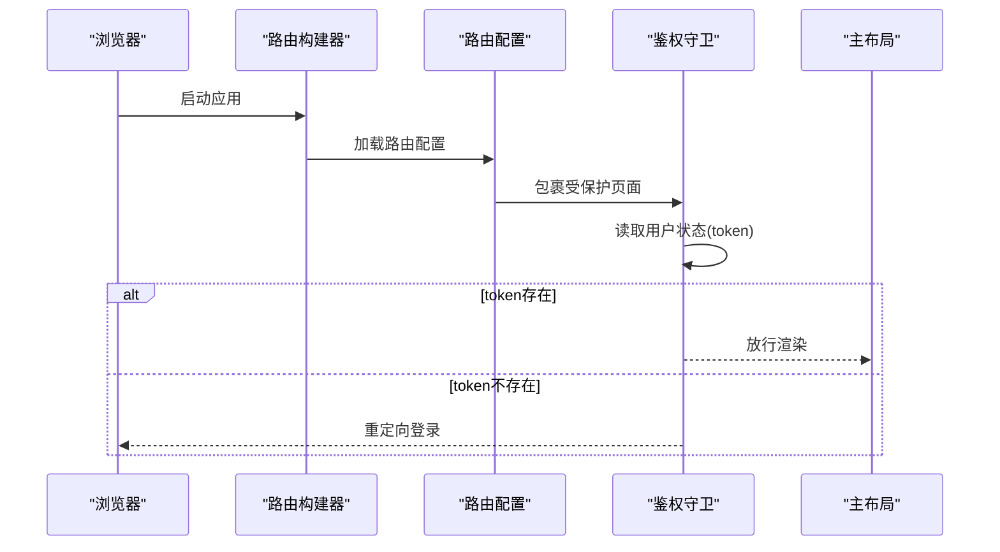
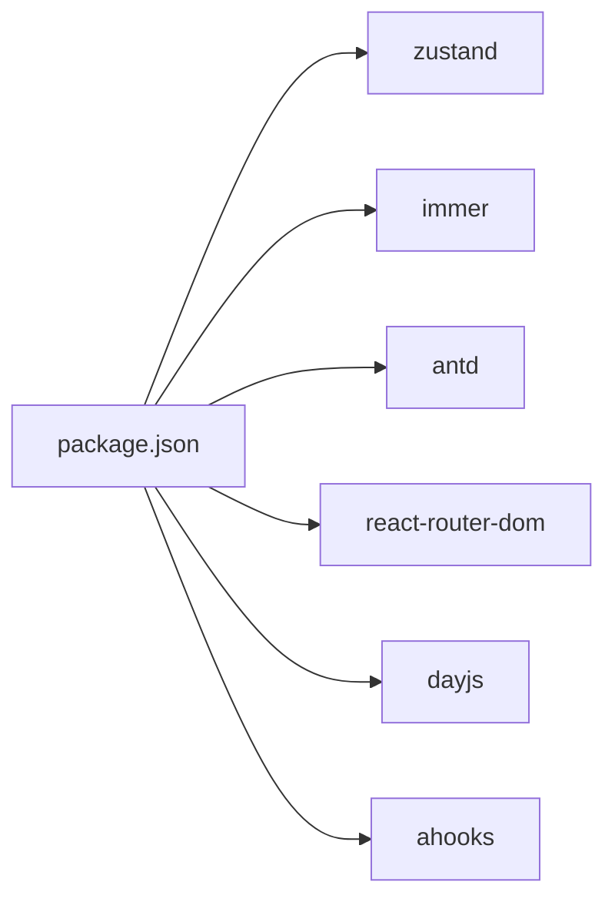

# 组件通信机制

<cite>
**本文引用的文件**
- [src/main.tsx](file://src/main.tsx)
- [src/layouts/MainLayout.tsx](file://src/layouts/MainLayout.tsx)
- [src/router/index.tsx](file://src/router/index.tsx)
- [src/router/routes/index.tsx](file://src/router/routes/index.tsx)
- [src/router/guards/RequireAuth.tsx](file://src/router/guards/RequireAuth.tsx)
- [src/stores/index.ts](file://src/stores/index.ts)
- [src/stores/app.ts](file://src/stores/app.ts)
- [src/stores/user.ts](file://src/stores/user.ts)
- [src/utils/index.ts](file://src/utils/index.ts)
- [src/types/index.ts](file://src/types/index.ts)
- [package.json](file://package.json)
</cite>

## 目录

1. [引言](#引言)
2. [项目结构](#项目结构)
3. [核心组件](#核心组件)
4. [架构总览](#架构总览)
5. [详细组件分析](#详细组件分析)
6. [依赖分析](#依赖分析)
7. [性能考虑](#性能考虑)
8. [故障排查指南](#故障排查指南)
9. [结论](#结论)
10. [附录](#附录)

## 引言

本文件围绕“AI管理平台”的组件通信机制展开，重点覆盖以下主题：

- 组件通信模式：父子组件（Props传递、回调）、兄弟组件（事件总线/状态共享）、跨层级（上下文Provider、全局状态）。
- 状态管理：Zustand 的使用、状态提升策略、局部状态与全局状态的选择。
- 自定义 Hooks：数据获取、业务逻辑、UI 状态等在通信中的角色。
- 最佳实践：性能优化、内存泄漏防护、错误边界处理。
- 实战示例：结合仓库现有代码，给出可落地的通信方案。

## 项目结构

该工程采用分层清晰的组织方式：

- 应用入口与主题配置位于入口文件中，统一注入 Ant Design 主题与国际化。
- 布局层通过主布局组件承载侧边栏、头部、内容区，并与全局状态交互。
- 路由层负责页面级导航与鉴权守卫，页面组件负责展示与少量本地交互。
- 状态层采用 Zustand，分别维护应用态（主题、语言、侧边栏折叠）与用户态（登录信息、权限）。
- 工具层提供通用工具函数（防抖、节流、格式化等），辅助通信与渲染。

图表来源

- [src/main.tsx](file://src/main.tsx#L17-L31)
- [src/router/index.tsx](file://src/router/index.tsx#L1-L9)
- [src/router/routes/index.tsx](file://src/router/routes/index.tsx#L9-L28)
- [src/router/guards/RequireAuth.tsx](file://src/router/guards/RequireAuth.tsx#L11-L22)
- [src/layouts/MainLayout.tsx](file://src/layouts/MainLayout.tsx#L18-L25)

章节来源

- [src/main.tsx](file://src/main.tsx#L1-L32)
- [src/router/index.tsx](file://src/router/index.tsx#L1-L9)
- [src/router/routes/index.tsx](file://src/router/routes/index.tsx#L1-L31)
- [src/router/guards/RequireAuth.tsx](file://src/router/guards/RequireAuth.tsx#L1-L25)
- [src/layouts/MainLayout.tsx](file://src/layouts/MainLayout.tsx#L1-L174)

## 核心组件

- 入口与主题配置：在入口文件中统一注入 Ant Design 的 ConfigProvider，设置语言与主题色，保证全局 UI 一致性。
- 主布局：承担侧边栏、头部、内容区的职责；从全局状态读取主题、语言、侧边栏折叠状态，并通过动作切换状态；同时从用户状态读取用户信息并处理登出。
- 鉴权守卫：基于用户状态中的 token 决定是否放行到受保护页面。
- 页面组件：如仪表盘页面，负责数据展示与少量本地交互，不直接参与全局状态管理。
- 全局状态：应用状态与用户状态分别封装在独立的 Zustand Store 中，支持持久化与 Immer 更新。

章节来源

- [src/main.tsx](file://src/main.tsx#L17-L31)
- [src/layouts/MainLayout.tsx](file://src/layouts/MainLayout.tsx#L18-L25)
- [src/router/guards/RequireAuth.tsx](file://src/router/guards/RequireAuth.tsx#L15-L15)
- [src/stores/app.ts](file://src/stores/app.ts#L18-L58)
- [src/stores/user.ts](file://src/stores/user.ts#L21-L75)

## 架构总览

下图展示了组件通信在本项目中的总体流向：入口注入主题 → 路由守卫校验 → 主布局消费全局状态 → 页面组件渲染数据 → 用户操作触发状态更新。

图表来源

- [src/router/guards/RequireAuth.tsx](file://src/router/guards/RequireAuth.tsx#L15-L15)
- [src/layouts/MainLayout.tsx](file://src/layouts/MainLayout.tsx#L23-L24)
- [src/stores/app.ts](file://src/stores/app.ts#L25-L35)
- [src/stores/user.ts](file://src/stores/user.ts#L53-L60)

## 详细组件分析

### 1) 父子组件通信：Props传递与回调

- 父组件（主布局）向子组件（Ant Design 的 Layout/Header/Sider/Menu/Content）传递 props（如样式、图标、选中状态等），实现 UI 层面的父子通信。
- 子组件通过回调（如 onClick、onSelect）将用户行为回传给父组件，父组件根据回调执行状态更新或页面跳转。
- 示例路径：
  - 侧边栏折叠按钮的点击回调用于切换应用状态。
  - 用户下拉菜单的点击回调用于触发登出并跳转登录页。
  - 菜单点击回调用于页面路由跳转。

章节来源

- [src/layouts/MainLayout.tsx](file://src/layouts/MainLayout.tsx#L119-L125)
- [src/layouts/MainLayout.tsx](file://src/layouts/MainLayout.tsx#L48-L61)
- [src/layouts/MainLayout.tsx](file://src/layouts/MainLayout.tsx#L102-L102)

### 2) 兄弟组件通信：状态共享与事件

- 在当前代码中，兄弟组件之间的通信主要通过共享全局状态实现：例如头部区域的通知徽标与用户信息共享同一用户状态，二者通过订阅同一状态源实现联动。
- 若需要更复杂的事件编排，可在全局状态中引入事件队列或信号量，但当前仓库未见显式的事件总线实现。

章节来源

- [src/layouts/MainLayout.tsx](file://src/layouts/MainLayout.tsx#L129-L131)
- [src/layouts/MainLayout.tsx](file://src/layouts/MainLayout.tsx#L133-L152)
- [src/stores/user.ts](file://src/stores/user.ts#L24-L26)

### 3) 跨层级组件通信：全局状态（Zustand）

- 应用状态与用户状态分别封装在独立的 Zustand Store 中，通过 Hook 在任意层级组件中访问与更新。
- 应用状态包含主题、语言、侧边栏折叠等 UI 状态；用户状态包含用户信息、token、权限等业务状态。
- 通过持久化中间件，状态在刷新后仍可恢复，提升用户体验。

图表来源

- [src/stores/app.ts](file://src/stores/app.ts#L18-L58)
- [src/stores/user.ts](file://src/stores/user.ts#L21-L75)

章节来源

- [src/stores/app.ts](file://src/stores/app.ts#L18-L58)
- [src/stores/user.ts](file://src/stores/user.ts#L21-L75)
- [src/stores/index.ts](file://src/stores/index.ts#L1-L3)

### 4) 状态管理：Zustand 使用与选择

- 状态提升策略：UI 状态（主题、语言、侧边栏）与业务状态（用户信息、token、权限）分离，避免过度提升导致的渲染风暴。
- 局部状态 vs 全局状态：仅当多个非父子关系组件需要共享且频繁更新时才放入全局状态；否则使用局部状态，减少不必要的重渲染。
- 持久化与 Immer：应用状态与用户状态均启用持久化与 Immer，简化不可变更新与本地存储。

章节来源

- [src/stores/app.ts](file://src/stores/app.ts#L18-L58)
- [src/stores/user.ts](file://src/stores/user.ts#L21-L75)
- [src/stores/index.ts](file://src/stores/index.ts#L1-L3)

### 5) 自定义 Hooks 在组件通信中的应用

- 数据获取 Hook：可基于请求插件与类型系统封装数据获取 Hook，统一处理加载、错误与缓存。
- 业务逻辑 Hook：将权限判断、表单校验等业务逻辑抽取为 Hook，便于复用与测试。
- UI 状态 Hook：如抽屉、弹窗、标签页等 UI 状态的集中管理，减少重复代码。
- 当前仓库的 hooks 导出文件为空，建议后续按需补充。

章节来源

- [src/hooks/index.ts](file://src/hooks/index.ts#L1-L6)
- [src/types/index.ts](file://src/types/index.ts#L17-L28)
- [src/utils/index.ts](file://src/utils/index.ts#L59-L87)

### 6) 路由与鉴权：跨层级通信的典型场景

- 鉴权守卫通过读取用户状态中的 token 决定是否放行，属于典型的跨层级通信：守卫组件与页面组件之间无直接父子关系，但通过全局状态建立联系。
- 路由配置将主布局作为根元素，内部再嵌套子路由，形成稳定的页面容器与状态消费环境。

图表来源

- [src/router/index.tsx](file://src/router/index.tsx#L1-L9)
- [src/router/routes/index.tsx](file://src/router/routes/index.tsx#L11-L17)
- [src/router/guards/RequireAuth.tsx](file://src/router/guards/RequireAuth.tsx#L15-L15)

章节来源

- [src/router/index.tsx](file://src/router/index.tsx#L1-L9)
- [src/router/routes/index.tsx](file://src/router/routes/index.tsx#L9-L28)
- [src/router/guards/RequireAuth.tsx](file://src/router/guards/RequireAuth.tsx#L1-L25)

### 7) 页面组件与数据展示

- 页面组件负责数据展示与少量本地交互，不直接参与全局状态管理，遵循“展示型组件”原则，降低复杂度。
- 通过工具函数对日期、金额、数字进行格式化，提升可读性与一致性。

章节来源

- [src/pages/dashboard/index.tsx](file://src/pages/dashboard/index.tsx#L12-L167)
- [src/utils/index.ts](file://src/utils/index.ts#L6-L19)
- [src/utils/index.ts](file://src/utils/index.ts#L24-L27)
- [src/utils/index.ts](file://src/utils/index.ts#L32-L35)

## 依赖分析

- 状态管理：Zustand 为核心，Immer 与 persist 作为中间件增强更新与持久化能力。
- UI 框架：Ant Design 提供丰富的组件与主题能力，配合 ConfigProvider 进行全局配置。
- 路由与导航：React Router DOM 提供路由能力，结合守卫实现鉴权。
- 工具库：dayjs、lodash-es、ahooks 等提升开发效率与稳定性。

图表来源

- [package.json](file://package.json#L20-L36)

章节来源

- [package.json](file://package.json#L1-L81)

## 性能考虑

- 减少全局状态粒度：将高频更新的状态拆分为多个 Store 或局部状态，避免单一 Store 导致的全量重渲染。
- 使用 Immer 与不可变更新：通过 Immer 简化更新逻辑，减少浅比较失败带来的重渲染。
- 防抖与节流：对高频输入、滚动、窗口尺寸变化等场景使用防抖/节流，降低渲染压力。
- 懒加载与分割：对大型页面或组件采用懒加载，减少首屏负担。
- 严格模式与开发工具：利用 React Strict Mode 与开发者工具定位潜在问题。

章节来源

- [src/utils/index.ts](file://src/utils/index.ts#L59-L87)
- [src/stores/app.ts](file://src/stores/app.ts#L18-L58)
- [src/stores/user.ts](file://src/stores/user.ts#L21-L75)

## 故障排查指南

- 登录态异常：检查用户状态的持久化键名与清理逻辑，确保登出后本地存储被正确移除。
- 侧边栏状态不同步：确认主布局中读取与更新的路径一致，避免因命名差异导致的状态不一致。
- 鉴权误判：核对守卫中读取 token 的路径与用户状态初始化逻辑，确保在应用启动时正确恢复状态。
- 性能问题：使用 React DevTools Profiler 定位重渲染热点，结合防抖/节流与状态拆分优化。

章节来源

- [src/stores/user.ts](file://src/stores/user.ts#L59-L60)
- [src/layouts/MainLayout.tsx](file://src/layouts/MainLayout.tsx#L23-L24)
- [src/router/guards/RequireAuth.tsx](file://src/router/guards/RequireAuth.tsx#L15-L15)

## 结论

本项目通过“入口主题注入 + 路由守卫 + 全局状态 + 展示型页面”的架构，实现了清晰、可维护的组件通信体系。Zustand 的轻量与灵活性使得状态管理易于扩展与演进；通过合理的状态拆分与工具函数，兼顾了性能与可读性。建议后续在 hooks 层面补充数据获取与业务逻辑 Hook，进一步提升组件复用与可测试性。

## 附录

- 类型系统：统一的全局类型定义有助于在组件间传递数据时保持强类型约束，减少运行时错误。
- 工具函数：防抖、节流、格式化等工具函数可作为通信与渲染的基础设施，建议在 Hook 中复用。

章节来源

- [src/types/index.ts](file://src/types/index.ts#L17-L28)
- [src/utils/index.ts](file://src/utils/index.ts#L59-L87)
