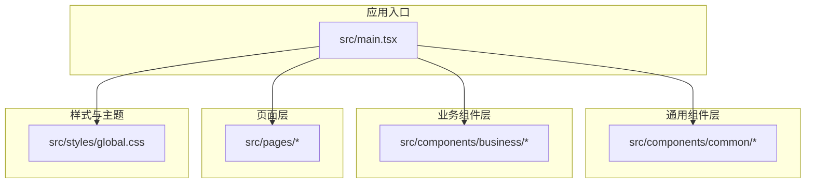
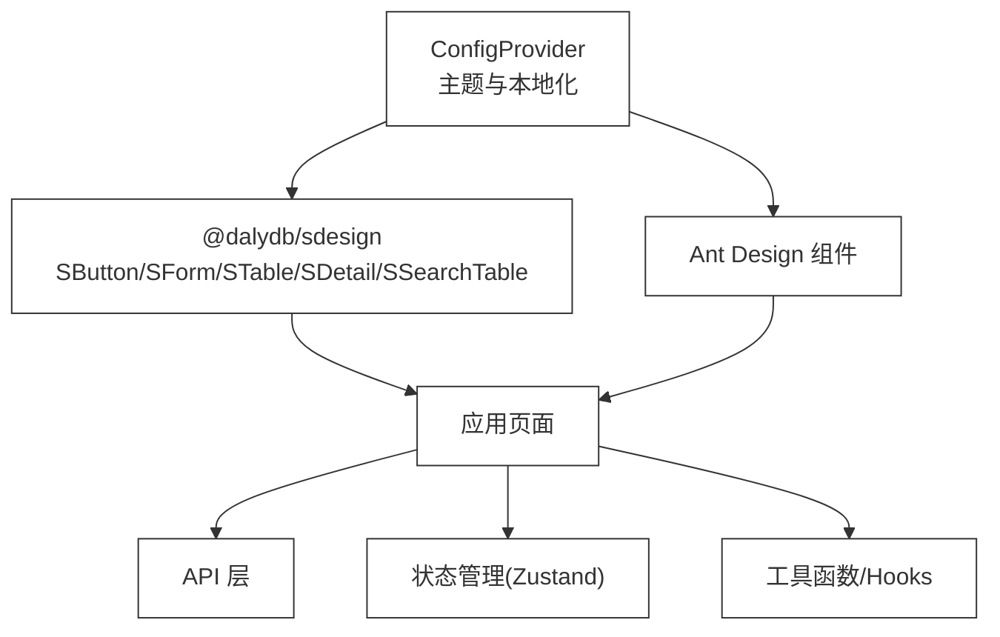
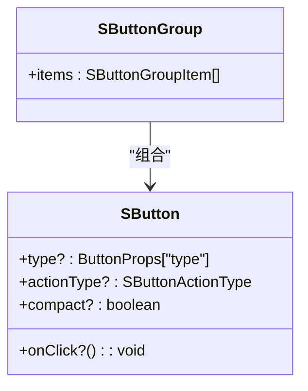
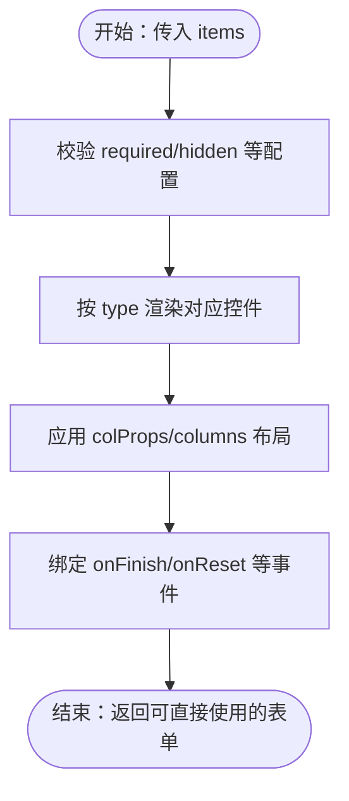
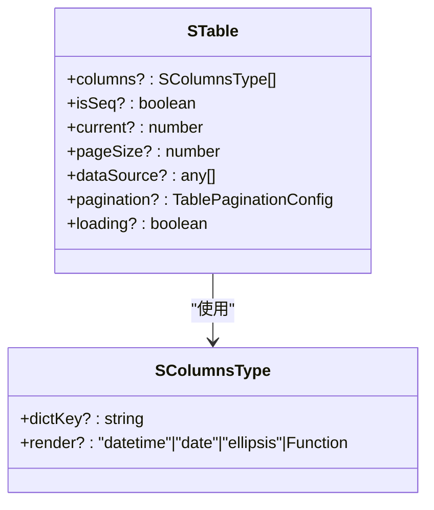
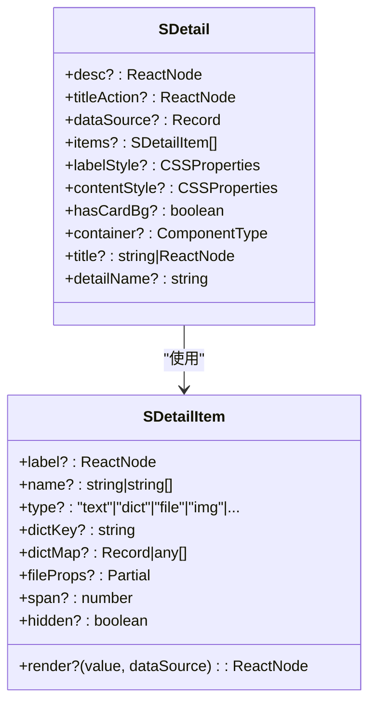
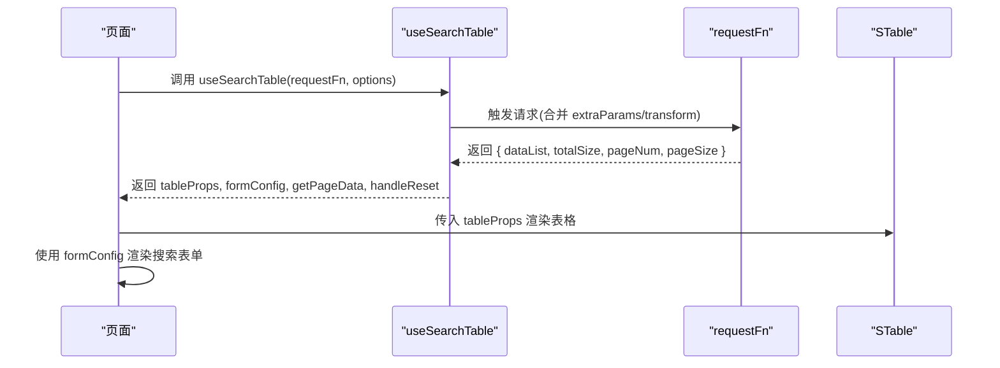
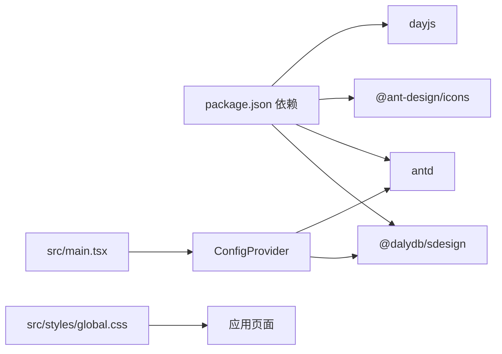

# 通用组件

<cite>
**本文引用的文件**
- [package.json](file://package.json)
- [main.tsx](file://src/main.tsx)
- [global.css](file://src/styles/global.css)
- [架构规范.md](file://.ai/core/architecture.md)
- [编码规范.md](file://.ai/core/coding-standards.md)
- [sdesign 文档.md](file://.ai/core/sdesign-docs.md)
- [CRUD 页面模板.md](file://.ai/templates/crud-page.md)
- [Dashboard 页面](file://src/pages/dashboard/index.tsx)
- [登录页面](file://src/pages/login/index.tsx)
</cite>

## 目录

1. [引言](#引言)
2. [项目结构](#项目结构)
3. [核心组件](#核心组件)
4. [架构概览](#架构概览)
5. [详细组件分析](#详细组件分析)
6. [依赖分析](#依赖分析)
7. [性能考虑](#性能考虑)
8. [故障排查指南](#故障排查指南)
9. [结论](#结论)
10. [附录](#附录)

## 引言

本文件面向“AI管理平台”的通用组件体系，目标是帮助开发者快速理解并高效使用平台提供的通用UI组件，涵盖按钮、表单控件、表格、详情与模态场景等基础能力，并给出设计规范、复用策略、扩展机制与最佳实践。平台采用 Ant Design 作为基础UI库，并通过 @dalydb/sdesign 组件库提供统一的 S 前缀增强组件，形成“配置驱动 + 组件复用”的开发范式。

## 项目结构

- 项目采用分层清晰的目录结构，通用组件位于 components/common，业务组件位于 components/business，布局组件位于 layouts，页面位于 pages。
- 通用组件需遵循统一的组件规范与样式规范，确保跨页面一致性与可维护性。
- 项目通过 ConfigProvider 全局注入 Ant Design 主题与本地化，保证组件风格一致。

图示来源

- [main.tsx](file://src/main.tsx#L17-L31)
- [global.css](file://src/styles/global.css#L1-L83)

章节来源

- [package.json](file://package.json#L37-L55)
- [main.tsx](file://src/main.tsx#L17-L31)
- [架构规范.md](file://.ai/core/architecture.md#L20-L75)

## 核心组件

- 组件库：@dalydb/sdesign（S 前缀组件）
- 基础库：Ant Design 5.x + @ant-design/icons + dayjs
- 组件类型：按钮（SButton）、表单（SForm）、表格（STable）、详情（SDetail）、搜索表格（SSearchTable）等
- 设计理念：配置驱动、类型安全、可组合、可扩展

章节来源

- [package.json](file://package.json#L20-L36)
- [sdesign 文档.md](file://.ai/core/sdesign-docs.md#L13-L20)
- [编码规范.md](file://.ai/core/coding-standards.md#L47-L89)

## 架构概览

- 入口配置：ConfigProvider 全局注入主题与本地化；全局样式统一管理。
- 组件规范：函数式组件 + TypeScript；Props 接口明确；避免 any 类型；样式采用 BEM 命名。
- 组件库集成：优先使用 S 前缀组件；SForm 通过 items 配置项声明控件；SSearchTable 将搜索表单与表格一体化。
- 状态与请求：API 层与状态管理分离；组件内使用 ahooks 的 useRequest 管理异步请求与错误处理。

图示来源

- [main.tsx](file://src/main.tsx#L19-L29)
- [sdesign 文档.md](file://.ai/core/sdesign-docs.md#L13-L20)
- [架构规范.md](file://.ai/core/architecture.md#L77-L181)

## 详细组件分析

### SButton（按钮）

- 作用：增强按钮，支持 actionType 预设类型（保存、取消、删除、编辑、搜索等），减少重复文案与样式。
- 设计要点：优先使用 actionType，避免手写 children；支持紧凑模式（compact）。
- 扩展机制：可通过 SButton.Group 组合多个按钮；支持 visible、render 自定义渲染与点击事件。

图示来源

- [sdesign 文档.md](file://.ai/core/sdesign-docs.md#L89-L92)
- [sdesign 文档.md](file://.ai/core/sdesign-docs.md#L156-L165)

章节来源

- [sdesign 文档.md](file://.ai/core/sdesign-docs.md#L22-L23)
- [sdesign 文档.md](file://.ai/core/sdesign-docs.md#L89-L92)
- [sdesign 文档.md](file://.ai/core/sdesign-docs.md#L156-L165)

### SForm（表单控件）

- 作用：配置化表单，通过 items 数组声明控件类型、字段、校验与布局，自动渲染 Form.Item。
- 设计要点：支持 22 种控件类型（input、select、datePicker、upload、table、dependency 等）；fieldProps 类型随 type 自动推导；支持分组、只读、联动与自定义渲染。
- 复用策略：将 items 与列数 columns 抽象为页面级配置；通过 formName 支持嵌套表单字段前缀；readonly 模式下可直接展示文本。

图示来源

- [sdesign 文档.md](file://.ai/core/sdesign-docs.md#L52-L62)
- [sdesign 文档.md](file://.ai/core/sdesign-docs.md#L96-L115)

章节来源

- [sdesign 文档.md](file://.ai/core/sdesign-docs.md#L192-L195)
- [sdesign 文档.md](file://.ai/core/sdesign-docs.md#L96-L115)

### STable（表格）

- 作用：增强表格，支持 dictKey 字典映射、render 快捷类型（datetime/date/ellipsis）、序号列等。
- 设计要点：columns 支持 dictKey 与字符串 render；isSeq/current/pageSize 控制序号列；rowKey 必须唯一。
- 复用策略：与 SSearchTable 结合，形成“搜索 + 列表”一体化页面。

图示来源

- [sdesign 文档.md](file://.ai/core/sdesign-docs.md#L71-L76)
- [sdesign 文档.md](file://.ai/core/sdesign-docs.md#L117-L126)

章节来源

- [sdesign 文档.md](file://.ai/core/sdesign-docs.md#L197-L199)
- [sdesign 文档.md](file://.ai/core/sdesign-docs.md#L71-L76)

### SDetail（详情）

- 作用：详情展示，支持多种渲染类型（text/dict/file/img/rangeTime/checkbox 等），支持分组与容器自定义。
- 设计要点：通过 items 与 dataSource 映射；dictKey 与 dictMap 支持字典值转换；支持标题右侧操作区与卡片背景。
- 复用策略：将详情项抽象为 SDetailItem，支持分组 SDetail.Group 与多面板 SDetailProps。

图示来源

- [sdesign 文档.md](file://.ai/core/sdesign-docs.md#L77-L87)
- [sdesign 文档.md](file://.ai/core/sdesign-docs.md#L128-L142)

章节来源

- [sdesign 文档.md](file://.ai/core/sdesign-docs.md#L33-L34)
- [sdesign 文档.md](file://.ai/core/sdesign-docs.md#L128-L142)

### SSearchTable（搜索表格一体化）

- 作用：将 SForm.Search 与 STable 组合，形成列表页首选组件。
- 设计要点：requestFn 返回包含列表与总数的数据结构；支持 options.paginationFields 自定义字段映射；useSearchTable 返回 tableProps、formConfig、分页与加载状态。
- 复用策略：将 formItems 与 columns 抽象为页面配置，统一 headTitle/tableTitle 样式。

图示来源

- [sdesign 文档.md](file://.ai/core/sdesign-docs.md#L63-L70)
- [sdesign 文档.md](file://.ai/core/sdesign-docs.md#L201-L226)

章节来源

- [sdesign 文档.md](file://.ai/core/sdesign-docs.md#L45-L46)
- [sdesign 文档.md](file://.ai/core/sdesign-docs.md#L229-L249)
- [CRUD 页面模板.md](file://.ai/templates/crud-page.md#L50-L81)

### SForm.Search（搜索表单）

- 作用：SForm 的搜索变体，支持默认展开/收起、卡片包裹、右侧操作区等。
- 设计要点：defaultExpand/showExpand/expandLine 控制折叠行为；actionNode 支持右侧自定义操作；isCard 控制是否包裹卡片。

章节来源

- [sdesign 文档.md](file://.ai/core/sdesign-docs.md#L144-L154)

### SConfigProvider（全局配置）

- 作用：提供全局字典（globalDict），STable/SDetail 自动读取并进行值映射。
- 设计要点：在应用入口或页面根部包裹，集中管理字典与上传地址等配置。

章节来源

- [sdesign 文档.md](file://.ai/core/sdesign-docs.md#L28-L28)

## 依赖分析

- 组件库依赖：@dalydb/sdesign 与 antd 并存，优先使用 S 前缀组件；必要时使用 antd 原生组件进行补充。
- 主题与本地化：ConfigProvider 在入口注入，统一颜色与圆角；dayjs 设置中文语言包。
- 样式依赖：全局样式 global.css 提供通用工具类与基础排版。

图示来源

- [package.json](file://package.json#L20-L36)
- [main.tsx](file://src/main.tsx#L19-L29)
- [global.css](file://src/styles/global.css#L1-L83)

章节来源

- [package.json](file://package.json#L20-L36)
- [main.tsx](file://src/main.tsx#L19-L29)

## 性能考虑

- 避免不必要的重渲染：使用 useMemo/useCallback 缓存计算结果与回调函数。
- 列表渲染优化：为列表项提供稳定 key；大数据量场景可引入虚拟列表组件。
- 组件懒加载：页面路由与组件按需加载，降低首屏压力。
- 请求与状态：使用 ahooks 的 useRequest 管理请求生命周期与错误处理，避免在组件内直接发起请求。

章节来源

- [编码规范.md](file://.ai/core/coding-standards.md#L323-L350)

## 故障排查指南

- 组件未生效或样式异常
  - 检查 ConfigProvider 是否正确包裹应用根节点，locale 与 theme 是否正确注入。
  - 检查全局样式 global.css 是否被正确引入。
- SForm 表单不渲染或报错
  - 确认 items 数组配置完整，type 与 fieldProps 类型匹配；避免使用 any。
  - 检查 required/hidden/depNames 等配置是否冲突。
- STable 列不显示或字典不生效
  - 确认列定义中的 dictKey 与 SConfigProvider 的 globalDict 对应；检查数据源字段名与 name 映射。
- SSearchTable 无数据或分页异常
  - 检查 requestFn 返回的数据结构与 options.paginationFields 字段映射是否一致。
  - 确认 extraParams/transformRequestParams/transformResponseData 的参数处理逻辑。
- 按钮文案与样式不符合预期
  - 优先使用 actionType；若需自定义文案与样式，确保 SButton.Group 的 visible/render 配置正确。

章节来源

- [main.tsx](file://src/main.tsx#L19-L29)
- [global.css](file://src/styles/global.css#L1-L83)
- [sdesign 文档.md](file://.ai/core/sdesign-docs.md#L277-L283)
- [编码规范.md](file://.ai/core/coding-standards.md#L250-L294)

## 结论

通过 @dalydb/sdesign 的 S 前缀组件与配置化范式，平台实现了“高复用、低样板代码”的通用组件体系。结合 Ant Design 的强大生态与统一的主题注入，开发者可以快速搭建一致性的业务页面。建议在实际开发中严格遵循组件规范与编码规范，充分利用 SSearchTable、SForm、STable、SDetail 等核心组件，提升开发效率与维护性。

## 附录

### 设计规范与最佳实践

- 组件规范
  - 函数式组件 + TypeScript；明确 Props 接口；避免 any 类型。
  - 使用 BEM 命名规范，避免全局样式污染。
- 样式规范
  - 组件样式文件与组件同名；优先使用全局工具类（flex、gap、text-center 等）。
- 导入导出规范
  - 导入顺序：React 相关 → 第三方库 → 绝对路径（src/）→ 相对路径（./）。
  - 默认导出组件，命名导出 API/Hooks/工具函数。
- 错误处理与性能
  - 统一在请求层处理错误；组件内只处理业务错误。
  - 使用 useMemo/useCallback 优化渲染；大数据量使用虚拟列表。

章节来源

- [架构规范.md](file://.ai/core/architecture.md#L77-L181)
- [编码规范.md](file://.ai/core/coding-standards.md#L47-L121)
- [编码规范.md](file://.ai/core/coding-standards.md#L215-L294)

### 通用组件使用示例与定制化方案

- 搜索表格页面
  - 使用 SSearchTable 组合 SForm.Search 与 STable；通过 requestFn 提供数据；options.paginationFields 自定义分页字段映射。
- 配置化表单
  - 使用 SForm.items 声明控件类型与字段；通过 columns 控制布局；通过 required/readonly/customCom/render 定制行为。
- 详情展示
  - 使用 SDetail.items 与 dataSource 映射；通过 dictKey/dictMap 进行字典值转换；通过 titleAction 添加操作区。
- 按钮与按钮组
  - 使用 SButton.actionType 选择预设类型；通过 SButton.Group 组合多个按钮；通过 visible/render 自定义渲染与可见性。

章节来源

- [sdesign 文档.md](file://.ai/core/sdesign-docs.md#L229-L275)
- [CRUD 页面模板.md](file://.ai/templates/crud-page.md#L50-L81)

### 页面中的通用组件实践

- 登录页
  - 使用 antd 的 Form/Button/Input 等原生组件进行表单与交互；通过 ahooks 的 useRequest 管理登录请求。
- 仪表盘
  - 使用 antd 的 Card/List/Statistic/Progress 等组件进行数据可视化与活动展示；体现通用组件在非 S 前缀场景下的使用方式。

章节来源

- [登录页面](file://src/pages/login/index.tsx#L32-L133)
- [Dashboard 页面](file://src/pages/dashboard/index.tsx#L12-L170)
