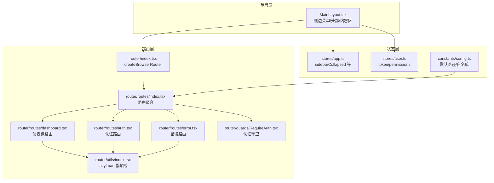
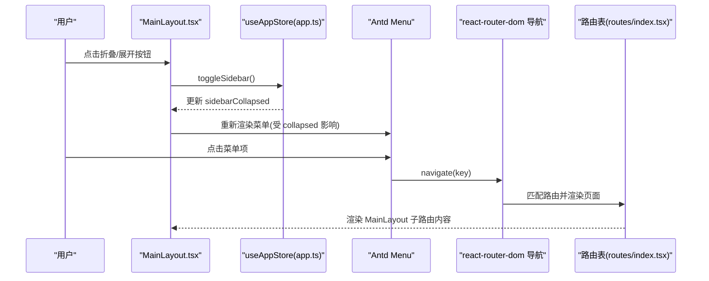
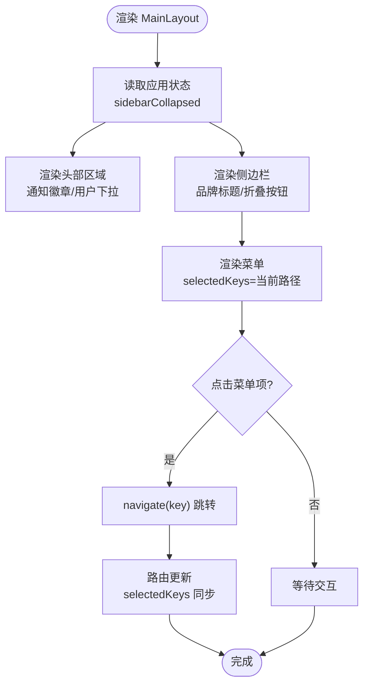
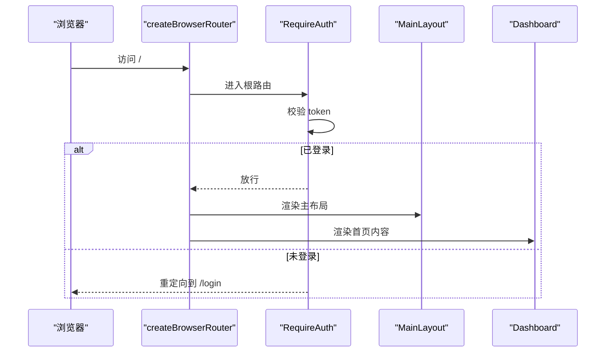
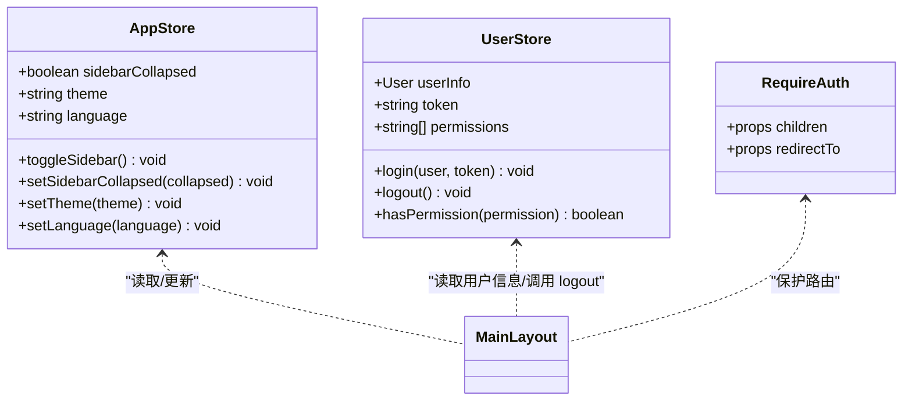
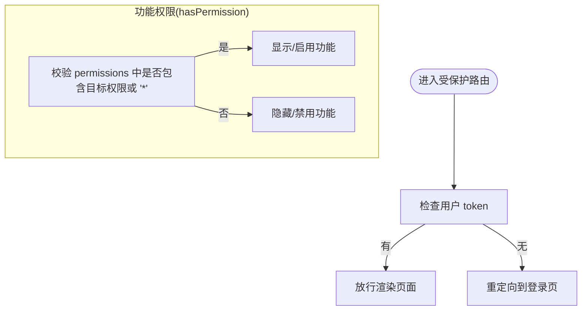
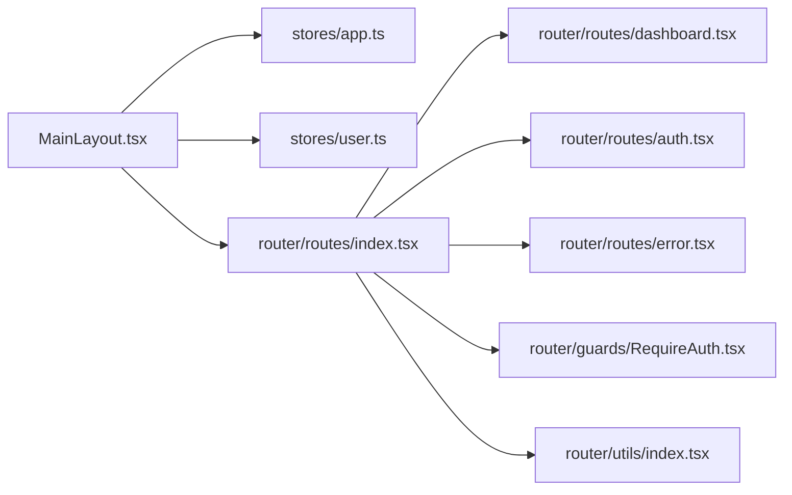

# 导航菜单

<cite>
**本文引用的文件**
- [src/layouts/MainLayout.tsx](file://src/layouts/MainLayout.tsx)
- [src/router/routes/index.tsx](file://src/router/routes/index.tsx)
- [src/router/index.tsx](file://src/router/index.tsx)
- [src/stores/app.ts](file://src/stores/app.ts)
- [src/stores/user.ts](file://src/stores/user.ts)
- [src/router/guards/RequireAuth.tsx](file://src/router/guards/RequireAuth.tsx)
- [src/router/utils/index.tsx](file://src/router/utils/index.tsx)
- [src/constants/config.ts](file://src/constants/config.ts)
- [src/pages/dashboard/index.tsx](file://src/pages/dashboard/index.tsx)
- [src/router/routes/dashboard.tsx](file://src/router/routes/dashboard.tsx)
- [src/router/routes/auth.tsx](file://src/router/routes/auth.tsx)
- [src/router/routes/error.tsx](file://src/router/routes/error.tsx)
</cite>

## 目录

1. [简介](#简介)
2. [项目结构](#项目结构)
3. [核心组件](#核心组件)
4. [架构总览](#架构总览)
5. [详细组件分析](#详细组件分析)
6. [依赖关系分析](#依赖关系分析)
7. [性能考量](#性能考量)
8. [故障排查指南](#故障排查指南)
9. [结论](#结论)
10. [附录：菜单配置与使用示例](#附录菜单配置与使用示例)

## 简介

本文件围绕导航菜单系统进行系统化说明，涵盖设计理念、数据结构、动态生成机制、权限控制、与路由系统的集成（路由匹配、激活状态管理、面包屑思路）、状态管理策略（当前选中项、展开收起、响应式适配），以及菜单自定义开发指南（新增/删除菜单项、样式定制、交互行为修改）。同时提供多级菜单、图标菜单、折叠菜单等不同类型的实现思路与配置示例。

## 项目结构

导航菜单主要位于主布局组件中，配合路由系统与状态管理实现完整的导航体验。关键文件如下：

- 主布局与侧边菜单：src/layouts/MainLayout.tsx
- 路由聚合与嵌套路由：src/router/routes/index.tsx
- 路由器实例：src/router/index.tsx
- 应用状态（折叠状态、主题、语言）：src/stores/app.ts
- 用户状态（登录态、权限）：src/stores/user.ts
- 认证守卫：src/router/guards/RequireAuth.tsx
- 路由懒加载工具：src/router/utils/index.tsx
- 全局常量（应用/路由/请求配置）：src/constants/config.ts
- 首页页面：src/pages/dashboard/index.tsx
- 路由模块拆分：src/router/routes/dashboard.tsx、src/router/routes/auth.tsx、src/router/routes/error.tsx

图表来源

- [src/layouts/MainLayout.tsx](file://src/layouts/MainLayout.tsx#L1-L174)
- [src/router/index.tsx](file://src/router/index.tsx#L1-L9)
- [src/router/routes/index.tsx](file://src/router/routes/index.tsx#L1-L31)
- [src/router/routes/dashboard.tsx](file://src/router/routes/dashboard.tsx#L1-L17)
- [src/router/routes/auth.tsx](file://src/router/routes/auth.tsx#L1-L15)
- [src/router/routes/error.tsx](file://src/router/routes/error.tsx#L1-L16)
- [src/router/guards/RequireAuth.tsx](file://src/router/guards/RequireAuth.tsx#L1-L25)
- [src/router/utils/index.tsx](file://src/router/utils/index.tsx#L1-L23)
- [src/stores/app.ts](file://src/stores/app.ts#L1-L59)
- [src/stores/user.ts](file://src/stores/user.ts#L1-L76)
- [src/constants/config.ts](file://src/constants/config.ts#L1-L76)

章节来源

- [src/layouts/MainLayout.tsx](file://src/layouts/MainLayout.tsx#L1-L174)
- [src/router/routes/index.tsx](file://src/router/routes/index.tsx#L1-L31)
- [src/router/index.tsx](file://src/router/index.tsx#L1-L9)
- [src/stores/app.ts](file://src/stores/app.ts#L1-L59)
- [src/stores/user.ts](file://src/stores/user.ts#L1-L76)
- [src/router/guards/RequireAuth.tsx](file://src/router/guards/RequireAuth.tsx#L1-L25)
- [src/router/utils/index.tsx](file://src/router/utils/index.tsx#L1-L23)
- [src/constants/config.ts](file://src/constants/config.ts#L1-L76)

## 核心组件

- 侧边菜单与头部交互
  - 侧边菜单通过 Ant Design Menu 组件渲染，使用 inline 模式，选中项由当前路由路径决定。
  - 折叠按钮绑定应用状态中的切换函数，实现侧边栏展开/收起。
  - 头部右侧包含通知徽章与用户下拉菜单，支持跳转到个人中心、系统设置与退出登录。
- 路由系统
  - 使用 createBrowserRouter 聚合路由，根路由包裹认证守卫，子路由模块按需加载。
  - 首页路由在 dashboard 模块中定义，支持标题与图标元信息。
- 状态管理
  - 应用状态负责 sidebarCollapsed、主题、语言等；用户状态负责 token、权限列表与登录/登出。
- 权限控制
  - 认证守卫基于用户 token 判断是否放行；用户权限用于细粒度功能可见性判断。

章节来源

- [src/layouts/MainLayout.tsx](file://src/layouts/MainLayout.tsx#L18-L171)
- [src/router/routes/index.tsx](file://src/router/routes/index.tsx#L9-L28)
- [src/router/routes/dashboard.tsx](file://src/router/routes/dashboard.tsx#L7-L14)
- [src/stores/app.ts](file://src/stores/app.ts#L18-L58)
- [src/stores/user.ts](file://src/stores/user.ts#L21-L75)
- [src/router/guards/RequireAuth.tsx](file://src/router/guards/RequireAuth.tsx#L11-L22)

## 架构总览

导航菜单系统采用“布局-路由-状态-权限”四层协作模式：

- 布局层负责 UI 呈现与交互事件绑定；
- 路由层负责页面切换与懒加载；
- 状态层负责跨组件共享的 UI 状态与用户信息；
- 权限层负责访问控制与功能可见性。

图表来源

- [src/layouts/MainLayout.tsx](file://src/layouts/MainLayout.tsx#L75-L104)
- [src/stores/app.ts](file://src/stores/app.ts#L25-L35)
- [src/router/routes/index.tsx](file://src/router/routes/index.tsx#L9-L28)

## 详细组件分析

### 侧边菜单与头部组件（MainLayout）

- 菜单项数据结构
  - 菜单项包含 key（通常为路由路径）、icon（Ant Design 图标）、label（显示文本）等字段。
  - 当前仅包含一个示例菜单项，其余菜单项可通过运行时逻辑动态注入。
- 选中状态与路由联动
  - selectedKeys 绑定为当前路径，确保菜单与路由同步高亮。
  - 点击菜单项后调用 navigate，实现无刷新跳转。
- 折叠与响应式
  - 通过应用状态控制 Sider 的 collapsed 属性，折叠时仅显示图标与品牌简写。
  - 折叠按钮根据当前状态动态选择展开/折叠图标。
- 用户下拉菜单
  - 支持个人中心、系统设置、退出登录等操作，退出时调用用户状态的 logout 并跳转至登录页。

图表来源

- [src/layouts/MainLayout.tsx](file://src/layouts/MainLayout.tsx#L73-L104)
- [src/stores/app.ts](file://src/stores/app.ts#L21-L28)

章节来源

- [src/layouts/MainLayout.tsx](file://src/layouts/MainLayout.tsx#L18-L171)

### 路由系统与菜单集成

- 路由聚合
  - 根路由包裹 RequireAuth，确保进入主布局前已登录。
  - 子路由模块通过展开运算符引入，dashboard 路由作为首页入口。
- 路由懒加载
  - 使用 lazyLoad 包裹页面组件，提升首屏性能。
- 菜单与路由的匹配
  - 菜单项的 key 与路由 path 对应，点击后直接导航到对应路径。
  - 首页路由 index: true，访问根路径自动跳转到 dashboard。

图表来源

- [src/router/index.tsx](file://src/router/index.tsx#L6-L6)
- [src/router/routes/index.tsx](file://src/router/routes/index.tsx#L9-L28)
- [src/router/guards/RequireAuth.tsx](file://src/router/guards/RequireAuth.tsx#L11-L22)
- [src/router/routes/dashboard.tsx](file://src/router/routes/dashboard.tsx#L7-L14)

章节来源

- [src/router/index.tsx](file://src/router/index.tsx#L1-L9)
- [src/router/routes/index.tsx](file://src/router/routes/index.tsx#L1-L31)
- [src/router/guards/RequireAuth.tsx](file://src/router/guards/RequireAuth.tsx#L1-L25)
- [src/router/utils/index.tsx](file://src/router/utils/index.tsx#L1-L23)
- [src/router/routes/dashboard.tsx](file://src/router/routes/dashboard.tsx#L1-L17)

### 状态管理策略

- 侧边栏折叠状态
  - 通过 useAppStore 的 toggleSidebar/setSidebarCollapsed 控制 Sider 的 collapsed 属性。
  - 状态持久化存储于本地，保证刷新后仍保持上次折叠状态。
- 主题与语言
  - 提供 theme 与 language 字段，可扩展为全局主题切换与国际化菜单文案。
- 用户登录态与权限
  - token 为空时通过 RequireAuth 重定向至登录页。
  - permissions 支持通配符“\*”，便于快速授权或限制。

图表来源

- [src/stores/app.ts](file://src/stores/app.ts#L5-L16)
- [src/stores/user.ts](file://src/stores/user.ts#L6-L19)
- [src/router/guards/RequireAuth.tsx](file://src/router/guards/RequireAuth.tsx#L6-L9)

章节来源

- [src/stores/app.ts](file://src/stores/app.ts#L1-L59)
- [src/stores/user.ts](file://src/stores/user.ts#L1-L76)
- [src/router/guards/RequireAuth.tsx](file://src/router/guards/RequireAuth.tsx#L1-L25)

### 权限控制逻辑

- 认证守卫
  - 依据用户 token 是否存在决定是否放行，未登录则重定向到登录页。
- 功能权限
  - hasPermission 支持精确权限字符串与通配符“\*”，可用于控制菜单项/按钮的显示与交互。

图表来源

- [src/router/guards/RequireAuth.tsx](file://src/router/guards/RequireAuth.tsx#L15-L21)
- [src/stores/user.ts](file://src/stores/user.ts#L62-L65)

章节来源

- [src/router/guards/RequireAuth.tsx](file://src/router/guards/RequireAuth.tsx#L1-L25)
- [src/stores/user.ts](file://src/stores/user.ts#L1-L76)

### 面包屑导航（设计建议）

- 当前代码未实现面包屑，但可基于路由层级与 meta 信息构建。
- 建议在路由 handle 中增加 title 与父级路径信息，结合 location.pathname 生成面包屑链路。
- 可参考 Ant Design Pro 的面包屑实现思路进行扩展。

## 依赖关系分析

- 组件耦合
  - MainLayout 依赖应用状态与用户状态，耦合度低，职责清晰。
  - 路由系统与布局解耦，通过路由表集中管理。
- 外部依赖
  - Ant Design 菜单与图标组件、react-router-dom 导航能力。
- 潜在循环依赖
  - 当前结构未见循环导入，路由模块按需引入，避免环状依赖。

图表来源

- [src/layouts/MainLayout.tsx](file://src/layouts/MainLayout.tsx#L1-L174)
- [src/router/routes/index.tsx](file://src/router/routes/index.tsx#L1-L31)
- [src/router/routes/dashboard.tsx](file://src/router/routes/dashboard.tsx#L1-L17)
- [src/router/routes/auth.tsx](file://src/router/routes/auth.tsx#L1-L15)
- [src/router/routes/error.tsx](file://src/router/routes/error.tsx#L1-L16)
- [src/router/guards/RequireAuth.tsx](file://src/router/guards/RequireAuth.tsx#L1-L25)
- [src/router/utils/index.tsx](file://src/router/utils/index.tsx#L1-L23)

章节来源

- [src/layouts/MainLayout.tsx](file://src/layouts/MainLayout.tsx#L1-L174)
- [src/router/routes/index.tsx](file://src/router/routes/index.tsx#L1-L31)

## 性能考量

- 路由懒加载
  - 使用 lazy 与 Suspense 提升首屏加载速度，减少初始包体积。
- 状态持久化
  - 应用状态使用持久化中间件，折叠状态等在刷新后保持，改善用户体验。
- 图标与组件
  - Ant Design 图标按需引入，避免全量引入导致体积增大。

章节来源

- [src/router/utils/index.tsx](file://src/router/utils/index.tsx#L1-L23)
- [src/stores/app.ts](file://src/stores/app.ts#L49-L57)

## 故障排查指南

- 无法进入主页面
  - 检查用户 token 是否存在，若不存在将被 RequireAuth 重定向到登录页。
- 菜单不跳转
  - 确认菜单项的 key 与路由 path 一致，点击后会调用 navigate(key)。
- 折叠状态异常
  - 检查 useAppStore 的 toggleSidebar/setSidebarCollapsed 是否正确触发。
- 页面空白或加载缓慢
  - 确认懒加载组件是否正确包裹 lazyLoad，Suspense fallback 是否生效。

章节来源

- [src/router/guards/RequireAuth.tsx](file://src/router/guards/RequireAuth.tsx#L15-L21)
- [src/layouts/MainLayout.tsx](file://src/layouts/MainLayout.tsx#L98-L104)
- [src/stores/app.ts](file://src/stores/app.ts#L25-L35)
- [src/router/utils/index.tsx](file://src/router/utils/index.tsx#L4-L20)

## 结论

该导航菜单系统以简洁清晰的分层设计实现了从布局到路由再到状态与权限的完整闭环。通过 inline 菜单与路由路径的强关联，实现了自然的激活状态管理与无刷新跳转；通过 RequireAuth 与用户权限模型，提供了基础的访问控制能力。后续可在现有基础上扩展多级菜单、面包屑、图标菜单与折叠菜单等特性，满足更复杂的业务需求。

## 附录：菜单配置与使用示例

### 示例一：添加一级菜单项

- 在侧边菜单数组中新增一项，key 为路由路径，icon 为 Ant Design 图标，label 为显示文本。
- 确保路由表中存在对应的 path 与 element。

章节来源

- [src/layouts/MainLayout.tsx](file://src/layouts/MainLayout.tsx#L64-L71)
- [src/router/routes/index.tsx](file://src/router/routes/index.tsx#L18-L26)

### 示例二：实现多级菜单（建议方案）

- 将菜单项结构扩展为包含 children 的树形结构，每个子项同样包含 key/icon/label。
- 在 Menu 组件上开启 SubMenu 渲染，或在业务层自行渲染子菜单。
- 路由层面也相应拆分为嵌套路由，形成“菜单-路由”双树结构。

章节来源

- [src/layouts/MainLayout.tsx](file://src/layouts/MainLayout.tsx#L98-L104)
- [src/router/routes/index.tsx](file://src/router/routes/index.tsx#L18-L26)

### 示例三：图标菜单

- 通过 Ant Design 图标库引入所需图标，设置到菜单项的 icon 字段。
- 可结合主题色与字体大小统一风格。

章节来源

- [src/layouts/MainLayout.tsx](file://src/layouts/MainLayout.tsx#L2-L10)

### 示例四：折叠菜单

- 通过应用状态控制 Sider 的 collapsed 属性，折叠时仅显示图标与品牌简写。
- 折叠按钮动态切换展开/折叠图标，点击后调用 toggleSidebar。

章节来源

- [src/stores/app.ts](file://src/stores/app.ts#L25-L35)
- [src/layouts/MainLayout.tsx](file://src/layouts/MainLayout.tsx#L119-L125)

### 示例五：面包屑导航（扩展建议）

- 在路由 handle 中增加 title 与父级路径信息。
- 基于 location.pathname 与路由表生成面包屑链路，点击后导航到对应路径。

章节来源

- [src/router/routes/dashboard.tsx](file://src/router/routes/dashboard.tsx#L10-L12)

### 示例六：权限控制菜单项

- 使用用户状态的 hasPermission 判断当前用户是否具备某项权限。
- 根据返回值决定是否渲染菜单项或禁用交互。

章节来源

- [src/stores/user.ts](file://src/stores/user.ts#L62-L65)

### 示例七：首页与默认跳转

- 根路由 index: true，访问 / 自动跳转到 dashboard。
- 首页路由在 dashboard 模块中定义，支持标题与图标元信息。

章节来源

- [src/router/routes/index.tsx](file://src/router/routes/index.tsx#L18-L23)
- [src/router/routes/dashboard.tsx](file://src/router/routes/dashboard.tsx#L7-L14)
