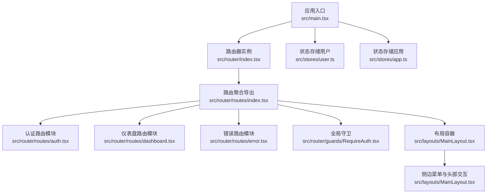
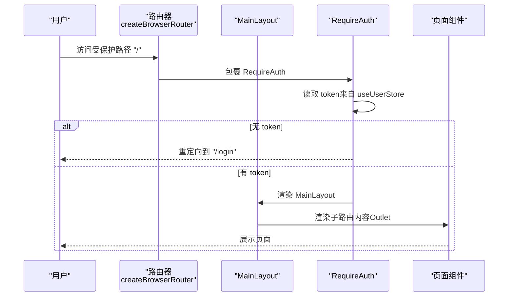
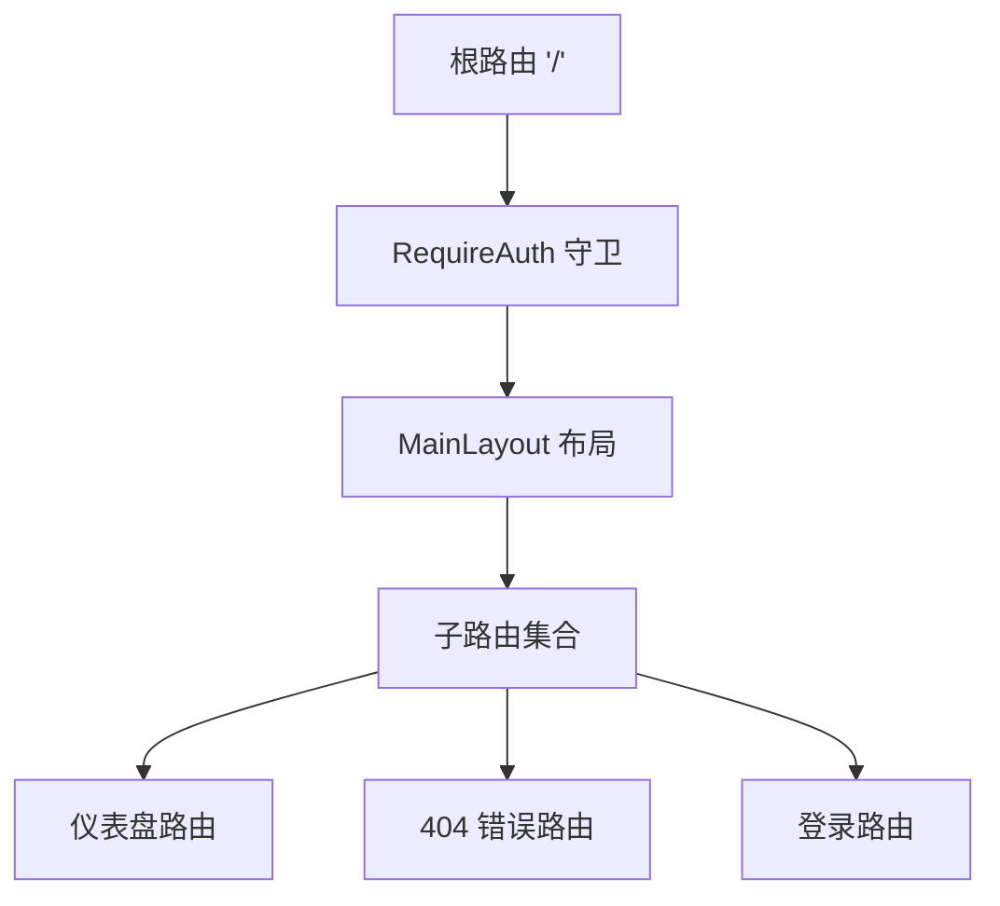
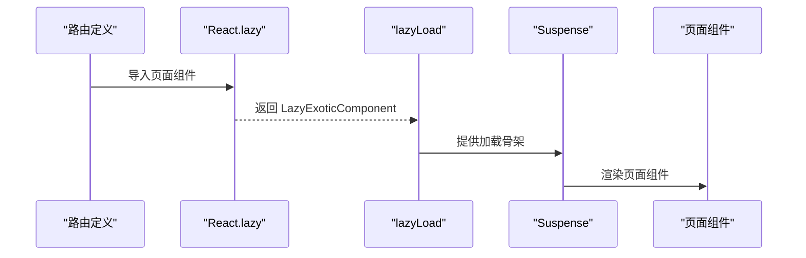
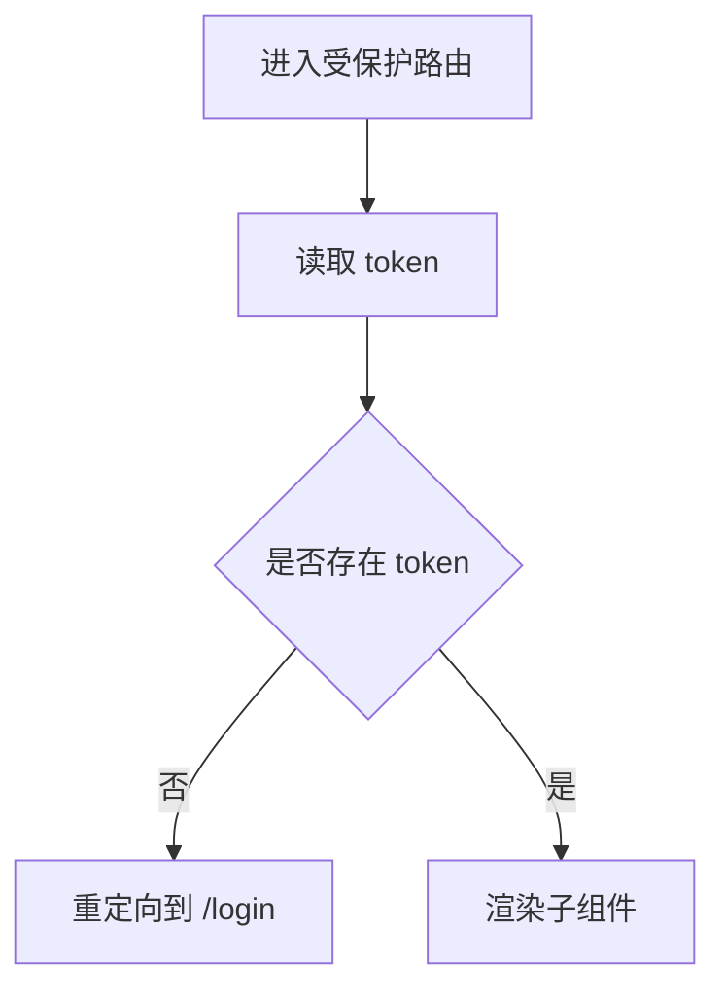
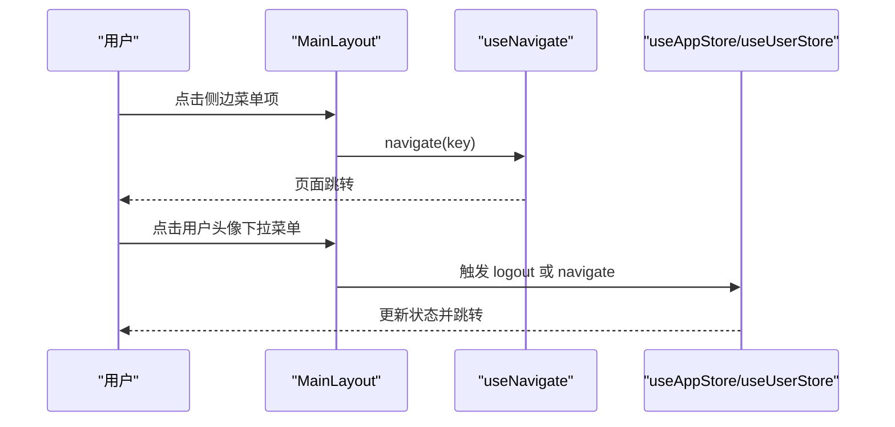
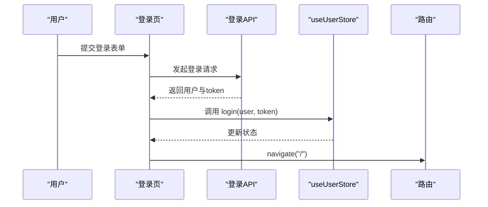
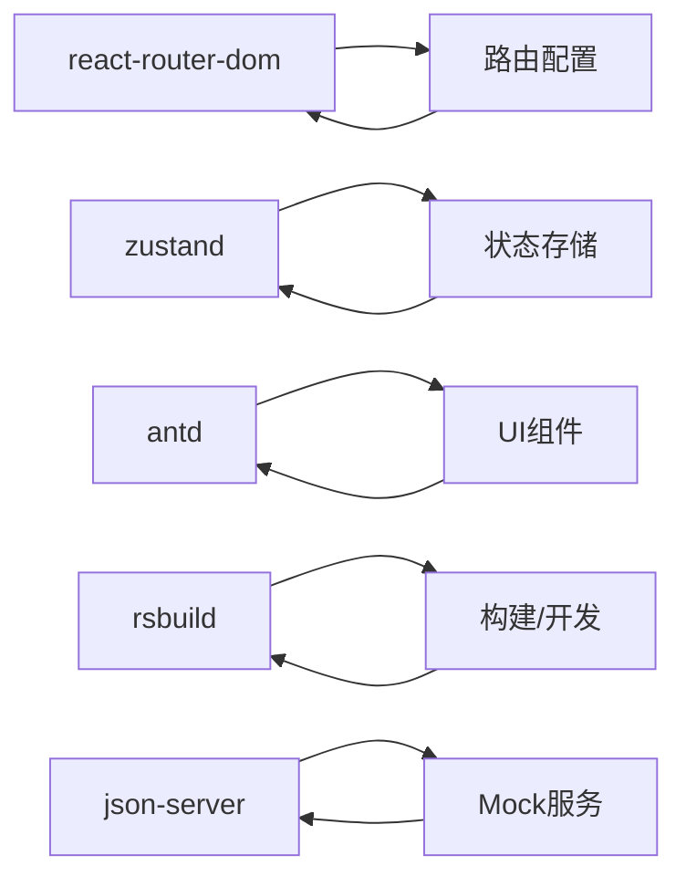

# 路由与导航

<cite>
**本文引用的文件**
- [src/router/index.tsx](file://src/router/index.tsx)
- [src/router/routes/index.tsx](file://src/router/routes/index.tsx)
- [src/router/guards/RequireAuth.tsx](file://src/router/guards/RequireAuth.tsx)
- [src/router/utils/index.tsx](file://src/router/utils/index.tsx)
- [src/layouts/MainLayout.tsx](file://src/layouts/MainLayout.tsx)
- [src/router/routes/auth.tsx](file://src/router/routes/auth.tsx)
- [src/router/routes/dashboard.tsx](file://src/router/routes/dashboard.tsx)
- [src/router/routes/error.tsx](file://src/router/routes/error.tsx)
- [src/stores/user.ts](file://src/stores/user.ts)
- [src/stores/app.ts](file://src/stores/app.ts)
- [src/main.tsx](file://src/main.tsx)
- [src/pages/login/index.tsx](file://src/pages/login/index.tsx)
- [src/pages/dashboard/index.tsx](file://src/pages/dashboard/index.tsx)
- [src/types/index.ts](file://src/types/index.ts)
- [package.json](file://package.json)
</cite>

## 目录

1. [简介](#简介)
2. [项目结构](#项目结构)
3. [核心组件](#核心组件)
4. [架构总览](#架构总览)
5. [详细组件分析](#详细组件分析)
6. [依赖分析](#依赖分析)
7. [性能考虑](#性能考虑)
8. [故障排查指南](#故障排查指南)
9. [结论](#结论)
10. [附录](#附录)

## 简介

本文件系统性梳理本项目的路由与导航体系，围绕以下目标展开：路由层级设计与嵌套路由、动态路由参数与懒加载策略、路由守卫机制（尤其是 RequireAuth 的实现）、导航菜单的动态生成与状态同步、以及最佳实践（含错误边界与预加载建议）。文档同时提供可直接定位到源码位置的路径指引，便于快速查阅与落地实施。

## 项目结构

本项目采用“按功能域分层”的组织方式，路由相关代码集中在 src/router 目录下，配合 stores 提供的状态管理与 layouts 提供的布局容器，形成清晰的职责边界。

图表来源

- [src/main.tsx](file://src/main.tsx#L17-L31)
- [src/router/index.tsx](file://src/router/index.tsx#L1-L9)
- [src/router/routes/index.tsx](file://src/router/routes/index.tsx#L9-L28)
- [src/router/routes/auth.tsx](file://src/router/routes/auth.tsx#L1-L15)
- [src/router/routes/dashboard.tsx](file://src/router/routes/dashboard.tsx#L1-L17)
- [src/router/routes/error.tsx](file://src/router/routes/error.tsx#L1-L16)
- [src/router/guards/RequireAuth.tsx](file://src/router/guards/RequireAuth.tsx#L1-L25)
- [src/layouts/MainLayout.tsx](file://src/layouts/MainLayout.tsx#L1-L174)
- [src/stores/user.ts](file://src/stores/user.ts#L21-L76)
- [src/stores/app.ts](file://src/stores/app.ts#L18-L59)

章节来源

- [src/main.tsx](file://src/main.tsx#L17-L31)
- [src/router/index.tsx](file://src/router/index.tsx#L1-L9)
- [src/router/routes/index.tsx](file://src/router/routes/index.tsx#L9-L28)

## 核心组件

- 路由器实例：通过 createBrowserRouter 创建并注入 RouterProvider，集中管理所有路由。
- 路由聚合：routes/index.tsx 将认证、仪表盘、错误等模块路由组合，并在根路径下挂载 RequireAuth 守卫与 MainLayout 布局。
- 路由守卫 RequireAuth：基于用户 token 判断是否放行，未登录则重定向至登录页。
- 懒加载工具 lazyLoad：统一包裹 React.lazy 组件，提供加载骨架。
- 布局容器 MainLayout：提供侧边菜单、顶部导航、内容区 Outlet，负责菜单项渲染与跳转。
- 状态存储：useUserStore 提供 token、用户信息、权限集合与登录/登出；useAppStore 提供侧边栏折叠等应用态。

章节来源

- [src/router/index.tsx](file://src/router/index.tsx#L1-L9)
- [src/router/routes/index.tsx](file://src/router/routes/index.tsx#L9-L28)
- [src/router/guards/RequireAuth.tsx](file://src/router/guards/RequireAuth.tsx#L1-L25)
- [src/router/utils/index.tsx](file://src/router/utils/index.tsx#L1-L23)
- [src/layouts/MainLayout.tsx](file://src/layouts/MainLayout.tsx#L1-L174)
- [src/stores/user.ts](file://src/stores/user.ts#L21-L76)
- [src/stores/app.ts](file://src/stores/app.ts#L18-L59)

## 架构总览

整体架构采用“路由聚合 + 守卫 + 布局 + 状态”的分层设计。路由模块化拆分，便于扩展；全局守卫统一拦截；布局容器承载导航与内容展示；状态持久化保障用户体验。

图表来源

- [src/router/routes/index.tsx](file://src/router/routes/index.tsx#L11-L17)
- [src/router/guards/RequireAuth.tsx](file://src/router/guards/RequireAuth.tsx#L11-L22)
- [src/layouts/MainLayout.tsx](file://src/layouts/MainLayout.tsx#L166-L166)

## 详细组件分析

### 路由层级与嵌套路由

- 根路径 "/" 使用 RequireAuth 包裹 MainLayout，形成“受保护的主布局”。
- 子路由通过数组形式注入，如仪表盘模块与错误模块，支持 index 路由与通配符路由。
- 嵌套关系：MainLayout 作为父级容器，内部通过 Outlet 渲染子路由元素。

图表来源

- [src/router/routes/index.tsx](file://src/router/routes/index.tsx#L9-L28)
- [src/router/routes/dashboard.tsx](file://src/router/routes/dashboard.tsx#L7-L14)
- [src/router/routes/error.tsx](file://src/router/routes/error.tsx#L7-L13)
- [src/router/routes/auth.tsx](file://src/router/routes/auth.tsx#L7-L12)

章节来源

- [src/router/routes/index.tsx](file://src/router/routes/index.tsx#L9-L28)

### 动态路由参数与懒加载

- 动态路由参数：当前路由未显式声明动态段（如 :id），若需支持可在具体路由定义中添加。
- 懒加载策略：通过 React.lazy 与 lazyLoad 包裹页面组件，结合 Suspense 提供加载骨架，提升首屏性能与交互体验。

图表来源

- [src/router/routes/auth.tsx](file://src/router/routes/auth.tsx#L5-L11)
- [src/router/routes/dashboard.tsx](file://src/router/routes/dashboard.tsx#L5-L10)
- [src/router/utils/index.tsx](file://src/router/utils/index.tsx#L4-L20)

章节来源

- [src/router/utils/index.tsx](file://src/router/utils/index.tsx#L1-L23)
- [src/router/routes/auth.tsx](file://src/router/routes/auth.tsx#L1-L15)
- [src/router/routes/dashboard.tsx](file://src/router/routes/dashboard.tsx#L1-L17)

### 路由守卫机制：RequireAuth 实现

- 作用：在进入受保护的根路径时，检查用户 token 是否存在，不存在则重定向到登录页。
- 数据来源：从 useUserStore 中读取 token。
- 扩展点：可在此基础上扩展权限校验（如基于权限字符串或角色）。

图表来源

- [src/router/guards/RequireAuth.tsx](file://src/router/guards/RequireAuth.tsx#L11-L22)
- [src/stores/user.ts](file://src/stores/user.ts#L21-L76)

章节来源

- [src/router/guards/RequireAuth.tsx](file://src/router/guards/RequireAuth.tsx#L1-L25)
- [src/stores/user.ts](file://src/stores/user.ts#L21-L76)

### 导航菜单设计：动态生成与状态同步

- 菜单项来源：MainLayout 内部定义基础菜单项（如首页），可通过运行时逻辑动态追加新项。
- 状态同步：选中态通过 selectedKeys=[location.pathname] 与当前路由保持一致；点击事件 onClick 触发 useNavigate 跳转。
- 用户菜单：右上角下拉菜单包含个人中心、系统设置、退出登录等操作，退出登录后跳转至登录页。

图表来源

- [src/layouts/MainLayout.tsx](file://src/layouts/MainLayout.tsx#L64-L104)
- [src/layouts/MainLayout.tsx](file://src/layouts/MainLayout.tsx#L133-L152)
- [src/stores/app.ts](file://src/stores/app.ts#L18-L59)
- [src/stores/user.ts](file://src/stores/user.ts#L53-L60)

章节来源

- [src/layouts/MainLayout.tsx](file://src/layouts/MainLayout.tsx#L1-L174)
- [src/stores/app.ts](file://src/stores/app.ts#L18-L59)
- [src/stores/user.ts](file://src/stores/user.ts#L53-L60)

### 登录流程与权限初始化

- 登录页：表单提交后调用模拟登录 API，成功后写入用户信息与 token，并跳转到根路径。
- 权限模型：用户状态包含 permissions 字段，提供 hasPermission 方法用于判断权限。

图表来源

- [src/pages/login/index.tsx](file://src/pages/login/index.tsx#L32-L50)
- [src/stores/user.ts](file://src/stores/user.ts#L46-L51)
- [src/router/routes/index.tsx](file://src/router/routes/index.tsx#L20-L22)

章节来源

- [src/pages/login/index.tsx](file://src/pages/login/index.tsx#L1-L133)
- [src/stores/user.ts](file://src/stores/user.ts#L21-L76)

### 错误边界与兜底页面

- 通配符路由 "\*" 对应 404 页面，确保未知路径得到统一处理。
- 建议：可在此基础上扩展错误日志上报、重试机制或自定义错误页。

章节来源

- [src/router/routes/error.tsx](file://src/router/routes/error.tsx#L1-L16)

### 类型与元信息

- RouteMeta：定义路由元信息（标题、图标、权限等），可用于菜单渲染与权限控制。
- MenuItem：菜单项结构，支持树形结构与元信息映射。

章节来源

- [src/types/index.ts](file://src/types/index.ts#L30-L47)

## 依赖分析

- 路由生态：react-router-dom 提供路由能力；createBrowserRouter 与 RouterProvider 组合使用。
- 状态管理：zustand 结合 persist 与 immer 实现轻量级状态持久化与不可变更新。
- UI 组件：Ant Design 提供 Layout、Menu、Dropdown、Avatar 等组件支撑导航与布局。
- 构建与脚手架：Rsbuild 提供构建与开发环境；JSON Server 支持本地 Mock。

图表来源

- [package.json](file://package.json#L20-L36)
- [src/main.tsx](file://src/main.tsx#L1-L32)

章节来源

- [package.json](file://package.json#L20-L36)

## 性能考虑

- 路由懒加载：对非首屏路由采用 React.lazy 与 lazyLoad，减少初始包体积。
- 加载骨架：通过 Suspense 提供加载指示，改善感知性能。
- 状态持久化：用户 token 与应用态持久化，避免刷新后状态丢失。
- 预加载建议（概念性）：对高频访问的路由可考虑在空闲时进行预加载，但需结合业务场景评估收益与资源消耗。

章节来源

- [src/router/utils/index.tsx](file://src/router/utils/index.tsx#L1-L23)
- [src/stores/user.ts](file://src/stores/user.ts#L67-L74)
- [src/stores/app.ts](file://src/stores/app.ts#L49-L57)

## 故障排查指南

- 无法进入受保护页面
  - 检查 token 是否存在：确认登录流程已正确写入 token 并持久化。
  - 检查 RequireAuth 逻辑：确认守卫未被意外绕过。
- 菜单不跳转或选中态异常
  - 检查菜单 key 与路由 path 是否一致；确认 onClick 与 navigate 的调用链路。
  - 检查 selectedKeys 与 location.pathname 的同步。
- 登录后未跳转
  - 检查登录页 onSuccess 回调中的 navigate 调用与路由路径。
- 404 页面未显示
  - 检查通配符路由是否正确挂载且优先级靠后。

章节来源

- [src/router/guards/RequireAuth.tsx](file://src/router/guards/RequireAuth.tsx#L11-L22)
- [src/layouts/MainLayout.tsx](file://src/layouts/MainLayout.tsx#L98-L104)
- [src/pages/login/index.tsx](file://src/pages/login/index.tsx#L36-L43)
- [src/router/routes/error.tsx](file://src/router/routes/error.tsx#L7-L13)

## 结论

本项目通过模块化的路由设计、统一的守卫机制与状态持久化方案，实现了清晰、可扩展的路由与导航体系。建议后续在权限细化、菜单动态化与预加载策略方面持续演进，以进一步提升安全性与用户体验。

## 附录

### 路由配置最佳实践清单

- 路由分层：将不同业务域拆分为独立路由模块，便于维护与扩展。
- 守卫策略：在根路径统一放置 RequireAuth，必要时在子路由增加细粒度权限校验。
- 懒加载：对非首屏页面启用懒加载与加载骨架，降低首屏压力。
- 错误边界：使用通配符路由兜底未知路径，保证用户体验一致性。
- 菜单与路由联动：菜单 key 与路由 path 保持一致，确保选中态与跳转一致。
- 状态持久化：对 token、主题、语言等关键状态进行持久化，提升可用性。

### 示例与使用方法（路径指引）

- 路由器实例创建与注入
  - [src/router/index.tsx](file://src/router/index.tsx#L1-L9)
  - [src/main.tsx](file://src/main.tsx#L17-L31)
- 路由聚合与嵌套路由
  - [src/router/routes/index.tsx](file://src/router/routes/index.tsx#L9-L28)
- 守卫组件 RequireAuth
  - [src/router/guards/RequireAuth.tsx](file://src/router/guards/RequireAuth.tsx#L1-L25)
- 懒加载工具
  - [src/router/utils/index.tsx](file://src/router/utils/index.tsx#L1-L23)
- 布局容器 MainLayout
  - [src/layouts/MainLayout.tsx](file://src/layouts/MainLayout.tsx#L1-L174)
- 登录页与用户状态
  - [src/pages/login/index.tsx](file://src/pages/login/index.tsx#L1-L133)
  - [src/stores/user.ts](file://src/stores/user.ts#L21-L76)
- 仪表盘与错误页面
  - [src/router/routes/dashboard.tsx](file://src/router/routes/dashboard.tsx#L1-L17)
  - [src/router/routes/error.tsx](file://src/router/routes/error.tsx#L1-L16)
- 类型定义（元信息与菜单项）
  - [src/types/index.ts](file://src/types/index.ts#L30-L47)
