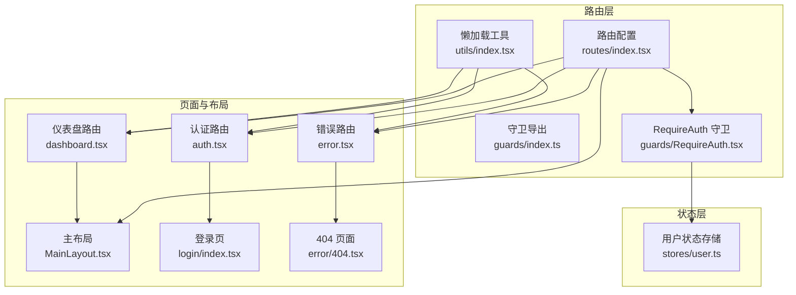
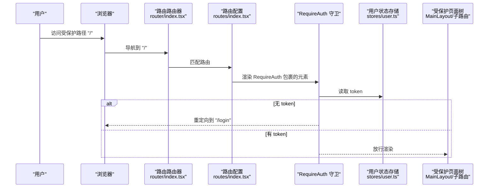
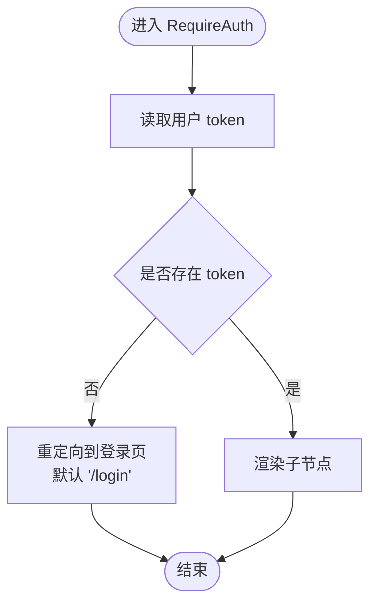
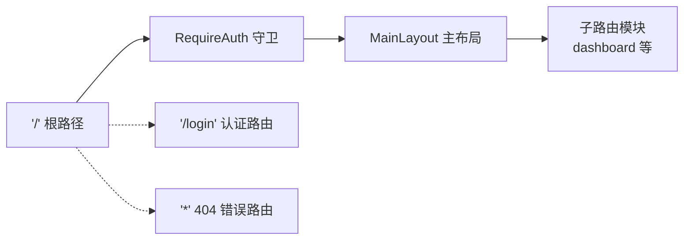
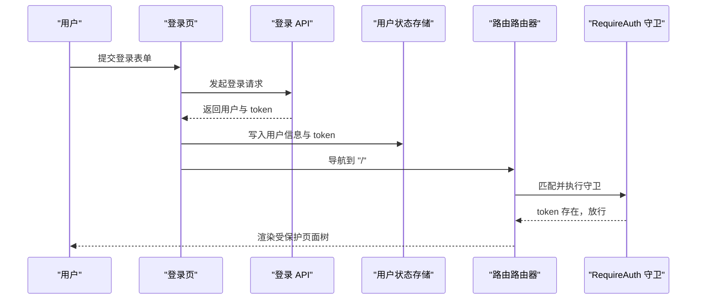
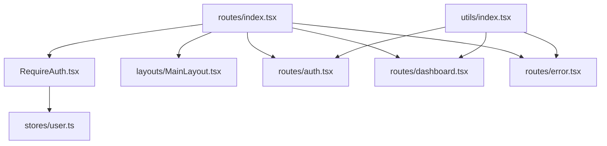

# 路由守卫

<cite>
**本文引用的文件**
- [RequireAuth.tsx](file://src/router/guards/RequireAuth.tsx)
- [index.ts（守卫导出）](file://src/router/guards/index.ts)
- [index.tsx（路由总入口）](file://src/router/index.tsx)
- [index.tsx（路由配置）](file://src/router/routes/index.tsx)
- [auth.tsx（认证路由）](file://src/router/routes/auth.tsx)
- [dashboard.tsx（仪表盘路由）](file://src/router/routes/dashboard.tsx)
- [error.tsx（错误路由）](file://src/router/routes/error.tsx)
- [utils/index.tsx（懒加载工具）](file://src/router/utils/index.tsx)
- [MainLayout.tsx（主布局）](file://src/layouts/MainLayout.tsx)
- [user.ts（用户状态存储）](file://src/stores/user.ts)
- [login/index.tsx（登录页）](file://src/pages/login/index.tsx)
- [error/404.tsx（404页面）](file://src/pages/error/404.tsx)
</cite>

## 目录

1. [引言](#引言)
2. [项目结构](#项目结构)
3. [核心组件](#核心组件)
4. [架构总览](#架构总览)
5. [详细组件分析](#详细组件分析)
6. [依赖关系分析](#依赖关系分析)
7. [性能考虑](#性能考虑)
8. [故障排查指南](#故障排查指南)
9. [结论](#结论)
10. [附录：自定义守卫开发指南与最佳实践](#附录自定义守卫开发指南与最佳实践)

## 引言

本文件围绕本项目的“路由守卫”系统进行全面说明，重点解释 RequireAuth 守卫的实现原理与工作机制，涵盖用户认证检查、权限验证流程、重定向处理等核心能力；同时阐述守卫的执行时机与优先级、多守卫协作方式，并提供自定义守卫的开发指南、配置示例与常见问题解决方案。

## 项目结构

路由守卫位于路由层的 guards 目录中，通过路由配置在根路径上包裹 RequireAuth，从而对受保护的页面树进行统一鉴权。用户状态由 Zustand 管理，登录后写入 token，登出时清除 token 并持久化清理。

图表来源

- [index.tsx（路由配置）](file://src/router/routes/index.tsx#L1-L31)
- [RequireAuth.tsx](file://src/router/guards/RequireAuth.tsx#L1-L25)
- [index.ts（守卫导出）](file://src/router/guards/index.ts#L1-L3)
- [utils/index.tsx（懒加载工具）](file://src/router/utils/index.tsx#L1-L23)
- [auth.tsx（认证路由）](file://src/router/routes/auth.tsx#L1-L15)
- [dashboard.tsx（仪表盘路由）](file://src/router/routes/dashboard.tsx#L1-L17)
- [error.tsx（错误路由）](file://src/router/routes/error.tsx#L1-L16)
- [MainLayout.tsx（主布局）](file://src/layouts/MainLayout.tsx#L1-L174)
- [login/index.tsx（登录页）](file://src/pages/login/index.tsx#L1-L133)
- [error/404.tsx（404页面）](file://src/pages/error/404.tsx#L1-L23)
- [user.ts（用户状态存储）](file://src/stores/user.ts#L1-L76)

章节来源

- [index.tsx（路由配置）](file://src/router/routes/index.tsx#L1-L31)
- [RequireAuth.tsx](file://src/router/guards/RequireAuth.tsx#L1-L25)
- [index.ts（守卫导出）](file://src/router/guards/index.ts#L1-L3)
- [utils/index.tsx（懒加载工具）](file://src/router/utils/index.tsx#L1-L23)
- [auth.tsx（认证路由）](file://src/router/routes/auth.tsx#L1-L15)
- [dashboard.tsx（仪表盘路由）](file://src/router/routes/dashboard.tsx#L1-L17)
- [error.tsx（错误路由）](file://src/router/routes/error.tsx#L1-L16)
- [MainLayout.tsx（主布局）](file://src/layouts/MainLayout.tsx#L1-L174)
- [login/index.tsx（登录页）](file://src/pages/login/index.tsx#L1-L133)
- [error/404.tsx（404页面）](file://src/pages/error/404.tsx#L1-L23)
- [user.ts（用户状态存储）](file://src/stores/user.ts#L1-L76)

## 核心组件

- RequireAuth 守卫：基于用户 token 的存在与否决定是否放行或重定向至登录页。支持自定义重定向目标。
- 路由配置：在根路径 '/' 上包裹 RequireAuth，使主布局及所有子路由均受保护。
- 用户状态存储：提供 token、登录/登出、权限判断等能力，供守卫读取。
- 懒加载工具：为路由页面提供加载态占位，改善首屏体验。

章节来源

- [RequireAuth.tsx](file://src/router/guards/RequireAuth.tsx#L1-L25)
- [index.tsx（路由配置）](file://src/router/routes/index.tsx#L1-L31)
- [user.ts（用户状态存储）](file://src/stores/user.ts#L1-L76)
- [utils/index.tsx（懒加载工具）](file://src/router/utils/index.tsx#L1-L23)

## 架构总览

路由守卫的工作流可概括为：浏览器导航触发 -> 路由匹配 -> 执行 RequireAuth -> 依据 token 决定放行或重定向 -> 渲染目标页面或登录页。

图表来源

- [index.tsx（路由总入口）](file://src/router/index.tsx#L1-L9)
- [index.tsx（路由配置）](file://src/router/routes/index.tsx#L1-L31)
- [RequireAuth.tsx](file://src/router/guards/RequireAuth.tsx#L1-L25)
- [user.ts（用户状态存储）](file://src/stores/user.ts#L1-L76)

## 详细组件分析

### RequireAuth 守卫

- 功能职责
  - 从用户状态存储读取 token
  - 若 token 为空，返回重定向组件到登录页（默认 '/login'）
  - 若 token 存在，直接渲染子节点
- 关键点
  - 重定向目标可通过属性传入，默认值为 '/login'
  - 采用 react-router-dom 的 Navigate 组件完成重定向
  - 与路由配置结合，在根路径上包裹主布局，实现整棵页面树的保护

图表来源

- [RequireAuth.tsx](file://src/router/guards/RequireAuth.tsx#L1-L25)
- [user.ts（用户状态存储）](file://src/stores/user.ts#L1-L76)

章节来源

- [RequireAuth.tsx](file://src/router/guards/RequireAuth.tsx#L1-L25)
- [index.ts（守卫导出）](file://src/router/guards/index.ts#L1-L3)

### 路由配置与执行时机

- 在根路径 '/' 上，RequireAuth 包裹主布局，形成受保护的页面树
- 子路由模块（如仪表盘）无需重复加守卫，已在父级生效
- 错误路由 '\*' 对应 404 页面，不受 RequireAuth 影响

图表来源

- [index.tsx（路由配置）](file://src/router/routes/index.tsx#L1-L31)
- [auth.tsx（认证路由）](file://src/router/routes/auth.tsx#L1-L15)
- [error.tsx（错误路由）](file://src/router/routes/error.tsx#L1-L16)
- [MainLayout.tsx（主布局）](file://src/layouts/MainLayout.tsx#L1-L174)

章节来源

- [index.tsx（路由配置）](file://src/router/routes/index.tsx#L1-L31)
- [auth.tsx（认证路由）](file://src/router/routes/auth.tsx#L1-L15)
- [error.tsx（错误路由）](file://src/router/routes/error.tsx#L1-L16)

### 登录流程与守卫联动

- 登录页提供表单提交，调用登录 API 后写入用户信息与 token
- 登录成功后跳转到根路径 '/'，此时 RequireAuth 因存在 token 而放行
- 退出登录会清除 token，再次访问受保护路径会被重定向到登录页

图表来源

- [login/index.tsx（登录页）](file://src/pages/login/index.tsx#L1-L133)
- [user.ts（用户状态存储）](file://src/stores/user.ts#L1-L76)
- [index.tsx（路由总入口）](file://src/router/index.tsx#L1-L9)
- [index.tsx（路由配置）](file://src/router/routes/index.tsx#L1-L31)
- [RequireAuth.tsx](file://src/router/guards/RequireAuth.tsx#L1-L25)

章节来源

- [login/index.tsx（登录页）](file://src/pages/login/index.tsx#L1-L133)
- [user.ts（用户状态存储）](file://src/stores/user.ts#L1-L76)
- [index.tsx（路由总入口）](file://src/router/index.tsx#L1-L9)
- [index.tsx（路由配置）](file://src/router/routes/index.tsx#L1-L31)
- [RequireAuth.tsx](file://src/router/guards/RequireAuth.tsx#L1-L25)

### 权限验证扩展（建议）

当前守卫仅基于 token 判断是否已登录。若需细化到页面/操作级权限，可在 RequireAuth 中扩展：

- 读取用户权限列表
- 对比路由元信息中的所需权限
- 不满足权限时重定向到无权限或 404 页面

该扩展不改变现有守卫的接口与行为，仅在内部增加权限判断分支。

## 依赖关系分析

- RequireAuth 依赖用户状态存储以读取 token
- 路由配置依赖 RequireAuth 实现全局保护
- 主布局与子路由模块在受保护页面树内渲染
- 懒加载工具用于优化页面加载体验

图表来源

- [RequireAuth.tsx](file://src/router/guards/RequireAuth.tsx#L1-L25)
- [user.ts（用户状态存储）](file://src/stores/user.ts#L1-L76)
- [index.tsx（路由配置）](file://src/router/routes/index.tsx#L1-L31)
- [MainLayout.tsx（主布局）](file://src/layouts/MainLayout.tsx#L1-L174)
- [auth.tsx（认证路由）](file://src/router/routes/auth.tsx#L1-L15)
- [dashboard.tsx（仪表盘路由）](file://src/router/routes/dashboard.tsx#L1-L17)
- [error.tsx（错误路由）](file://src/router/routes/error.tsx#L1-L16)
- [utils/index.tsx（懒加载工具）](file://src/router/utils/index.tsx#L1-L23)

章节来源

- [RequireAuth.tsx](file://src/router/guards/RequireAuth.tsx#L1-L25)
- [user.ts（用户状态存储）](file://src/stores/user.ts#L1-L76)
- [index.tsx（路由配置）](file://src/router/routes/index.tsx#L1-L31)
- [MainLayout.tsx（主布局）](file://src/layouts/MainLayout.tsx#L1-L174)
- [auth.tsx（认证路由）](file://src/router/routes/auth.tsx#L1-L15)
- [dashboard.tsx（仪表盘路由）](file://src/router/routes/dashboard.tsx#L1-L17)
- [error.tsx（错误路由）](file://src/router/routes/error.tsx#L1-L16)
- [utils/index.tsx（懒加载工具）](file://src/router/utils/index.tsx#L1-L23)

## 性能考虑

- 使用懒加载工具对路由页面进行按需加载，减少初始包体积
- 将 token 等轻量状态放入内存，避免频繁 IO
- 避免在守卫中执行耗时同步逻辑，必要时采用异步策略并在组件内处理

## 故障排查指南

- 无法进入受保护页面
  - 检查登录流程是否正确写入 token
  - 确认路由配置中根路径是否包裹 RequireAuth
- 登录后仍被重定向
  - 检查用户状态存储中 token 是否存在且未过期
  - 确认登录成功后的导航目标是否为 '/'
- 自定义重定向目标无效
  - 确认 RequireAuth 的 redirectTo 属性是否正确传入
- 404 页面未受保护
  - '\*' 错误路由不受 RequireAuth 影响，属预期行为

章节来源

- [RequireAuth.tsx](file://src/router/guards/RequireAuth.tsx#L1-L25)
- [index.tsx（路由配置）](file://src/router/routes/index.tsx#L1-L31)
- [login/index.tsx（登录页）](file://src/pages/login/index.tsx#L1-L133)
- [error/404.tsx（404页面）](file://src/pages/error/404.tsx#L1-L23)

## 结论

本项目的路由守卫以 RequireAuth 为核心，通过在根路径上包裹守卫，实现了对整个页面树的统一登录保护。其设计简洁、耦合度低，易于扩展权限校验与自定义重定向等能力。配合懒加载与状态管理，既保证了用户体验，也确保了安全边界。

## 附录：自定义守卫开发指南与最佳实践

- 开发规范
  - 保持守卫纯函数式：输入为 props/上下文，输出为放行或重定向
  - 仅做轻量判断，复杂逻辑下沉到状态存储或服务层
  - 明确默认重定向目标，允许外部覆盖
- 异步处理策略
  - 对于需要网络校验的场景，可在守卫内部发起请求并等待结果
  - 建议在组件内处理加载态与错误态，避免阻塞路由切换
- 错误处理机制
  - 对异常情况统一返回重定向或错误页面
  - 记录必要的日志以便排查
- 多守卫协作
  - 将 RequireAuth 放置在最外层，作为“登录守卫”
  - 如需权限守卫，可新增一个基于权限的守卫，按需嵌套在 RequireAuth 内部
  - 注意守卫顺序：先登录再权限
- 配置示例与使用场景
  - 登录保护：在根路径 '/' 上包裹 RequireAuth
  - 权限控制：在需要权限的路由上再包裹权限守卫
  - 状态检查：在守卫中读取用户状态，根据状态决定放行或重定向
- 最佳实践
  - 将 token 存储在状态管理中，避免直接依赖本地存储
  - 对关键页面启用懒加载，提升首屏性能
  - 为守卫提供清晰的错误反馈与回退路径
