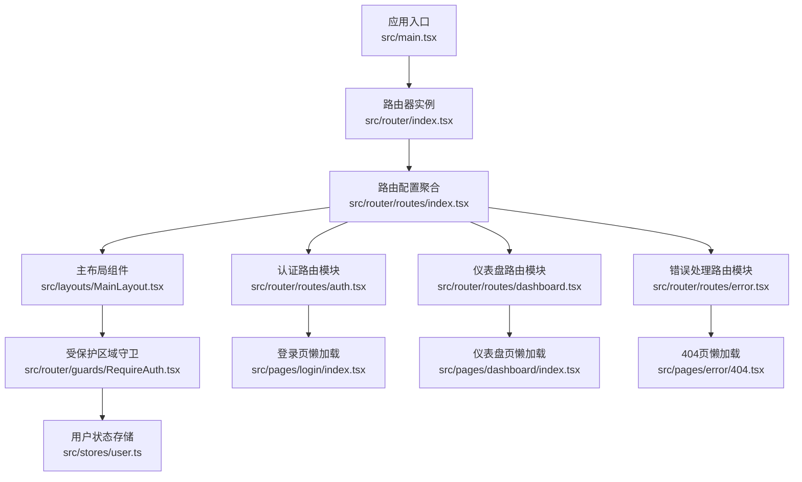
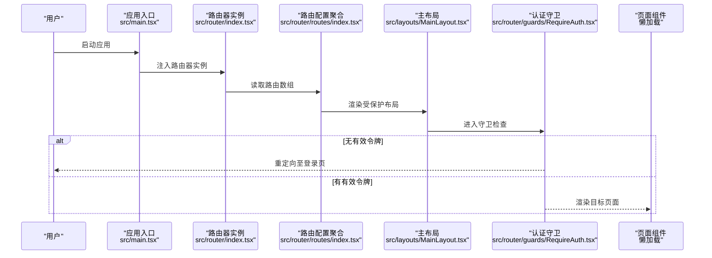
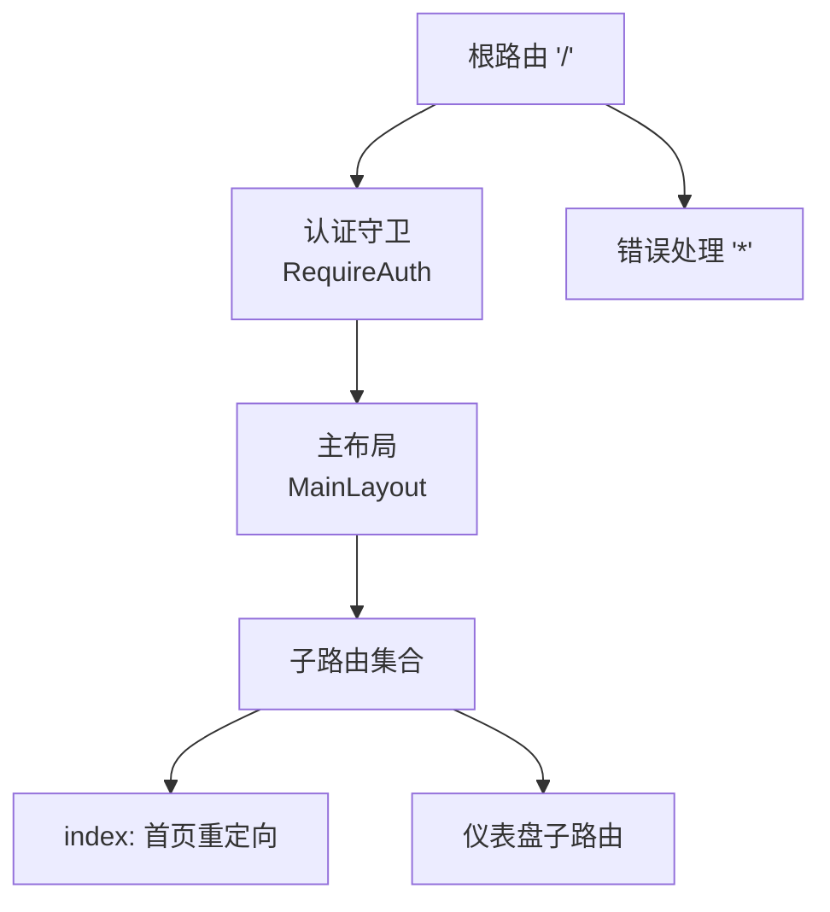
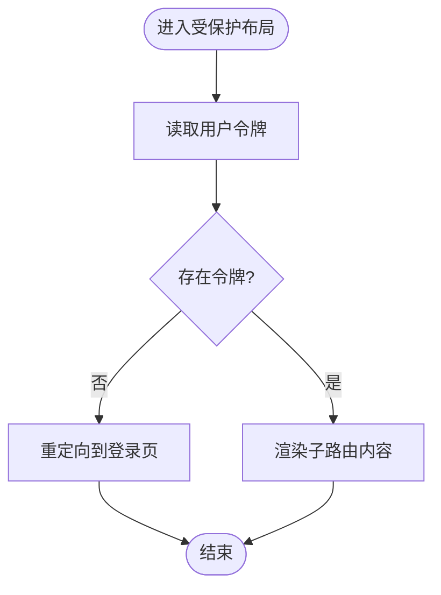
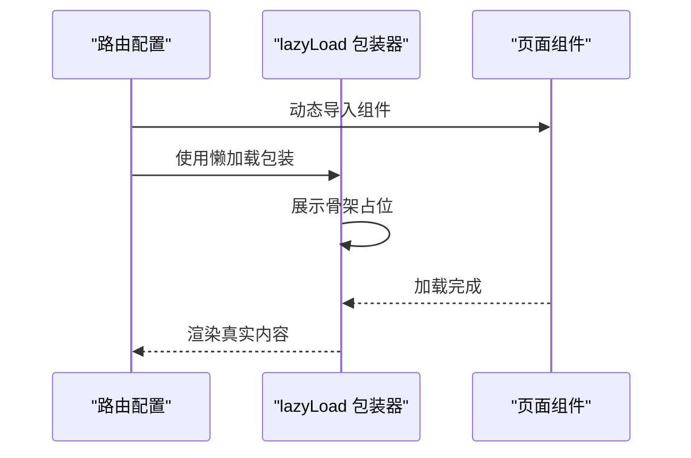
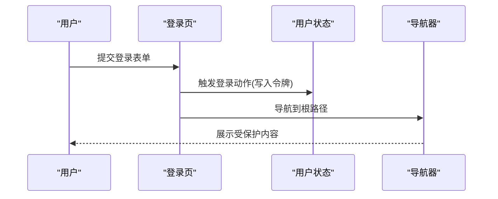
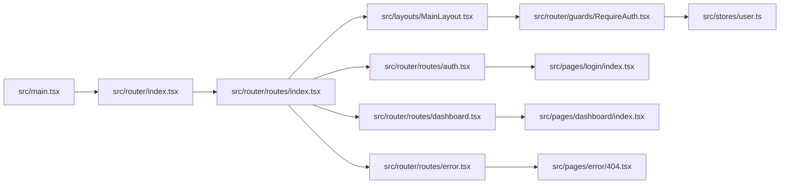

# 路由配置

<cite>
**本文引用的文件**
- [src/router/index.tsx](file://src/router/index.tsx)
- [src/router/routes/index.tsx](file://src/router/routes/index.tsx)
- [src/router/guards/RequireAuth.tsx](file://src/router/guards/RequireAuth.tsx)
- [src/router/utils/index.tsx](file://src/router/utils/index.tsx)
- [src/router/routes/auth.tsx](file://src/router/routes/auth.tsx)
- [src/router/routes/dashboard.tsx](file://src/router/routes/dashboard.tsx)
- [src/router/routes/error.tsx](file://src/router/routes/error.tsx)
- [src/main.tsx](file://src/main.tsx)
- [src/layouts/MainLayout.tsx](file://src/layouts/MainLayout.tsx)
- [src/stores/user.ts](file://src/stores/user.ts)
- [src/pages/login/index.tsx](file://src/pages/login/index.tsx)
- [src/pages/dashboard/index.tsx](file://src/pages/dashboard/index.tsx)
- [src/pages/error/404.tsx](file://src/pages/error/404.tsx)
- [mock/routes.json](file://mock/routes.json)
</cite>

## 目录

1. [简介](#简介)
2. [项目结构](#项目结构)
3. [核心组件](#核心组件)
4. [架构总览](#架构总览)
5. [详细组件分析](#详细组件分析)
6. [依赖关系分析](#依赖关系分析)
7. [性能考量](#性能考量)
8. [故障排查指南](#故障排查指南)
9. [结论](#结论)
10. [附录](#附录)

## 简介

本文件系统性梳理了基于 React Router 的路由配置体系，涵盖路由层级设计、嵌套路由与守卫、懒加载与代码分割、错误处理与导航策略等。文档以仓库现有实现为依据，结合最佳实践给出可操作的优化建议与排障指引。

## 项目结构

路由系统采用“按功能模块分组”的组织方式，入口在根路由配置中聚合各模块路由，形成清晰的层次化结构：

- 根路由聚合：将认证、仪表盘、错误处理等路由模块合并为统一数组
- 布局层：通过主布局包裹受保护的子路由
- 守卫层：在布局外层对需要鉴权的区域进行权限校验
- 懒加载层：通过工具函数对页面组件进行延迟加载与骨架占位

图表来源

- [src/main.tsx](file://src/main.tsx#L10-L31)
- [src/router/index.tsx](file://src/router/index.tsx#L1-L9)
- [src/router/routes/index.tsx](file://src/router/routes/index.tsx#L1-L31)
- [src/router/routes/auth.tsx](file://src/router/routes/auth.tsx#L1-L15)
- [src/router/routes/dashboard.tsx](file://src/router/routes/dashboard.tsx#L1-L17)
- [src/router/routes/error.tsx](file://src/router/routes/error.tsx#L1-L16)
- [src/layouts/MainLayout.tsx](file://src/layouts/MainLayout.tsx#L1-L174)
- [src/router/guards/RequireAuth.tsx](file://src/router/guards/RequireAuth.tsx#L1-L25)
- [src/stores/user.ts](file://src/stores/user.ts#L1-L76)

章节来源

- [src/router/index.tsx](file://src/router/index.tsx#L1-L9)
- [src/router/routes/index.tsx](file://src/router/routes/index.tsx#L1-L31)
- [src/main.tsx](file://src/main.tsx#L1-L32)

## 核心组件

- 路由器实例：通过集中导出的路由数组创建浏览器路由实例，供应用根节点注入
- 路由配置聚合：将认证、仪表盘、错误处理等模块路由合并，统一管理
- 主布局与嵌套路由：根路径下挂载受保护的主布局，内部再挂载子路由（如仪表盘）
- 认证守卫：在受保护布局外层对令牌进行校验，未通过则重定向到登录页
- 懒加载与骨架：统一封装页面组件的延迟加载与加载占位，提升首屏体验
- 页面组件：登录、仪表盘、404 等页面均采用懒加载与骨架占位

章节来源

- [src/router/index.tsx](file://src/router/index.tsx#L1-L9)
- [src/router/routes/index.tsx](file://src/router/routes/index.tsx#L1-L31)
- [src/router/guards/RequireAuth.tsx](file://src/router/guards/RequireAuth.tsx#L1-L25)
- [src/router/utils/index.tsx](file://src/router/utils/index.tsx#L1-L23)
- [src/layouts/MainLayout.tsx](file://src/layouts/MainLayout.tsx#L1-L174)

## 架构总览

整体流程从应用入口创建路由器实例，注入到根组件；根路由聚合认证、主布局与受保护子路由、错误处理；守卫根据用户状态决定是否放行；页面组件通过懒加载与骨架提升性能。

图表来源

- [src/main.tsx](file://src/main.tsx#L10-L31)
- [src/router/index.tsx](file://src/router/index.tsx#L1-L9)
- [src/router/routes/index.tsx](file://src/router/routes/index.tsx#L1-L31)
- [src/router/guards/RequireAuth.tsx](file://src/router/guards/RequireAuth.tsx#L1-L25)
- [src/layouts/MainLayout.tsx](file://src/layouts/MainLayout.tsx#L1-L174)

## 详细组件分析

### 路由层级与嵌套路由

- 根路径“/”作为受保护区域的容器，内部包含首页重定向与仪表盘子路由
- 子路由通过 index 表示默认子路由，实现访问根路径时自动跳转到仪表盘
- 错误处理路由使用通配符“\*”，确保未匹配路径进入 404 页面

图表来源

- [src/router/routes/index.tsx](file://src/router/routes/index.tsx#L9-L28)
- [src/router/routes/dashboard.tsx](file://src/router/routes/dashboard.tsx#L7-L14)
- [src/router/routes/error.tsx](file://src/router/routes/error.tsx#L7-L13)

章节来源

- [src/router/routes/index.tsx](file://src/router/routes/index.tsx#L1-L31)
- [src/router/routes/dashboard.tsx](file://src/router/routes/dashboard.tsx#L1-L17)
- [src/router/routes/error.tsx](file://src/router/routes/error.tsx#L1-L16)

### 认证守卫与令牌校验

- 守卫组件读取用户状态中的令牌字段，若为空则重定向到登录页
- 支持自定义重定向地址，默认为“/login”
- 守卫包裹在主布局外层，确保所有受保护子路由均需通过校验

图表来源

- [src/router/guards/RequireAuth.tsx](file://src/router/guards/RequireAuth.tsx#L1-L25)
- [src/stores/user.ts](file://src/stores/user.ts#L1-L76)

章节来源

- [src/router/guards/RequireAuth.tsx](file://src/router/guards/RequireAuth.tsx#L1-L25)
- [src/stores/user.ts](file://src/stores/user.ts#L1-L76)

### 懒加载与骨架占位

- 页面组件通过 React.lazy 动态导入，配合封装的懒加载工具实现加载骨架
- 骨架采用全局加载指示器，覆盖全屏，保证用户体验一致
- 懒加载仅作用于页面级组件，避免重复包裹导致的层级过深

图表来源

- [src/router/routes/auth.tsx](file://src/router/routes/auth.tsx#L1-L15)
- [src/router/routes/dashboard.tsx](file://src/router/routes/dashboard.tsx#L1-L17)
- [src/router/routes/error.tsx](file://src/router/routes/error.tsx#L1-L16)
- [src/router/utils/index.tsx](file://src/router/utils/index.tsx#L1-L23)

章节来源

- [src/router/utils/index.tsx](file://src/router/utils/index.tsx#L1-L23)
- [src/router/routes/auth.tsx](file://src/router/routes/auth.tsx#L1-L15)
- [src/router/routes/dashboard.tsx](file://src/router/routes/dashboard.tsx#L1-L17)
- [src/router/routes/error.tsx](file://src/router/routes/error.tsx#L1-L16)

### 页面组件与导航

- 登录页：表单提交后调用用户状态的登录动作，成功后跳转到根路径
- 仪表盘页：作为默认子路由展示统计信息与活动列表
- 404 页：通用错误页面，提供返回首页按钮

图表来源

- [src/pages/login/index.tsx](file://src/pages/login/index.tsx#L1-L133)
- [src/stores/user.ts](file://src/stores/user.ts#L1-L76)
- [src/router/routes/index.tsx](file://src/router/routes/index.tsx#L18-L25)

章节来源

- [src/pages/login/index.tsx](file://src/pages/login/index.tsx#L1-L133)
- [src/pages/dashboard/index.tsx](file://src/pages/dashboard/index.tsx#L1-L170)
- [src/pages/error/404.tsx](file://src/pages/error/404.tsx#L1-L23)

### 路由配置示例与最佳实践

- 认证路由：登录页路径“/login”，使用懒加载包装
- 仪表盘路由：根路径下的默认子路由，携带元信息用于标题与图标
- 错误处理路由：通配符“\*”兜底，确保未知路径进入 404
- 分组策略：按业务域拆分为独立模块文件，便于维护与扩展
- 优先级设置：路由数组顺序即匹配优先级，需将更具体的路由置于通配符之前
- 路径匹配：使用 index 实现默认子路由，使用通配符实现兜底

章节来源

- [src/router/routes/auth.tsx](file://src/router/routes/auth.tsx#L1-L15)
- [src/router/routes/dashboard.tsx](file://src/router/routes/dashboard.tsx#L1-L17)
- [src/router/routes/error.tsx](file://src/router/routes/error.tsx#L1-L16)
- [src/router/routes/index.tsx](file://src/router/routes/index.tsx#L1-L31)

## 依赖关系分析

- 应用入口依赖路由器实例
- 路由器实例依赖路由配置聚合
- 路由配置聚合依赖各模块路由与主布局
- 主布局依赖守卫组件
- 守卫组件依赖用户状态存储
- 页面组件依赖懒加载工具与骨架占位

图表来源

- [src/main.tsx](file://src/main.tsx#L10-L31)
- [src/router/index.tsx](file://src/router/index.tsx#L1-L9)
- [src/router/routes/index.tsx](file://src/router/routes/index.tsx#L1-L31)
- [src/router/guards/RequireAuth.tsx](file://src/router/guards/RequireAuth.tsx#L1-L25)
- [src/stores/user.ts](file://src/stores/user.ts#L1-L76)
- [src/pages/login/index.tsx](file://src/pages/login/index.tsx#L1-L133)
- [src/pages/dashboard/index.tsx](file://src/pages/dashboard/index.tsx#L1-L170)
- [src/pages/error/404.tsx](file://src/pages/error/404.tsx#L1-L23)

章节来源

- [src/main.tsx](file://src/main.tsx#L1-L32)
- [src/router/index.tsx](file://src/router/index.tsx#L1-L9)
- [src/router/routes/index.tsx](file://src/router/routes/index.tsx#L1-L31)

## 性能考量

- 代码分割：通过 React.lazy 对页面组件进行按需加载，减少初始包体积
- 骨架占位：统一的加载骨架提升感知性能，避免空白屏
- 路由优先级：合理安排路由顺序，避免通配符过早拦截具体路径
- 嵌套层级：保持布局与守卫的适度嵌套，避免深层嵌套带来的渲染开销
- 缓存策略：利用持久化状态存储减少重复请求与重复渲染

## 故障排查指南

- 登录后无法进入受保护页面
  - 检查用户状态中令牌是否正确写入
  - 确认守卫组件是否包裹在主布局外层
- 404 页面不显示
  - 确认通配符路由是否位于路由数组末尾
  - 检查是否存在更具体路由覆盖了通配符匹配
- 骨架不出现或闪烁
  - 确认懒加载包装器是否正确包裹页面组件
  - 检查动态导入的路径是否正确
- Mock 接口映射
  - 若使用 mock 服务，确认路由映射文件中的路径与实际路由一致

章节来源

- [src/router/guards/RequireAuth.tsx](file://src/router/guards/RequireAuth.tsx#L1-L25)
- [src/stores/user.ts](file://src/stores/user.ts#L1-L76)
- [src/router/routes/error.tsx](file://src/router/routes/error.tsx#L1-L16)
- [src/router/utils/index.tsx](file://src/router/utils/index.tsx#L1-L23)
- [mock/routes.json](file://mock/routes.json#L1-L10)

## 结论

该路由配置体系以模块化与分层设计为核心，结合懒加载与守卫机制，实现了清晰的权限控制与良好的用户体验。建议在后续迭代中进一步完善权限细化、路由元信息的统一管理以及错误边界与监控埋点，持续提升可维护性与可观测性。

## 附录

- 路由配置文件组织建议
  - 将同类型路由归档到同一模块文件，便于扩展与复用
  - 在根配置中明确路由顺序与嵌套关系
  - 使用通配符路由统一兜底，避免遗漏路径
- 动态路由参数处理
  - 使用 React Router 的参数占位语法在路径中声明参数
  - 在页面组件中通过导航工具读取参数并进行数据加载
- 预加载与缓存
  - 对高频访问页面可考虑预加载策略
  - 利用持久化状态存储减少重复请求
