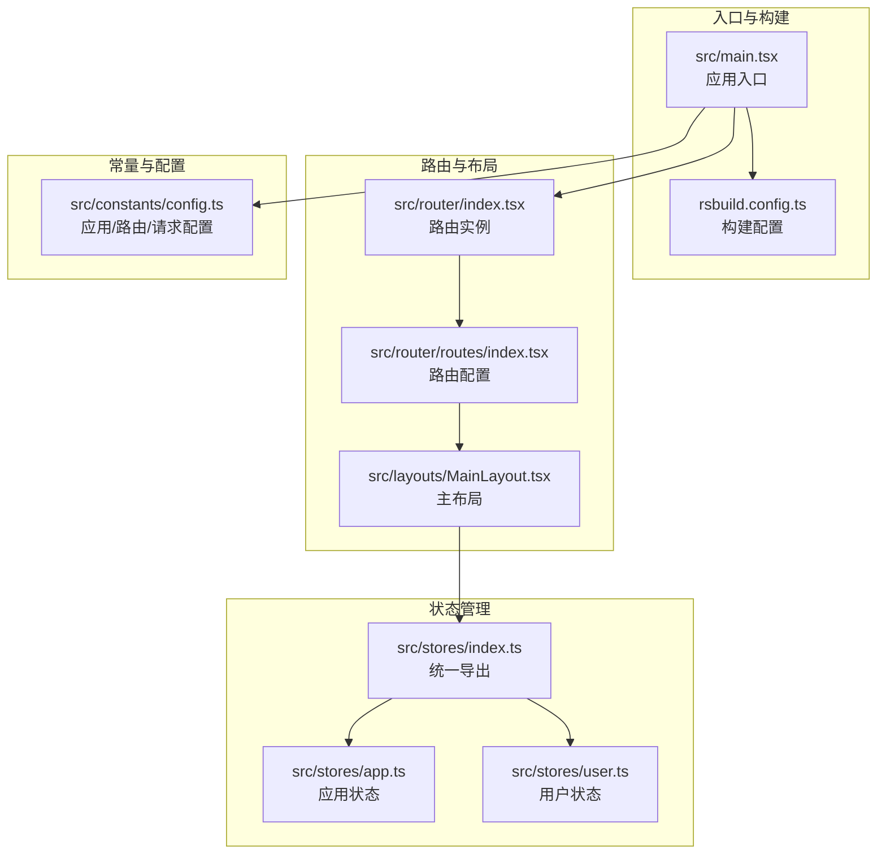
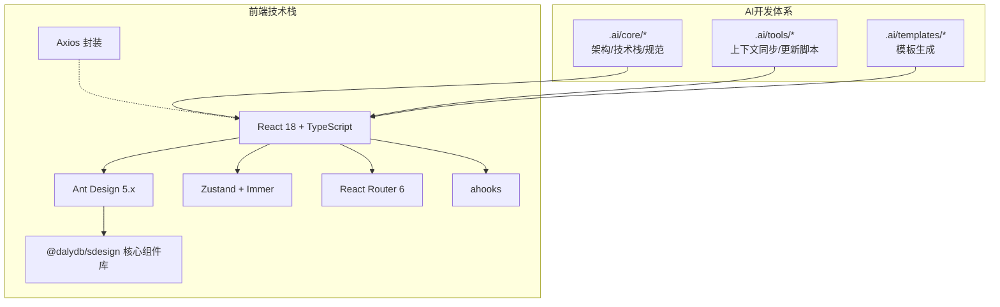
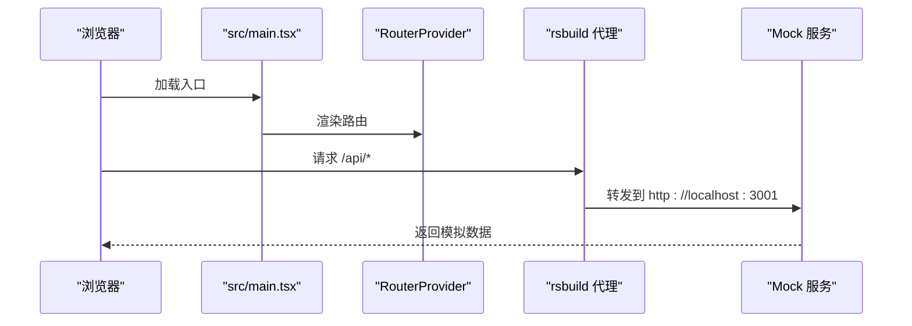
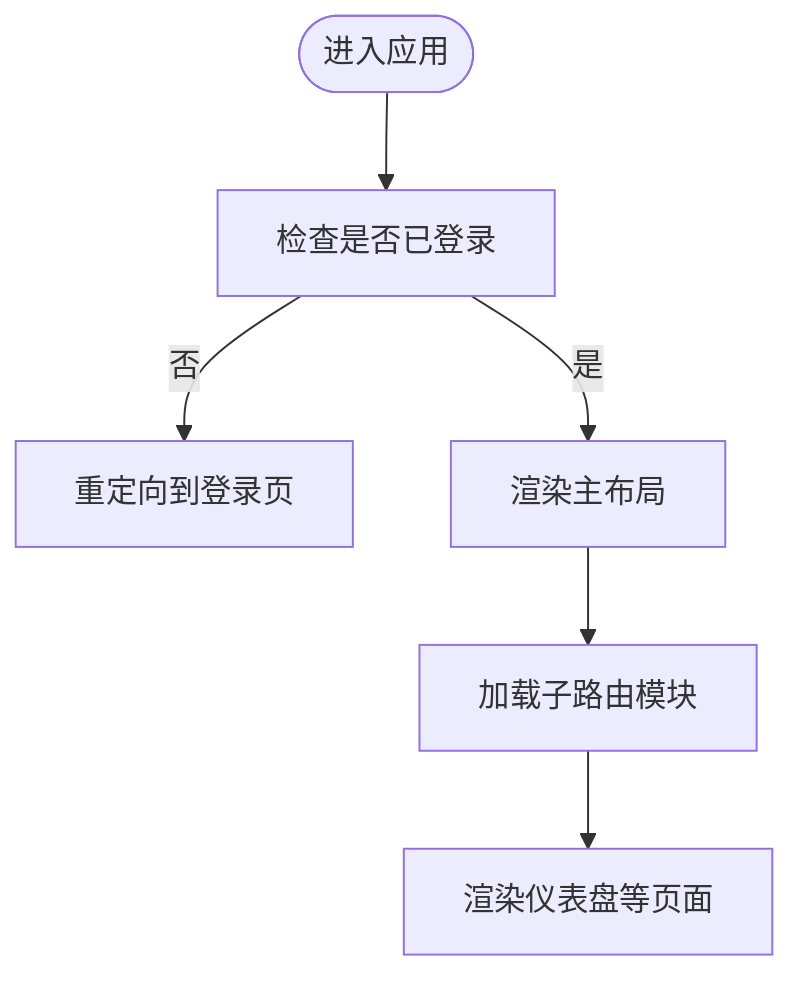
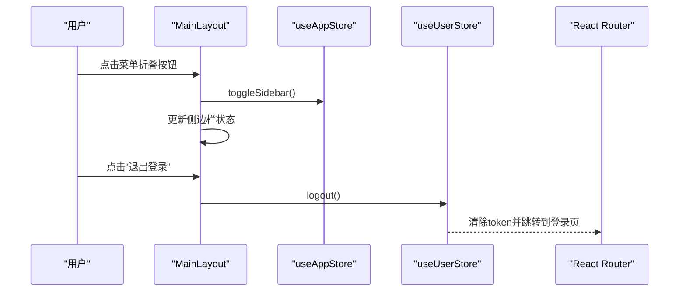
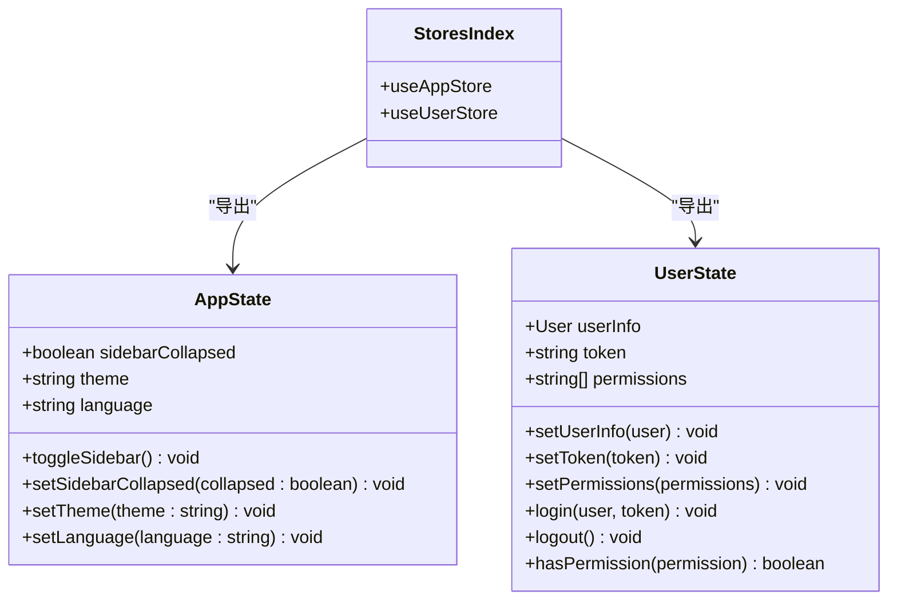
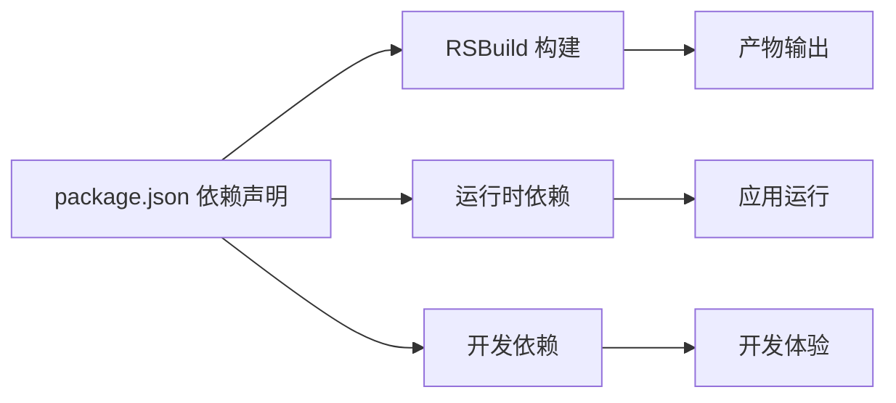

# 项目概述

<cite>
**本文引用的文件**
- [package.json](file://package.json)
- [rsbuild.config.ts](file://rsbuild.config.ts)
- [src/main.tsx](file://src/main.tsx)
- [src/router/index.tsx](file://src/router/index.tsx)
- [src/router/routes/index.tsx](file://src/router/routes/index.tsx)
- [src/layouts/MainLayout.tsx](file://src/layouts/MainLayout.tsx)
- [src/stores/app.ts](file://src/stores/app.ts)
- [src/stores/user.ts](file://src/stores/user.ts)
- [src/stores/index.ts](file://src/stores/index.ts)
- [src/constants/config.ts](file://src/constants/config.ts)
- [.ai/core/architecture.md](file://.ai/core/architecture.md)
- [.ai/core/tech-stack.md](file://.ai/core/tech-stack.md)
- [.ai/core/coding-standards.md](file://.ai/core/coding-standards.md)
</cite>

## 目录

1. [引言](#引言)
2. [项目结构](#项目结构)
3. [核心组件](#核心组件)
4. [架构总览](#架构总览)
5. [详细组件分析](#详细组件分析)
6. [依赖分析](#依赖分析)
7. [性能考虑](#性能考虑)
8. [故障排查指南](#故障排查指南)
9. [结论](#结论)
10. [附录](#附录)

## 引言

本项目是一个基于前端技术栈的AI管理平台，旨在通过AI驱动的开发体系提升研发效率与交付质量。项目采用配置驱动开发理念，结合Ant Design与自研组件库@<dalydb/sdesign>，配合Zustand状态管理与React Router路由体系，形成统一、可扩展且易于维护的前端架构。项目同时内置AI辅助开发工具链，覆盖从模板生成到上下文同步的全流程，帮助开发者快速搭建高质量页面与组件。

## 项目结构

项目采用模块化分层架构，围绕“页面-组件-状态-路由-插件-常量-工具”的层次划分，确保职责清晰、耦合度低、可测试性强。整体结构如下图所示：

**图表来源**

- [src/main.tsx](file://src/main.tsx#L1-L32)
- [rsbuild.config.ts](file://rsbuild.config.ts#L1-L30)
- [src/router/index.tsx](file://src/router/index.tsx#L1-L9)
- [src/router/routes/index.tsx](file://src/router/routes/index.tsx#L1-L31)
- [src/layouts/MainLayout.tsx](file://src/layouts/MainLayout.tsx#L1-L174)
- [src/stores/index.ts](file://src/stores/index.ts#L1-L3)
- [src/stores/app.ts](file://src/stores/app.ts#L1-L59)
- [src/stores/user.ts](file://src/stores/user.ts#L1-L76)
- [src/constants/config.ts](file://src/constants/config.ts#L1-L76)

**章节来源**

- [src/main.tsx](file://src/main.tsx#L1-L32)
- [rsbuild.config.ts](file://rsbuild.config.ts#L1-L30)
- [src/router/index.tsx](file://src/router/index.tsx#L1-L9)
- [src/router/routes/index.tsx](file://src/router/routes/index.tsx#L1-L31)
- [src/layouts/MainLayout.tsx](file://src/layouts/MainLayout.tsx#L1-L174)
- [src/stores/index.ts](file://src/stores/index.ts#L1-L3)
- [src/stores/app.ts](file://src/stores/app.ts#L1-L59)
- [src/stores/user.ts](file://src/stores/user.ts#L1-L76)
- [src/constants/config.ts](file://src/constants/config.ts#L1-L76)

## 核心组件

- 应用入口与国际化主题
  - 在入口文件中完成Ant Design本地化、主题定制以及RouterProvider挂载，确保全局样式与语言环境一致。
- 路由与权限守卫
  - 路由配置采用模块化拆分，结合认证守卫RequireAuth实现受保护页面的访问控制。
- 主布局与导航
  - 主布局包含侧边栏、头部与内容区，集成用户下拉菜单、通知徽标与侧边栏折叠切换逻辑。
- 状态管理
  - 应用状态（主题、语言、侧边栏）与用户状态（登录信息、权限）分别独立管理，并持久化至本地存储。
- 配置中心
  - 提供应用名称、默认分页、语言主题、路由白名单、请求超时与正则校验等集中配置。

**章节来源**

- [src/main.tsx](file://src/main.tsx#L1-L32)
- [src/router/index.tsx](file://src/router/index.tsx#L1-L9)
- [src/router/routes/index.tsx](file://src/router/routes/index.tsx#L1-L31)
- [src/layouts/MainLayout.tsx](file://src/layouts/MainLayout.tsx#L1-L174)
- [src/stores/app.ts](file://src/stores/app.ts#L1-L59)
- [src/stores/user.ts](file://src/stores/user.ts#L1-L76)
- [src/constants/config.ts](file://src/constants/config.ts#L1-L76)

## 架构总览

项目采用“配置驱动 + 组件库增强 + 状态管理 + 路由守卫”的整体架构，强调可复用性与一致性。AI辅助开发体系贯穿于模板生成、上下文同步与文档对齐，确保团队协作与代码质量。

**图表来源**

- [package.json](file://package.json#L20-L56)
- [.ai/core/architecture.md](file://.ai/core/architecture.md#L1-L257)
- [.ai/core/tech-stack.md](file://.ai/core/tech-stack.md#L1-L90)

**章节来源**

- [package.json](file://package.json#L20-L56)
- [.ai/core/architecture.md](file://.ai/core/architecture.md#L1-L257)
- [.ai/core/tech-stack.md](file://.ai/core/tech-stack.md#L1-L90)

## 详细组件分析

### 应用入口与构建配置

- 应用入口负责：
  - Ant Design ConfigProvider配置（语言与主题）
  - dayjs本地化设置
  - RouterProvider挂载
- 构建配置：
  - 使用RSBuild作为构建工具，集成React插件
  - 开发服务器端口与代理配置，将/api前缀转发至本地Mock服务
  - 输出资产前缀统一为/

**图表来源**

- [src/main.tsx](file://src/main.tsx#L1-L32)
- [rsbuild.config.ts](file://rsbuild.config.ts#L11-L22)

**章节来源**

- [src/main.tsx](file://src/main.tsx#L1-L32)
- [rsbuild.config.ts](file://rsbuild.config.ts#L1-L30)

### 路由与权限守卫

- 路由组织：
  - 认证路由、仪表盘路由、错误页面路由模块化
  - 主布局包裹受保护页面，根路径重定向至/dashboard
- 权限守卫：
  - RequireAuth用于拦截未登录用户的访问

**图表来源**

- [src/router/routes/index.tsx](file://src/router/routes/index.tsx#L1-L31)
- [src/router/index.tsx](file://src/router/index.tsx#L1-L9)

**章节来源**

- [src/router/routes/index.tsx](file://src/router/routes/index.tsx#L1-L31)
- [src/router/index.tsx](file://src/router/index.tsx#L1-L9)

### 主布局与导航

- 功能要点：
  - 侧边栏折叠/展开
  - 顶部通知徽标与用户下拉菜单（个人中心、系统设置、退出登录）
  - 响应式内容区域与阴影/圆角主题风格
- 与状态管理联动：
  - 使用应用状态控制侧边栏折叠与主题
  - 使用用户状态进行登出操作与跳转

**图表来源**

- [src/layouts/MainLayout.tsx](file://src/layouts/MainLayout.tsx#L1-L174)
- [src/stores/app.ts](file://src/stores/app.ts#L1-L59)
- [src/stores/user.ts](file://src/stores/user.ts#L1-L76)

**章节来源**

- [src/layouts/MainLayout.tsx](file://src/layouts/MainLayout.tsx#L1-L174)
- [src/stores/app.ts](file://src/stores/app.ts#L1-L59)
- [src/stores/user.ts](file://src/stores/user.ts#L1-L76)

### 状态管理（Zustand + Immer + 持久化）

- 应用状态（app）：
  - 状态：侧边栏折叠、主题、语言
  - 行为：切换折叠、设置主题、设置语言
  - 持久化：仅持久化部分字段，减少存储开销
- 用户状态（user）：
  - 状态：用户信息、token、权限列表
  - 行为：设置用户信息、设置token、设置权限、登录、登出、权限判断
  - 持久化：token与用户信息持久化，登出时清理token

**图表来源**

- [src/stores/app.ts](file://src/stores/app.ts#L1-L59)
- [src/stores/user.ts](file://src/stores/user.ts#L1-L76)
- [src/stores/index.ts](file://src/stores/index.ts#L1-L3)

**章节来源**

- [src/stores/app.ts](file://src/stores/app.ts#L1-L59)
- [src/stores/user.ts](file://src/stores/user.ts#L1-L76)
- [src/stores/index.ts](file://src/stores/index.ts#L1-L3)

### 配置中心与常量

- 应用配置：应用名称、版本、默认分页、语言与主题、Token过期天数
- 路由配置：登录页路径、首页路径、白名单路由
- 请求配置：基础URL占位、超时、重试次数与延迟
- 正则与日期格式：手机号、邮箱、密码、URL、身份证、常用日期格式

**章节来源**

- [src/constants/config.ts](file://src/constants/config.ts#L1-L76)

### AI驱动开发体系

- 技术栈与架构规范
  - 固定技术栈与项目结构，确保团队一致性
  - 组件、API层、状态管理、页面组件的规范模板
  - 禁止事项清单（避免使用不合规技术）
- 代码规范
  - TypeScript类型定义、接口命名、导入导出顺序、注释与性能优化
  - API层模块化组织与对象模式、状态管理Store结构
- 模板与工具
  - .ai/templates提供可复用模板
  - .ai/tools提供上下文更新与AI文档同步脚本

**章节来源**

- [.ai/core/architecture.md](file://.ai/core/architecture.md#L1-L257)
- [.ai/core/tech-stack.md](file://.ai/core/tech-stack.md#L1-L90)
- [.ai/core/coding-standards.md](file://.ai/core/coding-standards.md#L1-L351)

## 依赖分析

- 运行时依赖
  - React 18、Ant Design 5、@dalydb/sdesign、Zustand、Immer、React Router、Axios、ahooks、Chart.js、dayjs、lodash-es、lucide-react、@ant-design/icons
- 开发依赖
  - RSBuild、@rsbuild/plugin-react、TypeScript、ESLint、Prettier及相关插件
- 构建与脚本
  - dev/build/preview/mock/lint/type-check等脚本，支持AI上下文更新与文档同步

**图表来源**

- [package.json](file://package.json#L20-L56)

**章节来源**

- [package.json](file://package.json#L1-L81)

## 性能考虑

- 构建与体积
  - 单页体积控制目标、首屏加载时间与交互响应时间约束
- 状态管理
  - 使用Immer简化不可变更新，减少深拷贝成本；持久化仅保存必要字段
- 组件与路由
  - 通过模块化路由与懒加载工具降低初始包体
- 图表与工具库
  - Chart.js与dayjs按需引入，避免全量打包

**章节来源**

- [.ai/core/tech-stack.md](file://.ai/core/tech-stack.md#L69-L75)
- [src/stores/app.ts](file://src/stores/app.ts#L1-L59)
- [src/stores/user.ts](file://src/stores/user.ts#L1-L76)

## 故障排查指南

- 启动与代理
  - 确认开发服务器端口与代理配置正确，/api请求被转发至Mock服务
- 登录与权限
  - 检查用户状态中的token是否存在，登出后是否清除本地存储
- 国际化与主题
  - 确认ConfigProvider的locale与theme配置生效
- Mock数据
  - 使用mock脚本启动本地JSON Server，确认db.json与routes.json配置正确

**章节来源**

- [rsbuild.config.ts](file://rsbuild.config.ts#L11-L22)
- [src/stores/user.ts](file://src/stores/user.ts#L53-L60)
- [src/main.tsx](file://src/main.tsx#L19-L29)
- [package.json](file://package.json#L11-L11)

## 结论

本项目通过“配置驱动 + 组件库增强 + 状态管理 + 路由守卫”的架构设计，结合AI辅助开发工具链，实现了高一致性、高可维护性的前端工程化体系。React 18、TypeScript、Ant Design与@<dalydb/sdesign>、Zustand等技术栈的选择，既保证了开发效率，也兼顾了性能与可扩展性。AI驱动的模板与规范体系进一步降低了重复劳动，提升了团队协作效率与交付质量。

## 附录

- 关键文件速览
  - 入口与构建：[src/main.tsx](file://src/main.tsx#L1-L32)、[rsbuild.config.ts](file://rsbuild.config.ts#L1-L30)
  - 路由与布局：[src/router/index.tsx](file://src/router/index.tsx#L1-L9)、[src/router/routes/index.tsx](file://src/router/routes/index.tsx#L1-L31)、[src/layouts/MainLayout.tsx](file://src/layouts/MainLayout.tsx#L1-L174)
  - 状态管理：[src/stores/index.ts](file://src/stores/index.ts#L1-L3)、[src/stores/app.ts](file://src/stores/app.ts#L1-L59)、[src/stores/user.ts](file://src/stores/user.ts#L1-L76)
  - 配置中心：[src/constants/config.ts](file://src/constants/config.ts#L1-L76)
  - AI开发体系：[.ai/core/architecture.md](file://.ai/core/architecture.md#L1-L257)、[.ai/core/tech-stack.md](file://.ai/core/tech-stack.md#L1-L90)、[.ai/core/coding-standards.md](file://.ai/core/coding-standards.md#L1-L351)
