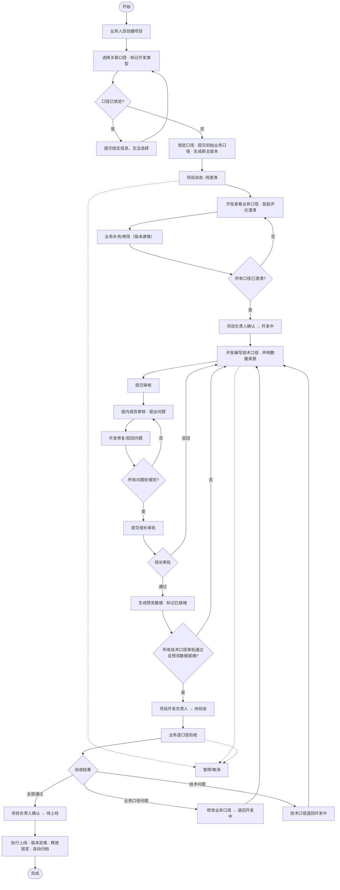
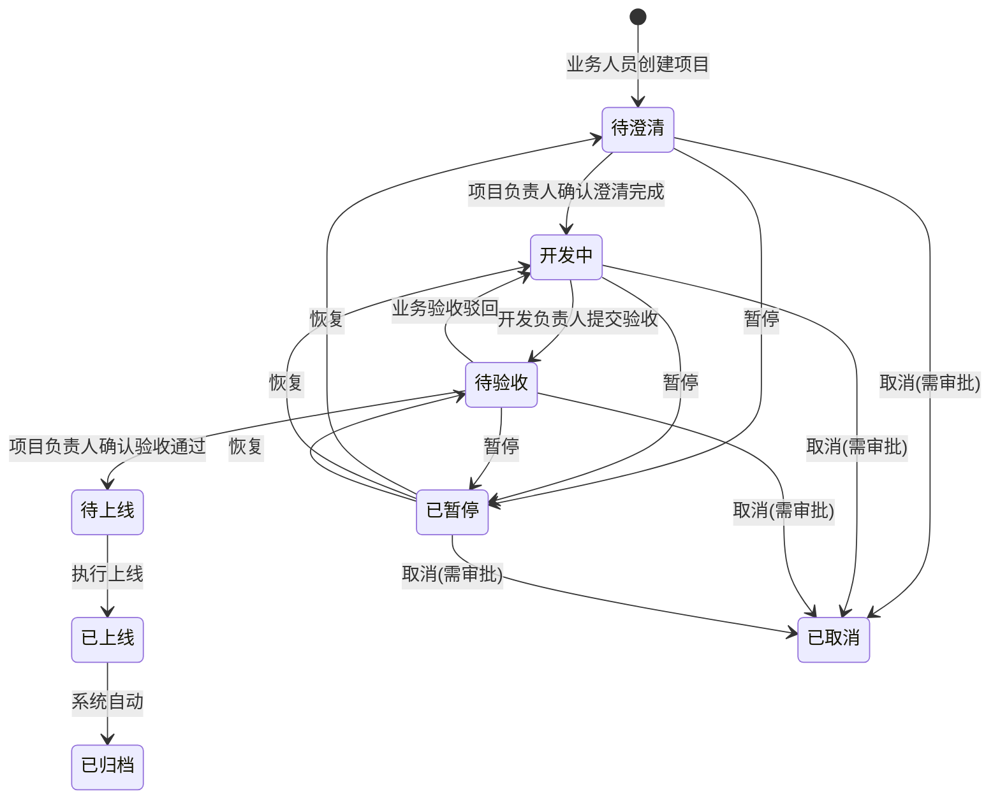
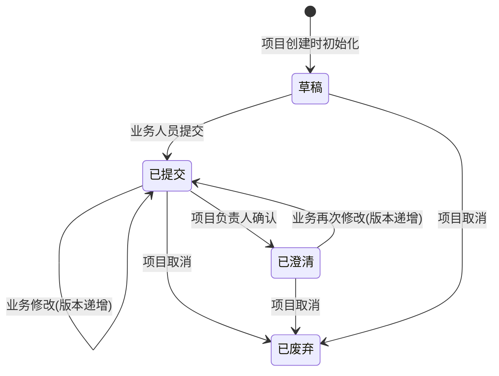
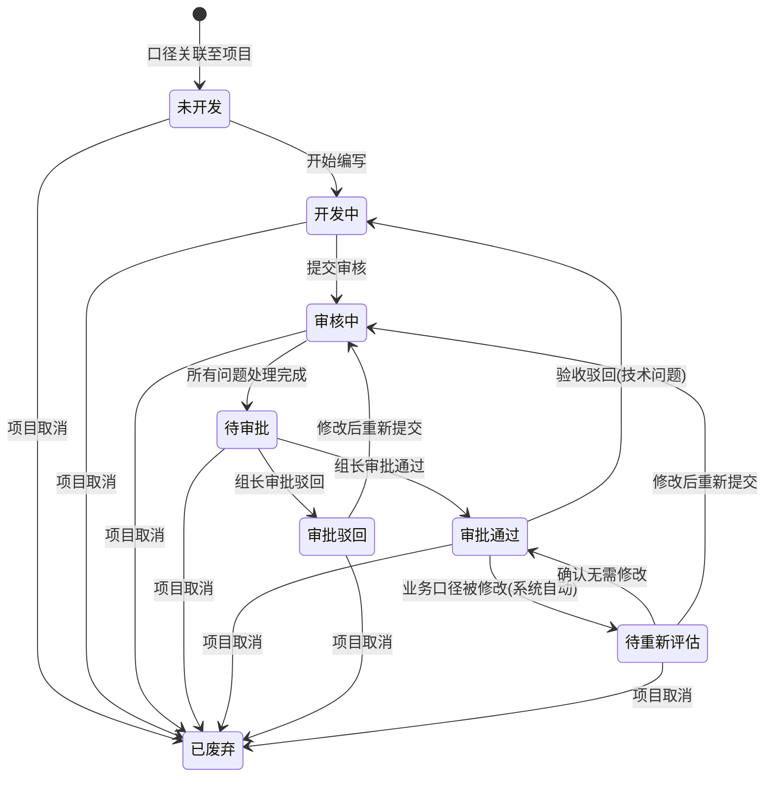

# 数据管理平台 - 核心流程图 & 用户故事地图

> 配套可视化文件: [core-flowcharts.html](./core-flowcharts.html)（浏览器打开可交互查看）

---

## 一、项目全生命周期流程图



---

## 二、项目状态机



### 关键转换条件

| 转换            | 操作人                   | 前置条件                                                                                 |
| --------------- | ------------------------ | ---------------------------------------------------------------------------------------- |
| 待澄清 → 开发中 | 项目负责人               | 所有业务口径状态为「已澄清」                                                             |
| 开发中 → 待验收 | 项目开发负责人           | 所有「需技术开发」口径的技术口径均「审批通过」且「预览数据已就绪」；无「待重新评估」状态 |
| 待验收 → 待上线 | 项目负责人               | 所有口径均验收通过                                                                       |
| 待验收 → 开发中 | 业务人员                 | 至少一个口径验收不通过                                                                   |
| 待上线 → 已上线 | 项目开发负责人/管理员    | 无                                                                                       |
| 已上线 → 已归档 | 系统自动                 | 上线操作完成                                                                             |
| 任意 → 已暂停   | 项目负责人/管理员        | 项目处于待澄清/开发中/待验收                                                             |
| 任意 → 已取消   | 项目负责人(需管理员审批) | 项目处于待澄清/开发中/待验收/已暂停                                                      |

### 暂停 vs 取消对比

| 维度     | 暂停                | 取消             |
| -------- | ------------------- | ---------------- |
| 可恢复性 | ✅ 可恢复           | ❌ 不可恢复      |
| 口径锁定 | 保持锁定            | 释放锁定         |
| 版本处理 | 保持不变            | 标记为「已废弃」 |
| 流程状态 | 冻结（不可操作）    | 终止             |
| 审批要求 | 无需审批            | 需管理员审批     |
| 超时处理 | 30天提醒 / 90天预警 | 无               |

---

## 三、业务口径状态机



### 业务口径修改影响分析

当业务人员在「开发中」或「待验收」阶段修改业务口径时:

```
业务发起修改 → 检测技术口径状态
  ├── 无技术口径 → 正常修改，版本递增
  ├── 技术口径未开发/开发中 → 提示通知开发，正常修改
  ├── 技术口径审核中/待审批 → 警告修改影响，确认后修改
  └── 技术口径审批通过 → 强警告，确认后触发「待重新评估」
```

---

## 四、技术口径状态机



### 组内审核 + 组长审批流程

```
提交审核 → 通知组内成员
  → 组内审核（提出问题）
    → 开发修复/驳回问题
      → 所有问题处理完? → 否 → 回到组内审核
      → 是 → 提交审批
        → 系统自动指定审批人（开发人员所在组的组长）
          → 组长查看完整信息
            ├── 通过 → 审批通过 → 生成预览数据 → 标记就绪
            └── 驳回 → 退回开发 → 修改后重新提交审核（循环）
```

### 审批委托机制

- 组长可委托同组成员代行审批
- 委托信息: 委托人、被委托人、委托时间、结束时间
- 超过48小时未审批 → 自动提醒组长及上级

---

## 五、口径版本控制与锁定

### 版本演进规则

```
项目A (首次创建):  V1.0 → V1.1 → V1.2 → V1.2(上线定格 ✅)
                                               ↓
项目B (正常迭代):  V2.0 → V2.1 → V2.2 → V2.2(上线定格 ✅)
                                               ↓
项目C (被取消):    V3.0 → V3.0(废弃 ❌)
                                               ↓
项目D (接续):      V4.0(版本号继续递增，跳过废弃版本)
```

### 口径锁定生命周期

```
空闲 → 项目关联 → 已锁定
  ├── 项目上线归档 → 版本生效 → 释放 → 空闲
  ├── 项目取消 → 版本废弃 → 释放 → 空闲
  ├── 项目移除关联 → 版本废弃 → 释放 → 空闲
  └── 项目暂停 → 保持锁定（冻结）
       ├── 恢复 → 继续锁定
       └── 取消 → 版本废弃 → 释放 → 空闲
```

---

## 六、用户故事地图

### 故事统计

| 优先级   | 数量   | 说明               |
| -------- | ------ | ------------------ |
| 🟢 MVP   | 48     | 核心功能，首期交付 |
| 🟡 V2    | 16     | 增强功能，二期迭代 |
| ⚪ V3    | 1      | 远期规划           |
| **总计** | **65** |                    |

### 按角色 × 阶段分布

#### 业务人员 (18个故事)

| 阶段     | 故事                                        | 优先级 |
| -------- | ------------------------------------------- | ------ |
| 项目创建 | US-B01 创建项目并填写基本信息、指定负责人   | MVP    |
| 项目创建 | US-B02 选择关联口径并标记开发类型           | MVP    |
| 项目创建 | US-B03 提交初始业务口径（含要素需求）       | MVP    |
| 项目创建 | US-B04 查看口径锁定状态提示                 | MVP    |
| 需求澄清 | US-B05 查看开发评论并回复澄清               | MVP    |
| 需求澄清 | US-B06 修改业务口径（版本自动递增）         | MVP    |
| 需求澄清 | US-B07 查看修改影响提示（关联技术口径状态） | MVP    |
| 需求澄清 | US-B08 上传附件辅助澄清                     | V2     |
| 数据开发 | US-B09 在开发阶段追加修改业务口径           | V2     |
| 审核审批 | US-B10 查看技术口径审核审批进度             | MVP    |
| 业务验收 | US-B11 逐口径提交验收结果                   | MVP    |
| 业务验收 | US-B12 选择驳回类型并填写原因               | MVP    |
| 业务验收 | US-B13 使用版本对比辅助验收                 | MVP    |
| 上线归档 | US-B14 查看归档项目的完整记录               | MVP    |
| 资产管理 | US-B15 按主题/名称/标签搜索口径             | MVP    |
| 资产管理 | US-B16 查看口径版本历史和对比               | MVP    |
| 资产管理 | US-B17 批量导入导出要素                     | V2     |
| 资产管理 | US-B18 全文搜索口径和业务规则               | V2     |

#### 数据开发 (17个故事)

| 阶段     | 故事                                      | 优先级 |
| -------- | ----------------------------------------- | ------ |
| 项目创建 | US-D01 收到新项目通知并查看项目详情       | MVP    |
| 需求澄清 | US-D02 查看业务口径详情和要素需求         | MVP    |
| 需求澄清 | US-D03 发起评论 @业务人员澄清             | MVP    |
| 数据开发 | US-D04 编写技术口径（SQL/ETL逻辑）        | MVP    |
| 数据开发 | US-D05 声明数据来源口径（血缘）           | MVP    |
| 数据开发 | US-D06 关联指定版本的业务口径             | MVP    |
| 数据开发 | US-D07 提交技术口径审核                   | MVP    |
| 审核审批 | US-D08 查看组内审核问题列表               | MVP    |
| 审核审批 | US-D09 修复问题 / 驳回不合理问题          | MVP    |
| 审核审批 | US-D10 提交组长审批                       | MVP    |
| 审核审批 | US-D11 评估业务口径变更影响（待重新评估） | MVP    |
| 业务验收 | US-D12 在机房生成预览数据                 | MVP    |
| 业务验收 | US-D13 标记预览数据已就绪                 | MVP    |
| 业务验收 | US-D14 验收驳回后修改技术口径             | MVP    |
| 上线归档 | US-D15 执行上线操作                       | MVP    |
| 资产管理 | US-D16 查看技术口径版本对比               | MVP    |
| 资产管理 | US-D17 查看口径血缘关系图谱               | V2     |

#### 开发组长 (6个故事)

| 阶段     | 故事                             | 优先级 |
| -------- | -------------------------------- | ------ |
| 审核审批 | US-L01 查看待审核的技术口径      | MVP    |
| 审核审批 | US-L02 组内审核时提出问题        | MVP    |
| 审核审批 | US-L03 审批技术口径（通过/驳回） | MVP    |
| 审核审批 | US-L04 委托审批权限给同组成员    | MVP    |
| 审核审批 | US-L05 批量审批多个技术口径      | V2     |
| 资产管理 | US-L06 查看组内技术口径质量报告  | V2     |

#### 项目负责人 (6个故事)

| 阶段     | 故事                                 | 优先级 |
| -------- | ------------------------------------ | ------ |
| 项目创建 | US-P01 查看项目全局信息和进度        | MVP    |
| 需求澄清 | US-P02 确认所有口径澄清完成 → 开发中 | MVP    |
| 数据开发 | US-P03 暂停/恢复项目                 | MVP    |
| 数据开发 | US-P04 发起项目取消申请              | MVP    |
| 审核审批 | US-P05 跟踪技术口径审核审批进度      | MVP    |
| 业务验收 | US-P06 确认项目整体验收完成 → 待上线 | MVP    |

#### 管理员 (11个故事)

| 阶段     | 故事                                | 优先级 |
| -------- | ----------------------------------- | ------ |
| 需求澄清 | US-A01 管理评论（标记隐藏不当评论） | V2     |
| 数据开发 | US-A02 审批项目取消申请             | MVP    |
| 审核审批 | US-A03 处理审核审批异常             | V2     |
| 审核审批 | US-A04 查看审批委托记录             | V2     |
| 上线归档 | US-A05 执行项目上线操作             | MVP    |
| 资产管理 | US-A06 配置角色和操作权限 (RBAC)    | MVP    |
| 资产管理 | US-A07 管理开发组与人员归属         | MVP    |
| 资产管理 | US-A08 查看全量操作日志             | MVP    |
| 资产管理 | US-A09 审批口径废弃申请             | MVP    |
| 资产管理 | US-A10 配置数据权限（主题/部门）    | V2     |
| 资产管理 | US-A11 批量导入口径（数据迁移）     | V2     |

#### 系统自动 (16个故事)

| 阶段     | 故事                                      | 优先级 |
| -------- | ----------------------------------------- | ------ |
| 项目创建 | US-S01 校验口径锁定状态                   | MVP    |
| 项目创建 | US-S02 自动锁定关联口径                   | MVP    |
| 项目创建 | US-S03 生成口径新主版本号                 | MVP    |
| 需求澄清 | US-S04 版本自动递增（次版本号）           | MVP    |
| 需求澄清 | US-S05 发送评论/修改通知                  | MVP    |
| 数据开发 | US-S06 技术口径状态自动变更（待重新评估） | MVP    |
| 审核审批 | US-S07 自动指定审批人（组长）             | MVP    |
| 审核审批 | US-S08 审批超时提醒（48h）                | MVP    |
| 审核审批 | US-S09 通知聚合（防轰炸）                 | V2     |
| 业务验收 | US-S10 验收驳回时自动退回技术口径状态     | MVP    |
| 上线归档 | US-S11 上线后自动释放口径锁定             | MVP    |
| 上线归档 | US-S12 版本定格为生效版本                 | MVP    |
| 上线归档 | US-S13 项目自动归档                       | MVP    |
| 资产管理 | US-S14 逾期项目预警                       | V2     |
| 资产管理 | US-S15 暂停超时提醒（30天/90天）          | V2     |
| 资产管理 | US-S16 冷热数据自动迁移                   | V3     |
