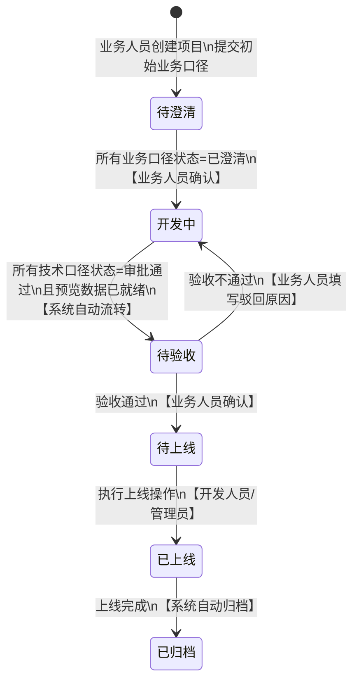
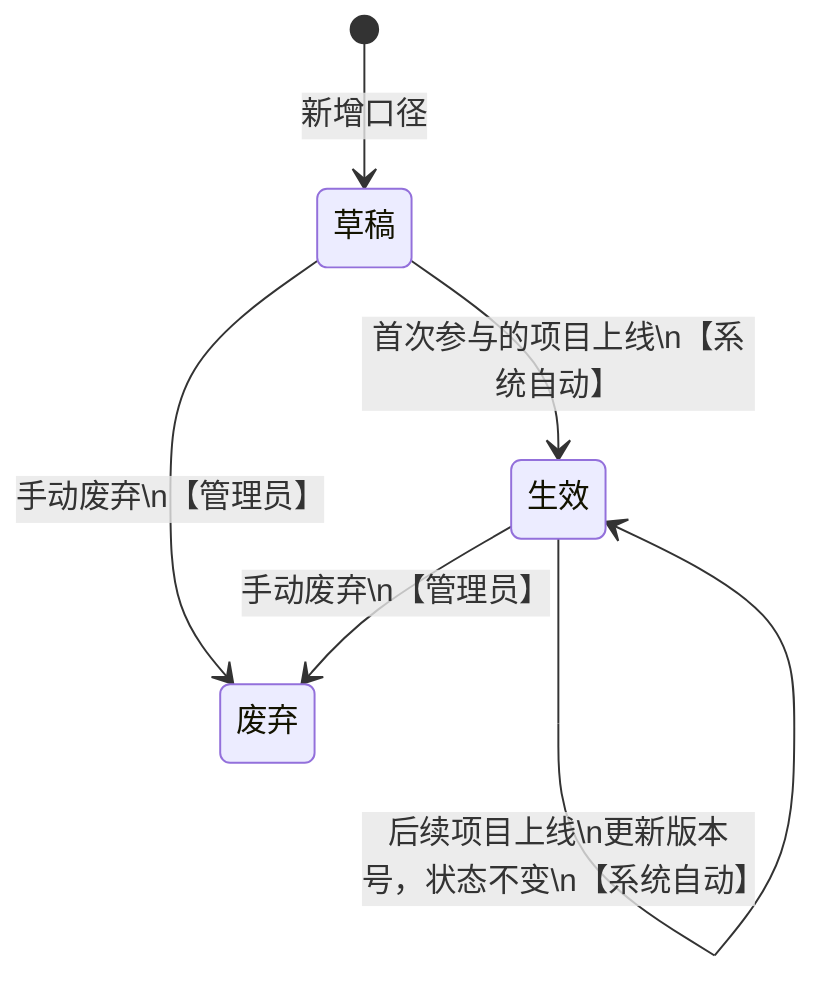
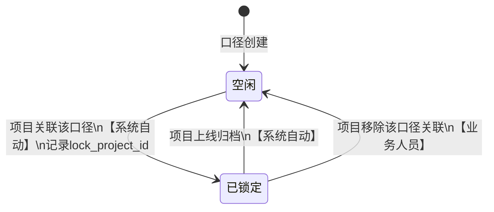
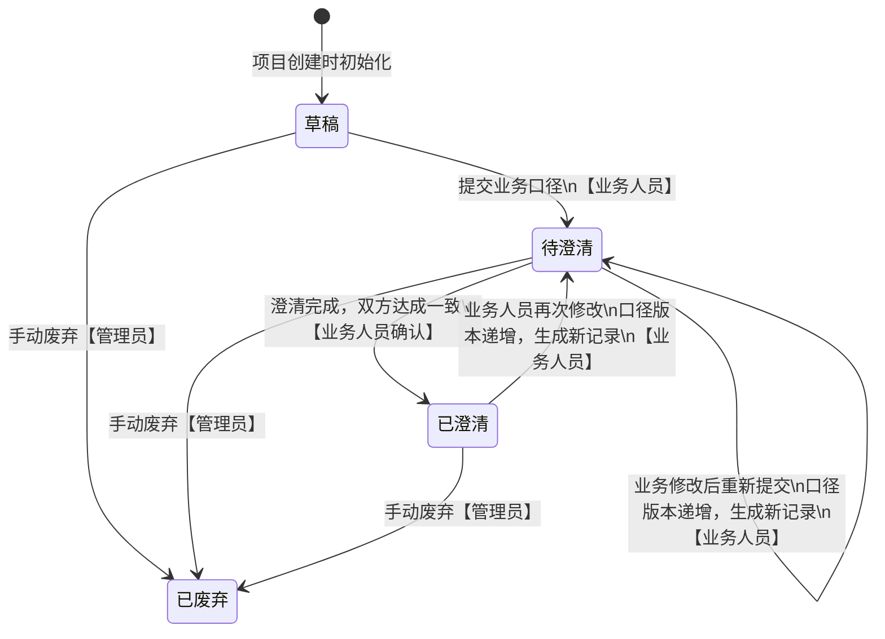
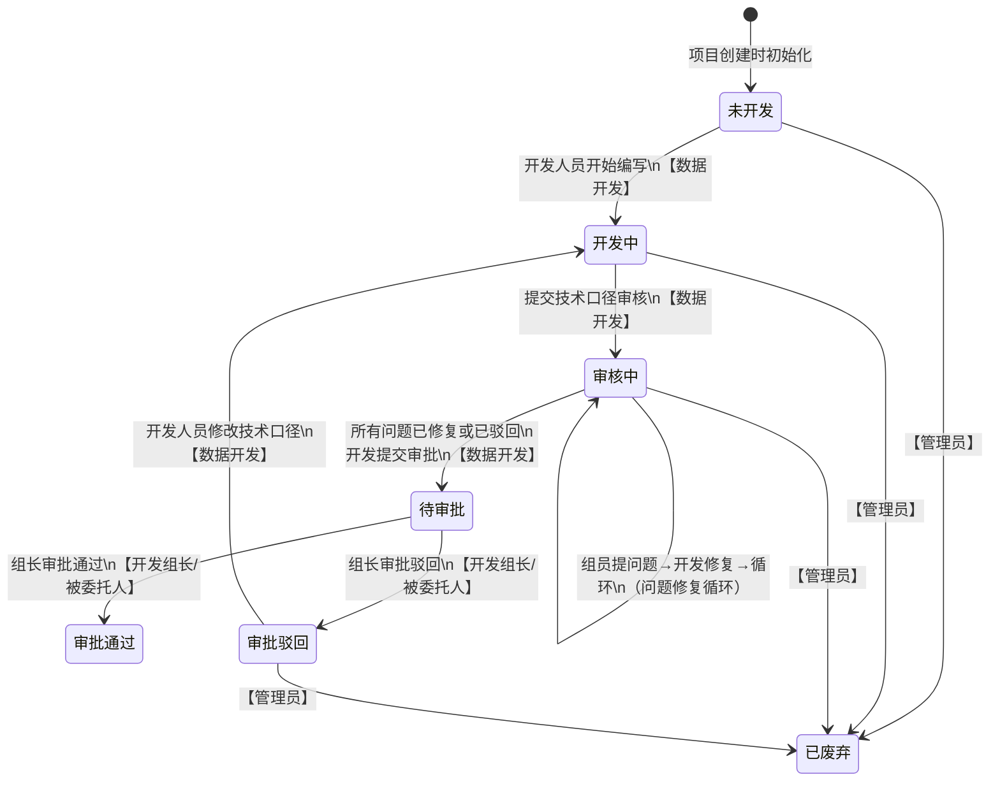
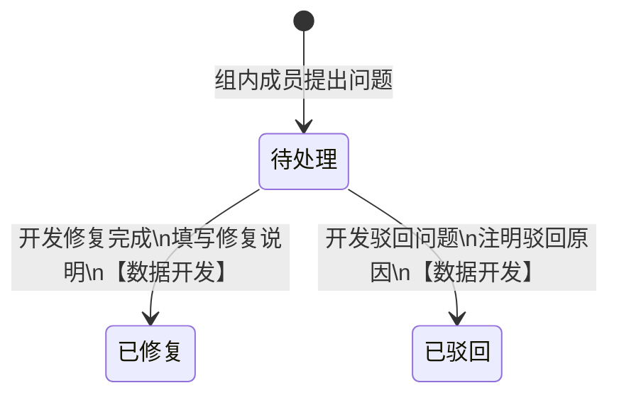
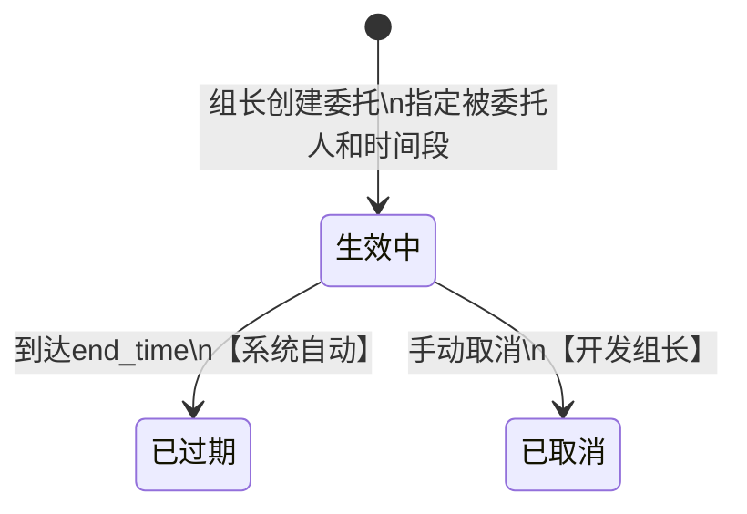

# 数据管理平台 - 状态机设计文档

本文档定义平台所有实体的状态、流转规则、触发条件和联动关系，是前后端开发的核心依据。

---

## 一、项目状态机

项目是平台流程的主线，驱动业务口径、技术口径、口径锁定等子状态机联动。

### 1.1 状态定义

| 状态值 | 中文名 | 数据库枚举              | 说明                                   |
| ------ | ------ | ----------------------- | -------------------------------------- |
| 待澄清 | 待澄清 | `pending_clarification` | 项目刚创建，业务与开发进行需求澄清     |
| 开发中 | 开发中 | `developing`            | 澄清完成，技术口径开发/审核/审批进行中 |
| 待验收 | 待验收 | `pending_acceptance`    | 所有技术口径审批通过，等待业务验收     |
| 待上线 | 待上线 | `pending_launch`        | 验收通过，等待执行上线                 |
| 已上线 | 已上线 | `launched`              | 上线完成，触发版本定格和锁定释放       |
| 已归档 | 已归档 | `archived`              | 归档完成，所有数据只读不可修改         |

### 1.2 状态流转图



### 1.3 流转规则明细

| #   | 当前状态 | 目标状态 | 触发条件                                           | 触发角色        | 系统副作用                                   |
| --- | -------- | -------- | -------------------------------------------------- | --------------- | -------------------------------------------- |
| T1  | -        | 待澄清   | 创建项目、提交初始业务口径                         | 业务人员        | 关联口径自动锁定；通知数据开发人员           |
| T2  | 待澄清   | 开发中   | 所有业务口径状态 = 已澄清                          | 业务人员        | -                                            |
| T3  | 开发中   | 待验收   | 所有技术口径状态 = 审批通过 且 `preview_ready = 1` | 系统自动        | 通知业务人员前往数据开发平台查看预览数据     |
| T4  | 待验收   | 待上线   | 业务验收通过                                       | 业务人员        | 记录验收结果                                 |
| T5  | 待验收   | 开发中   | 业务验收不通过（填写驳回原因）                     | 业务人员        | 记录验收结果；业务可修改业务口径（版本递增） |
| T6  | 待上线   | 已上线   | 执行上线操作                                       | 开发人员/管理员 | 口径版本定格为生效版本；口径锁定释放         |
| T7  | 已上线   | 已归档   | 上线完成                                           | 系统自动        | 所有记录变为只读                             |

### 1.4 约束规则

- **不可回退**：已上线/已归档不可回退。上线后发现问题需重新创建新项目。
- **验收驳回**：待验收 → 开发中是唯一的回退路径，业务可修改业务口径（版本递增），开发重走技术口径流程。
- **业务口径修改窗口**：项目上线前的任何阶段（待澄清、开发中、待验收）业务人员均可修改业务口径。

---

## 二、口径状态机（双轨：业务状态 + 锁定状态）

口径同时维护两个独立状态维度：**业务状态**（生命周期）和**锁定状态**（并发控制），互不干扰。

### 2.1 口径业务状态

#### 状态定义

| 状态值 | 中文名 | 数据库枚举   | 说明                               |
| ------ | ------ | ------------ | ---------------------------------- |
| 草稿   | 草稿   | `draft`      | 新建口径，未参与过项目             |
| 生效   | 生效   | `active`     | 至少有一个项目上线后，口径版本生效 |
| 废弃   | 废弃   | `deprecated` | 手动标记废弃，不可再参与新项目     |

#### 状态流转图



#### 流转规则

| #   | 当前状态  | 目标状态 | 触发条件           | 触发角色        | 系统副作用                       |
| --- | --------- | -------- | ------------------ | --------------- | -------------------------------- |
| C1  | -         | 草稿     | 新增口径           | 业务人员/管理员 | 初始版本 V1.0                    |
| C2  | 草稿      | 生效     | 首次参与的项目上线 | 系统自动        | `is_current` 标记生效版本        |
| C3  | 生效      | 生效     | 后续项目上线       | 系统自动        | 更新 `is_current` 至新版本       |
| C4  | 草稿/生效 | 废弃     | 手动废弃           | 管理员          | 保留全部历史数据，不可参与新项目 |

### 2.2 口径锁定状态

#### 状态定义

| 状态值 | 中文名 | 数据库枚举 | 说明                                         |
| ------ | ------ | ---------- | -------------------------------------------- |
| 空闲   | 空闲   | `free`     | 未被任何项目锁定，可被新项目关联             |
| 已锁定 | 已锁定 | `locked`   | 被某个进行中的项目锁定，其他项目不可关联修改 |

#### 状态流转图



#### 流转规则

| #   | 当前状态 | 目标状态 | 触发条件             | 触发角色 | 系统副作用                          |
| --- | -------- | -------- | -------------------- | -------- | ----------------------------------- |
| L1  | 空闲     | 已锁定   | 项目创建时关联该口径 | 系统自动 | 写入 `lock_project_id`、`lock_time` |
| L2  | 已锁定   | 空闲     | 关联项目上线归档     | 系统自动 | 清空 `lock_project_id`、`lock_time` |
| L3  | 已锁定   | 空闲     | 项目主动移除口径关联 | 业务人员 | 清空 `lock_project_id`、`lock_time` |

#### 约束规则

- 已锁定的口径：其他项目创建时可**查看**但**不可选择关联**。
- 锁定信息展示：页面显示锁定项目名称、锁定时间，便于用户了解当前状态。
- 一个口径同一时间最多被一个项目锁定。

---

## 三、业务口径状态机

### 3.1 状态定义

| 状态值 | 中文名 | 数据库枚举              | 说明                           |
| ------ | ------ | ----------------------- | ------------------------------ |
| 草稿   | 草稿   | `draft`                 | 刚创建，尚未提交               |
| 待澄清 | 待澄清 | `pending_clarification` | 已提交，业务与开发进行需求澄清 |
| 已澄清 | 已澄清 | `clarified`             | 澄清完成，业务与开发达成一致   |
| 已废弃 | 已废弃 | `deprecated`            | 手动废弃                       |

### 3.2 状态流转图



### 3.3 流转规则明细

| #   | 当前状态 | 目标状态 | 触发条件                 | 触发角色 | 系统副作用                                                 |
| --- | -------- | -------- | ------------------------ | -------- | ---------------------------------------------------------- |
| B1  | -        | 草稿     | 项目创建时初始化业务口径 | 业务人员 | 生成口径新主版本（如 V2.0）                                |
| B2  | 草稿     | 待澄清   | 提交业务口径             | 业务人员 | 通知数据开发人员                                           |
| B3  | 待澄清   | 已澄清   | 澄清完成                 | 业务人员 | 当所有业务口径已澄清时，触发项目状态 → 开发中              |
| B4  | 待澄清   | 待澄清   | 修改后重新提交           | 业务人员 | 版本递增（V2.0→V2.1），生成新的业务口径记录                |
| B5  | 已澄清   | 待澄清   | 业务人员再次修改         | 业务人员 | 版本递增，生成新记录；若项目在"开发中"，开发需注意关联版本 |
| B6  | 任意     | 已废弃   | 手动废弃                 | 管理员   | 保留历史记录                                               |

### 3.4 约束规则

- **修改窗口**：只要项目未上线（状态不为 已上线/已归档），业务人员均可修改业务口径。修改主要集中在待澄清阶段。
- **版本递增**：每次修改生成新的业务口径记录，口径版本自动递增次版本号，原记录保留不可修改。
- **联动影响**：业务口径修改后，项目可选择将技术口径重新关联至新版本。

---

## 四、技术口径状态机（流程最复杂）

### 4.1 状态定义

| 状态值   | 中文名   | 数据库枚举         | 说明                               |
| -------- | -------- | ------------------ | ---------------------------------- |
| 未开发   | 未开发   | `not_started`      | 初始化，等待开发人员开始           |
| 开发中   | 开发中   | `developing`       | 开发人员正在编写技术口径           |
| 审核中   | 审核中   | `reviewing`        | 提交组内审核，组员审查中           |
| 待审批   | 待审批   | `pending_approval` | 审核问题全部处理完成，等待组长审批 |
| 审批通过 | 审批通过 | `approved`         | 组长审批通过                       |
| 审批驳回 | 审批驳回 | `rejected`         | 组长审批驳回                       |
| 已废弃   | 已废弃   | `deprecated`       | 手动废弃                           |

### 4.2 状态流转图



### 4.3 流转规则明细

| #   | 当前状态 | 目标状态 | 触发条件                                  | 触发角色          | 系统副作用                                                             |
| --- | -------- | -------- | ----------------------------------------- | ----------------- | ---------------------------------------------------------------------- |
| TC1 | -        | 未开发   | 项目创建时初始化                          | 系统自动          | -                                                                      |
| TC2 | 未开发   | 开发中   | 开发人员开始编写                          | 数据开发          | -                                                                      |
| TC3 | 开发中   | 审核中   | 提交技术口径审核                          | 数据开发          | 通知组内成员（除本人外）                                               |
| TC4 | 审核中   | 审核中   | 组员提出问题 / 开发修复问题               | 组员 + 开发       | 问题记录写入 `prj_caliber_issue`                                       |
| TC5 | 审核中   | 待审批   | 所有问题状态 ∈ {已修复, 已驳回}，提交审批 | 数据开发          | 通知开发组长                                                           |
| TC6 | 待审批   | 审批通过 | 组长审批通过                              | 开发组长/被委托人 | 记录审批意见；当项目内所有技术口径=审批通过 → 触发项目状态流转至待验收 |
| TC7 | 待审批   | 审批驳回 | 组长审批驳回（填写驳回原因）              | 开发组长/被委托人 | 记录审批意见；通知开发人员                                             |
| TC8 | 审批驳回 | 开发中   | 开发人员修改技术口径                      | 数据开发          | -                                                                      |
| TC9 | 任意     | 已废弃   | 手动废弃                                  | 管理员            | 保留历史记录                                                           |

### 4.4 约束规则

- **审批前置条件**：审核中 → 待审批，要求所有问题状态为 已修复 或 已驳回，不允许存在 待处理 的问题。
- **审批驳回路径**：必须走 审批驳回 → 开发中 → 审核中 → 待审批 完整路径，不可跳过审核直接重新审批。
- **审批通过后不可回退**：审批通过为终态（除废弃外），不可再修改。
- **联动项目状态**：所有技术口径审批通过 + 预览数据就绪 → 项目自动流转至"待验收"。
- **业务口径变更影响**：开发中状态下，若业务口径发生变更，项目可选择重新关联版本，开发人员据此调整后重新提交审核。

---

## 五、技术口径问题状态机

### 5.1 状态定义

| 状态值 | 中文名 | 数据库枚举 | 说明                             |
| ------ | ------ | ---------- | -------------------------------- |
| 待处理 | 待处理 | `open`     | 组员提出问题，等待开发处理       |
| 已修复 | 已修复 | `fixed`    | 开发修复完成，填写修复说明       |
| 已驳回 | 已驳回 | `rejected` | 开发认为问题不合理，注明驳回原因 |

### 5.2 状态流转图



### 5.3 流转规则明细

| #   | 当前状态 | 目标状态 | 触发条件                     | 触发角色  | 系统副作用                                     |
| --- | -------- | -------- | ---------------------------- | --------- | ---------------------------------------------- |
| I1  | -        | 待处理   | 组内成员提出问题             | 组员/组长 | 通知开发人员                                   |
| I2  | 待处理   | 已修复   | 开发修复完成，填写修复说明   | 数据开发  | 记录 `fixed_by`、`fixed_at`、`fix_description` |
| I3  | 待处理   | 已驳回   | 开发认为不合理，注明驳回原因 | 数据开发  | 记录 `reject_reason`                           |

### 5.4 约束规则

- **不可回退**：已修复/已驳回为终态，不可回退到待处理。
- **异议处理**：对修复结果有异议时，提出**新问题**，不修改原问题状态。
- **审批前置**：技术口径提交审批前，所有问题必须处于 已修复 或 已驳回 状态。
- **不可删除**：问题记录永久保留，作为审核追溯依据。

---

## 六、审批委托状态机

### 6.1 状态定义

| 状态值 | 中文名 | 数据库枚举  | 说明                         |
| ------ | ------ | ----------- | ---------------------------- |
| 生效中 | 生效中 | `active`    | 委托生效，被委托人可执行审批 |
| 已过期 | 已过期 | `expired`   | 到达结束时间，自动过期       |
| 已取消 | 已取消 | `cancelled` | 组长手动取消委托             |

### 6.2 状态流转图



### 6.3 流转规则明细

| #   | 当前状态 | 目标状态 | 触发条件        | 触发角色 | 系统副作用                   |
| --- | -------- | -------- | --------------- | -------- | ---------------------------- |
| D1  | -        | 生效中   | 组长创建委托    | 开发组长 | 委托期间被委托人拥有审批权限 |
| D2  | 生效中   | 已过期   | 到达 `end_time` | 系统自动 | 被委托人审批权限自动回收     |
| D3  | 生效中   | 已取消   | 组长手动取消    | 开发组长 | 被委托人审批权限立即回收     |

### 6.4 约束规则

- **委托范围**：被委托人必须为同组成员。
- **委托记录**：所有委托操作留痕，管理员可查看全部委托记录。
- **审批超时**：技术口径提交审批后超过48小时未处理，系统自动提醒审批人（含被委托人）及其上级。

---

## 七、状态机联动关系

### 7.1 联动总览

```
项目状态               业务口径状态            技术口径状态           口径锁定状态
══════════             ══════════════          ══════════════         ════════════

  创建项目 ──────────── 草稿 ──────────── 未开发 ──────────── 空闲→已锁定
     │                   │                  │
     ▼                   ▼                  ▼
  待澄清 ◄──────────── 待澄清              │
     │                   │                  │
     │ 所有已澄清        ▼                  │
     ▼                 已澄清               ▼
  开发中 ────────────────────────────── 开发中→审核中→待审批
     │                                      │
     │                               所有审批通过
     ▼                                      ▼
  待验收 ◄────────────────────────── 审批通过
     │
     │ 验收通过
     ▼
  待上线
     │
     │ 执行上线
     ▼
  已上线 ──────────────────────────────────────── 已锁定→空闲
     │                                            (锁定释放)
     ▼                                            口径版本定格
  已归档
```

### 7.2 关键联动规则

| #   | 触发事件             | 源状态机变化        | 联动状态机变化                                         | 说明                         |
| --- | -------------------- | ------------------- | ------------------------------------------------------ | ---------------------------- |
| 1   | 创建项目             | 项目 → 待澄清       | 口径锁定：空闲 → 已锁定                                | 关联口径自动锁定             |
| 2   | 所有业务口径已澄清   | 业务口径 → 已澄清   | 项目：待澄清 → 开发中                                  | 澄清完成驱动项目进入开发阶段 |
| 3   | 所有技术口径审批通过 | 技术口径 → 审批通过 | 项目：开发中 → 待验收                                  | 需同时满足预览数据就绪       |
| 4   | 验收不通过           | 项目 → 开发中       | 业务口径可修改（版本递增）；技术口径可回退修改         | 回退路径                     |
| 5   | 执行上线             | 项目 → 已上线       | 口径锁定：已锁定 → 空闲；口径业务状态 → 生效；版本定格 | 上线触发多个联动             |
| 6   | 业务口径修改         | 业务口径版本递增    | 技术口径可选择重新关联至新版本                         | 开发中阶段的关联调整         |
| 7   | 审批委托生效         | 委托 → 生效中       | 技术口径审批操作权限扩展至被委托人                     | 权限联动                     |

### 7.3 数据库字段与状态机映射

| 状态机       | 数据库表                  | 状态字段         | 枚举值                                                                                                     |
| ------------ | ------------------------- | ---------------- | ---------------------------------------------------------------------------------------------------------- |
| 项目状态     | `prj_project`             | `status`         | `pending_clarification` / `developing` / `pending_acceptance` / `pending_launch` / `launched` / `archived` |
| 口径业务状态 | `dat_caliber`             | `caliber_status` | `draft` / `active` / `deprecated`                                                                          |
| 口径锁定状态 | `dat_caliber`             | `lock_status`    | `free` / `locked`                                                                                          |
| 业务口径状态 | `prj_business_caliber`    | `status`         | `draft` / `pending_clarification` / `clarified` / `deprecated`                                             |
| 技术口径状态 | `prj_technical_caliber`   | `status`         | `not_started` / `developing` / `reviewing` / `pending_approval` / `approved` / `rejected` / `deprecated`   |
| 问题状态     | `prj_caliber_issue`       | `status`         | `open` / `fixed` / `rejected`                                                                              |
| 审批委托状态 | `prj_approval_delegation` | `status`         | `active` / `expired` / `cancelled`                                                                         |
