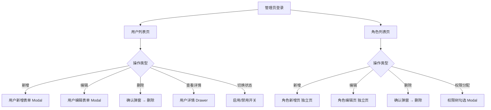

# 用户管理中心 - 产品需求文档

> 版本: v1.0 | 日期: 2026-04-30 | 作者: 产品部
>
> 本文档描述用户管理中心（用户管理 + 角色管理）的功能需求，供前后端开发使用。

---

## 一、背景与目标

### 1.1 背景

当前系统缺乏统一的用户管理和角色权限分配能力。管理员无法在后台查看、创建、编辑用户账号，也无法灵活配置角色及其权限。需要建设一个基础的用户管理中心，为后续的权限体系升级打好基础。

### 1.2 目标

- 提供完整的用户 CRUD 管理（列表查询、新增、编辑、删除、启用/禁用）
- 提供完整的角色 CRUD 管理（列表查询、新增、编辑、删除、权限分配）
- 用户与角色可关联，一个用户可分配多个角色
- 所有操作走 mock 数据，接口结构预留真实对接能力

---

## 二、业务流程与功能范围

### 2.1 现状痛点

- 无统一用户管理入口，用户数据散落各处
- 角色和权限靠硬编码，新增角色需要改代码
- 用户状态变更（启用/禁用）无操作界面

### 2.2 未来业务流程



### 2.3 功能清单

| 编号 | 功能          | 所属模块 | 前端范围 | 说明                                   |
| ---- | ------------- | -------- | -------- | -------------------------------------- |
| F01  | 用户列表查询  | 用户管理 | 是       | 分页列表，支持用户名/状态/日期范围搜索 |
| F02  | 新增用户      | 用户管理 | 是       | Modal 表单，8 个字段                   |
| F03  | 编辑用户      | 用户管理 | 是       | 复用新增 Modal，回显数据               |
| F04  | 删除用户      | 用户管理 | 是       | 二次确认后删除                         |
| F05  | 用户详情      | 用户管理 | 是       | Drawer 展示完整信息                    |
| F06  | 用户启用/禁用 | 用户管理 | 是       | 列表页 Switch 切换                     |
| F07  | 角色列表查询  | 角色管理 | 是       | 分页列表，支持角色名/状态搜索          |
| F08  | 新增角色      | 角色管理 | 是       | 独立页面，字段较多含权限树             |
| F09  | 编辑角色      | 角色管理 | 是       | 复用新增页，回显数据含已分配权限       |
| F10  | 删除角色      | 角色管理 | 是       | 二次确认，已关联用户的角色提示         |
| F11  | 角色权限分配  | 角色管理 | 是       | 树形勾选权限点                         |

---

## 三、功能详细设计

### 3.1 用户管理

#### 3.1.1 功能简述

管理员在用户列表页查看所有用户，支持按用户名模糊搜索、按状态筛选、按创建时间范围筛选。列表分页展示，每行提供编辑、删除、查看详情操作。顶部有新增按钮。

#### 3.1.2 入口路径

菜单：系统管理 → 用户管理 → `/system/user`

#### 3.1.3 原型图（UI 元素清单）

**列表页：**

- 上方搜索区域（3 列布局）：用户名输入框、状态下拉、创建时间范围选择器、搜索按钮、重置按钮
- 搜索区域下方：新增按钮
- 表格列：序号、用户名、昵称、邮箱、角色（标签展示）、状态（Switch 开关）、创建时间、操作（编辑/删除/详情）
- 分页器

**新增/编辑 Modal：**

- 用户名（input，必填，4-20 字符）
- 昵称（input，必填，2-20 字符）
- 邮箱（input，必填，邮箱格式校验）
- 手机号（input，必填，11 位手机号格式）
- 角色分配（select，多选，下拉选项来自角色列表）
- 状态（switch，默认启用）
- 备注（textarea，选填，最多 200 字）

**详情 Drawer：**

- 展示用户全部字段（含 id、创建时间、更新时间）
- 角色以标签形式展示

#### 3.1.4 业务要素（字段列表）

| 字段名     | 中文名     | 类型     | 必填     | 校验规则                  | 说明     |
| ---------- | ---------- | -------- | -------- | ------------------------- | -------- |
| id         | 用户ID     | string   | 自动生成 | -                         | UUID     |
| username   | 用户名     | string   | 是       | 4-20 字符，字母数字下划线 | 唯一     |
| nickname   | 昵称       | string   | 是       | 2-20 字符                 | -        |
| email      | 邮箱       | string   | 是       | 邮箱格式                  | -        |
| phone      | 手机号     | string   | 是       | 11 位数字，1 开头         | -        |
| avatar     | 头像       | string   | 否       | URL 格式                  | 默认头像 |
| status     | 状态       | number   | 是       | 1-启用 0-禁用             | 默认 1   |
| roleIds    | 角色ID列表 | string[] | 否       | -                         | 关联角色 |
| remark     | 备注       | string   | 否       | 最多 200 字符             | -        |
| createTime | 创建时间   | string   | 自动生成 | ISO 8601                  | -        |
| updateTime | 更新时间   | string   | 自动生成 | ISO 8601                  | -        |

#### 3.1.5 搜索参数

| 参数名    | 中文名       | 类型             | 控件类型        | 说明                      |
| --------- | ------------ | ---------------- | --------------- | ------------------------- |
| keyword   | 用户名/昵称  | string           | input           | 模糊搜索                  |
| status    | 状态         | number           | select          | 1-启用 0-禁用，不选查全部 |
| dateRange | 创建时间范围 | [string, string] | datePickerRange | 起止日期                  |

#### 3.1.6 业务操作规则

- 删除用户前弹出确认：`确认删除用户「{username}」？删除后不可恢复。`
- 禁用用户时弹出确认：`确认禁用用户「{username}」？禁用后该用户无法登录。`
- 用户名全局唯一，新增/编辑时前端做非空校验，唯一性由后端校验
- 角色下拉选项从角色列表接口获取，用户无角色时显示"未分配"

---

### 3.2 角色管理

#### 3.2.1 功能简述

管理员在角色列表页查看所有角色，支持按角色名模糊搜索、按状态筛选。分页展示，每行提供编辑、删除、权限分配操作。新增/编辑角色为独立页面（字段较多，含权限树）。

#### 3.2.2 入口路径

菜单：系统管理 → 角色管理 → `/system/role`

#### 3.2.3 原型图（UI 元素清单）

**列表页：**

- 上方搜索区域（3 列布局）：角色名输入框、状态下拉、搜索按钮、重置按钮
- 搜索区域下方：新增按钮
- 表格列：序号、角色编码、角色名、描述、状态（Switch 开关）、创建时间、操作（编辑/删除/权限分配）
- 分页器

**新增/编辑独立页：**

- 角色编码（input，必填，大写字母下划线，如 `ADMIN`）
- 角色名（input，必填，2-20 字符）
- 描述（textarea，选填，最多 200 字符）
- 状态（switch，默认启用）
- 权限树（checkbox tree，全选/反选，父子联动）

#### 3.2.4 业务要素（字段列表）

| 字段名        | 中文名     | 类型     | 必填     | 校验规则       | 说明                   |
| ------------- | ---------- | -------- | -------- | -------------- | ---------------------- |
| id            | 角色ID     | string   | 自动生成 | -              | UUID                   |
| code          | 角色编码   | string   | 是       | 大写字母下划线 | 唯一，如 `SUPER_ADMIN` |
| name          | 角色名     | string   | 是       | 2-20 字符      | 唯一                   |
| description   | 描述       | string   | 否       | 最多 200 字符  | -                      |
| status        | 状态       | number   | 是       | 1-启用 0-禁用  | 默认 1                 |
| permissionIds | 权限ID列表 | string[] | 否       | -              | 关联权限点             |
| createTime    | 创建时间   | string   | 自动生成 | ISO 8601       | -                      |
| updateTime    | 更新时间   | string   | 自动生成 | ISO 8601       | -                      |

#### 3.2.5 权限树结构

```
系统管理
├── 用户管理
│   ├── 查看用户列表
│   ├── 新增用户
│   ├── 编辑用户
│   ├── 删除用户
│   └── 查看用户详情
├── 角色管理
│   ├── 查看角色列表
│   ├── 新增角色
│   ├── 编辑角色
│   ├── 删除角色
│   └── 分配角色权限
```

#### 3.2.6 搜索参数

| 参数名  | 中文名      | 类型   | 控件类型 | 说明          |
| ------- | ----------- | ------ | -------- | ------------- |
| keyword | 角色名/编码 | string | input    | 模糊搜索      |
| status  | 状态        | number | select   | 1-启用 0-禁用 |

#### 3.2.7 业务操作规则

- 删除角色前弹出确认：`确认删除角色「{name}」？如有用户关联此角色，将自动解除关联。`
- 角色编码全局唯一，新增/编辑时前端做非空校验，唯一性由后端校验
- 权限分配保存时，若角色已关联用户，提示"该角色已关联 {N} 个用户，修改权限将立即生效"
- 分配权限页面的权限树默认全部展开

---

## 四、接口设计（Mock 数据）

> 以下接口为前端开发用，后端上线后替换为真实接口。所有接口基于 `src/plugins/request` 封装。

### 4.1 用户模块接口

| 方法名             | HTTP   | 路径             | 说明             |
| ------------------ | ------ | ---------------- | ---------------- |
| getUserListByGet   | GET    | `/api/user`      | 分页查询用户列表 |
| getUserByIdByGet   | GET    | `/api/user/{id}` | 查询用户详情     |
| createUserByPost   | POST   | `/api/user`      | 新增用户         |
| updateUserByPut    | PUT    | `/api/user/{id}` | 编辑用户         |
| deleteUserByDelete | DELETE | `/api/user/{id}` | 删除用户         |

### 4.2 角色模块接口

| 方法名             | HTTP   | 路径             | 说明             |
| ------------------ | ------ | ---------------- | ---------------- |
| getRoleListByGet   | GET    | `/api/role`      | 分页查询角色列表 |
| getRoleByIdByGet   | GET    | `/api/role/{id}` | 查询角色详情     |
| createRoleByPost   | POST   | `/api/role`      | 新增角色         |
| updateRoleByPut    | PUT    | `/api/role/{id}` | 编辑角色         |
| deleteRoleByDelete | DELETE | `/api/role/{id}` | 删除角色         |

### 4.3 字典接口

| 方法名       | HTTP | 路径        | 说明                       |
| ------------ | ---- | ----------- | -------------------------- |
| getDictByGet | GET  | `/api/dict` | 获取字典数据（状态枚举等） |

### 4.4 Mock 数据示例

#### 用户列表响应 (`GET /api/user`)

```json
{
  "code": 200,
  "data": {
    "records": [
      {
        "id": "u-001",
        "username": "zhangsan",
        "nickname": "张三",
        "email": "zhangsan@example.com",
        "phone": "13800138001",
        "avatar": "",
        "status": 1,
        "roleIds": ["r-001", "r-002"],
        "remark": "",
        "createTime": "2026-01-15T10:30:00Z",
        "updateTime": "2026-04-20T14:22:00Z"
      },
      {
        "id": "u-002",
        "username": "lisi",
        "nickname": "李四",
        "email": "lisi@example.com",
        "phone": "13800138002",
        "avatar": "",
        "status": 1,
        "roleIds": ["r-002"],
        "remark": "临时账号",
        "createTime": "2026-02-20T09:15:00Z",
        "updateTime": "2026-03-10T11:00:00Z"
      }
    ],
    "totalSize": 2,
    "pageNum": 1,
    "pageSize": 10
  },
  "message": "success"
}
```

#### 角色列表响应 (`GET /api/role`)

```json
{
  "code": 200,
  "data": {
    "records": [
      {
        "id": "r-001",
        "code": "SUPER_ADMIN",
        "name": "超级管理员",
        "description": "拥有系统全部权限",
        "status": 1,
        "permissionIds": ["p-001", "p-002", "p-003"],
        "createTime": "2026-01-01T00:00:00Z",
        "updateTime": "2026-01-01T00:00:00Z"
      },
      {
        "id": "r-002",
        "code": "USER_MANAGER",
        "name": "用户管理员",
        "description": "仅管理用户模块",
        "status": 1,
        "permissionIds": ["p-001"],
        "createTime": "2026-01-01T00:00:00Z",
        "updateTime": "2026-03-15T08:00:00Z"
      }
    ],
    "totalSize": 2,
    "pageNum": 1,
    "pageSize": 10
  },
  "message": "success"
}
```

---

**附录：字典编码约定**

| 字典编码     | 说明          | 值映射                     |
| ------------ | ------------- | -------------------------- |
| `userStatus` | 用户/角色状态 | `{ 1: '启用', 0: '禁用' }` |
