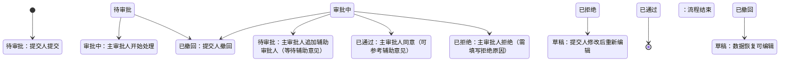

# 手工损益录入模块 产品需求文档（PRD）

---

## 1. 项目背景与目标

### 1.1 业务背景
手工损益数据是财务核算的重要组成部分，涉及大量字段的填报与审批。当前手工录入流程缺乏统一模板管理、审批过程不透明、数据变更难以追溯，导致业务处理效率低下、数据质量参差不齐。

### 1.2 核心目标
- **规范录入标准**：通过可配置的损益模板，统一数据录入格式和必填要求。
- **简化审批流程**：支持批量提交、批量审批，提升多数据处理效率。
- **确保可追溯**：所有数据变更均需经过审批，并完整记录审批历史，便于问题排查和审计。
- **提升效率**：通过暂存、撤回、批量操作等功能，减少重复工作。

---

## 2. 范围与边界

### 2.1 包含功能
- 损益模板配置（增删改查、字段配置）
- 损益数据录入（表单生成、暂存、提交审批、修改、删除）
- 损益数据审批（主审批人、辅助审批人、审批流程、撤回）
- 批量操作（批量提交、批量审批、批量删除审批）
- 审批历史追溯

### 2.2 不包含功能
- 与其他财务系统（如ERP）的数据同步
- 损益数据的报表导出与图表分析
- 多语言支持

---

## 3. 用户角色与权限

| 角色         | 职责说明                                                     | 核心操作权限                                               |
|--------------|--------------------------------------------------------------|-----------------------------------------------------------|
| 提交人       | 业务员，负责损益数据的录入、编辑、提交审批、撤回审批         | 查看本人暂存及已提交数据；暂存/提交/撤回；查看审批进度   |
| 主审批人     | 由系统固定配置，负责审批损益数据，可追加辅助审批人           | 查看待审批/审批中数据；审批（同意/拒绝）；追加辅助审批人 |
| 辅助审批人   | 由主审批人临时追加，提供参考意见，无最终审批权限             | 查看被追加的审批数据；提交意见（同意/拒绝）               |
| 系统管理员   | 负责模板配置、审批人分配、系统运维                           | 模板增删改；配置主审批人；查看所有数据及日志             |

---

## 4. 功能需求

### 4.1 损益模板配置

#### 4.1.1 功能描述
从系统预设的60个损益字段中筛选所需字段，组合成固定模板，供后续数据录入使用。模板支持新增、修改、删除、查询。

#### 4.1.2 字段配置说明
每个选中的字段需配置以下属性：
- **label**：字段显示名称，用于表单展示，需清晰易懂。
- **name**：字段标识，供系统内部识别，不可重复。
- **require**：是否必填，勾选后表单提交时需校验。
- **字段类型**：预设字段已固定类型（如文本、数字、金额、日期），配置时仅展示类型，不可修改。
- **字段顺序**：配置时可通过拖动调整显示顺序，保存后生效。

#### 4.1.3 操作规则
- **模板名称唯一**：新增或修改时，名称不可与已有模板重复。
- **删除校验**：若模板已关联任何损益数据（无论数据状态），系统提示“该模板已关联损益数据，不可删除”，禁止删除。
- **修改影响范围**：修改模板配置（如增减字段、调整必填）后，**新配置仅对后续新增的损益数据生效**；已存在的历史数据仍按原模板配置展示，不受影响。

#### 4.1.4 界面要素
- 模板列表：展示模板名称、字段数量、最后修改时间、操作（编辑、删除）
- 查询条件：模板名称（模糊查询）
- 新增/编辑弹窗：模板名称输入框、字段选择区（左侧待选字段、右侧已选字段）、字段属性配置（label、require）、顺序拖动条

---

### 4.2 损益数据录入

#### 4.2.1 表单生成
用户选择模板后，系统根据模板配置动态生成录入表单：
- 字段按配置顺序展示
- 必填字段标注红色星号（*）
- 字段默认值：部分预设字段可自动填充（如“提交人”默认为当前登录用户、“提交日期”默认为当天）

#### 4.2.2 数据操作
| 操作     | 说明                                                                                       | 状态变更 | 操作入口 |
|----------|--------------------------------------------------------------------------------------------|----------|----------|
| 暂存     | 保存当前填写数据，不发起审批流程。仅提交人本人可见并可编辑。                               | 草稿     | 录入页面 |
| 提交审批 | 正式发起审批流程，数据进入待审批状态，不可直接编辑。                                       | 待审批   | 录入页面 |
| 编辑     | 仅对“草稿”或“已拒绝”状态的数据可编辑。编辑后可再次暂存或提交。                             | 保持不变 | 录入页面 |
| 删除     | 任何状态的数据删除均需发起删除审批（草稿数据除外，可直接删除）。删除审批通过后数据逻辑删除。 | -        | 录入页面（草稿直接删除）/ 审批发起（非草稿） |
| 撤回     | 对“待审批”或“审批中”状态的数据，提交人可撤回审批，数据恢复为草稿状态。**撤回操作仅在审批列表页面提供，数据录入页面不提供撤回按钮。** | 已撤回 → 草稿 | 审批列表页面 |

#### 4.2.3 批量操作

##### 4.2.3.1 批量提交审批
- **适用数据**：多条处于“草稿”状态的损益数据（可混合模板吗？**限制：仅支持同一模板的数据批量提交，避免审批混乱**）
- **操作流程**：
  1. 勾选多条草稿数据，点击“批量提交审批”。
  2. 进入批量提交编辑页，页面分为上下两部分：
     - **选中数据表格**：展示所有勾选的数据，每条数据后带“修改”、“删除”按钮。
       - 点击“修改”：弹出该条数据的编辑弹窗，保存后数据更新并**暂存**（不立即提交），返回列表仍处于选中状态。
       - 点击“删除”：将该数据移出本次批量队列，不参与审批。
     - **审批人配置区**：统一选择主审批人，并可选择是否需要追加辅助审批人（可多选）。
  3. 点击“提交”，所有剩余数据统一发起审批流程，状态变更为“待审批”。

##### 4.2.3.2 批量审批
- **适用数据**：多条“待审批”状态的损益数据（审批人本人负责的）。
- **操作流程**：
  1. 审批人在审批列表勾选多条待审批数据，点击“批量审批”。
  2. 弹出批量审批框，可选择“同意”或“拒绝”，并填写统一审批意见（可选）。
  3. 提交后，系统逐条执行审批操作。若某条数据因并发等原因审批失败（如已被他人先行审批），则整体操作提示“部分成功”，失败项需单独处理。

##### 4.2.3.3 批量删除审批
- **适用数据**：多条任意状态的损益数据（需先确认删除权限）。
- **操作流程**：勾选目标数据，点击“批量删除审批”，发起删除审批流程（与单条删除审批类似，批量发起）。

#### 4.2.4 审批历史查看
在损益数据详情页面，可查看该条数据的所有历史审批记录列表，列表展示：
- 审批单号、操作类型（提交/撤回/同意/拒绝/追加）、操作人、操作时间、审批状态、意见。
- 点击每条记录的“明细”按钮，可跳转至该次审批的完整详情页，查看当时的数据快照、审批流程、所有意见。

---

### 4.3 损益数据审批

#### 4.3.1 审批流程角色与职责
- **提交人**：发起审批、撤回审批、查看进度。
- **主审批人**：系统固定配置（可一人或多人，按模板或业务线分配）。负责接收审批请求，决定最终结果（同意/拒绝），可根据需要追加辅助审批人。
- **辅助审批人**：由主审批人临时追加，仅提供参考意见，意见提交后流程自动返回主审批人。辅助审批人之间互不可见彼此意见，但主审批人可见所有意见。

#### 4.3.2 审批流程详细说明

#### 4.3.3 审批操作说明

##### 4.3.3.1 提交发起
- 提交人在数据录入页面点击“提交审批”，数据状态变更为“待审批”，系统向主审批人推送通知（站内消息/邮件/待办）。

##### 4.3.3.2 主审批操作
1. 主审批人进入审批列表，点击某条数据的“审批”按钮，进入审批详情页，查看完整损益数据、字段配置、提交信息。
2. 主审批人可选择：
   - **直接审批**：填写审批意见，点击“同意”或“拒绝”，流程结束。
   - **追加审批用户**：弹出选择框，从系统用户列表中选择辅助审批人（可多选），并填写追加原因（可选）。确认后，系统向辅助审批人发送通知，流程状态仍为“审批中”。
3. 若已追加辅助审批人，主审批人可随时在详情页查看已收到的辅助意见，并决定是否继续追加或直接完成审批。

##### 4.3.3.3 辅助审批操作
- 辅助审批人收到通知后，进入审批详情页（仅可查看数据，无法修改），提交审批意见（同意/拒绝），并可填写意见说明（可选）。
- 意见提交后，流程自动回转至主审批人，主审批人可见该意见。

##### 4.3.3.4 审批收尾
- 主审批人点击“同意”或“拒绝”并填写意见后，流程结束。数据状态更新为“已通过”或“已拒绝”。
- **拒绝时必填拒绝原因**，提交人可在“已拒绝”列表查看原因，修改后重新提交。

##### 4.3.3.5 审批撤回
- **操作入口**：提交人登录系统后，进入损益审批列表页面，对于状态为“待审批”或“审批中”且由本人提交的数据，列表项中提供“撤回”按钮。
- 点击“撤回”后，弹出确认框，确认后该审批流程立即终止，状态变更为“已撤回”，对应数据恢复为“草稿”状态，可编辑后再次提交。
- 撤回操作会生成一条撤回记录，留存于该数据的审批历史中。

#### 4.3.4 批量审批补充说明
- 批量审批时，若选择“同意”或“拒绝”，所有选中的数据将执行相同操作。
- 审批意见可统一填写，但若需对不同数据填写不同意见，建议逐条审批。
- 批量审批过程中，若某条数据已被其他人先行审批（状态已变化），则该条数据操作失败，不影响其他成功的数据。

---

## 5. 非功能性需求

### 5.1 性能要求
- 列表页查询响应时间 < 3秒（5000条数据以内）
- 表单提交响应时间 < 2秒
- 批量审批（50条以内）处理时间 < 5秒

### 5.2 并发处理
- 同一数据同时被多人审批时，后提交者应提示“数据已被处理，请刷新后重试”。
- 暂存数据多人同时编辑：采用“最后保存者覆盖”策略，并提示冲突。

### 5.3 安全性
- 严格基于角色的权限控制，前端隐藏无权限操作入口，后端接口校验。
- 所有操作记录操作日志（操作人、时间、IP、操作内容），留存不少于6个月。

### 5.4 可追溯性
- 审批历史记录需包含数据快照（提交时的数据内容），防止后续数据修改导致审批记录失真。
- 审批流程中的每一步操作（包括追加、撤回、意见提交）均记录详细时间戳。

---

## 6. 数据字典

### 6.1 损益模板表（template）
| 字段名     | 类型         | 说明                         |
|------------|--------------|------------------------------|
| id         | bigint       | 主键                         |
| name       | varchar(100) | 模板名称，唯一               |
| fields     | json         | 字段配置列表（含label,name,require,order） |
| created_by | bigint       | 创建人ID                     |
| created_at | datetime     | 创建时间                     |
| updated_at | datetime     | 最后修改时间                 |

### 6.2 损益数据主表（profit_loss_main）
| 字段名        | 类型         | 说明                                   |
|---------------|--------------|----------------------------------------|
| id            | bigint       | 主键                                   |
| template_id   | bigint       | 关联模板ID                             |
| data          | json         | 损益数据内容（key为字段name，value为值） |
| status        | tinyint      | 数据状态：0草稿、1待审批、2审批中、3已通过、4已拒绝、5已撤回、6已删除 |
| submitter_id  | bigint       | 提交人ID                               |
| submit_time   | datetime     | 提交时间（最近一次提交）               |
| approver_id   | bigint       | 当前主审批人ID                         |
| created_at    | datetime     | 创建时间                               |
| updated_at    | datetime     | 最后更新时间                           |

### 6.3 审批流程表（approval_flow）
| 字段名         | 类型         | 说明                                   |
|----------------|--------------|----------------------------------------|
| id             | bigint       | 主键                                   |
| data_id        | bigint       | 损益数据ID                             |
| flow_type      | tinyint      | 流程类型：1新增、2修改、3删除           |
| current_status | tinyint      | 当前流程状态：0待审批、1审批中、2已通过、3已拒绝、4已撤回 |
| initiator_id   | bigint       | 发起人ID                               |
| main_approver_id | bigint     | 主审批人ID                             |
| start_time     | datetime     | 流程开始时间                           |
| end_time       | datetime     | 流程结束时间                           |

### 6.4 审批记录表（approval_record）
| 字段名         | 类型          | 说明                                   |
|----------------|---------------|----------------------------------------|
| id             | bigint        | 主键                                   |
| flow_id        | bigint        | 关联流程ID                             |
| operator_id    | bigint        | 操作人ID                               |
| operator_role  | tinyint       | 操作人角色：1提交人、2主审批人、3辅助审批人 |
| action         | tinyint       | 操作类型：1提交、2同意、3拒绝、4追加、5撤回 |
| opinion        | varchar(500)  | 意见内容                               |
| data_snapshot  | json          | 操作时的数据快照（可选，用于追溯）     |
| created_at     | datetime      | 操作时间                               |

---

## 7. 界面原型（略）
此处可附上各页面的低保真或高保真原型图，标注关键操作区域。

---

## 8. 验收标准

### 8.1 模板配置
- [ ] 可成功新增模板，名称唯一校验生效
- [ ] 可成功修改模板，历史数据不受影响
- [ ] 删除已关联数据的模板时提示不可删除
- [ ] 字段配置中的label、require保存后生效

### 8.2 数据录入
- [ ] 选择模板后表单正确加载字段
- [ ] 暂存数据仅本人可见
- [ ] 提交审批后数据状态变更为待审批，不可编辑
- [ ] 删除审批发起后数据置灰，待审批通过后彻底隐藏
- [ ] **撤回按钮仅出现在审批列表页面，录入页面无撤回功能**

### 8.3 审批流程
- [ ] 主审批人可正常审批、拒绝、追加辅助审批人
- [ ] 辅助审批人可提交意见，意见提交后流程返回主审批人
- [ ] 撤回操作仅限未结束流程，且只能由提交人在审批列表操作，撤回后数据恢复草稿
- [ ] 审批拒绝后提交人可修改重新提交

### 8.4 批量操作
- [ ] 批量提交支持统一选审批人，可编辑/删除队列中数据
- [ ] 批量审批支持统一意见，部分失败有提示
- [ ] 批量删除审批正常发起

### 8.5 非功能
- [ ] 列表页响应时间符合要求
- [ ] 并发审批有冲突提示
- [ ] 所有操作生成日志记录

---

## 9. 附录

### 9.1 术语表
| 术语         | 解释                                   |
|--------------|----------------------------------------|
| 损益数据     | 指包含多个损益字段的一条业务记录       |
| 暂存         | 保存但不发起审批，仅自己可见           |
| 主审批人     | 系统固定配置，拥有最终审批权限         |
| 辅助审批人   | 主审批人临时追加，仅提供参考意见       |

### 9.2 参考资料
- 损益字段预设清单（附件一）
- 审批流程状态流转图（见4.3.2）

---

**文档结束**
