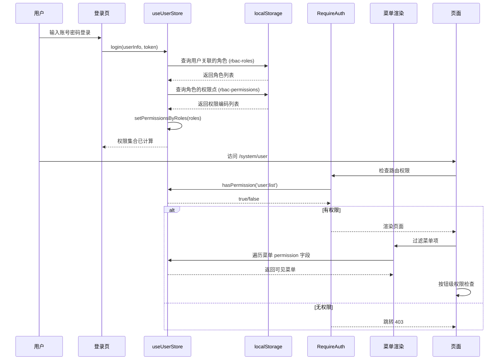
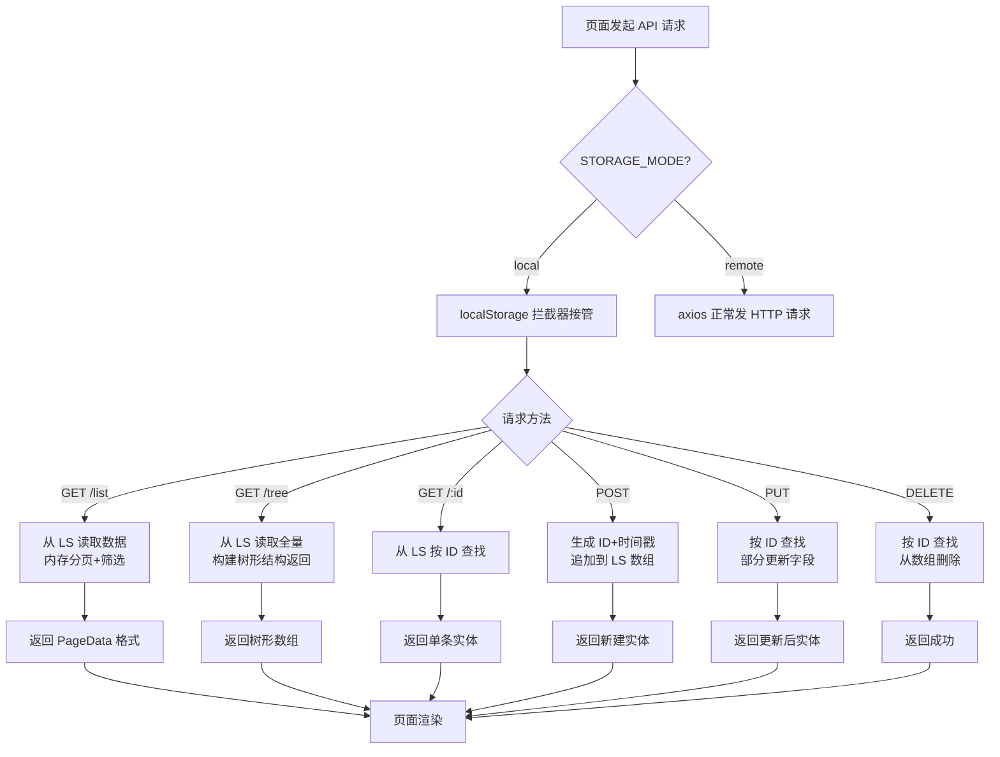

<!-- DRAFT VERSION - 待确认内容已标记为 [待确认: XXX] -->

# 1.需求概述

## 1.1.背景和目标（必填）

| 需求概述 | 为 AI Admin Pro 管理后台构建完整的 RBAC（基于角色的访问控制）权限体系，覆盖用户管理、角色管理、权限管理三大模块，实现从路由守卫到菜单过滤再到按钮控制的三级权限管控。前端 localStorage 先行存储，后续 Java + MySQL 后端接入时无缝切换。 |
| -------- | --------------------------------------------------------------------------------------------------------------------------------------------------------------------------------------------------------------------------------------- |
| 背景     | 当前系统仅有登录/注册基础功能，缺少完整的用户-角色-权限管理体系。`hasPermission()` 方法虽已定义但未在路由守卫和菜单渲染中使用，权限树硬编码在代码中不可动态管理。                                                                       |
| 目标     | 1. 实现用户/角色/权限三个模块的完整 CRUD 功能<br>2. 建立三级权限管控体系（路由守卫 → 菜单过滤 → 按钮控制）<br>3. 前端 localStorage 先行存储，预置种子数据，系统可独立运行<br>4. 后端接入时只需切换数据源配置，页面代码 0 改动           |

## 1.2.用户角色（选填）

| 用户/干系人类型 | 说明                           | 优先级 | 关注点                                   |
| --------------- | ------------------------------ | ------ | ---------------------------------------- |
| 超级管理员      | 拥有系统全部权限的系统内置角色 | P0     | 所有模块的增删改查、权限分配、系统配置   |
| 管理员          | 负责日常运维，管理用户和角色   | P1     | 用户管理、角色管理（不含权限管理）       |
| 只读用户        | 只能查看，不能修改             | P2     | 查看用户列表、查看角色列表、查看权限列表 |
| 后端开发人员    | 后续对接 Java 后端             | P3     | 接口契约一致性、数据格式兼容             |

## 1.3.术语解释（选填）

| 术语名词             | 术语解释                                                                        |
| -------------------- | ------------------------------------------------------------------------------- |
| RBAC                 | Role-Based Access Control，基于角色的访问控制模型                               |
| 权限点（Permission） | 最小权限单元，如 `user:create`（新增用户）、`role:delete`（删除角色）           |
| 权限树               | 权限的层级组织结构，顶级为模块分类（如"系统管理"），子级为具体权限点            |
| 角色（Role）         | 权限的集合载体，用户通过关联角色间接获取权限                                    |
| 权限编码             | `{模块}:{操作}` 格式的唯一标识，如 `user:list`、`perm:delete`                   |
| localStorage 存储层  | 利用浏览器 localStorage 模拟后端数据库，实现前端独立运行的 CRUD 操作            |
| 数据源适配层         | 位于 API 层之下的抽象层，统一封装 localStorage 和远程 HTTP 两种数据源的读写逻辑 |
| 种子数据             | 系统首次加载时自动写入的预置角色、权限点和管理员用户                            |

## 1.4.价值指标（选填）

| 目标成效       | 价值指标                               | 指标说明（计算规则）               | 目标值     | 基准值                        |
| -------------- | -------------------------------------- | ---------------------------------- | ---------- | ----------------------------- |
| 系统可独立运行 | 前端 localStorage 模式下 CRUD 可完成度 | 不依赖后端，3个模块完整增删改查    | 100%       | 0%                            |
| 后端迁移成本   | 切换后端需修改的配置项数量             | 改 1 行 STORAGE_MODE + 1 行 prefix | ≤2 项      | —                             |
| 页面改动量     | 后端迁移时页面代码改动量               | 页面组件代码的修改行数             | 0 行       | —                             |
| 权限管控覆盖   | 三级管控覆盖的操作入口数               | 路由守卫 + 菜单项 + 操作按钮       | 全部权限点 | 部分（仅 hasPermission 定义） |

## 1.5.影响范围（选填）

| 名称（模块/流程/应用端）                   | 是否受影响 | 备注                                                                             |
| ------------------------------------------ | ---------- | -------------------------------------------------------------------------------- |
| 路由系统                                   | 是         | RequireAuth 增强权限检查，新增权限管理路由                                       |
| 侧边栏菜单                                 | 是         | 菜单项增加 permission 字段，动态过滤                                             |
| 用户 Store                                 | 是         | permissions 加入 persist 白名单，增加 setPermissionsByRoles 方法                 |
| 插件层                                     | 是         | 新增 `src/plugins/storage/` localStorage 拦截器（独立文件夹，不动 request 核心） |
| 登录流程                                   | 是         | 登录后需根据角色计算权限集合并写入 Store                                         |
| 已有页面（home/login/register）            | 否         | 不修改已有页面                                                                   |
| package.json / tsconfig / eslint / rsbuild | 否         | 不修改工程配置文件                                                               |
| src/plugins/request/                       | 否         | 不修改 request 核心逻辑                                                          |

---

# 2.需求解析

## 2.1.现状业务流程/现状用户旅程/现状业务痛点（必填）

| 列1      | 列2                                                                                                                                                                                                                                                                                                                                                                                                                |
| -------- | ------------------------------------------------------------------------------------------------------------------------------------------------------------------------------------------------------------------------------------------------------------------------------------------------------------------------------------------------------------------------------------------------------------------ |
| 用户场景 | 管理后台的运维人员需要管理系统用户、分配角色和权限，确保不同人员只能访问和操作其职责范围内的功能。                                                                                                                                                                                                                                                                                                                 |
| 痛点问题 | 1. **无用户管理页面**：无法在系统中创建、编辑、停用用户，用户管理完全依赖代码或数据库直接操作<br>2. **无角色管理页面**：无法创建和分配角色，权限树硬编码在代码中不可动态调整<br>3. **权限管控缺失**：虽定义了 `hasPermission()` 方法，但路由守卫只检查 token 不检查权限，菜单不过滤，任何登录用户都能看到所有页面<br>4. **依赖后端才能运行**：API 直调后端路径，前端无法独立开发和演示，后端未就绪时前端功能不可用 |
| 发生频度 | 系统初始搭建阶段（一次性痛点），但缺乏权限管控影响每个用户的日常使用（持续痛点）                                                                                                                                                                                                                                                                                                                                   |
| 后果影响 | 1. 无法交付一个可用的管理后台给客户演示和验收<br>2. 安全风险：无权限控制的系统会导致越权操作<br>3. 开发阻塞：前端开发依赖后端接口，无法独立调试<br>4. 维护成本：权限硬编码在代码中，每次调整都需改代码、重新构建部署                                                                                                                                                                                               |

## 2.2.未来业务全景/未来业务流程/未来用户旅程（必填）

**未来业务全景**：系统具备完整的用户-角色-权限三层管理能力，支持通过 UI 界面完成用户创建、角色分配、权限点维护等全部操作。权限管控覆盖路由访问、菜单可见性和按钮操作三个层级。

**未来用户旅程**：

```
超级管理员登录
  │
  ├── 进入"系统管理 → 权限管理"，维护权限树（新增/编辑/删除权限点）
  │
  ├── 进入"系统管理 → 角色管理"，创建角色并关联权限点
  │
  ├── 进入"系统管理 → 用户管理"，创建用户并分配角色
  │
  └── 普通用户登录后只能看到有权限的菜单和按钮
```

**后端迁移后的未来状态**：修改 1 行配置和 1 行 prefix，所有页面代码无需任何改动，数据自动切换到 Java 后端数据库。

## 2.3.原型设计图（选填）

> 页面布局设计见 rbac-design.md §五 各模块功能设计。

## 2.4.领域对象定义/ER图（选填）

```
User ──(N:M)── Role ──(N:M)── Permission

用户.roleIds        → 关联 Role.id[]
角色.permissionIds  → 关联 Permission.id[]

用户最终权限 = 所有关联角色的 permissionIds 去重并集
```

**核心实体**：

- **User**：用户实体，含 id、username、nickname、email、phone、status、roleIds 等字段
- **Role**：角色实体，含 id、code、name、description、status、permissionIds 等字段
- **Permission**：权限点实体，含 id、code、name、type（menu/button/api）、parentId、sort、status 等字段

## 2.5.功能清单（必填）

| 类型 | 关联产品     | 关联资产目录 | 功能名称                             | 备注                                                  | 关联实施组 | 负责人 |
| ---- | ------------ | ------------ | ------------------------------------ | ----------------------------------------------------- | ---------- | ------ |
| 新建 | AI Admin Pro | 前端存储层   | localStorage 拦截器 + 通用 CRUD 封装 | 核心基础设施，拦截 axios 请求转到 localStorage        | 阶段一     | —      |
| 新建 | AI Admin Pro | 前端存储层   | 种子数据自动初始化                   | 首次加载写入预置角色/权限/管理员用户                  | 阶段一     | —      |
| 新建 | AI Admin Pro | API 模块     | 权限 API 模块                        | types + 6 个 API 方法（含权限树接口）                 | 阶段一     | —      |
| 修改 | AI Admin Pro | Store        | 用户 Store 调整                      | permissions 持久化 + setPermissionsByRoles 方法       | 阶段一     | —      |
| 新建 | AI Admin Pro | 页面         | 权限管理页                           | 左树右详情布局，支持增删改查                          | 阶段二     | —      |
| 新建 | AI Admin Pro | 页面         | 权限新增/编辑 Modal                  | createModal + SForm，含父级选择                       | 阶段二     | —      |
| 新建 | AI Admin Pro | 页面         | 用户管理页                           | SProTable + createModal + Drawer 详情                 | 阶段二     | —      |
| 新建 | AI Admin Pro | 页面         | 角色管理页                           | SProTable + 独立表单页 + 权限树分配                   | 阶段二     | —      |
| 修改 | AI Admin Pro | 路由         | 路由守卫增强                         | RequireAuth 增加 requiredPermission 参数              | 阶段三     | —      |
| 修改 | AI Admin Pro | 布局         | 菜单动态过滤                         | 菜单项加 permission 字段，按权限过滤渲染              | 阶段三     | —      |
| 修改 | AI Admin Pro | 页面         | 按钮级权限控制                       | 用户/角色/权限三个列表页操作按钮加 hasPermission 包裹 | 阶段三     | —      |
| 修改 | AI Admin Pro | 页面         | 角色表单权限树动态化                 | 硬编码 → API 动态获取权限树                           | 阶段三     | —      |

---

# 3.需求详情

## 3.1.业务性能需求描述

### 3.1.1.功能简述（必填）

构建 RBAC 权限管理体系，包含三个管理模块和一个权限管控层：

1. **用户管理**：提供用户的增删改查、启用/停用，支持为用户分配多个角色
2. **角色管理**：提供角色的增删改查、启用/停用，支持为角色分配多个权限点（通过权限树选择）
3. **权限管理**：提供权限点的增删改查、启用/停用，采用左树右详情布局，支持层级管理
4. **权限管控层**：三级递进管控——路由守卫检查页面访问权限，菜单根据权限动态过滤，按钮根据权限显示/隐藏

### 3.1.2.功能入口

#### 3.1.2.1.入口路径（必填）

| 功能     | 菜单路径            | 路由                 | 访问权限    |
| -------- | ------------------- | -------------------- | ----------- |
| 用户管理 | 系统管理 → 用户管理 | `/system/user`       | `user:list` |
| 角色管理 | 系统管理 → 角色管理 | `/system/role`       | `role:list` |
| 权限管理 | 系统管理 → 权限管理 | `/system/permission` | `perm:list` |

> 上述菜单项需要在 `MainLayout.tsx` 侧边栏中新增"系统管理"子菜单组。 [推断]

#### 3.1.2.2.入口规则（选填）

| 编号 | 名称                     | 预置条件（GIVEN）               | 触发动作（WHEN）            | 预期结果（THEN）       |
| ---- | ------------------------ | ------------------------------- | --------------------------- | ---------------------- |
| 1    | 有权限用户可见菜单       | 登录用户拥有 `user:list` 权限   | 渲染侧边栏                  | 显示"用户管理"菜单项   |
| 2    | 无权限用户不可见菜单     | 登录用户不拥有 `perm:list` 权限 | 渲染侧边栏                  | 不显示"权限管理"菜单项 |
| 3    | 无权限用户访问路由被拦截 | 登录用户无 `role:list` 权限     | 直接访问 `/system/role` URL | 跳转 403 页面          |
| 4    | 未登录用户被拦截         | 用户未登录                      | 访问任何 `/system/*` 路由   | 跳转登录页             |

### 3.1.3.流程图（必填）

#### 3.1.3.1. 业务流程图

**用户登录 → 权限加载 → 访问控制的完整流程：**



#### 3.1.3.2. 系统流程图

**CRUD 操作 → localStorage 拦截器处理流程：**



### 3.1.4.交互原型设计

#### 3.1.4.1.原型图（必填）

**1. 用户管理页**

```
┌─────────────────────────────────────────────────────────┐
│  用户管理                                               │
│  ┌─────────────────────────────────────────────────────┐│
│  │ [搜索框: 用户名/昵称]  [状态: 全部▼]  [搜索] [重置] ││
│  └─────────────────────────────────────────────────────┘│
│  [+ 新增用户]                                          │
│  ┌──────┬────────┬──────────┬──────┬──────┬──────────┐ │
│  │用户名 │ 昵称   │ 邮箱     │ 状态 │ 角色 │ 操作     │ │
│  ├──────┼────────┼──────────┼──────┼──────┼──────────┤ │
│  │admin │超级管理│admin@... │✅启用│超级管│[详情]    │ │
│  │      │员      │          │      │理员  │[编辑]    │ │
│  │      │        │          │      │      │[删除]    │ │
│  └──────┴────────┴──────────┴──────┴──────┴──────────┘ │
│  共 N 条  第 1/1 页                                    │
└─────────────────────────────────────────────────────────┘
```

**2. 角色管理页**

```
┌─────────────────────────────────────────────────────────┐
│  角色管理                                               │
│  ┌─────────────────────────────────────────────────────┐│
│  │ [搜索框: 角色名/编码]  [状态: 全部▼]  [搜索] [重置] ││
│  └─────────────────────────────────────────────────────┘│
│  [+ 新增角色]                                          │
│  ┌──────┬──────┬─────────────┬──────┬──────┬──────────┐│
│  │角色编码│角色名│ 描述       │ 状态 │权限数│ 操作     ││
│  ├──────┼──────┼─────────────┼──────┼──────┼──────────┤│
│  │SUPER │超级管│拥有全部权限 │✅启用│ 14   │[编辑]    ││
│  │_ADMIN│理员  │             │      │      │[删除]    ││
│  └──────┴──────┴─────────────┴──────┴──────┴──────────┘│
│  共 N 条  第 1/1 页                                    │
└─────────────────────────────────────────────────────────┘
```

**3. 权限管理页（左树右详情）**

```
┌──────────────────┬──────────────────────────────────────┐
│   权限树 (左侧)   │        详情/操作 (右侧)               │
│                  │                                      │
│  📁 系统管理      │  ┌─────────────────────────────────┐ │
│  ├─ 📁 用户管理   │  │ 权限名称: 查看用户列表            │ │
│  │  ├─ 查看列表  │  │ 权限编码: user:list               │ │
│  │  ├─ 新增用户  │  │ 权限类型: menu                    │ │
│  │  ├─ 编辑用户  │  │ 所属父级: 用户管理                 │ │
│  │  ├─ 删除用户  │  │ 排序: 1                           │ │
│  │  └─ 查看详情  │  │ 状态: ✅ 启用                      │ │
│  ├─ 📁 角色管理   │  │                                   │ │
│  │  └─ ...       │  │ [编辑] [停用] [删除]               │ │
│  └─ 📁 权限管理   │  └─────────────────────────────────┘ │
│     └─ ...       │                                      │
│                  │                                      │
│  [+ 新增权限点]   │                                      │
└──────────────────┴──────────────────────────────────────┘
```

**UI 组件映射** [推断，基于现有代码规范]：

- 表格：SProTable
- 表单：SForm / SForm.Search
- 按钮：SButton
- 详情：SDetail
- 弹窗：createModal
- 抽屉：createDrawer
- 树组件：antd Tree（权限管理页左侧树）

#### 3.1.4.2.原型说明（选填）

| 页面     | 说明                                                                                                                                         |
| -------- | -------------------------------------------------------------------------------------------------------------------------------------------- |
| 用户管理 | 标准 CRUD 列表页模式：SProTable + 搜索栏 + 新增 Modal + 编辑 Modal + 详情 Drawer，角色选择下拉数据源来自 localStorage/Store                  |
| 角色管理 | 列表页 + 独立表单页，表单页包含角色基本信息 + antd Tree 权限分配组件，权限树数据通过 `getPermissionTreeByGet()` 动态获取                     |
| 权限管理 | 非标准布局：左侧 antd Tree 展示权限层级（默认全部展开），点击节点右侧显示 SDetail 详情 + SButton 操作按钮，新增/编辑使用 createModal + SForm |

#### 3.1.4.3.展示规则（选填）

| 编号 | 名称                   | 预置条件（GIVEN）          | 触发动作（WHEN）                | 预期结果（THEN）                                                          |
| ---- | ---------------------- | -------------------------- | ------------------------------- | ------------------------------------------------------------------------- |
| 1    | 权限树选中节点显示详情 | 权限管理页左侧树渲染完成   | 用户点击某个权限节点            | 右侧面板显示该节点的名称/编码/类型/父级/排序/状态，以及编辑/停用/删除按钮 |
| 2    | 权限树新增按钮         | 权限管理页已加载           | 用户点击"+ 新增权限点"          | 弹出 Modal，包含编码/名称/类型/父级选择/排序/状态/描述字段                |
| 3    | 超级管理员角色不可删除 | 角色列表中存在 SUPER_ADMIN | 用户点击 SUPER_ADMIN 的删除按钮 | 按钮置灰不可点击或弹出提示"系统内置角色不可删除"                          |
| 4    | 有子节点的权限不可删除 | 选中的权限节点有子节点     | 用户点击"删除"按钮              | 提示"请先删除子权限点"                                                    |

## 3.1.5.业务要素（选填）

### 用户模块

| 含义     | 数据来源与范围            | 展示/修改                    | 是否必填 | 备注                   |
| -------- | ------------------------- | ---------------------------- | -------- | ---------------------- |
| 用户名   | 用户输入，字母+数字，唯一 | 新增必填，编辑不可改         | 是       | 登录名，创建后不可修改 |
| 昵称     | 用户输入，中文/英文       | 展示+修改                    | 是       | 显示名                 |
| 邮箱     | 用户输入，合法邮箱格式    | 展示+修改                    | 是       | —                      |
| 手机号   | 用户输入，11 位数字       | 展示+修改                    | 是       | —                      |
| 状态     | 启用/停用                 | 展示+修改（Switch）          | 是       | 停用后不可登录         |
| 关联角色 | 从角色列表多选            | 展示+修改（Select multiple） | 否       | 支持分配多个角色       |
| 备注     | 自由文本，最多 200 字     | 展示+修改                    | 否       | —                      |

### 角色模块

| 含义     | 数据来源与范围        | 展示/修改              | 是否必填 | 备注                 |
| -------- | --------------------- | ---------------------- | -------- | -------------------- |
| 角色编码 | 大写字母+下划线，唯一 | 新增必填，编辑不可改   | 是       | 如 `CONTENT_ADMIN`   |
| 角色名   | 中文                  | 展示+修改              | 是       | —                    |
| 描述     | 自由文本，最多 200 字 | 展示+修改              | 否       | —                    |
| 状态     | 启用/停用             | 展示+修改（Switch）    | 是       | SUPER_ADMIN 不可停用 |
| 关联权限 | 从权限树勾选          | 展示+修改（Tree 勾选） | 否       | 支持多选，全量替换   |

### 权限模块

| 含义     | 数据来源与范围             | 展示/修改               | 是否必填 | 备注                                         |
| -------- | -------------------------- | ----------------------- | -------- | -------------------------------------------- |
| 权限编码 | `{模块}:{操作}` 格式，唯一 | 新增必填，编辑不可改    | 是       | 如 `user:create`                             |
| 权限名称 | 中文                       | 展示+修改               | 是       | 如"新增用户"                                 |
| 权限类型 | menu/button/api            | 展示+修改（Select）     | 是       | menu=菜单权限，button=按钮权限，api=接口权限 |
| 父级权限 | 权限树中选择               | 展示+修改（TreeSelect） | 否       | null=顶级权限                                |
| 排序号   | 数字                       | 展示+修改               | 是       | 同级内排序                                   |
| 状态     | 启用/停用                  | 展示+修改（Switch）     | 是       | —                                            |

## 3.1.6.业务操作规则（必填）

#### 3.1.6.1.如果选用传统PRD范式：

##### 3.1.6.1.1.用户操作及权限

| 菜单路径            | 用户交互操作    | 用户权限                      | 数据权限                                                                               |
| ------------------- | --------------- | ----------------------------- | -------------------------------------------------------------------------------------- |
| 系统管理 → 用户管理 | 查看用户列表    | 拥有 `user:list` 权限的角色   | 超级管理员可查看所有用户；管理员/只读用户可查看所有用户 [待确认: 是否需要按创建人过滤] |
|                     | 新增用户        | 拥有 `user:create` 权限的角色 | 任何有权限的角色均可新增                                                               |
|                     | 编辑用户        | 拥有 `user:update` 权限的角色 | 仅可编辑非自身用户 [推断]                                                              |
|                     | 删除用户        | 拥有 `user:delete` 权限的角色 | 不可删除自己，不可删除超级管理员用户                                                   |
|                     | 查看用户详情    | 拥有 `user:detail` 权限的角色 | 可查看任何用户详情                                                                     |
| 系统管理 → 角色管理 | 查看角色列表    | 拥有 `role:list` 权限的角色   | 可查看所有角色                                                                         |
|                     | 新增角色        | 拥有 `role:create` 权限的角色 | 任何有权限的角色均可新增                                                               |
|                     | 编辑角色        | 拥有 `role:update` 权限的角色 | SUPER_ADMIN 角色不可编辑 [待确认]                                                      |
|                     | 删除角色        | 拥有 `role:delete` 权限的角色 | 有用户关联时提示先解除关联；SUPER_ADMIN 不可删除                                       |
|                     | 分配角色权限    | 拥有 `role:perm` 权限的角色   | 可分配任意权限点                                                                       |
| 系统管理 → 权限管理 | 查看权限列表/树 | 拥有 `perm:list` 权限的角色   | 可查看所有权限点                                                                       |
|                     | 新增权限点      | 拥有 `perm:create` 权限的角色 | 任何有权限的角色均可新增                                                               |
|                     | 编辑权限点      | 拥有 `perm:update` 权限的角色 | 可编辑任意权限点                                                                       |
|                     | 删除权限点      | 拥有 `perm:delete` 权限的角色 | 有子节点时不可删除；有角色引用时提示确认                                               |

##### 3.1.6.1.2.业务规则操作

**查看**

| 操作 | 要素内容 | 详情                                                                                                                                                                                               |
| ---- | -------- | -------------------------------------------------------------------------------------------------------------------------------------------------------------------------------------------------- |
| 查看 | 页面要素 | 用户列表：用户名、昵称、邮箱、状态（启用/停用）、关联角色、创建时间；角色列表：角色编码、角色名、描述、状态、权限数、创建时间；权限管理：左侧树展示层级，右侧详情显示名称/编码/类型/父级/排序/状态 |

**新增**

| 操作           | 要素内容           | 详情                                                                                                                                                                                                                                           |
| -------------- | ------------------ | ---------------------------------------------------------------------------------------------------------------------------------------------------------------------------------------------------------------------------------------------- |
| 新增（用户）   | 页面要素           | 1. 字段：用户名（Input，必填，唯一）、昵称（Input，必填）、邮箱（Input，必填，邮箱格式）、手机号（Input，必填，11位数字）、状态（Switch，默认启用）、角色（Select multiple，选填）、备注（TextArea，选填，最多200字）                          |
|                | 新增业务规则       | 1. 用户名校验：字母+数字，2-20位，不可重复<br>2. 邮箱格式校验<br>3. 手机号格式校验<br>4. 角色选择列表从 localStorage/Store 获取，仅显示启用状态的角色                                                                                          |
|                | 新增后的结果和影响 | 1. localStorage 写入新用户记录，自动生成 ID 和创建时间<br>2. 用户列表刷新显示新记录<br>3. 不影响已有用户                                                                                                                                       |
| 新增（角色）   | 页面要素           | 1. 字段：角色编码（Input，必填，大写字母+下划线）、角色名（Input，必填）、描述（TextArea，选填，最多200字）、状态（Switch，默认启用）、权限分配（Tree，选填，多选）                                                                            |
|                | 新增业务规则       | 1. 角色编码校验：大写字母+下划线，2-30位，不可重复<br>2. 权限树数据从 `GET /api/permission/tree` 动态获取<br>3. 权限分配为非必填，可后续编辑                                                                                                   |
|                | 新增后的结果和影响 | 1. localStorage 写入新角色记录<br>2. 角色列表刷新<br>3. 已有用户的角色分配不受影响                                                                                                                                                             |
| 新增（权限点） | 页面要素           | 1. 字段：权限编码（Input，必填，`{模块}:{操作}` 格式）、权限名称（Input，必填）、权限类型（Select，必填，menu/button/api）、父级（TreeSelect，选填，null=顶级）、排序号（InputNumber，必填）、状态（Switch，默认启用）、描述（TextArea，选填） |
|                | 新增业务规则       | 1. 权限编码校验：`模块:操作` 格式，模块为英文小写，操作为英文小写，不可重复<br>2. 排序号为正整数<br>3. 父级仅可选 type=menu 的权限节点                                                                                                         |
|                | 新增后的结果和影响 | 1. localStorage 写入新权限记录<br>2. 权限树和权限列表刷新<br>3. 已有角色的权限分配不受影响                                                                                                                                                     |

**修改**

| 操作           | 要素内容           | 详情                                                                                          |
| -------------- | ------------------ | --------------------------------------------------------------------------------------------- |
| 修改（用户）   | 页面要素           | 1. 用户名不可修改（灰色只读）<br>2. 其余字段同新增，带出已有值<br>3. 角色选择回填当前关联角色 |
|                | 修改业务规则       | 1. 同新增校验规则<br>2. 用户名校验跳过（不可修改）                                            |
|                | 修改后的结果和影响 | 1. localStorage 更新用户记录，更新时间刷新<br>2. 如果修改了关联角色，该用户下次登录时权限变更 |
| 修改（角色）   | 页面要素           | 1. 角色编码不可修改（灰色只读）<br>2. 其余字段同新增，带出已有值<br>3. 权限树回填当前关联权限 |
|                | 修改业务规则       | 1. SUPER_ADMIN 角色不可停用<br>2. 权限分配为全量替换模式                                      |
|                | 修改后的结果和影响 | 1. localStorage 更新角色记录<br>2. 关联该角色的所有用户权限将随之变更（下次登录生效）         |
| 修改（权限点） | 页面要素           | 1. 权限编码不可修改（灰色只读）<br>2. 其余字段同新增，带出已有值                              |
|                | 修改业务规则       | 1. 不可将自己设为子节点的父级（防止循环引用）<br>2. 停用权限点时，不影响已有角色中的引用      |
|                | 修改后的结果和影响 | 1. localStorage 更新权限记录<br>2. 权限树刷新                                                 |

**删除**

| 操作           | 要素内容           | 详情                                                                                                                                |
| -------------- | ------------------ | ----------------------------------------------------------------------------------------------------------------------------------- |
| 删除（用户）   | 是否需要二次确认   | 是，弹窗确认                                                                                                                        |
|                | 删除后的结果和影响 | 1. localStorage 删除用户记录<br>2. 不可删除自己（当前登录用户），不可删除 admin 用户（系统内置）<br>3. 角色关联随用户记录删除而解除 |
| 删除（角色）   | 是否需要二次确认   | 是，弹窗确认                                                                                                                        |
|                | 删除后的结果和影响 | 1. 有用户关联时提示"该角色下有 N 个用户，请先解除关联"<br>2. SUPER_ADMIN 角色不可删除<br>3. localStorage 删除角色记录               |
| 删除（权限点） | 是否需要二次确认   | 是，分两种情况：有子节点→提示"请先删除子权限点"阻止删除；有角色引用→提示"该权限点被 N 个角色引用，确认删除？"                       |
|                | 删除后的结果和影响 | 1. localStorage 删除权限记录<br>2. 角色中的权限引用需要同步清理（前端 localStorage 模式手动处理）                                   |

---

# 4.补充需求

## 4.1.业务性能需求描述（选填）

| 性能类型       | 性能需求描述                                                                        |
| -------------- | ----------------------------------------------------------------------------------- |
| 业务处理性能   | localStorage CRUD 操作为同步内存操作，预期响应时间 <50ms                            |
| 业务容量       | 权限点 <100 个，角色 <50 个，用户 <500 个，localStorage 容量充足（远低于 5MB 限制） |
| 业务响应时间   | 页面渲染和树组件交互在 500 条数据内流畅（antd Tree 虚拟滚动）                       |
| 日终批处理能力 | 不涉及                                                                              |

## 4.2.安全评估（选填）

1. 角色权限管理

- 用户角色权限管理：三级管控（路由守卫 → 菜单过滤 → 按钮控制），基于 `hasPermission()` 统一鉴权

2. 用户登录认证

- 用户登录：已有登录页，token 机制已实现
- 密码认证：前端 localStorage 模式明文存储，后端模式 BCrypt 加密

3. 文件与数据输入输出

- 以上均不涉及

4. 敏感数据处理

- 处理账户数据：用户名/邮箱/手机号存储于 localStorage，后端迁移后存储于 MySQL

5. 支付交易类场景

- 以上均不涉及

## 4.3.其他必要补充说明（选填）

### 预置种子数据

系统首次加载时自动写入以下预置数据：

- **3 个角色**：SUPER_ADMIN（超级管理员，全部14个权限点）、ADMIN（管理员，用户+角色管理10个权限点）、VIEWER（只读用户，4个查看权限点）
- **17 个权限点**：系统管理(1) + 用户管理分类(1) + 用户管理子权限(5) + 角色管理分类(1) + 角色管理子权限(5) + 权限管理分类(1) + 权限管理子权限(4)
- **1 个管理员用户**：admin / admin123，关联 SUPER_ADMIN 角色

种子数据仅写入一次（通过 localStorage 标记判断）。

### 后端迁移

当前阶段使用 localStorage 前端存储，后端 Java + MySQL 就绪后，切换方式：

1. 修改 `src/plugins/storage/index.ts` 中 `STORAGE_MODE = 'remote'`
2. 修改 `createRequest` 的 `prefix` 指向后端地址
3. 停用种子数据初始化逻辑

**页面代码 0 改动**。
